# 课程 P38：数据集格式转换介绍 📁➡️📦

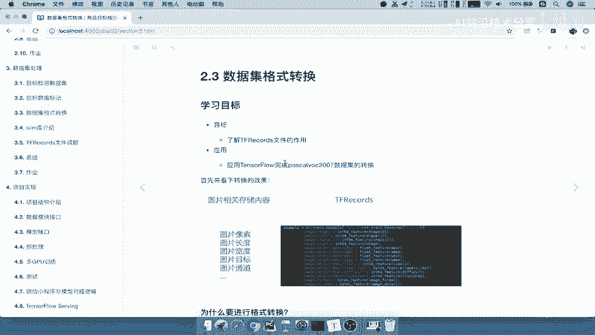

在本节课中，我们将学习为什么以及如何将原始的图像和标签数据转换为 TensorFlow 专用的 `tf.records` 文件格式。我们将了解这种格式的优势，并掌握使用 TensorFlow 完成数据集转换的基本流程。

## 为什么需要格式转换？🤔

上一节我们介绍了如何保存图片和对应的 XML 标签数据。接下来，我们需要进行数据集格式的转换。

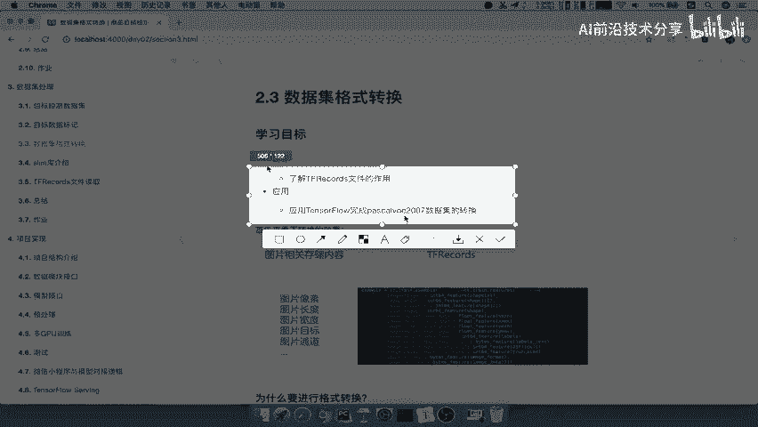

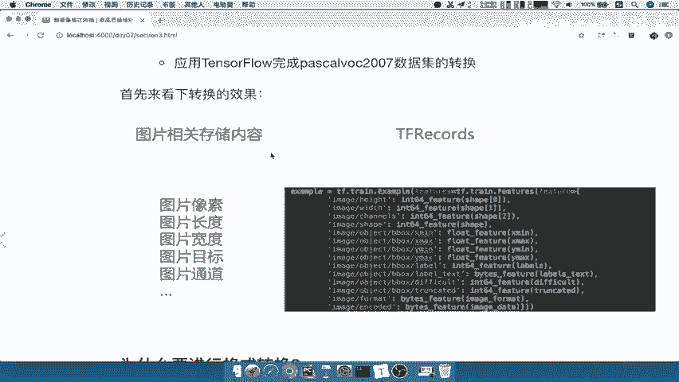

我们的目标是了解 `tf.records` 文件的作用，理解为何要这样处理，并应用 TensorFlow 完成数据集转换。我们将以 VOC2007 数据集为例进行转换。

首先，我们来看一下为何要进行格式转换。下图展示了两种数据存储方式。

左边是原始存储方式：图片和 XML 文件分开存放。XML 文件保存了图片的属性，如像素、长度、宽度、通道数以及图片中的对象信息。这些内容非常多，当训练模型需要读取数据时，编写的业务逻辑会非常复杂。

我们的目的是将数据格式转换的代码与模型使用数据的代码进行解耦。我们希望转换代码更简洁，模型只需负责读取和输出数据，无需编写复杂的转换逻辑。我们可以预先将数据转换好。

转换后的格式会非常方便，整体变得简洁。只需使用一个 `tf.train.Example` 函数就能将数据封装到一个类中，后续读取和处理都会非常简单。这就是我们想要做的事情。

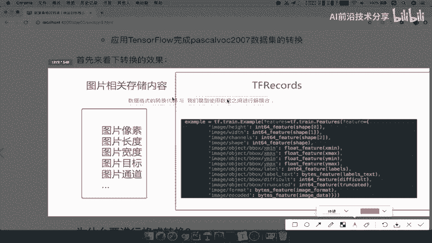

因此，我们需要将数据逻辑分开处理。

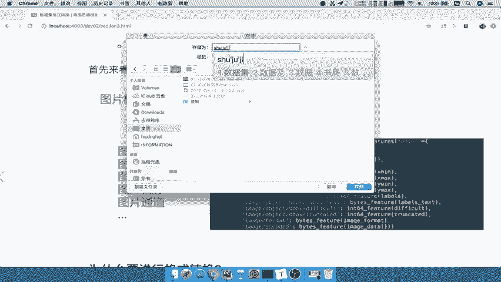

在原始数据集中，标记文件和图片是分开存放在不同文件夹的。图片与标签没有直接的一一对应关系，这给后续的项目处理带来了不便。

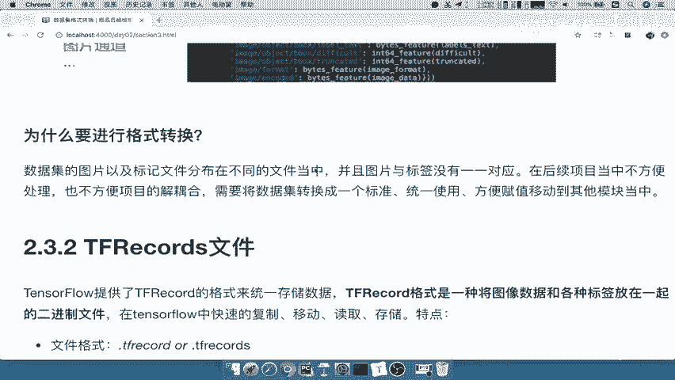

我们希望通过转换，使数据集具有统一标准，方便统一使用、复制和移动到其他模块。例如，将格式转换好后提供给他人训练模型，对方无需参考或编写太多逻辑，只需了解数据协议的保存格式即可。

这就是我们进行格式转换的前提。

## 认识 TFRecords 文件 📄

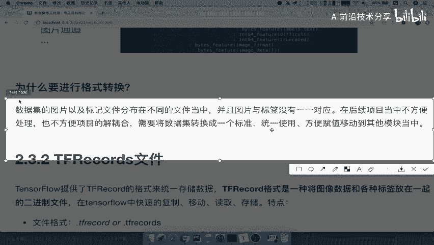

接下来，我们介绍 `tf.records` 文件。这是 TensorFlow 提供的一种用于存储数据的格式。

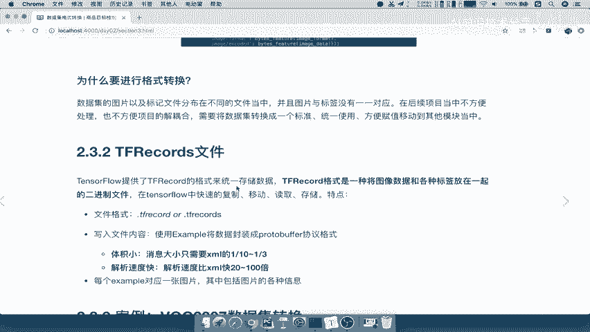

这种格式的特点如下：

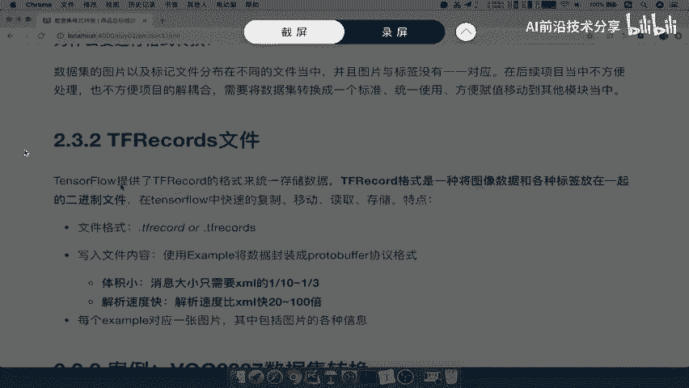

以下是 `tf.records` 文件的核心特点：

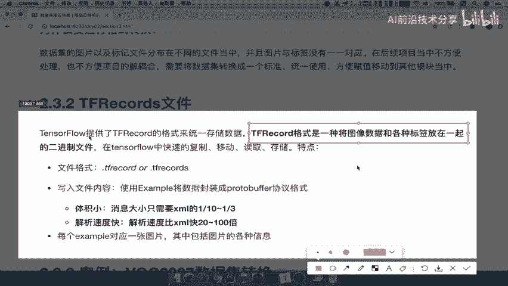

*   **数据一体化**：它将图像数据和各种标签信息存储在一起。
*   **二进制格式**：文件以二进制形式存储，具有快速复制、移动、读取和存储等特点。

我们重点来看“数据一体化”这个特点。在原始项目中，例如 VOC2007 数据集，XML 文件和图片是分开的。读取时，需要将图片与标签文件一一对应起来，过程非常麻烦。而 `tf.records` 格式可以将图像和标签整合在一起，形成一个数据协议，极大方便了后续处理。

在 TensorFlow 中，保存的文件扩展名可以是 `.tfrecords` 或 `.tfrecord`。写入文件内容时，使用 `tf.train.Example` 将数据封装成 **Protocol Buffer** 协议。

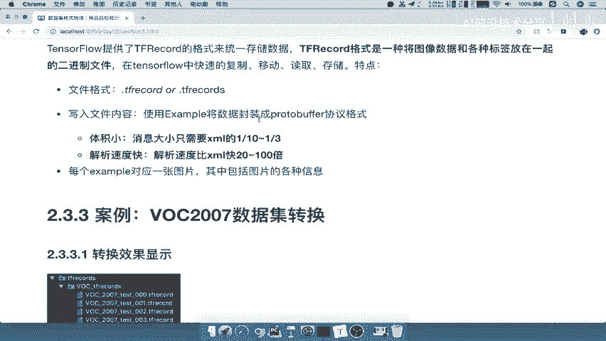

**Protocol Buffer** 是一种高效的序列化协议。它的特点是：
*   **体积小**：相比 JSON、XML 等格式，其存储体积要小 1/10 到 1/3。
*   **解析速度快**：解析速度远快于上述文件格式。

Protocol Buffer 也是谷歌提供的，具有快速、跨平台等优点。在 `tf.records` 文件中，每一个 `Example` 对应一张图片及其所有信息。

以上就是我们进行格式转换的原因和 `tf.records` 文件的简要介绍。

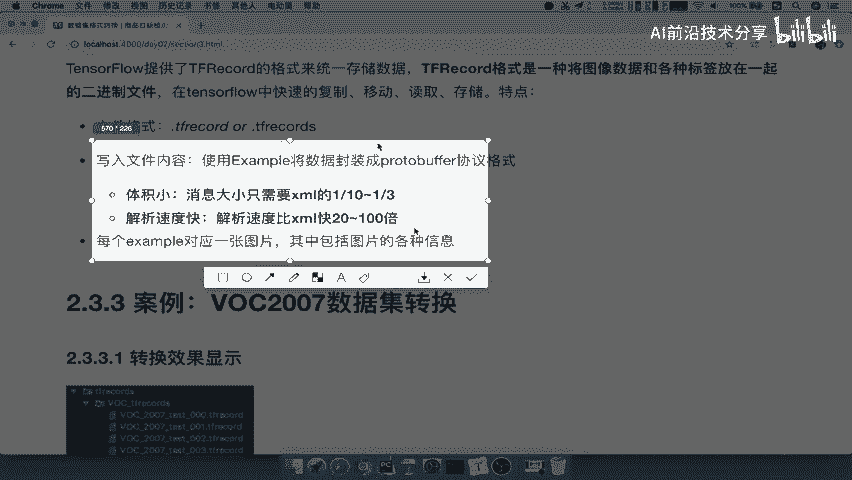

## 总结 📝

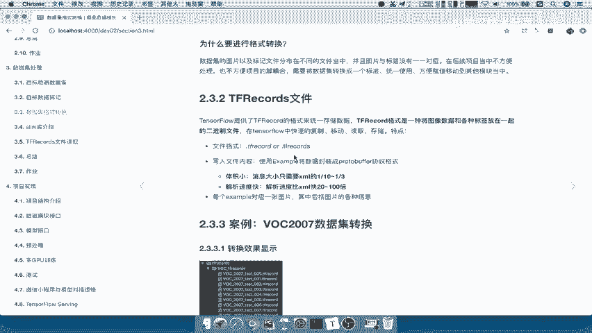

本节课中，我们一起学习了数据集格式转换的必要性。我们了解到，将分散的图片和 XML 标签文件转换为统一的 `tf.records` 格式，可以实现数据与模型代码的解耦，使数据读取更高效、便捷。`tf.records` 文件采用二进制存储，并结合了高效的 Protocol Buffer 协议，具有体积小、解析快的优点，为后续的模型训练提供了便利的数据基础。