# 课程 P39：39.02_格式转换：代码介绍 🛠️

在本节课中，我们将学习如何将 VOC2007 格式的数据集（包含图片和对应的 XML 标注文件）转换为 TensorFlow 的 TFRecord 文件格式。我们将通过一个具体的代码案例，详细讲解转换的步骤和核心逻辑。

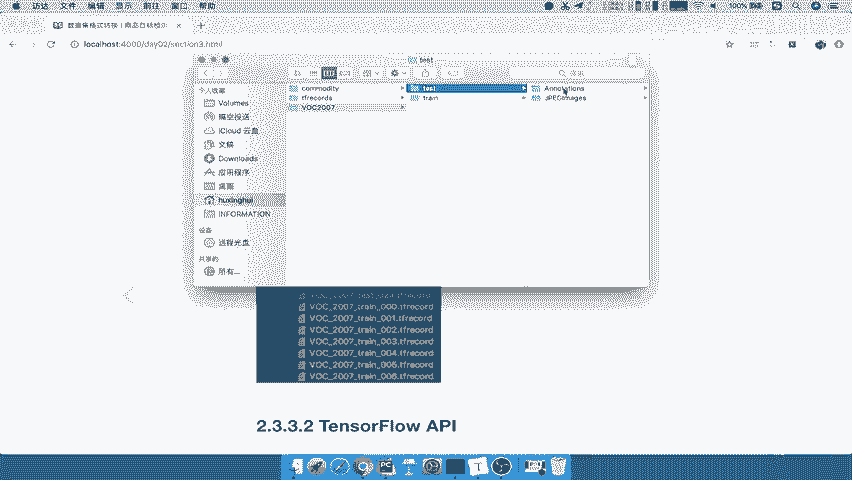

---

## 概述

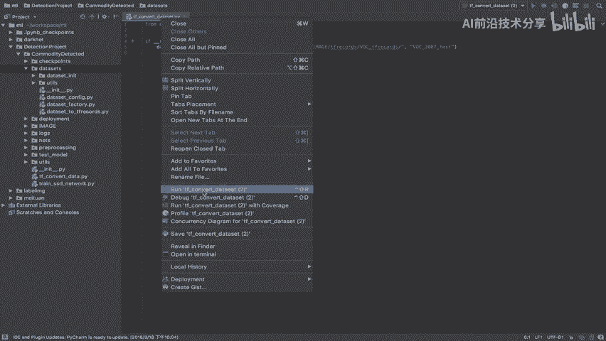

我们将动手编写代码，实现 VOC2007 数据集的转换。转换的目标是将原始的图片和 XML 标注文件打包成 TFRecord 文件，以便后续高效地读取和使用。我们的数据集目录结构通常包含 `test` 和 `train` 两个文件夹，我们将分别对它们进行转换。

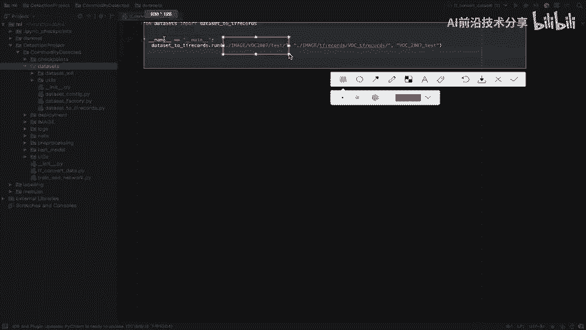

转换完成后，我们会得到一系列以 `test` 或 `train` 命名的 TFRecord 文件，每个文件包含固定数量的样本（例如 200 个）。这样，在训练或测试时，可以选择读取相应的文件。

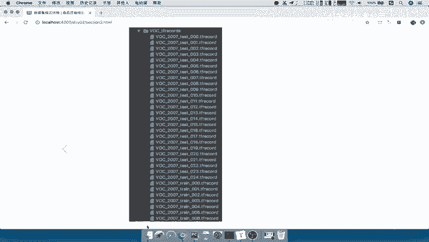

---

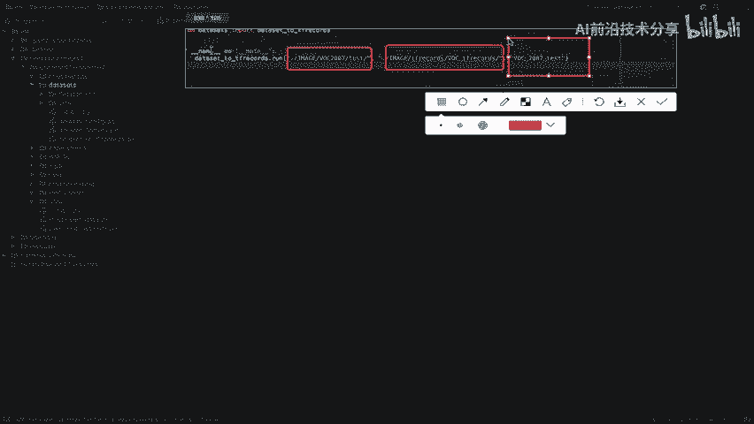

## 转换效果预览

在运行转换代码后，我们可以在输出目录中看到生成的 TFRecord 文件。例如，对于 `test` 数据集，会生成类似 `voc2007_test_00001.tfrecord` 到 `voc2007_test_00024.tfrecord` 的文件。每个文件存储了部分图片及其对应的标注信息。

---

## 核心 API 介绍

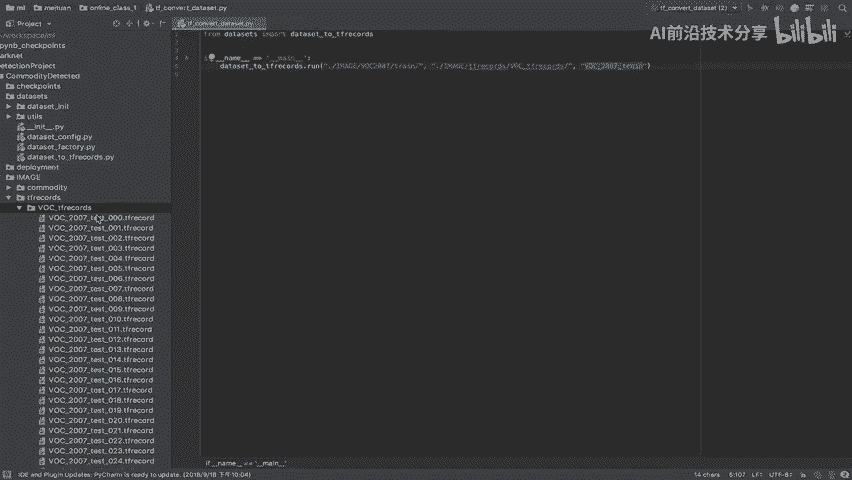

在开始编写代码之前，我们需要了解一些将要用到的核心 API。

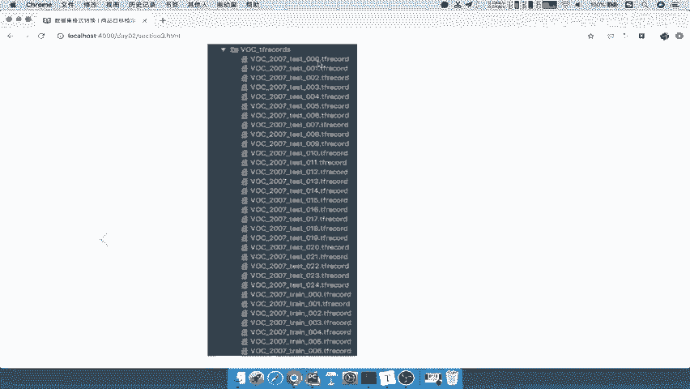

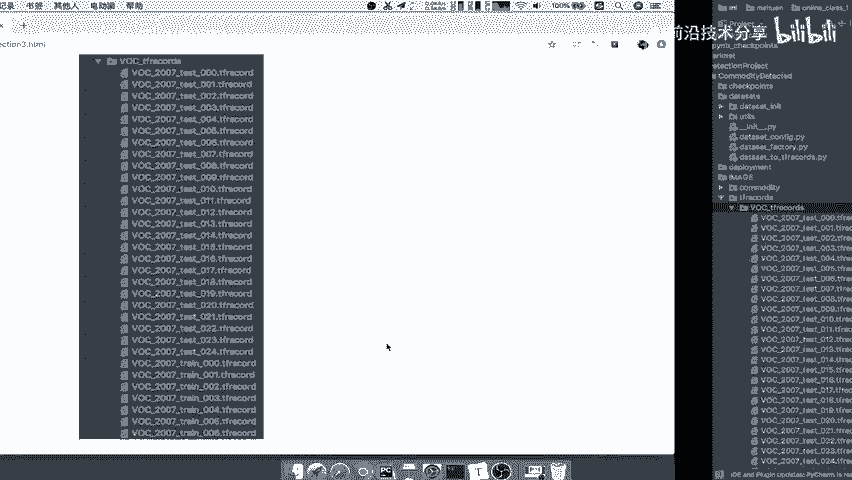

以下是转换过程中将使用的主要工具：

*   **文件操作**：使用 Python 的 `os` 和 `glob` 模块来检查文件是否存在、创建目录以及获取文件列表。
*   **TFRecord 写入**：使用 `tf.io.TFRecordWriter` 来创建和写入 TFRecord 文件。
*   **数据序列化**：使用 `tf.train.Example` 和 `tf.train.Features` 来定义和构建要存储的数据协议格式。
*   **XML 解析**：使用 `xml.etree.ElementTree` 库来读取和解析 VOC 格式的 XML 标注文件。

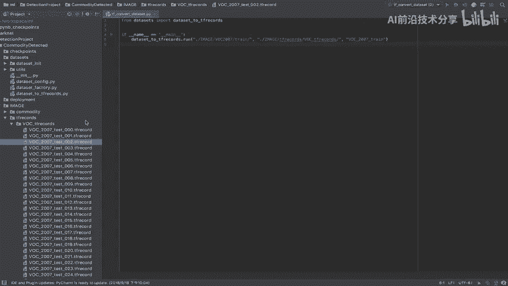

---

## 转换步骤分析

上一节我们介绍了核心的 API，本节中我们来看看具体的转换逻辑。整个转换过程可以分解为以下几个清晰的步骤：

以下是实现格式转换的核心步骤：

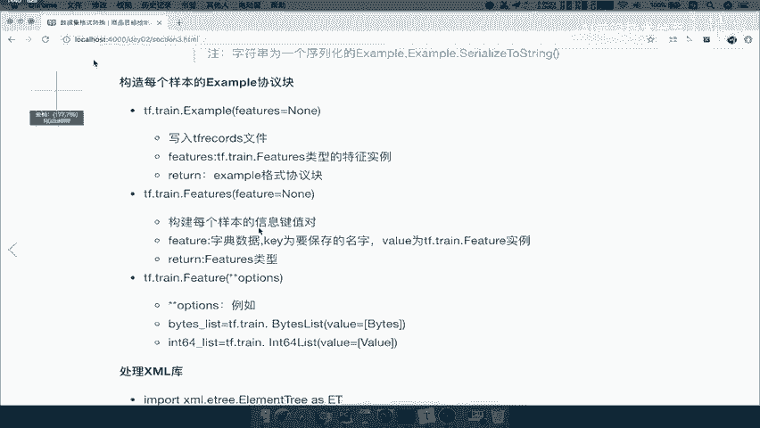

1.  **设定分片大小**：首先确定每个 TFRecord 文件包含的样本数量（例如 N=200）。这决定了最终会生成多少个文件。
2.  **读取与配对**：循环遍历数据集目录，确保每张图片都能找到其对应的 XML 标注文件，并一一配对。
3.  **序列化与写入**：读取图片内容和解析 XML 中的标注信息（如边界框、类别），将它们按照 `tf.train.Example` 的格式序列化，然后写入当前的 TFRecord 文件。
4.  **文件切换**：每写入 N 个样本，就关闭当前的 TFRecord 文件，然后创建并开始写入下一个文件，直到所有样本处理完毕。

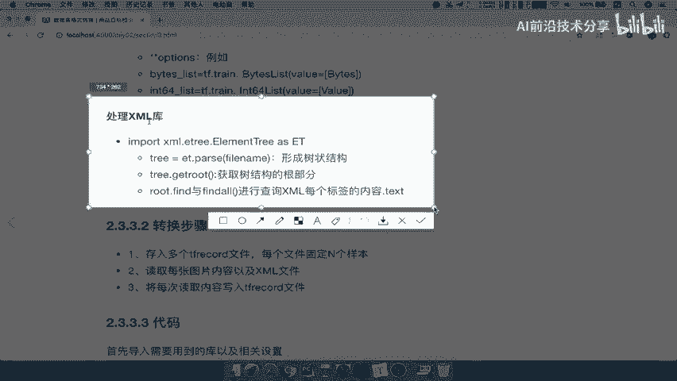

---

## 代码结构说明

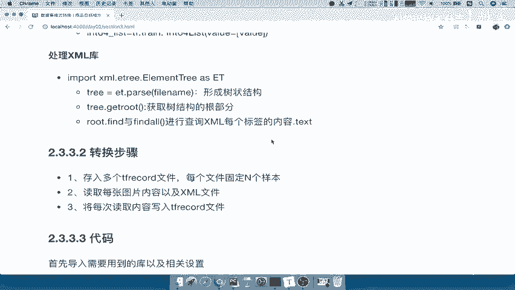

现在，让我们深入到代码的具体实现。我们的代码将组织在 `dataset` 目录下，结构清晰，便于维护。

以下是项目代码的主要结构：

*   `dataset/`
    *   `config.py`: 存放配置文件，例如数据集路径、每个 TFRecord 文件的样本数量等参数。
    *   `dataset_to_tfrecords.py`: 这是主要的转换逻辑实现文件，包含了我们上面分析的步骤。
    *   `utils/`: 存放一些公用的辅助函数或组件，例如 XML 解析函数。

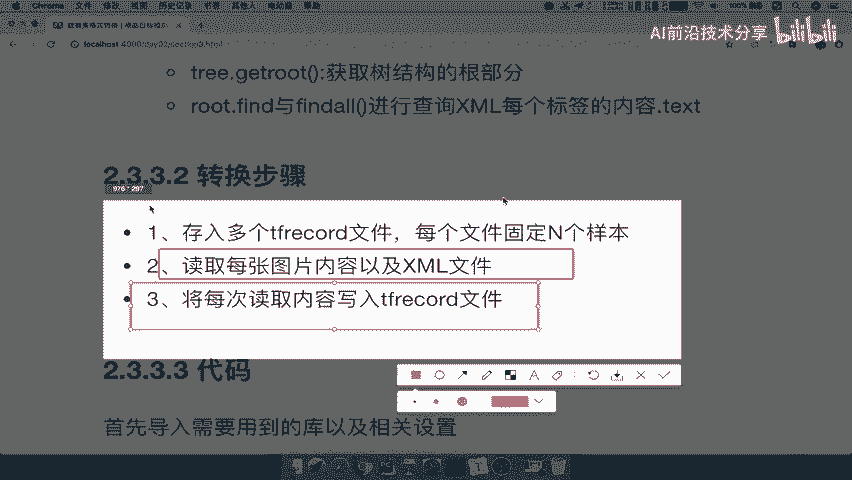

---

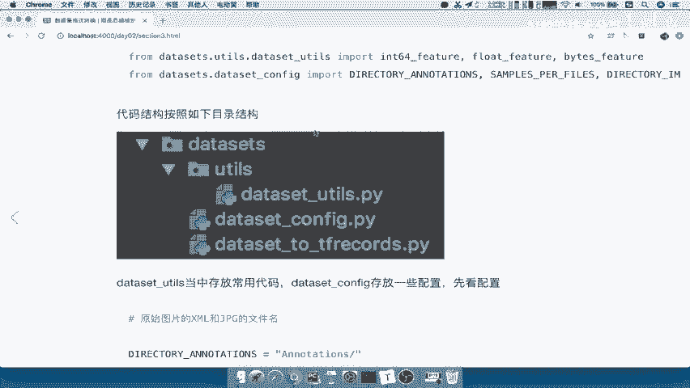

## 核心代码逻辑详解

我们将聚焦于 `dataset_to_tfrecords.py` 中的 `run` 函数，它是转换流程的控制器。

### 1. 路径准备与文件列表获取

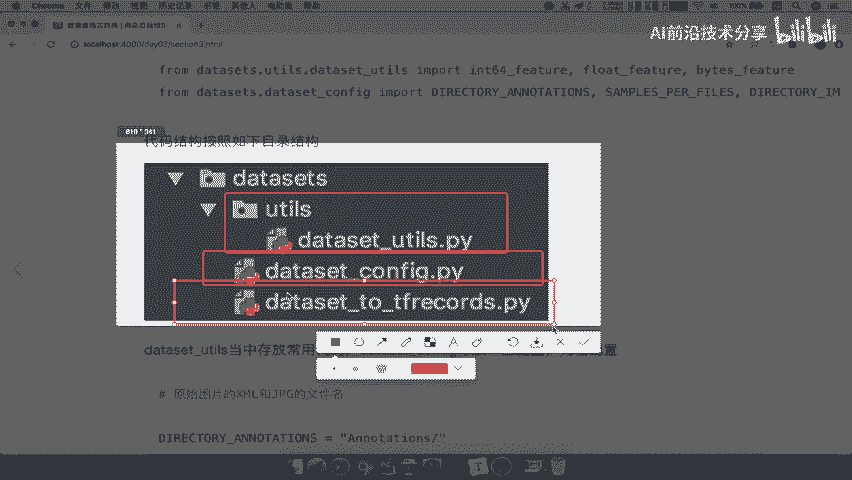

首先，代码会检查输入的数据集目录是否存在，并获取所有 XML 标注文件的列表。

```python
import os
import glob

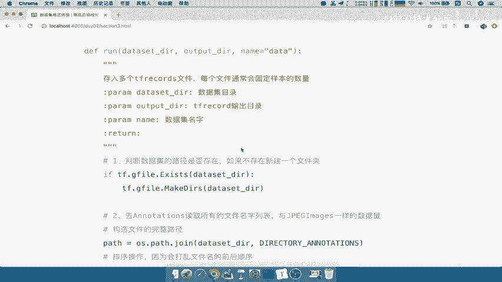

# 假设 dataset_dir 是传入的数据集路径（例如 ‘./VOC2007/ImageSets/Main/test’ 的上级目录）
annotation_dir = os.path.join(dataset_dir, ‘Annotations’)
if not os.path.isdir(annotation_dir):
    raise ValueError(“Annotation directory does not exist.”)

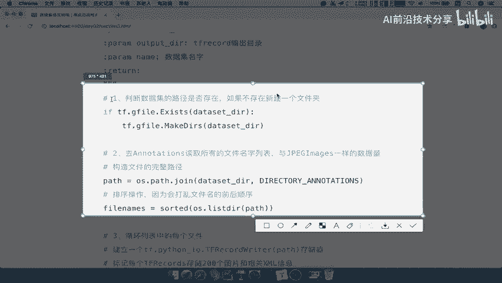

# 获取所有 XML 文件路径并排序，确保与图片顺序对应
annotation_files = sorted(glob.glob(os.path.join(annotation_dir, ‘*.xml’)))
```

### 2. 循环处理与文件写入

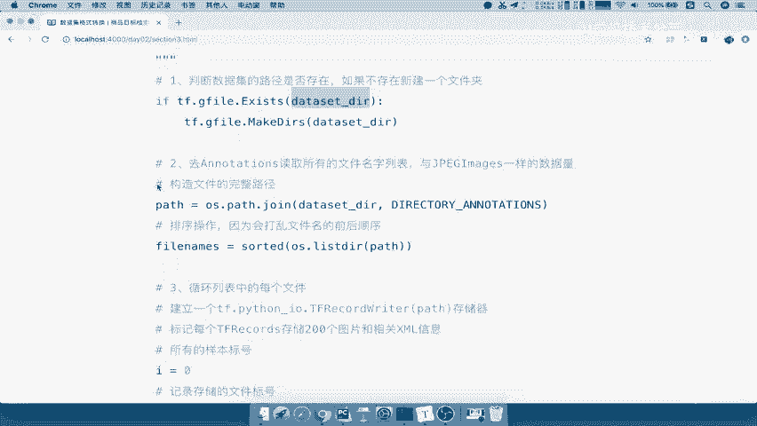

接着，代码进入主循环，遍历排序后的 XML 文件列表。

```python
import tensorflow as tf

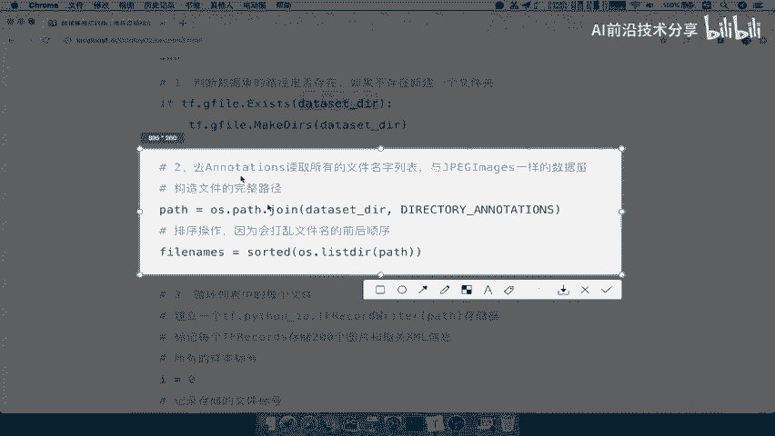

samples_per_file = 200  # 每个 TFRecord 文件的样本数
file_index = 0
sample_count = 0
writer = None

for i, annotation_path in enumerate(annotation_files):
    # 每处理 samples_per_file 个样本，就创建新的 TFRecord 文件
    if i % samples_per_file == 0:
        if writer: # 关闭上一个文件
            writer.close()
        # 构建新的输出文件名，例如 ‘voc2007_test_{:05d}.tfrecord’
        output_filename = get_output_filename(output_dir, dataset_name, file_index)
        writer = tf.io.TFRecordWriter(output_filename)
        file_index += 1

    # 核心：处理单个样本（图片+XML），并将其转换为 tf.train.Example
    example = add_to_tfrecord(annotation_path, dataset_dir)
    if example:
        writer.write(example.SerializeToString())
        sample_count += 1

# 循环结束后，关闭最后一个 writer
if writer:
    writer.close()
```

### 3. 单个样本处理函数

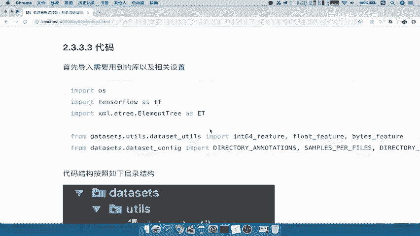

`add_to_tfrecord` 函数是转换的核心，它负责读取图片、解析 XML 并构建 `tf.train.Example` 对象。

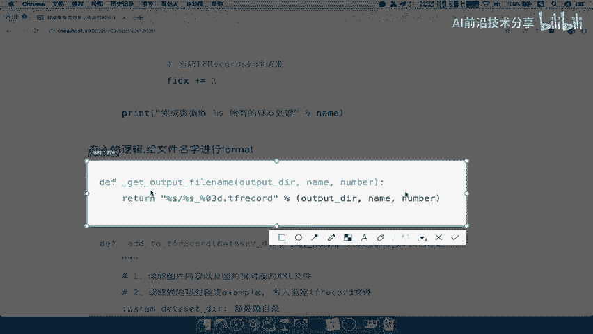

以下是 `add_to_tfrecord` 函数的关键操作：

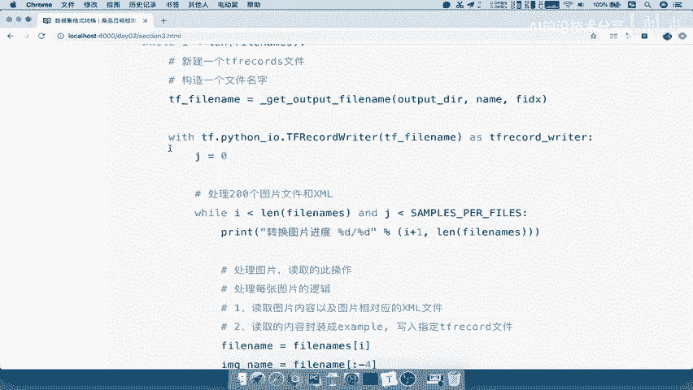

1.  **解析 XML**：从 XML 文件中提取文件名、图片尺寸、以及每个对象的边界框 (`xmin, ymin, xmax, ymax`) 和类别名称。
2.  **读取图片**：根据 XML 中记录的文件名，找到对应的图片文件（通常位于 `JPEGImages` 目录下），并读取为二进制格式。
3.  **构建 Features**：将图片二进制数据、图片尺寸、所有边界框坐标、所有类别标签（转换为整数索引）等，分别封装为 `tf.train.Feature`。
4.  **创建 Example**：将所有的 `Feature` 放入一个 `tf.train.Features` 字典，最终生成一个 `tf.train.Example` 对象。

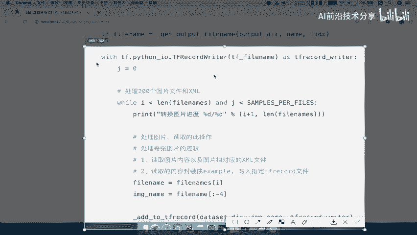

```python
def add_to_tfrecord(annotation_path, dataset_dir):
    # 解析 XML，获取信息
    data = parse_xml(annotation_path)

    # 读取图片
    image_path = os.path.join(dataset_dir, ‘JPEGImages’, data[‘filename’])
    with tf.io.gfile.GFile(image_path, ‘rb’) as fid:
        encoded_image = fid.read()

    # 构建特征字典
    feature_dict = {
        ‘image/encoded’: tf.train.Feature(bytes_list=tf.train.BytesList(value=[encoded_image])),
        ‘image/height’: tf.train.Feature(int64_list=tf.train.Int64List(value=[data[‘height’]])),
        ‘image/width’: tf.train.Feature(int64_list=tf.train.Int64List(value=[data[‘width’]])),
        ‘image/object/bbox/xmin’: tf.train.Feature(float_list=tf.train.FloatList(value=data[‘xmin’])),
        ‘image/object/bbox/ymin’: tf.train.Feature(float_list=tf.train.FloatList(value=data[‘ymin’])),
        # … 类似地添加 ymax, xmax, 和 class_label
    }

    # 创建并返回 Example
    example = tf.train.Example(features=tf.train.Features(feature=feature_dict))
    return example
```

---

## 总结

本节课中我们一起学习了将 VOC2007 数据集转换为 TFRecord 格式的完整流程。我们首先了解了转换的目的和效果，然后介绍了所需的 TensorFlow 和 Python API。接着，我们分析了转换的四个关键步骤，并深入解读了实现这些步骤的核心代码逻辑，包括如何组织代码结构、循环处理文件、以及最关键的单样本序列化函数 `add_to_tfrecord` 的实现。

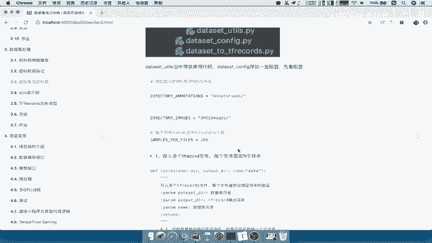

通过本教程，你应该能够理解 TFRecord 转换的基本思想，并可以根据这个模式将自己的数据集转换为高效的 TensorFlow 标准格式，为后续的模型训练做好准备。