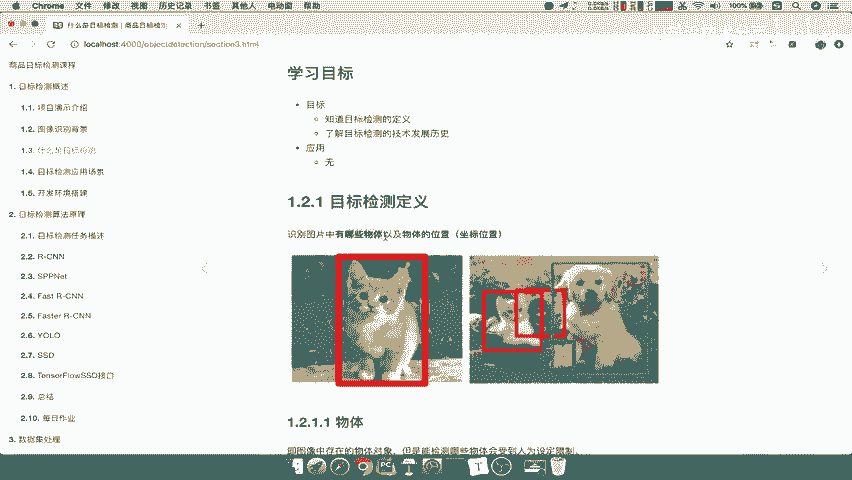
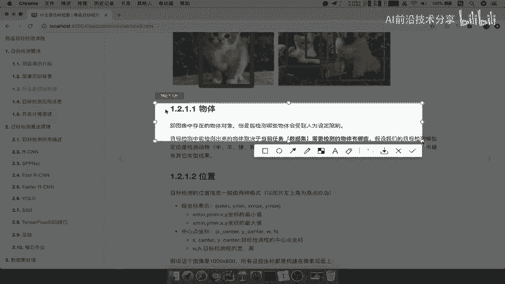
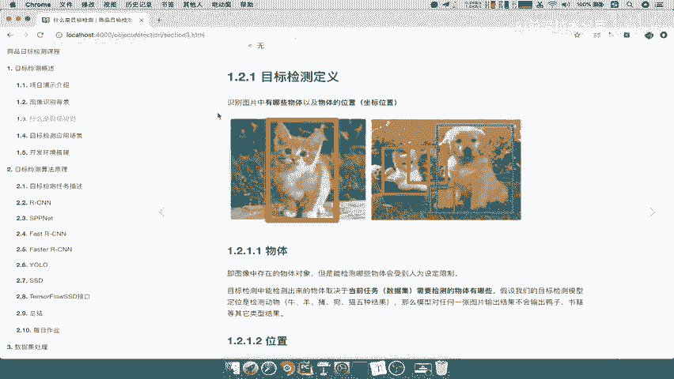
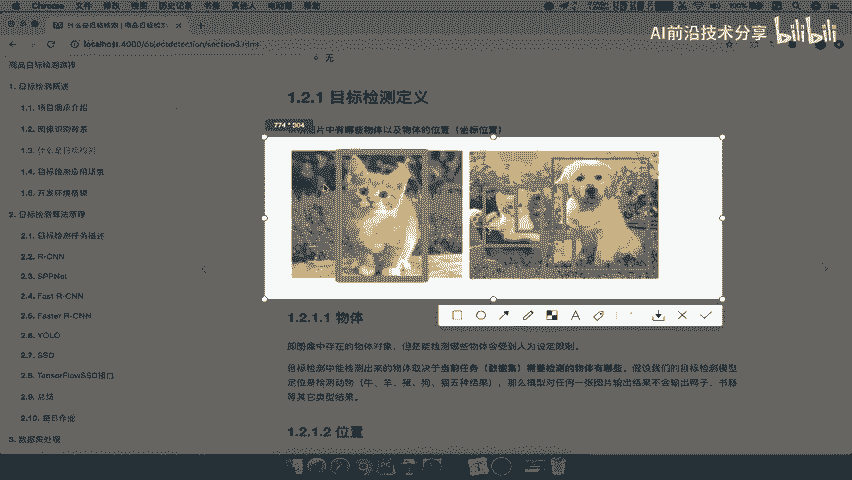
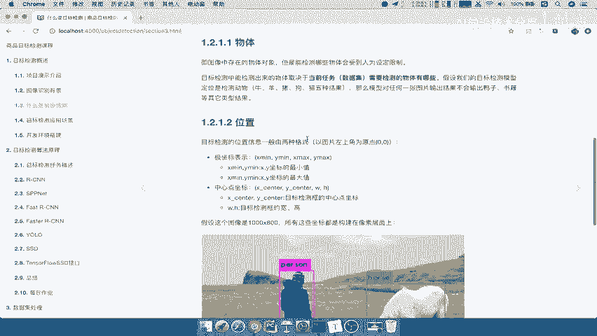
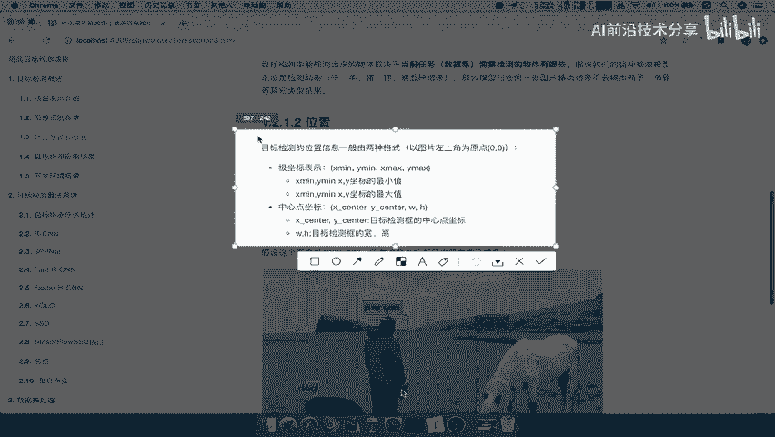
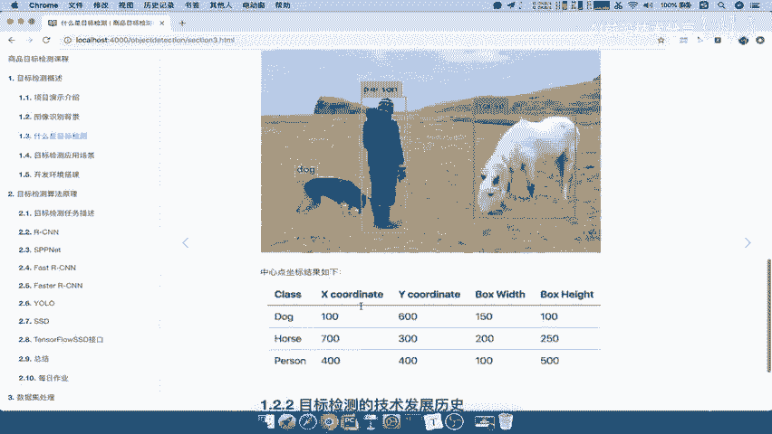

# 课程P4：目标检测的定义与技术历史 📚

在本节课中，我们将学习目标检测的基本定义，并了解其技术发展的主要阶段。理解这些基础概念是后续深入学习各类目标检测算法的前提。

## 目标检测的定义 🎯

上一节我们提到了目标检测的概念，本节中我们来看看其完整的定义。

目标检测的定义为：**识别图片中有哪些物体以及物体的位置**。

这个定义包含两个核心部分：“识别哪些物体”和“物体的位置”。接下来，我们将对这两部分进行详细解释。

### 识别哪些物体

“物体”指的是图像中存在的一个物体。例如，在下图中，第一张图片中存在一只猫，第二张图片中则存在多个物体，如狗、鸭、猫和水桶。

那么，目标检测需要识别出图像中的所有物体吗？答案是否定的。通常，需要检测哪些物体是**人为设定限制**的。这取决于具体的业务或应用场景。例如，在商品检测场景中，我们可能只关心电脑、手机等商品，而不会去检测背景中的猫或房屋。因此，目标检测系统通常被设计为只能识别出预先定义好类别的物体。

### 物体的位置

“物体的位置”指的是物体在图像中的坐标位置。坐标位置主要有两种表示格式。

以下是两种常见的边界框坐标表示方法：

1.  **极坐标（或角点坐标）表示法**：使用边界框左上角和右下角的坐标来表示。
    *   **公式**：`(x_min, y_min, x_max, y_max)`
    *   **说明**：`(x_min, y_min)` 是边界框左上角的坐标，`(x_max, y_max)` 是边界框右下角的坐标。通常以图像左上角为原点 `(0, 0)`。

    

2.  **中心点坐标表示法**：使用边界框的中心点坐标以及框的宽度和高度来表示。
    *   **公式**：`(x_center, y_center, width, height)`
    *   **说明**：`(x_center, y_center)` 是边界框中心点的坐标，`width` 和 `height` 分别是边界框的宽和高。

    

理解这两种坐标表示方式非常重要，它们在数据标注和模型训练中都会被用到。

## 目标检测的技术发展历史 📈

了解了目标检测的定义后，我们来看看它是如何一步步发展到今天的。目标检测的技术演进大致可以分为三个阶段。

以下是目标检测技术发展的三个主要阶段：

1.  **传统检测方法**
    *   这个阶段的方法通常包含多个步骤：首先使用算法（如滑动窗口）生成大量可能包含物体的“候选区域”，然后从这些区域中手工提取特征（如HOG、SIFT），最后使用分类器（如SVM）判断区域内是否有物体以及是什么物体。流程复杂且效率较低。

2.  **基于候选区域与深度学习的融合方法**
    *   随着深度学习的兴起，特征提取部分被卷积神经网络（CNN）所取代，大大提升了特征的表征能力。代表性框架有R-CNN系列（R-CNN, Fast R-CNN, Faster R-CNN）。它们仍然需要先产生候选区域，但整体精度得到了显著提升。

3.  **端到端的单阶段检测方法**
    *   这类方法摒弃了独立的候选区域生成步骤，直接在网络中一次性预测物体的类别和位置，因此速度非常快。代表性框架有YOLO系列和SSD。它们在速度和精度之间取得了更好的平衡，更适合实时检测场景。

## 总结 ✨

本节课中，我们一起学习了目标检测的核心内容。

我们首先明确了目标检测的定义：**识别图片中有哪些物体以及物体的位置**。并对“物体”（由应用场景人为限定）和“位置”（极坐标或中心点坐标表示）进行了详细解读。

接着，我们回顾了目标检测的技术发展历史，将其分为三个主要阶段：**传统检测方法**、**基于候选区域与深度学习的融合方法**以及**端到端的单阶段检测方法**。了解这段历史有助于我们理解不同检测框架的设计思路与优缺点。

掌握这些基础知识，将为后续学习具体的检测算法和模型打下坚实的根基。