# 🗂️ 课程P40：40.03 格式转换：文件读取与存储逻辑

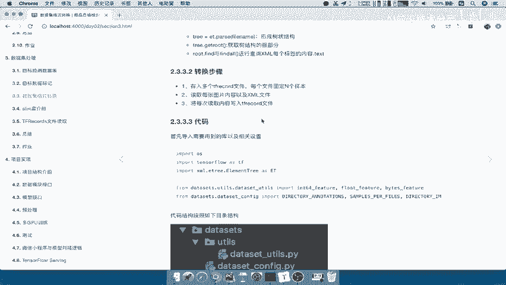

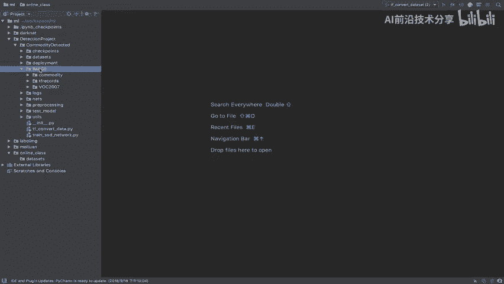

在本节课中，我们将学习如何将图像数据集（包含图片和XML标注文件）转换为TensorFlow的TFRecord格式。我们将逐步构建一个转换脚本，实现读取文件、分批处理和存储的逻辑。

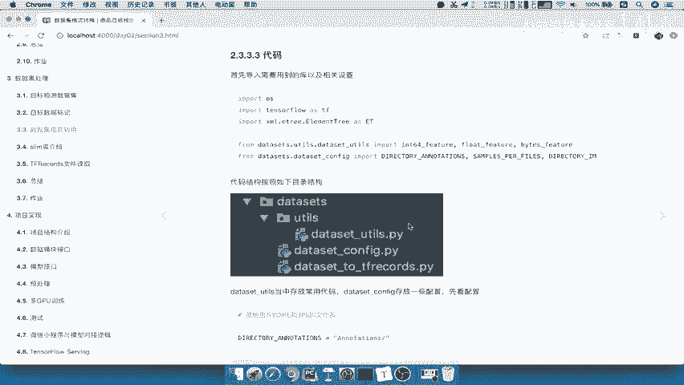

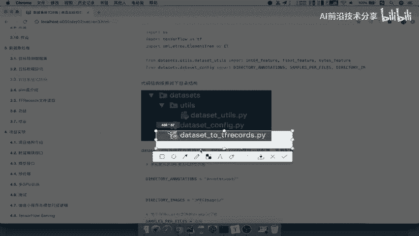

---

## 概述

我们将创建一个名为 `dataset_to_tfrecord.py` 的脚本。其核心功能是遍历指定目录下的图片和标注文件，每处理200个样本，就将它们打包并存储为一个TFRecord文件。这样做有助于高效地管理和读取大规模数据集。

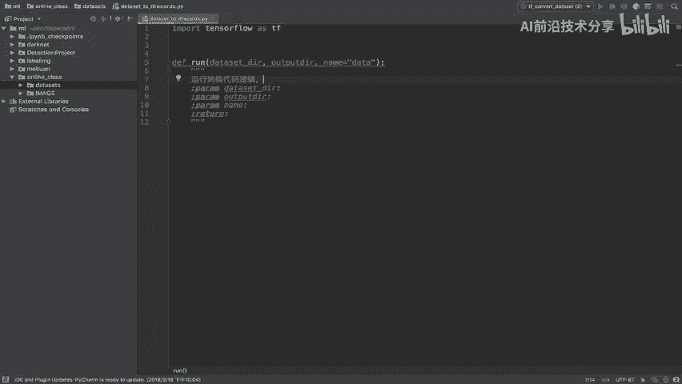

---

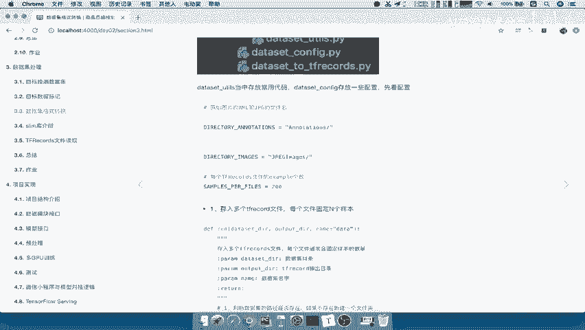

## 第一步：创建项目结构与文件夹

首先，我们需要建立项目文件夹结构。我们将创建一个名为 `Online_class` 的目录，并在其中建立 `datasets` 文件夹来存放我们的代码和数据。

以下是需要创建的目录结构：
*   `Online_class/`：项目根目录。
*   `Online_class/datasets/`：存放数据集处理代码。
*   `Online_class/images/`：存放原始图片和XML标注文件。

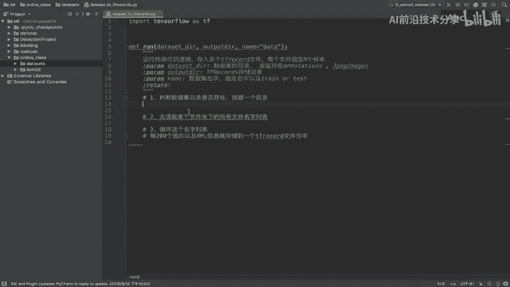

接下来，将准备好的 `images` 文件夹（内含 `annotations` 和 `JPEGImages` 子文件夹）复制到 `Online_class` 目录下。

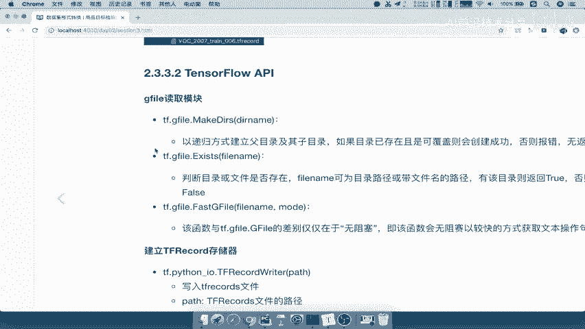

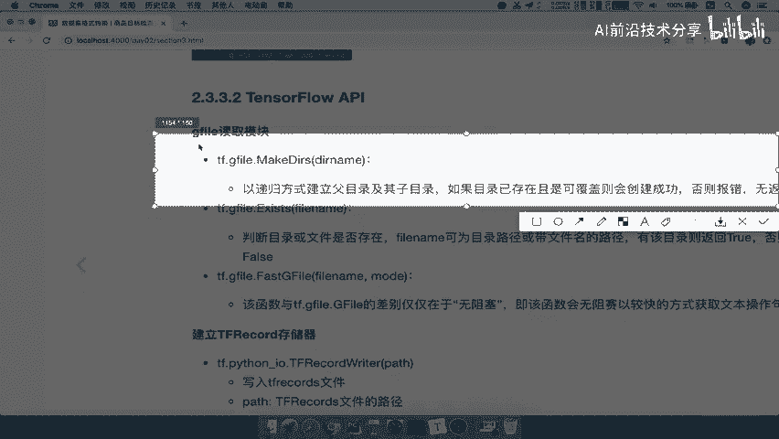

---

## 第二步：编写转换脚本

在 `datasets` 目录下，创建一个新的Python文件 `dataset_to_tfrecord.py`。

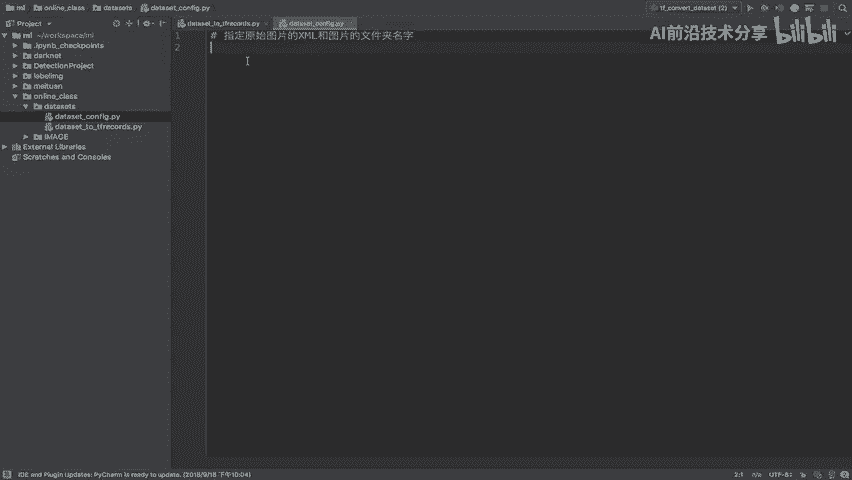

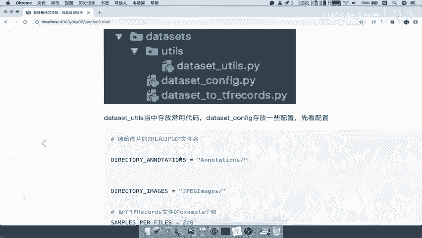

首先，导入必要的库。

```python
import tensorflow as tf
import os
```

---

## 第三步：定义主运行函数 `run`

`run` 函数是整个转换流程的入口，它接收三个参数：数据集目录、输出目录和数据集名称。

```python
def run(dataset_dir, output_dir, name='data'):
    """
    运行转换代码的主逻辑。
    参数:
        dataset_dir: 原始数据集的根目录。
        output_dir: 存储TFRecord文件的输出目录。
        name: 数据集名称，用于生成输出文件名。
    """
```

### 1. 检查数据集目录是否存在

首先，我们需要确认输入的 `dataset_dir` 是否存在。如果不存在，可以选择创建它或报错。

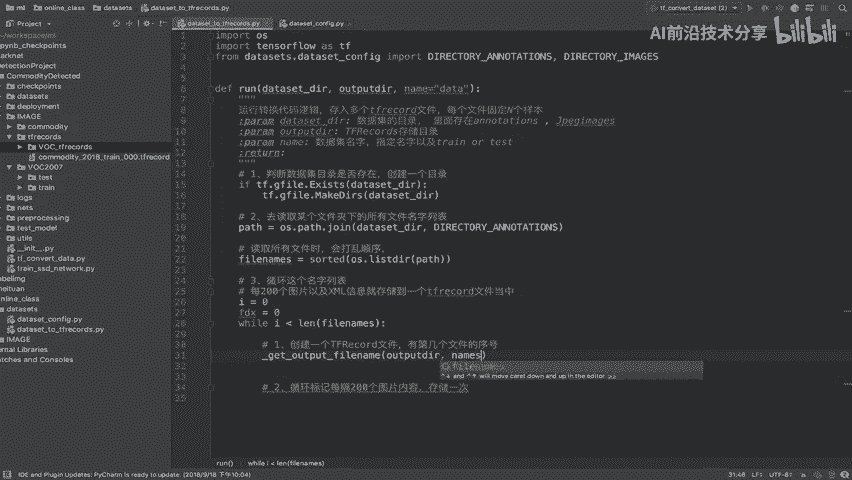

```python
    # 第一步：判断数据集目录是否存在
    if not tf.gfile.Exists(dataset_dir):
        # 如果目录不存在，则创建它（或可以选择抛出错误）
        tf.gfile.MakeDirs(dataset_dir)
```

### 2. 读取文件列表

我们需要获取 `annotations` 文件夹下所有XML文件的列表。这些文件名（不含扩展名）将对应图片文件名。

```python
    # 第二步：读取某个文件夹下的所有文件名列表
    # 假设annotations文件夹在dataset_dir下
    annotations_path = os.path.join(dataset_dir, 'annotations')
    # 获取所有XML文件名并排序，以保证顺序一致
    file_names = sorted(os.listdir(annotations_path))
```

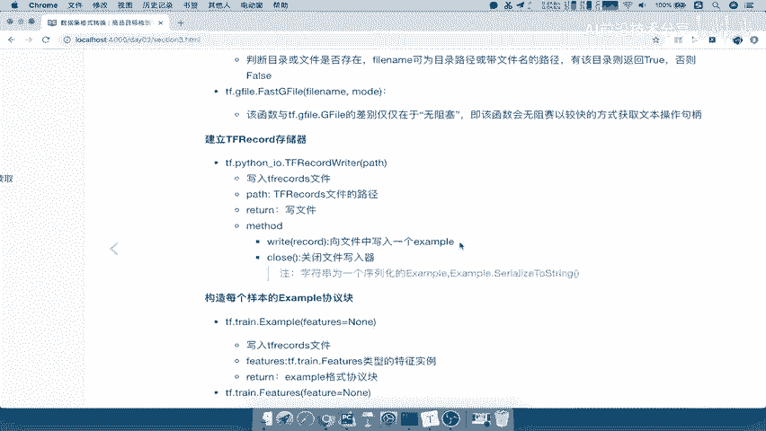

### 3. 循环处理与分批存储

接下来，我们将循环处理文件列表。每处理200个文件，就将它们打包成一个TFRecord文件。

以下是循环和分批存储的核心逻辑：

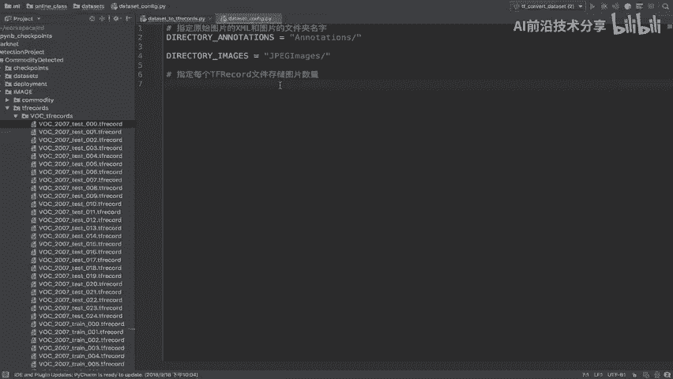

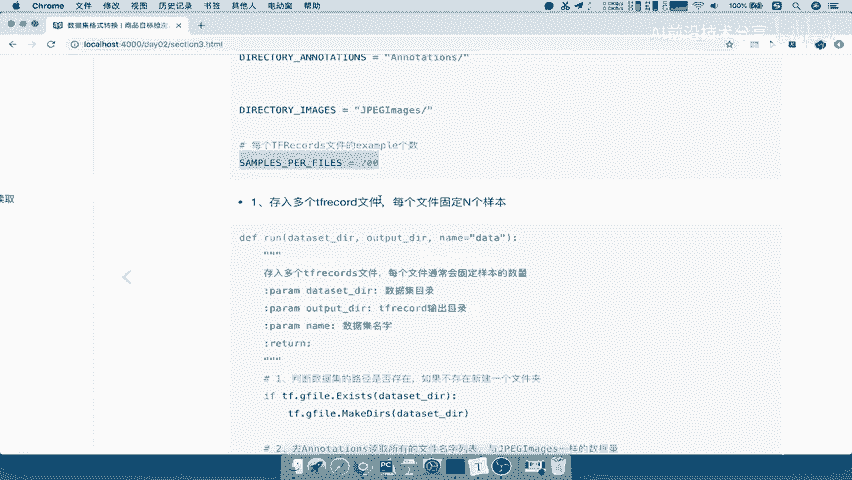

```python
    # 第三步：循环文件列表，每200个样本存储为一个文件
    i = 0  # 总文件索引
    file_idx = 0  # TFRecord文件序号
    samples_per_file = 200  # 每个TFRecord文件包含的样本数

    while i < len(file_names):
        # 获取当前要写入的TFRecord文件名
        output_filename = get_output_filename(output_dir, name, file_idx)

        # 创建TFRecord写入器
        with tf.python_io.TFRecordWriter(output_filename) as tfrecord_writer:
            j = 0  # 当前文件内样本计数
            while j < samples_per_file and i < len(file_names):
                # 打印转换进度
                print(f'正在转换图片: 第 {i+1} / {len(file_names)} 张')

                # 获取单个文件名（例如：'000001.xml'）
                single_file = file_names[i]
                # 提取基础名（例如：'000001'），用于匹配图片
                base_name = single_file[:-4]  # 去掉 '.xml' 后缀
                image_file_name = base_name + '.jpg'  # 对应的图片文件名

                # TODO: 在此处调用函数，读取图片和XML内容，并构造一个Example写入文件
                # convert_and_write_example(...)

                i += 1
                j += 1

        # 完成一个文件的写入后，文件序号增加
        file_idx += 1
        print(f'已成功创建TFRecord文件: {output_filename}')

    print(f'数据集“{name}”的所有图片转换完成。')
```

---

## 第四步：辅助函数：生成输出文件名

我们需要一个辅助函数来根据输出目录、数据集名称和文件索引生成标准的TFRecord文件名。

```python
def get_output_filename(output_dir, dataset_name, index):
    """
    获取输出的TFRecord文件完整路径。
    参数:
        output_dir: 输出目录。
        dataset_name: 数据集名称。
        index: 文件序号。
    返回:
        完整的文件路径字符串。
    """
    # 文件名格式示例：`data_train_000.tfrecord`
    filename = f"{dataset_name}_{index:03d}.tfrecord"
    return os.path.join(output_dir, filename)
```

---

## 总结

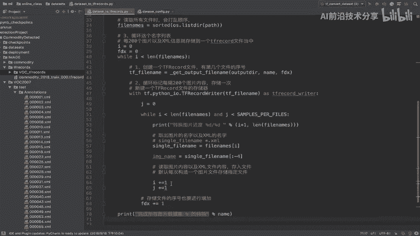

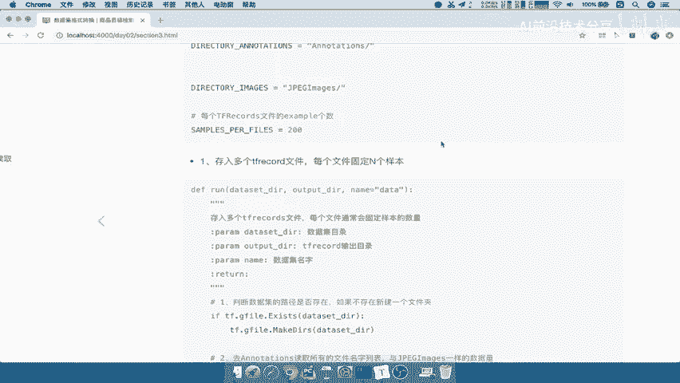

本节课中，我们一起学习了TFRecord格式转换的第一步：搭建项目结构并编写文件读取与分批存储的核心逻辑。我们创建了 `run` 函数，它能够检查目录、遍历文件列表，并规划好每200个样本存储为一个TFRecord文件。在下一节中，我们将实现具体的 `convert_and_write_example` 函数，完成从图片和XML中读取数据并写入TFRecord文件的最后一步。