# 课程 P42：42.05_格式转换：example封装与总结 📚

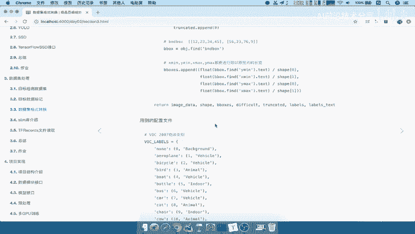

在本节课中，我们将学习如何将读取到的图片和XML标注数据，封装成TensorFlow的`tf.train.Example`格式，并最终写入TFRecord文件。这是构建高效数据管道的关键一步。

---

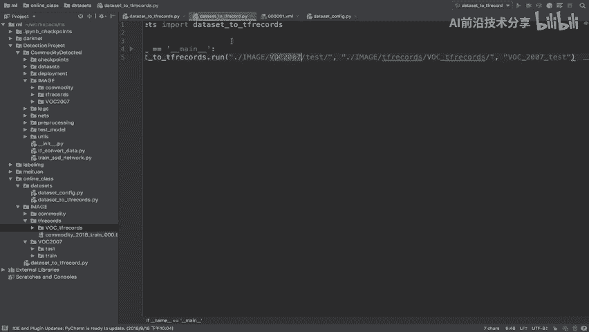

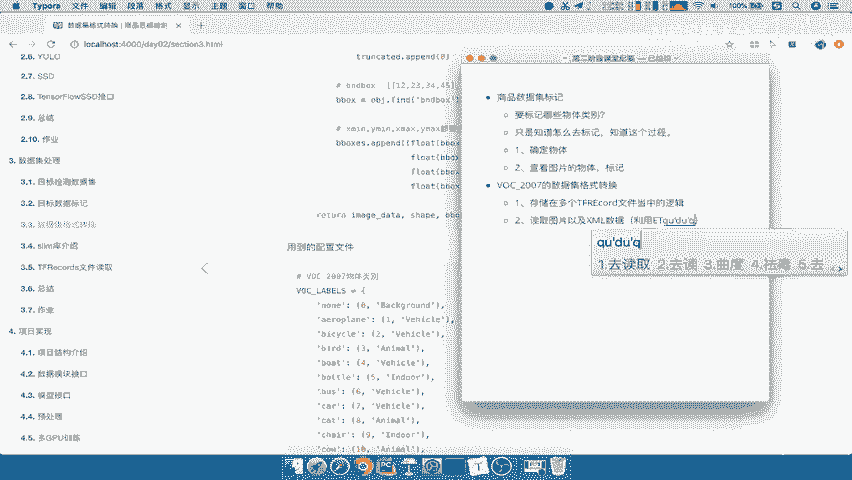

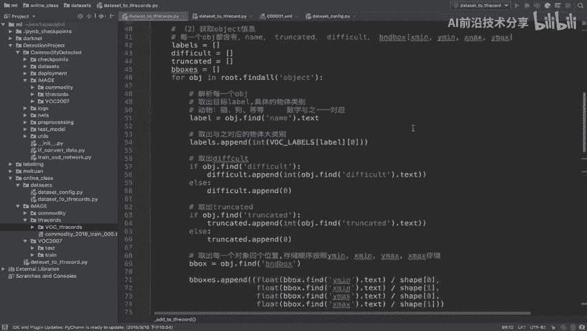

## 数据读取逻辑回顾 🔍

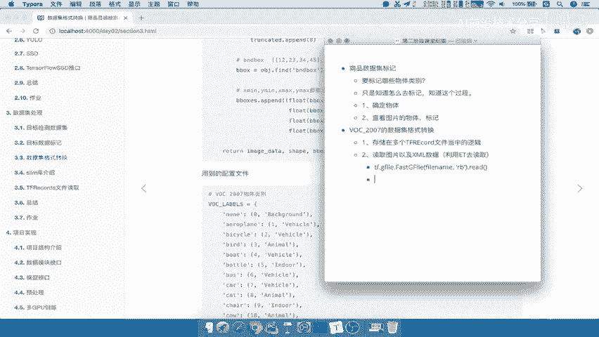

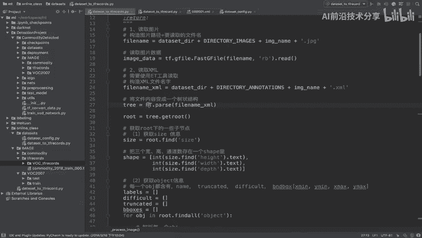

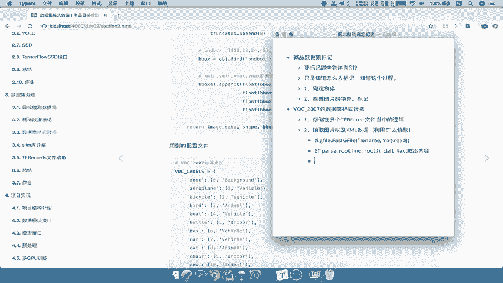

上一节我们介绍了如何从VOC2007数据集中读取图片和XML文件。本节中，我们来看看如何将这些数据封装起来。

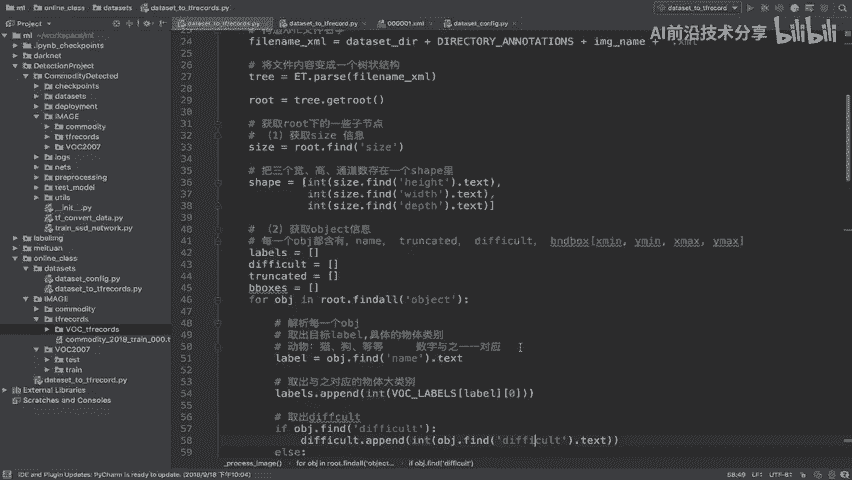

以下是读取逻辑的核心总结：
*   **读取图片**：使用 `tf.io.gfile.GFile(image_path, 'rb').read()` API。
*   **读取XML**：使用 `ET.parse(xml_path).getroot()` 获取根节点，然后通过 `root.find('object').find('bndbox').find('xmin').text` 等方式提取标注信息。
*   **数据标准化**：将边界框坐标进行归一化处理，公式为 `x / image_width` 和 `y / image_height`。目的是为了适应后续算法的运算需求。

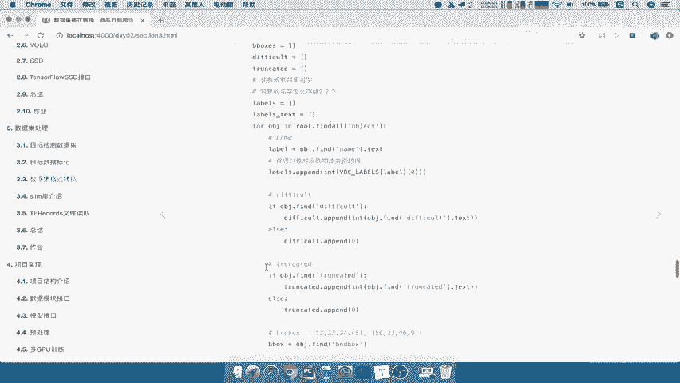

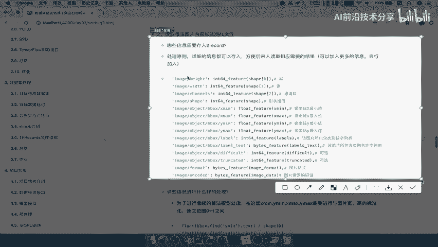

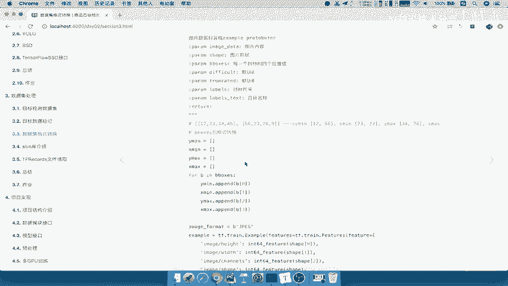

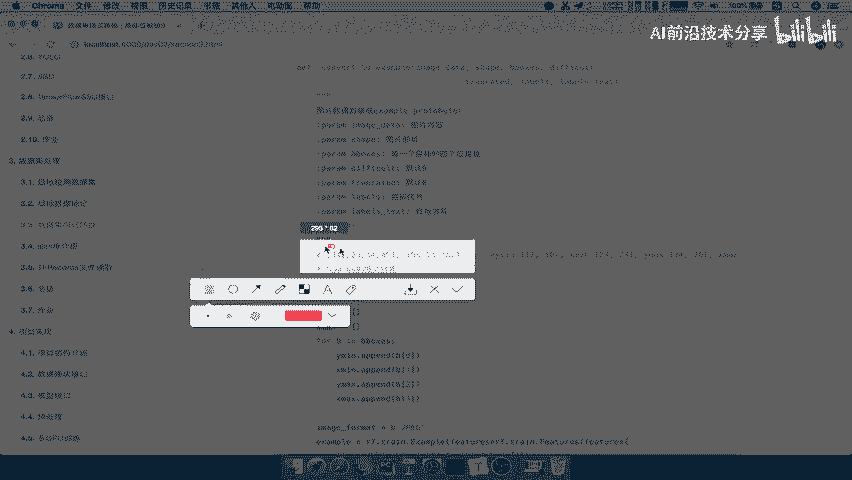

---

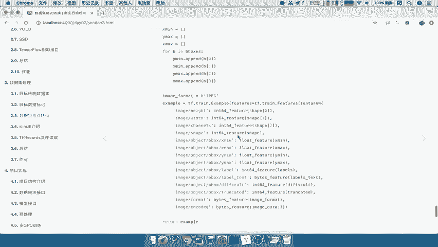

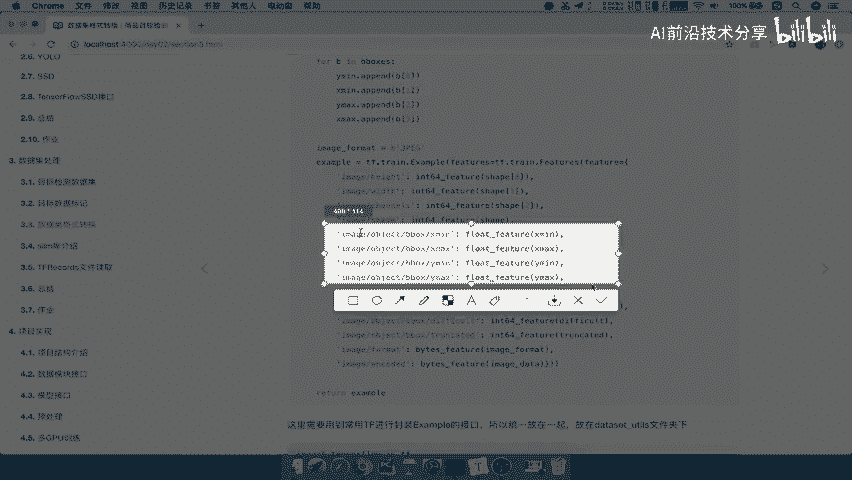

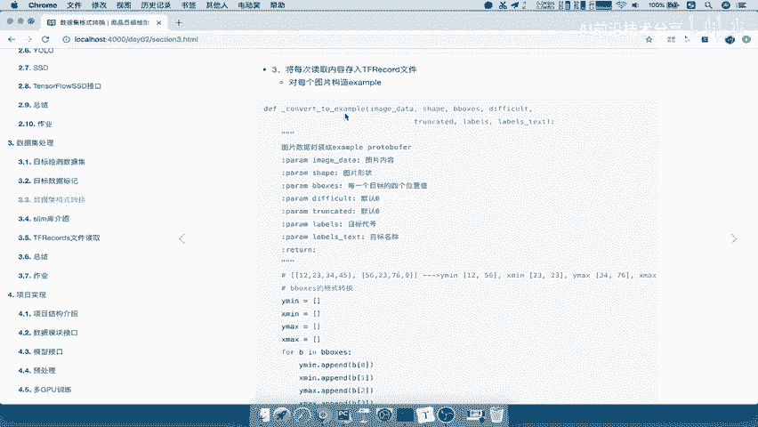

## 封装数据为 Example 📦

读取数据后，下一步是把取出的数据封装成一个`tf.train.Example`对象。

我们的封装原则是：**尽可能存储所有详细信息**，方便后续读取和使用。这意味着，不仅存储图片原始数据、高宽和通道数，还要将边界框信息从 `[ymin, xmin, ymax, xmax]` 的对象列表格式，转换为四个独立的坐标列表。

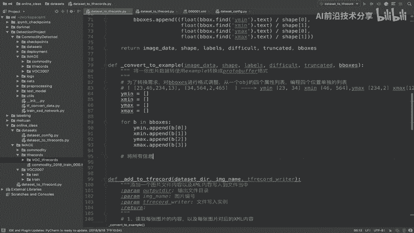

以下是格式转换的核心逻辑：
```python
# 假设 b_boxes 是一个列表，每个元素是一个对象的 [ymin, xmin, ymax, xmax]
ymin_list, xmin_list, ymax_list, xmax_list = [], [], [], []
for b in b_boxes:
    ymin_list.append(b[0])
    xmin_list.append(b[1])
    ymax_list.append(b[2])
    xmax_list.append(b[3])
```

转换完成后，我们使用 `tf.train.Example` 进行封装。关键点在于，存入的每个属性都必须明确指定其TensorFlow数据类型。

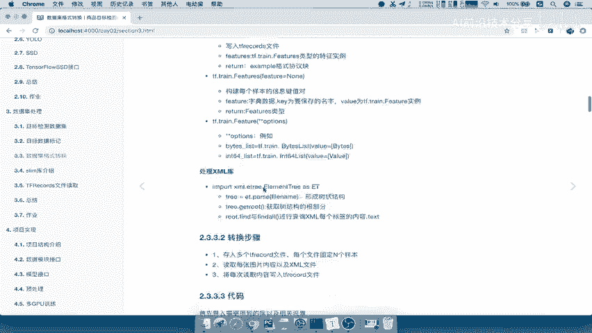

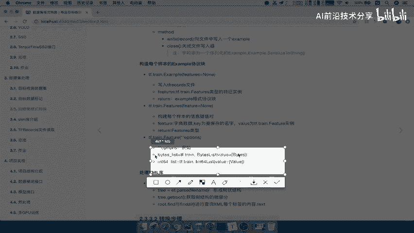

以下是封装 `Example` 的核心API结构：
```python
example = tf.train.Example(features=tf.train.Features(feature={
    'image/height': int64_feature(height),
    'image/width': int64_feature(width),
    'image/filename': bytes_feature(filename.encode('utf8')),
    'image/source_id': bytes_feature(filename.encode('utf8')),
    'image/encoded': bytes_feature(encoded_image_data),
    'image/format': bytes_feature(image_format.encode('utf8')),
    'image/object/bbox/xmin': float_list_feature(xmin_list),
    'image/object/bbox/xmax': float_list_feature(xmax_list),
    'image/object/bbox/ymin': float_list_feature(ymin_list),
    'image/object/bbox/ymax': float_list_feature(ymax_list),
    'image/object/class/text': bytes_list_feature(encoded_label_text_list),
    'image/object/class/label': int64_list_feature(label_list),
}))
```
其中，`int64_feature`, `float_list_feature`, `bytes_feature` 等是辅助函数，用于将Python数据转换为TensorFlow所需的Feature类型。

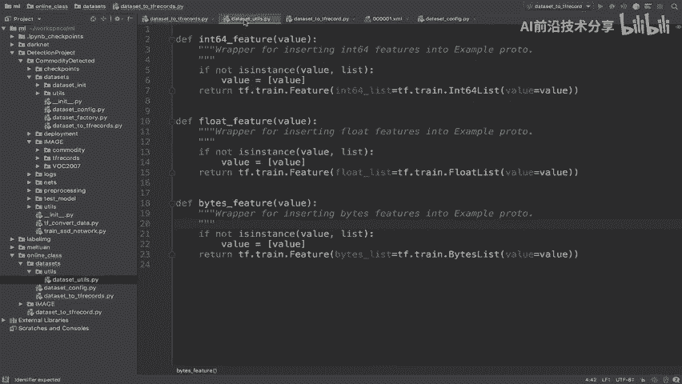

---

## 写入 TFRecord 文件 💾

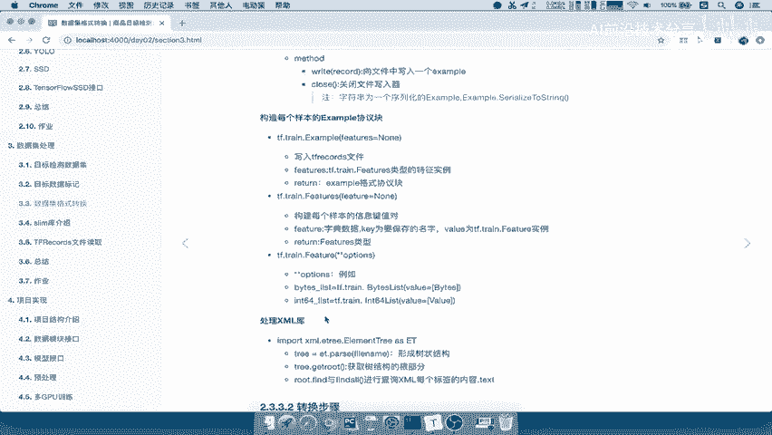

将单张图片的数据封装成 `Example` 后，最后一步就是将其写入TFRecord文件。

写入时需要注意：**必须写入序列化后的结果**。每一张图片对应写入一次。

以下是写入文件的核心API：
```python
with tf.io.TFRecordWriter(output_path) as writer:
    serialized_example = example.SerializeToString()
    writer.write(serialized_example)
```
**`tf.io.TFRecordWriter`** 用于创建写入器。
**`example.SerializeToString()`** 用于将Example对象序列化为二进制字符串。

---

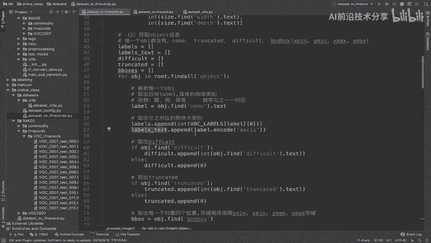

## 课程总结 ✨

本节课中我们一起学习了：
1.  **掌握XML文件读取**：使用 `xml.etree.ElementTree` 解析XML并提取关键标注信息。
2.  **掌握Example的构造**：理解了 `tf.train.Example` 的结构，学会了如何将多样化的数据（整型、浮点型列表、字节数据）按照指定格式封装进去。
3.  **完成数据到TFRecord的转换**：实现了从原始数据集到高效、可序列化的TFRecord文件的完整转换流程，为后续使用TensorFlow数据管道加载数据奠定了基础。

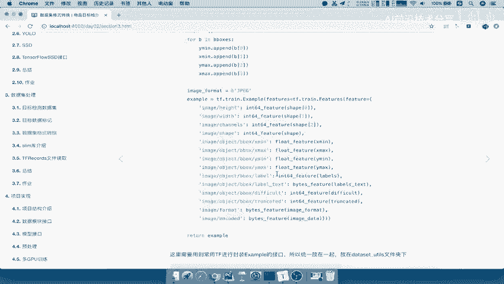

关键是要记住封装时的原则：信息尽可能详细，关键信息（如图像尺寸、边界框、类别）必须存储，并且要正确指定每个字段的数据类型。