# TensorFlow Slim库介绍与TFRecords数据读取教程 🧠

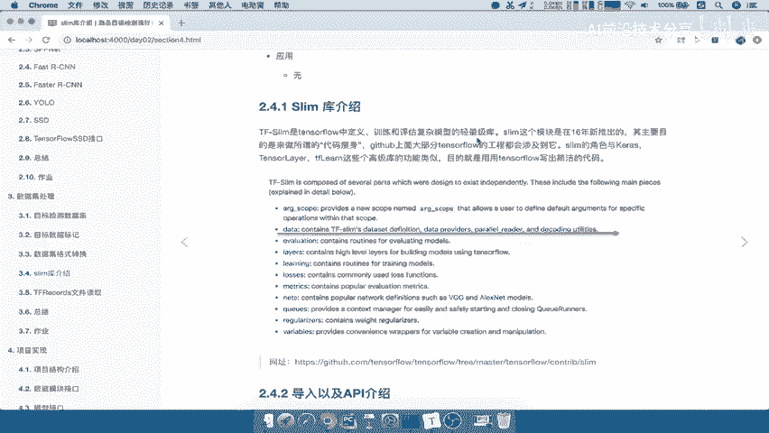

在本节课中，我们将学习如何使用TensorFlow的Slim库来简化模型构建和数据读取流程，特别是如何读取之前存储好的TFRecords文件。

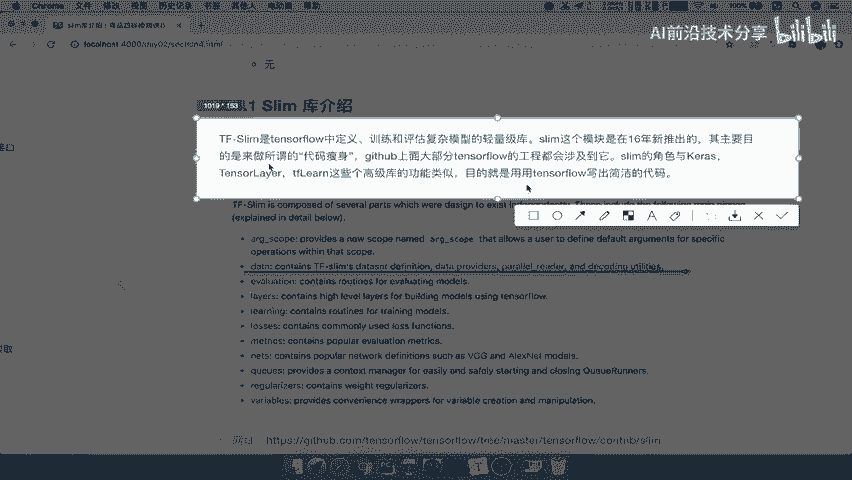

---

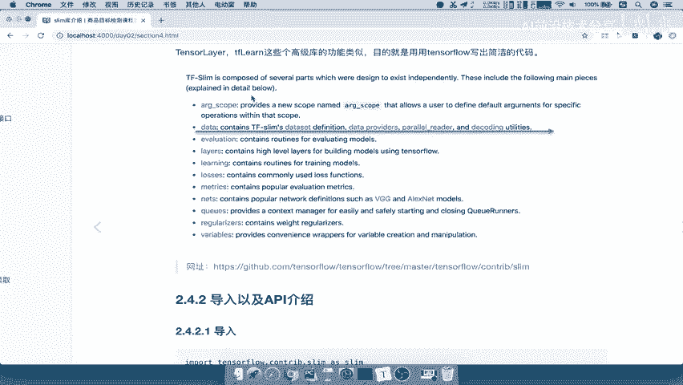

## 概述

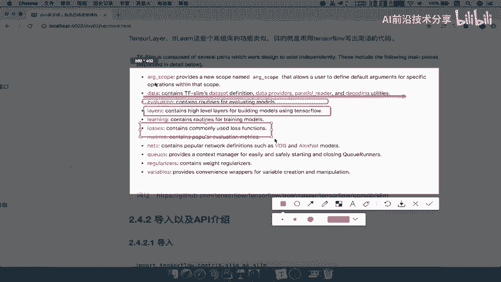

上一节我们介绍了如何将数据存储为TFRecords格式。本节中，我们来看看如何高效地读取这些数据以供模型训练使用。为此，我们将引入TensorFlow Slim库，这是一个旨在简化TensorFlow代码编写的轻量级库。

## 什么是TensorFlow Slim库？🤔

TensorFlow Slim库是TensorFlow内部定义的一个用于训练和评估复杂模型的轻量级库。它的功能类似于Keras、TFLearn等高级库，核心目的是使TensorFlow代码更加简洁。由于原生TensorFlow的代码步骤较多且接近算法底层，Slim库通过提供高级抽象来简化这一过程。

Slim库包含了许多模块，例如：
*   **数据读取** (`slim.data`)
*   **网络层定义** (`slim.layers`)
*   **损失函数** (`slim.losses`)
*   **评估指标** (`slim.metrics`)
*   **训练循环** (`slim.learning`)

导入Slim库非常简单：
```python
import tensorflow.contrib.slim as slim
```

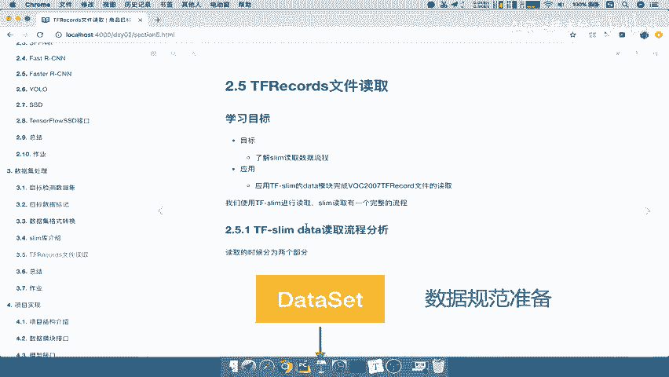

## Slim库读取数据的流程 📖

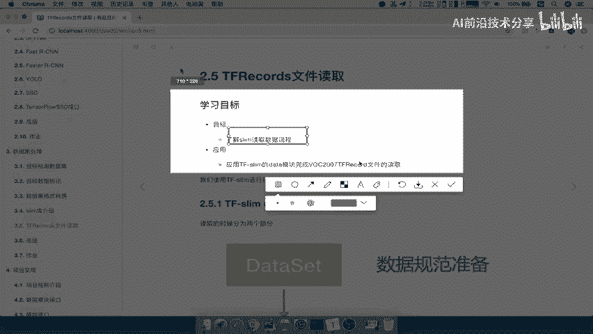

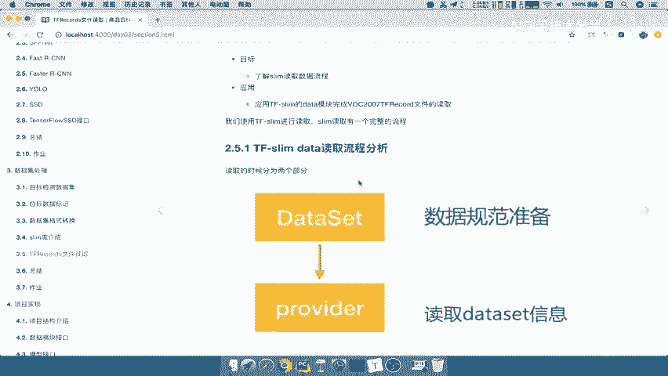

Slim库读取数据的流程清晰且分为两个主要步骤。以下是这两个步骤的概述：

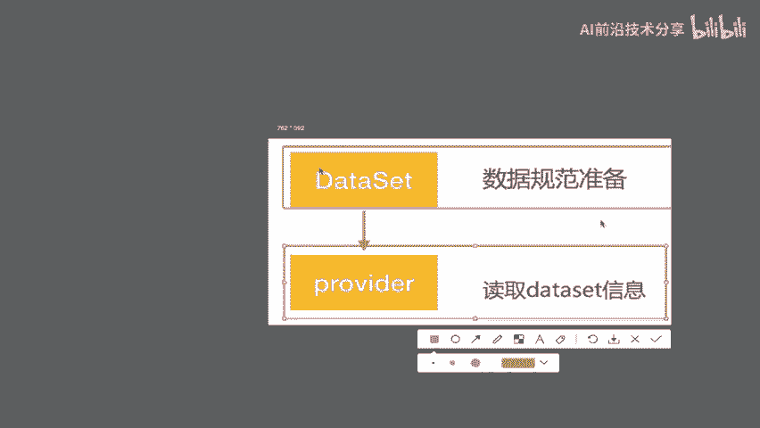

1.  **准备数据集规范信息**：定义数据的结构、解码方式等信息。
2.  **通过Provider读取数据**：使用定义好的规范，实际读取并供给数据。

具体来说，在TensorFlow Slim中读取数据只需两步：
第一步，准备 `dataset` 规范信息；第二步，直接通过 `provider` 进行读取。

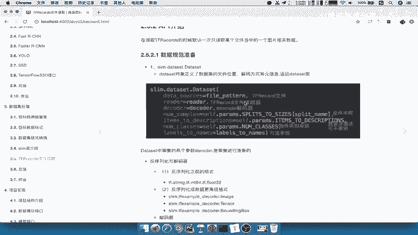

### 第一步：准备Dataset规范

这一步的核心是封装一个 `Dataset` 实例，告诉Slim我们想要什么数据以及数据的格式。一个关键的参数是 `decoder`（解码器）。

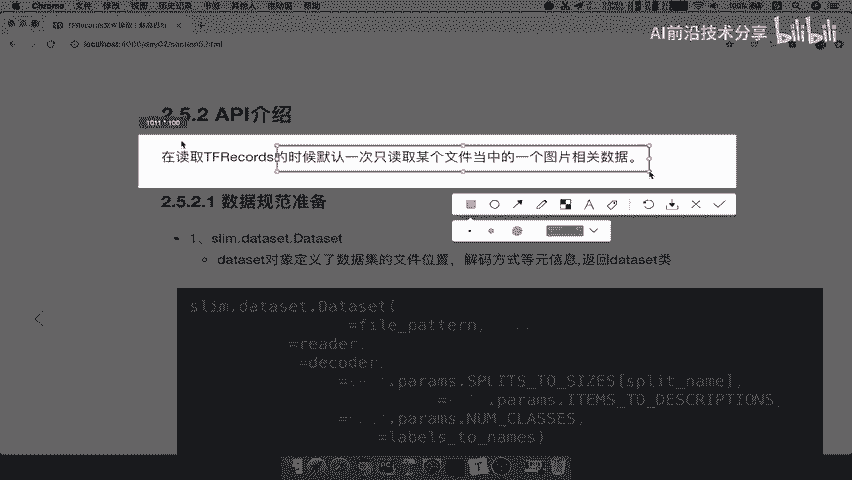

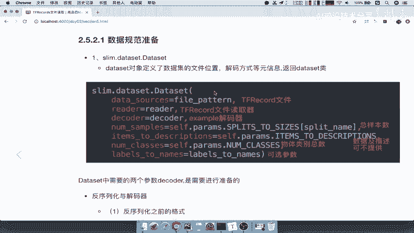

**为什么需要解码器？**
因为数据是以Protocol Buffer协议序列化后存储在TFRecords文件中的。读取时，我们需要一个“反序列化”的过程来解析这个协议，将二进制数据转换回我们可以使用的格式。

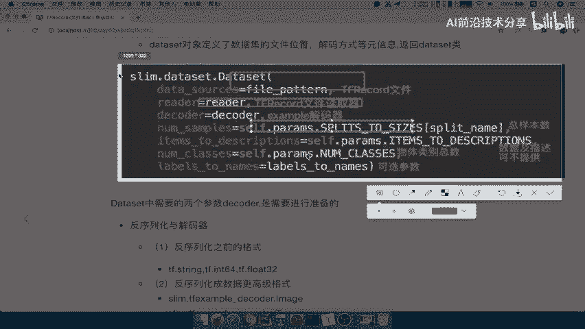

解码过程分为两步：
1.  **反序列化原始格式**：将数据从Protocol Buffer协议解析回其原始的存储格式（例如 `int64`, `float`）。
2.  **解码为高级格式**：将原始格式的数据进一步解码，封装成用户可以直接通过预定名称（如 `image`, `label`, `bbox`）访问的高级格式。

对于目标检测任务，Slim特别提供了对边界框（Bounding Box）的支持。需要注意的是，提供给Slim的边界框格式必须是 **[ymin, xmin, ymax, xmax]**。这与我们之前存储数据时强调的顺序是一致的。

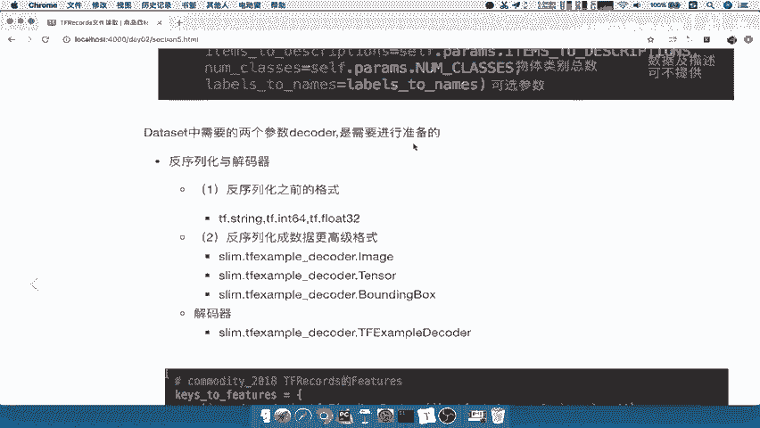

最终，我们会使用 `tf.example_decoder` 来完成解析。

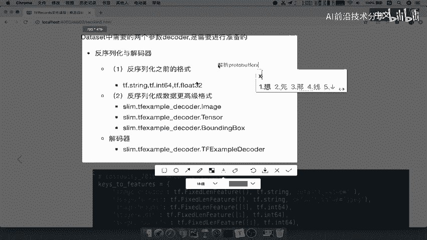

### 第二步：通过Provider读取

准备好 `Dataset` 规范后，就可以使用 `slim.dataset_data_provider.DatasetDataProvider` 来实际读取数据了。它会根据我们定义的规范，每次返回一个样本的数据（如图片、标签、边界框）。

## 代码实现示例 💻

以下是实现上述第一步（准备Dataset规范）的关键代码逻辑概述：

我们需要准备相关参数并填入 `slim.dataset.Dataset` 的构造函数中。主要参数包括：
*   `data_sources`: TFRecords文件路径。
*   `reader`: 读取器，例如 `tf.TFRecordReader`。
*   `decoder`: 配置好的解码器，如 `tf.example_decoder`。
*   `num_samples`: 数据集的样本总数。
*   `num_classes`: 数据的类别总数。

以下是一个简化的代码框架：
```python
import tensorflow as tf
import tensorflow.contrib.slim as slim

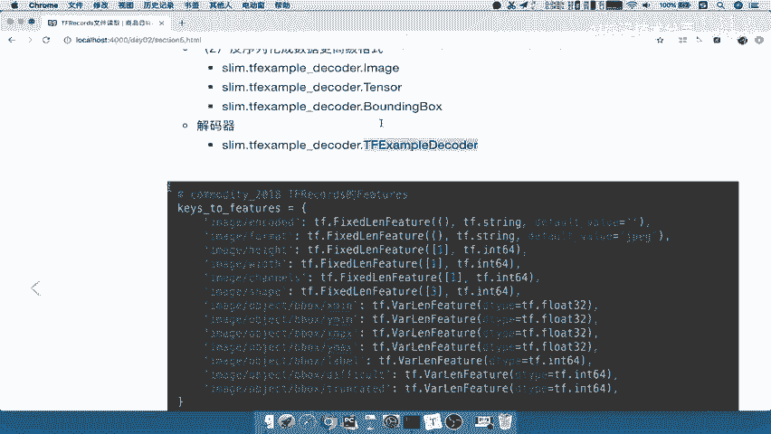

# 1. 定义解码器
keys_to_features = {
    'image/encoded': tf.FixedLenFeature((), tf.string, default_value=''),
    'image/format': tf.FixedLenFeature((), tf.string, default_value='jpeg'),
    'image/object/bbox/xmin': tf.VarLenFeature(dtype=tf.float32),
    # ... 定义其他特征
}
items_to_handlers = {
    'image': slim.tfexample_decoder.Image('image/encoded', 'image/format'),
    'bbox': slim.tfexample_decoder.BoundingBox(
                ['ymin', 'xmin', 'ymax', 'xmax'], 'image/object/bbox/'),
    # ... 定义其他数据的处理器
}
decoder = slim.tfexample_decoder.TFExampleDecoder(keys_to_features, items_to_handlers)

# 2. 创建Dataset实例
dataset = slim.dataset.Dataset(
    data_sources=['path/to/your.tfrecord'],
    reader=tf.TFRecordReader,
    decoder=decoder,
    num_samples=4952, # 你的样本总数
    num_classes=20,   # 你的类别总数
    items_to_descriptions={'image': 'A color image.', 'bbox': 'A list of bounding boxes.'}
)

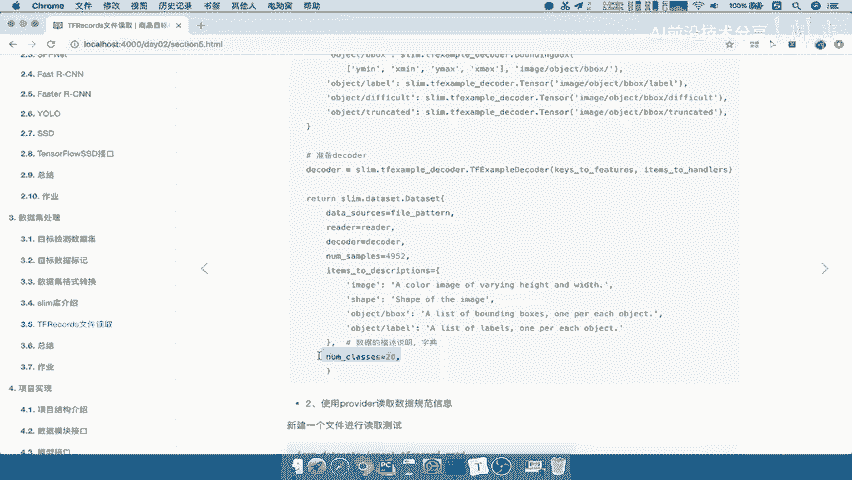

# 3. 创建Provider并获取数据
provider = slim.dataset_data_provider.DatasetDataProvider(dataset)
[image, bbox, label] = provider.get(['image', 'bbox', 'label'])
# 此时 image, bbox, label 就是可用的Tensor
```

运行上述代码后，你可以检查获取到的张量形状，例如 `image` 的形状可能是 `(?, ?, 3)`，表示可变的高度、宽度和3个颜色通道。

## 总结

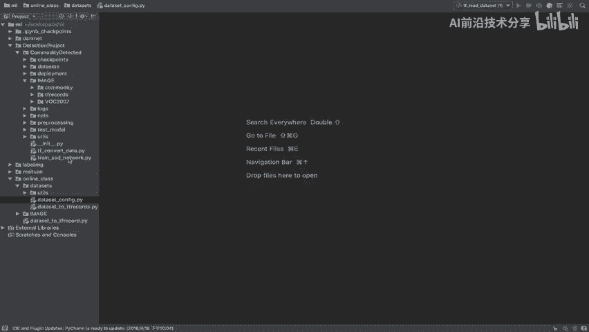

本节课中，我们一起学习了：
1.  **TensorFlow Slim库的作用**：一个用于简化TensorFlow模型开发的高级库。
2.  **Slim库读取TFRecords的两步流程**：首先准备`Dataset`数据规范，然后通过`Provider`读取。
3.  **解码器（Decoder）的核心作用**：负责将TFRecords中的序列化数据解析回可用的高级格式，并特别注意了边界框的格式要求。
4.  **基本的代码实现思路**：通过定义特征映射、创建Dataset和Provider来完成数据读取。

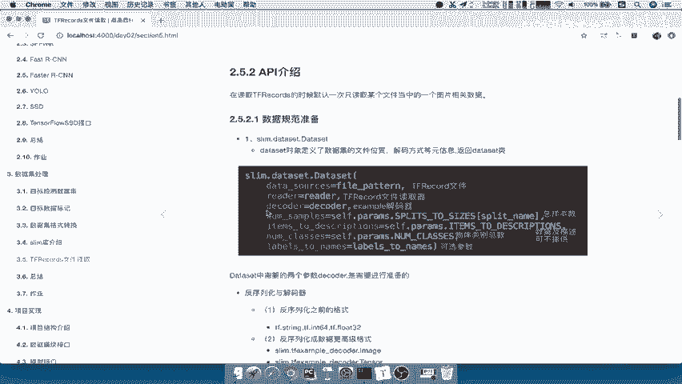

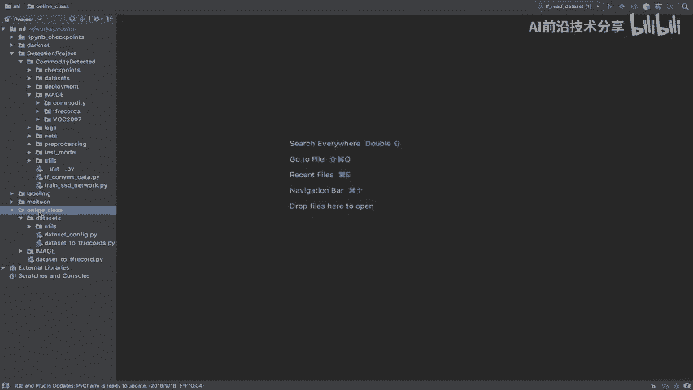

接下来，你就可以利用定义好的数据供给流程，将数据输入到使用Slim构建的模型中进行训练了。