# 课程 P44：TFRecord读取 - Dataset准备 🗂️

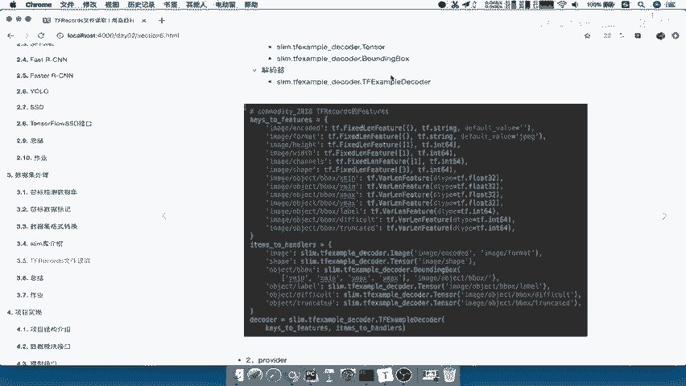

在本节课中，我们将学习如何为Pascal VOC 2007数据集编写一个规范的Dataset读取函数。我们将使用TensorFlow的`slim`模块来构建一个标准的数据读取流程，该流程能够从TFRecord文件中解析出图像和标注信息。

## 概述

上一节我们介绍了TFRecord文件的写入逻辑，本节中我们来看看如何从TFRecord文件中读取数据，并将其封装成一个符合TensorFlow Dataset API规范的Dataset对象。我们将创建一个名为`get_dataset`的函数来完成这个任务。

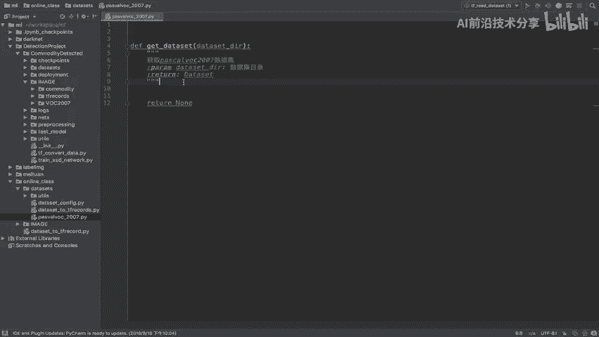

## 创建读取函数

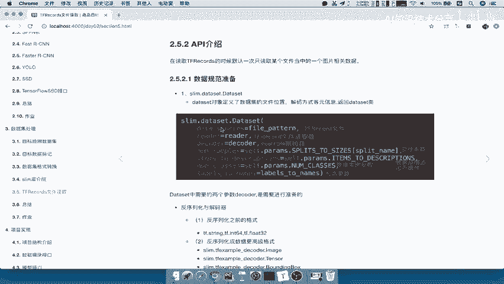

首先，我们创建一个新的Python文件，用于编写Pascal VOC 2007数据集的读取逻辑。

```python
import os
import tensorflow as tf
from tensorflow.contrib import slim
```

我们定义一个名为`get_dataset`的函数，它接收数据集目录作为参数，并返回一个Dataset对象。

```python
def get_dataset(dataset_dir):
    """
    获取Pascal VOC 2007数据集。
    Args:
        dataset_dir: 数据集的目录。
    Returns:
        一个符合Dataset API规范的数据集对象。
    """
    # 函数实现将放在这里
    pass
```

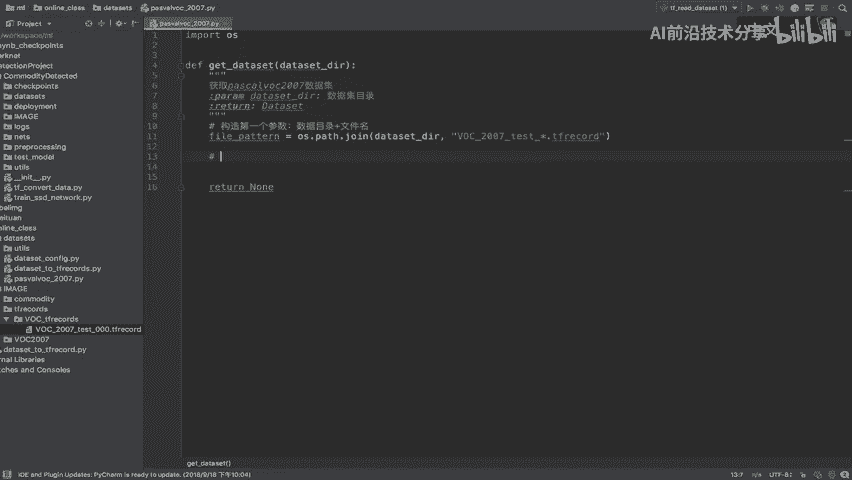

## 准备Dataset参数

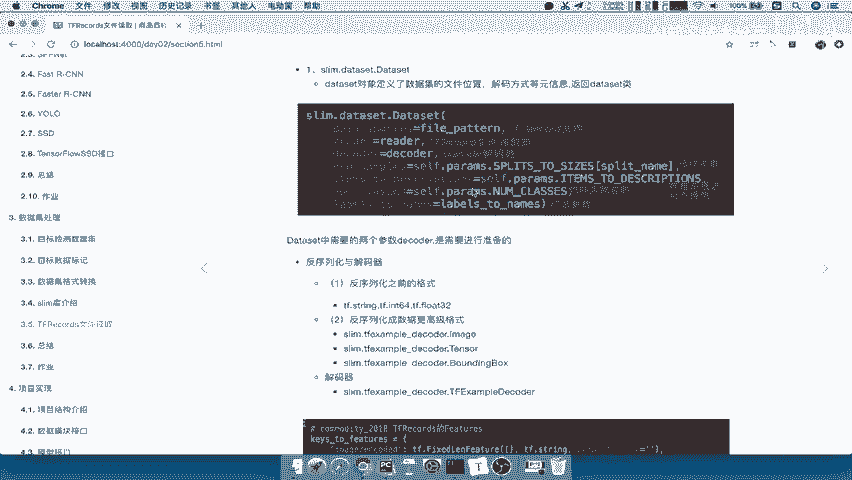

要构建一个Dataset，我们需要准备几个核心参数：数据源路径、读取器（reader）和解码器（decoder）。

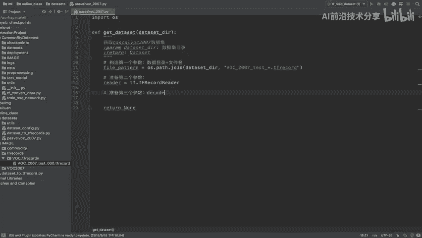

### 1. 构造数据源路径

第一个参数是数据源，即TFRecord文件的路径模式。我们使用通配符来匹配目录下所有相关的文件。

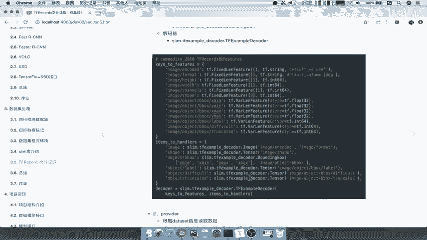

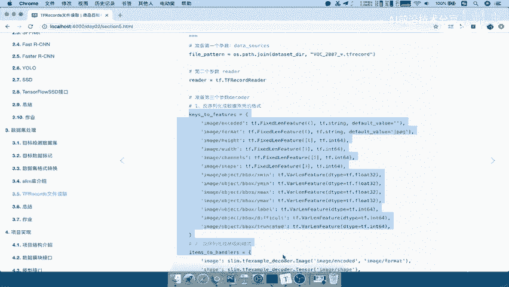

```python
# 构造数据源路径
file_pattern = os.path.join(dataset_dir, 'pascal_2007_*.tfrecord')
```

### 2. 准备读取器（Reader）

第二个参数是读取器，它定义了如何读取TFRecord文件。我们使用`tf.TFRecordReader`。

```python
# 准备读取器
reader = tf.TFRecordReader
```

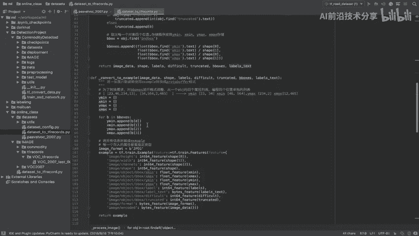

### 3. 准备解码器（Decoder）

解码器是最复杂的部分，它负责将序列化的TFRecord数据解析成可用的张量。它分为两部分：`keys_to_features`和`items_to_handlers`。

以下是解码器所需的核心字典定义：

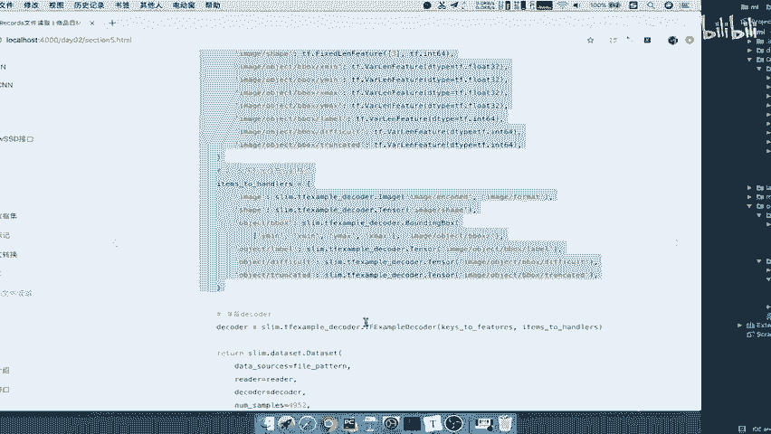

```python
# 定义 keys_to_features， 指定TFRecord中存储的原始数据格式
keys_to_features = {
    'image/encoded': tf.FixedLenFeature((), tf.string, default_value=''),
    'image/format': tf.FixedLenFeature((), tf.string, default_value='jpeg'),
    'image/height': tf.FixedLenFeature([1], tf.int64),
    'image/width': tf.FixedLenFeature([1], tf.int64),
    'image/channels': tf.FixedLenFeature([1], tf.int64),
    'image/shape': tf.FixedLenFeature([3], tf.int64),
    'image/object/bbox/xmin': tf.VarLenFeature(dtype=tf.float32),
    'image/object/bbox/ymin': tf.VarLenFeature(dtype=tf.float32),
    'image/object/bbox/xmax': tf.VarLenFeature(dtype=tf.float32),
    'image/object/bbox/ymax': tf.VarLenFeature(dtype=tf.float32),
    'image/object/bbox/label': tf.VarLenFeature(dtype=tf.int64),
    'image/object/bbox/difficult': tf.VarLenFeature(dtype=tf.int64),
    'image/object/bbox/truncated': tf.VarLenFeature(dtype=tf.int64),
}

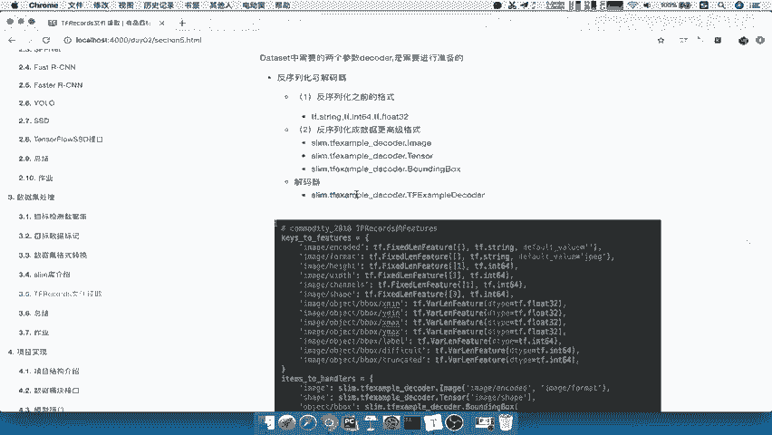

# 定义 items_to_handlers， 指定如何将解析后的特征映射到最终输出的张量
items_to_handlers = {
    'image': slim.tfexample_decoder.Image('image/encoded', 'image/format'),
    'shape': slim.tfexample_decoder.Tensor('image/shape'),
    'object/bbox': slim.tfexample_decoder.BoundingBox(
            ['ymin', 'xmin', 'ymax', 'xmax'], 'image/object/bbox/'),
    'object/label': slim.tfexample_decoder.Tensor('image/object/bbox/label'),
    'object/difficult': slim.tfexample_decoder.Tensor('image/object/bbox/difficult'),
    'object/truncated': slim.tfexample_decoder.Tensor('image/object/bbox/truncated'),
}
```

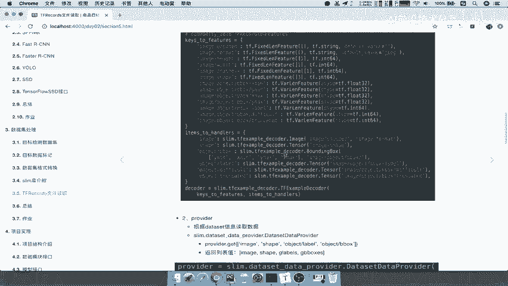

**关键点解释**：在`items_to_handlers`中，`BoundingBox`处理器默认只读取每个列表的第一个元素。这意味着，如果一张图片有多个标注框，这里只会返回第一个框的坐标。在实际应用中，你可能需要根据任务调整这个逻辑。

准备好这两个字典后，我们可以创建解码器：

```python
# 构造解码器
decoder = slim.tfexample_decoder.TFExampleDecoder(keys_to_features, items_to_handlers)
```

## 组装Dataset对象

现在，我们已经准备好了所有必需的参数，可以使用`slim.dataset.Dataset`类来创建最终的Dataset对象。

以下是组装Dataset的完整代码：

```python
def get_dataset(dataset_dir):
    """
    获取Pascal VOC 2007数据集。
    Args:
        dataset_dir: 数据集的目录。
    Returns:
        一个符合Dataset API规范的数据集对象。
    """
    # 1. 构造数据源路径
    file_pattern = os.path.join(dataset_dir, 'pascal_2007_*.tfrecord')

    # 2. 准备读取器
    reader = tf.TFRecordReader

    # 3. 准备解码器
    keys_to_features = { ... } # 如上文所示
    items_to_handlers = { ... } # 如上文所示
    decoder = slim.tfexample_decoder.TFExampleDecoder(keys_to_features, items_to_handlers)

    # 4. 创建并返回Dataset对象
    dataset = slim.dataset.Dataset(
        data_sources=file_pattern,
        reader=reader,
        decoder=decoder,
        num_samples=4952, # 数据集中样本的总数
        items_to_descriptions={
            'image': 'A color image of varying size.',
            'shape': 'Shape of the image',
            'object/bbox': 'A list of bounding boxes.',
            'object/label': 'A list of labels, one for each object.',
            'object/difficult': 'A list of difficulty flags.',
            'object/truncated': 'A list of truncation flags.',
        },
        num_classes=20 # VOC数据集的类别数
    )
    return dataset
```

## 核心API总结

本节课中我们一起学习了如何使用TensorFlow Slim来规范地读取TFRecord数据集。以下是涉及的核心API：

*   **`slim.dataset.Dataset`**：用于创建标准数据集对象的类。
*   **`tf.TFRecordReader`**：用于读取TFRecord文件的读取器类。
*   **`slim.tfexample_decoder.TFExampleDecoder`**：用于解析TFExample协议缓冲区的解码器类。

构建Dataset时需要重点准备的三个参数是：
1.  `data_sources`：数据文件路径模式。
2.  `reader`：文件读取器。
3.  `decoder`：数据解码器，其核心是`keys_to_features`和`items_to_handlers`两个字典的定义。

## 总结

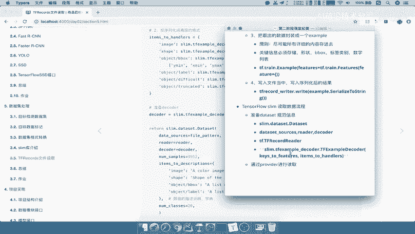

在本节课中，我们完成了一个从TFRecord文件读取Pascal VOC 2007数据集的完整函数。我们学习了如何构造数据源路径、指定读取器、以及最关键的一步——定义解码器来将序列化的数据还原为图像和标注张量。通过`slim.dataset.Dataset`类，我们将这些组件封装成一个标准、易用的Dataset对象，为后续的模型训练做好了数据准备。理解这个流程是使用TensorFlow高效处理自定义数据集的基础。