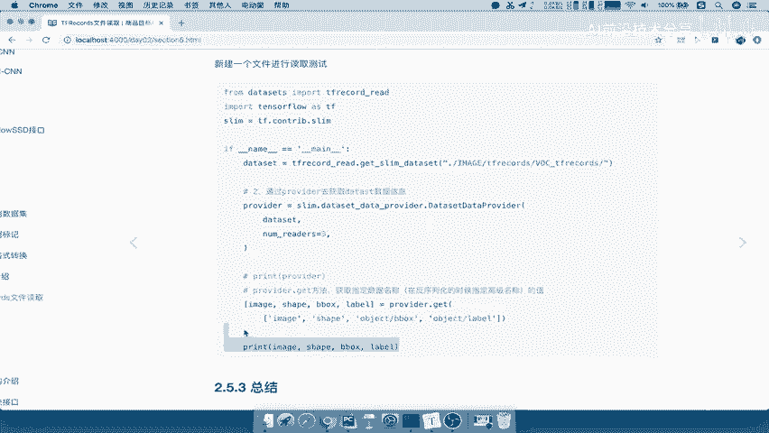
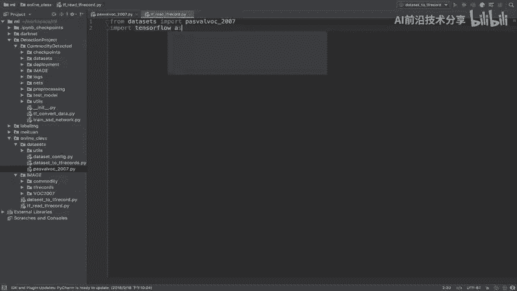
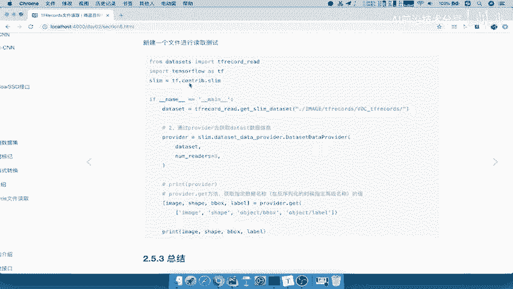
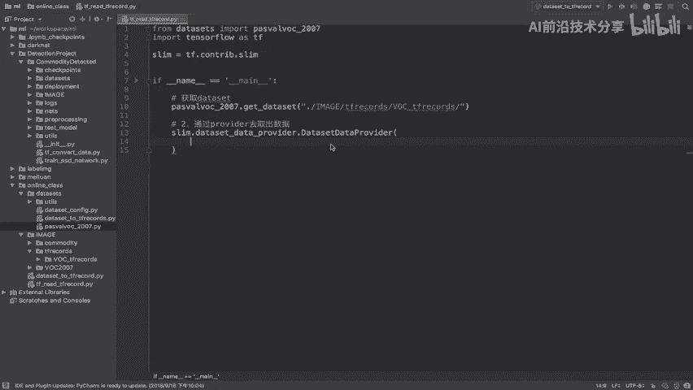
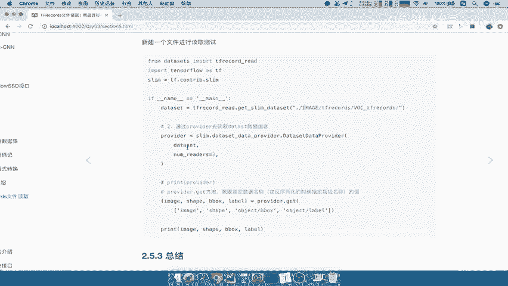
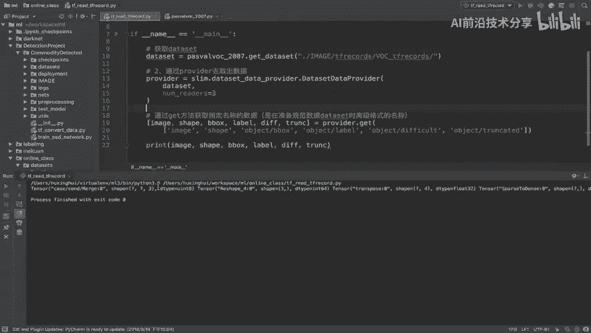
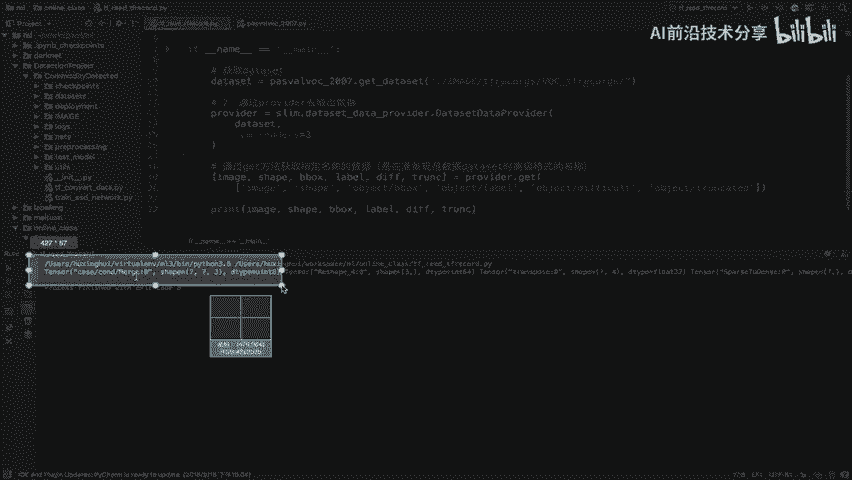
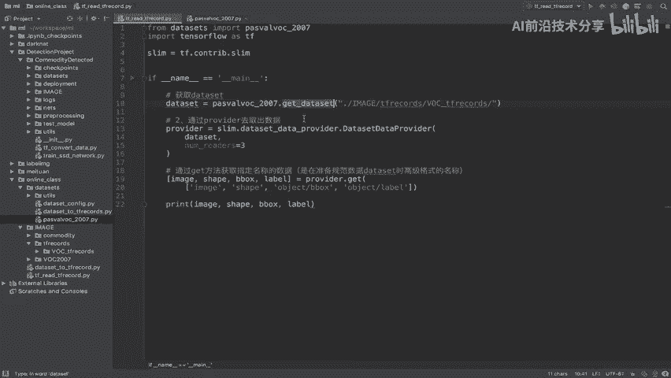
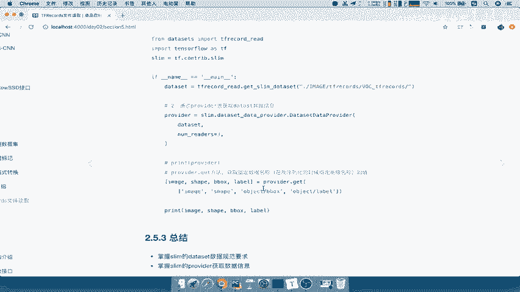

# 课程 P45：TFRecord 读取 - Provider 读取 🧠

在本节课中，我们将学习如何使用 TensorFlow 的 `slim` 模块中的 `provider` 来读取之前准备好的 TFRecord 数据集。我们将重点关注如何从数据规范中获取实际的数据样本。

---



## 概述

上一节我们介绍了如何准备数据集的规范信息。本节中，我们来看看如何使用 `provider` 来实际读取这些数据。`provider` 是一个数据提供器，它可以根据我们定义的数据集规范，高效地加载和提供数据样本。



## 数据读取步骤



以下是使用 `provider` 读取数据的主要步骤：

1.  **导入必要模块**：导入数据集模块和 TensorFlow。
2.  **获取数据集规范**：调用数据集模块的函数，获取数据集的规范对象。
3.  **创建数据提供器**：使用 `slim.dataset_data_provider.DatasetDataProvider` 创建数据提供器。
4.  **获取数据**：通过提供器的 `get` 方法，按需获取指定字段的数据。



接下来，我们将详细实现每一步。



## 代码实现

以下是实现数据读取的完整代码逻辑。

首先，我们需要导入必要的模块。

```python
import tensorflow as tf
from datasets import pascalvoc_2007
from tensorflow.contrib import slim
```

接着，我们定义一个主函数来执行读取操作。

```python
def main():
    # 第一步：获取数据集规范
    dataset = pascalvoc_2007.get_dataset('./images/tfrecords/voc_tfrecords/')

    # 第二步：通过 provider 创建数据提供器
    provider = slim.dataset_data_provider.DatasetDataProvider(
        dataset,
        num_readers=3  # 指定读取线程数
    )

    # 第三步：通过 get 方法获取指定名称的数据
    # 可以按需获取，不一定要获取所有字段
    [image, shape, bbox, label] = provider.get(['image', 'shape', 'object/bbox', 'object/label'])

    # 打印获取到的数据（以 Tensor 形式显示）
    print(image, shape, bbox, label)
```





## 参数说明

在创建 `DatasetDataProvider` 时，有几个关键参数可以配置：



*   `dataset`：必需参数，即第一步获取的数据集规范对象。
*   `num_readers`：读取数据时使用的线程数，可以提升读取效率。
*   其他参数如队列大小、是否打乱数据等均为可选，可以根据需要设置。

在调用 `provider.get()` 方法时，需要传入一个列表，指定要获取的数据字段名称。这些名称必须与准备数据集规范时定义的键名一致。你可以选择获取全部字段，也可以只获取训练所需的部分字段。

## 总结



本节课中我们一起学习了使用 `provider` 读取 TFRecord 数据的完整流程。核心在于两步：首先准备好数据集的规范，然后通过 `DatasetDataProvider` 创建提供器并利用 `get` 方法按需获取数据。掌握这个方法，你就能灵活高效地从 TFRecord 文件中加载数据用于模型训练了。