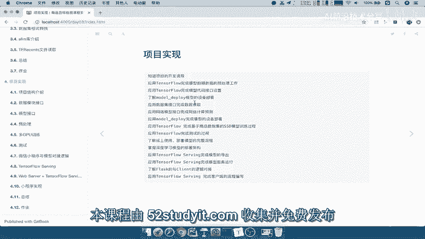
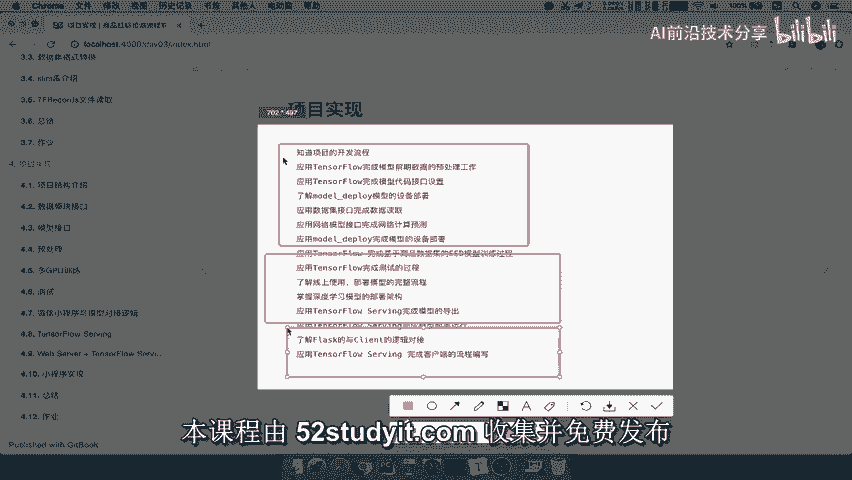
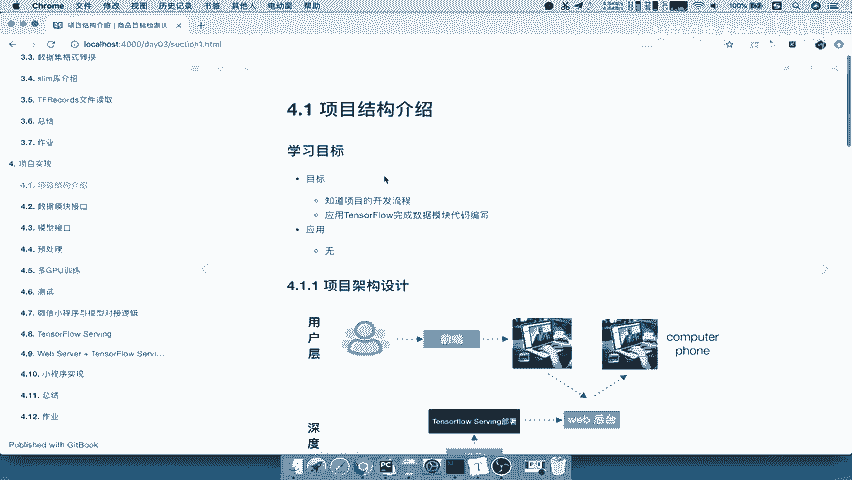
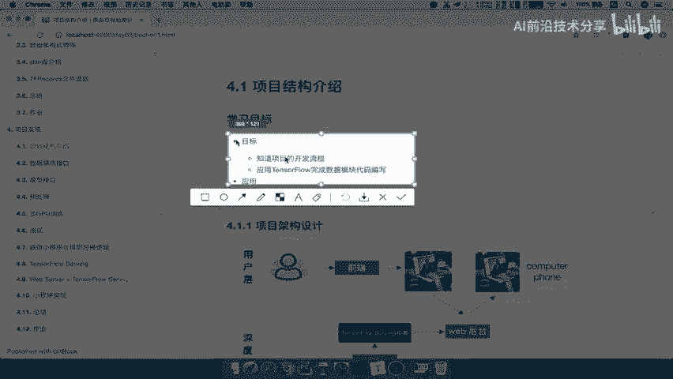
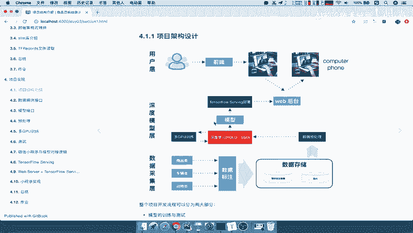
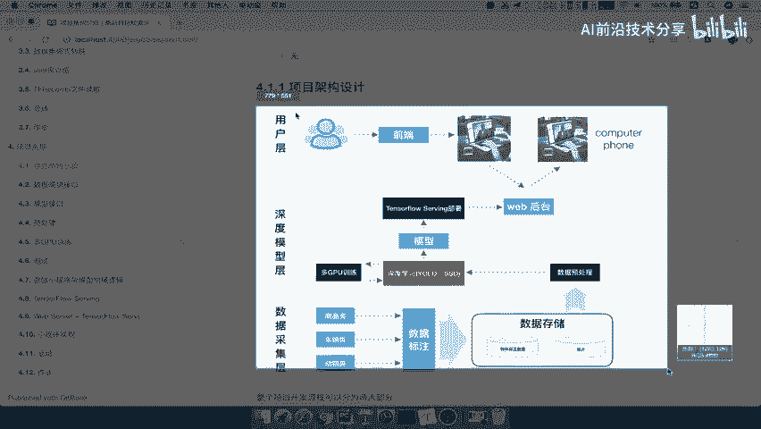
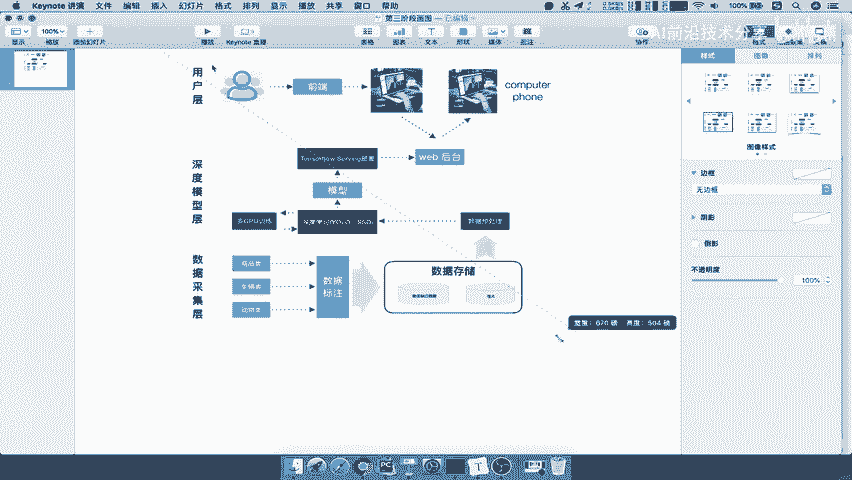
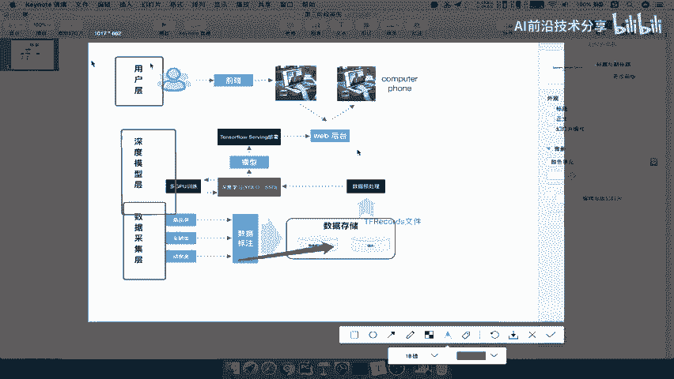
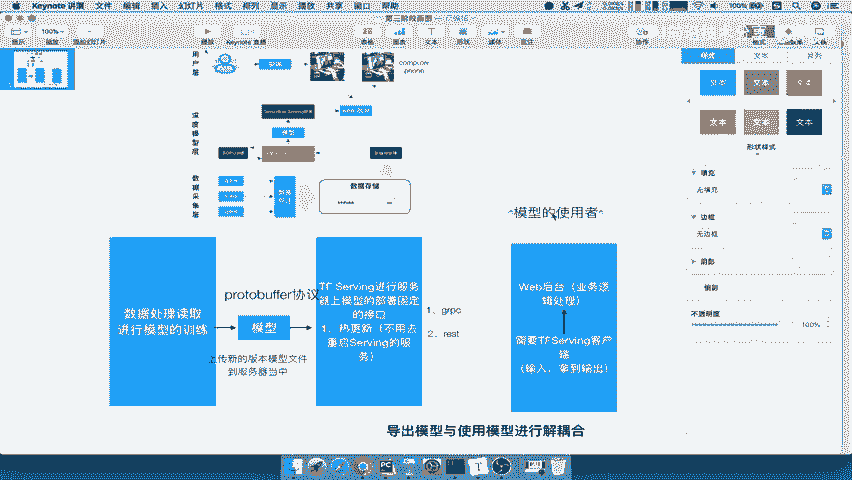

# 课程 P47：项目架构设计 🏗️



在本节课中，我们将学习如何为一个AI项目设计完整的实现架构。我们将从整体流程出发，详细讲解从数据处理到模型部署，再到用户交互的每一个环节，并解释为何采用特定的技术方案来实现解耦与高效协作。





---



## 项目结构介绍





上一节我们介绍了项目的整体目标，本节中我们来看看项目的具体开发流程与结构设计。



一个清晰的项目结构是成功实现的基础。你应该能够说明项目的开发流程，并应用TensorFlow完成数据与代码模块的编写。

以下是项目架构的整体设计图，它清晰地展示了从数据到用户的全流程：




整个模型流程可分为三层：
1.  **数据采集层**：负责数据的标注与存储。
2.  **深度模型训练层**：负责模型的训练与导出。
3.  **用户层**：负责提供交互界面与业务逻辑。

具体流程如下：
*   在数据采集层，将标注好的XML文件和图片数据存储后，统一转换为 **`TFRecords`** 文件格式。
*   在深度模型层，读取 `TFRecords` 文件进行预处理，并将数据送入算法模型，利用多GPU进行训练，最终生成一个训练好的模型。
*   训练好的模型通过 **TensorFlow Serving** 进行部署。后台服务通过调用Serving提供的接口，实现Web端的业务逻辑。
*   最终用户通过前端界面与后台交互，获得模型预测结果。

---

## 架构设计详解与解耦思想

了解了整体流程后，我们来深入探讨为何要这样设计，其中的核心在于“解耦”。

如果简单地将训练导出的模型文件直接交给使用者，会遇到诸多问题。模型使用者需要关心模型的版本迭代、文件路径以及内部细节的修改，这增加了使用的复杂度和耦合性。

我们的核心目标是：**让模型导出方与模型使用方的业务解耦**。使用者无需关心模型如何训练和版本更替，只需专注于使用模型功能。

为实现这一目标，我们引入了 **TensorFlow Serving** 作为模型部署的中间层。

### TensorFlow Serving 的优势

TensorFlow Serving 部署在固定的服务器接口上，其主要优势在于：

1.  **模型热更新**：当需要更新模型时，只需将新版模型文件上传至服务器指定位置。TensorFlow Serving 会自动检测并加载新模型，无需重启服务。服务接口始终保持不变。
    *   **公式表示**：`服务接口 = 恒定`
2.  **提供标准化接口**：TensorFlow Serving 会对外提供两种类型的接口供客户端调用：
    *   **gRPC 接口**：基于高效的 Protobuf 协议。
    *   **RESTful API 接口**：基于 HTTP 协议，更易于 Web 集成。

### 客户端与Web后台的角色

通常，我们会编写一个 **TensorFlow Serving 客户端**。这个客户端只做两件事：**输入数据**，**获取输出结果**。其逻辑非常简单。

```python
# 伪代码示例：客户端核心逻辑
def tf_serving_client(input_data):
    # 1. 将数据发送至 TensorFlow Serving 的固定接口
    # 2. 接收并返回预测结果
    prediction_result = call_serving_api(input_data)
    return prediction_result
```

我们会将这个客户端嵌入到 **Web 后台** 中。Web 后台负责处理用户请求、业务逻辑，然后调用上述客户端获取模型预测结果，最后将处理好的结果返回给前端用户。

通过这样的设计：
*   **模型使用者（Web后台）**：只需通过固定客户端调用模型，不关心模型文件与版本。
*   **模型提供者**：只需维护和更新 TensorFlow Serving 中的模型文件。
*   双方通过定义良好的接口（gRPC或RESTful）进行通信，实现了业务上的解耦。

---

## 总结



本节课中我们一起学习了AI项目的完整架构设计。我们从项目流程图入手，理解了数据层、模型层和用户层的分工。随后，我们深入探讨了引入 **TensorFlow Serving** 进行模型部署的核心价值，即实现模型训练与使用的**解耦**。通过固定接口、热更新机制和专用的Serving客户端，我们构建了一个稳定、可维护且易于协作的项目架构，为后续的具体实现打下了坚实的基础。