# 课程 P48：训练与测试整体结构设计 🏗️

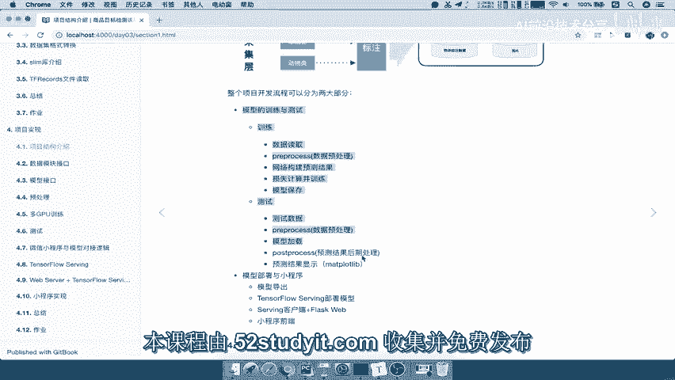

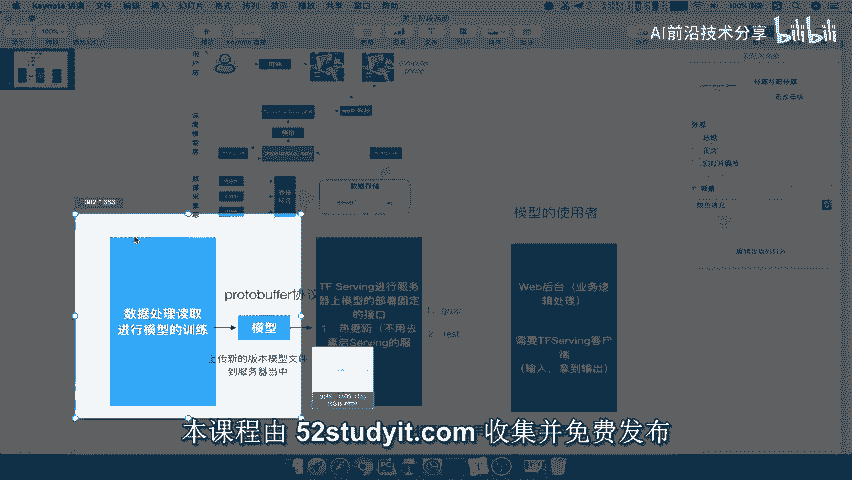

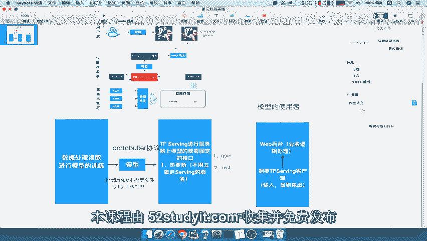

在本节课中，我们将学习如何为一个目标检测项目设计训练与测试部分的代码架构。我们将重点探讨如何实现模型、数据和预处理模块之间的解耦，以便灵活地组合不同的组件进行实验和开发。

---

## 概述

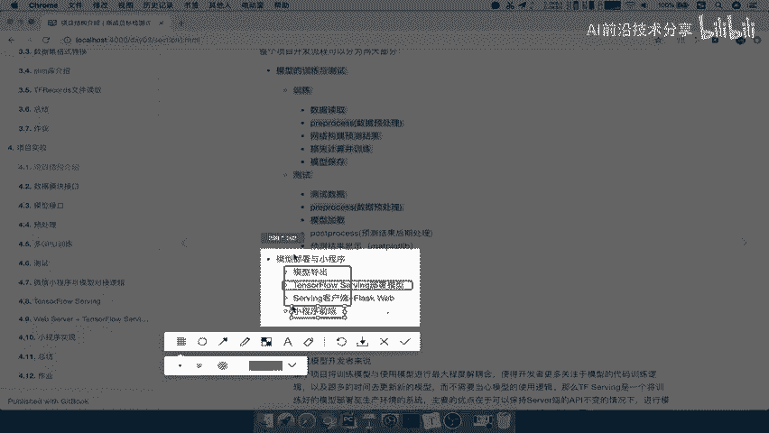

上一节我们介绍了项目的整体架构。本节中，我们来看看训练与测试部分的具体结构设计。我们的核心目标是设计一个灵活、可扩展的代码架构，使得模型训练过程能够轻松适配不同的数据集、预处理方法和模型算法。

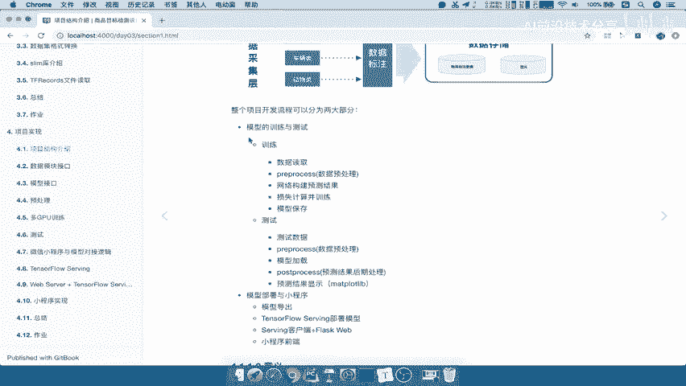

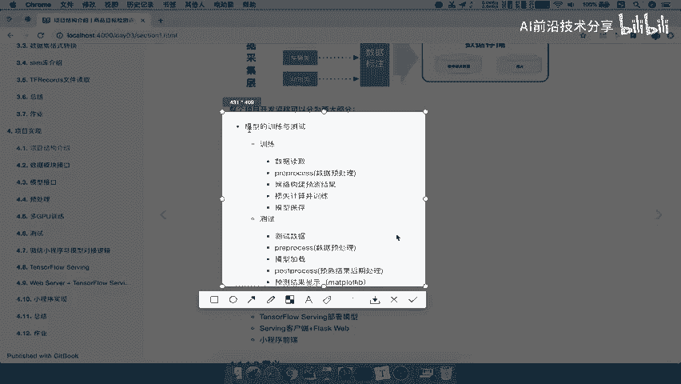

整个开发流程主要分为两部分：
1.  模型的训练与测试。
2.  模型的部署与应用。

我们关注的重点是第一部分的代码架构设计。部署部分（如TensorFlow Serving、Web客户端）更多是配置和应用，对于模型开发者而言，可以直接使用已准备好的工具。

## 训练代码架构设计目标

训练和测试都有各自的步骤与流程。我们首先需要设计训练部分的代码架构。

我们现在拥有的核心模块包括：
*   **数据模块**：负责提供训练和测试数据。
*   **模型网络模块**：包含不同的目标检测算法。
*   **预处理模块**：处理图像数据以满足不同模型的输入要求。

我们的设计目标是创建一个流程，使得在训练和测试时能够灵活地使用这三个部分。我们将其概念化为三个“工厂”：
*   `Data Factory`：数据工厂
*   `Process Factory`：预处理工厂
*   `Model Factory`：模型工厂

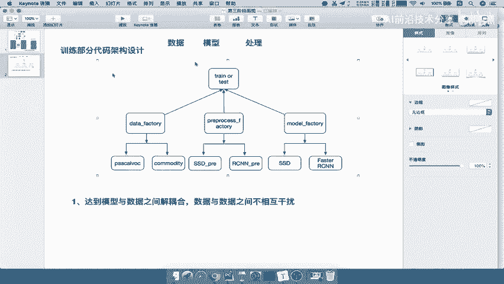

这意味着，当我想训练一个模型时，可以像在工厂中选择零件一样，自由组合。例如，我可以选择使用PASCAL VOC数据集、Faster R-CNN算法以及相应的预处理流程。这种设计的核心目的是实现**解耦合**。

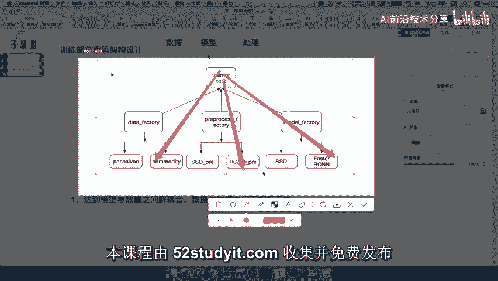

具体而言，我们希望达到：
*   **模型与数据之间解耦合**：更换数据集时，无需修改模型代码。
*   **数据与预处理之间解耦合**：数据读取逻辑独立于具体的预处理操作。
*   **预处理与模型之间解耦合**：预处理流程可以根据模型需求独立配置。

通过这种设计，当引入一个新的数据集时，我们只需要在`Data Factory`下增加该数据集的读取模块，即可与现有模型和预处理流程配合使用，无需改动其他部分的代码。这极大地提高了代码的复用性和可维护性。

## 项目文件结构

为了实现上述架构，我们的代码文件结构安排如下。以下是项目文件夹的核心构成：

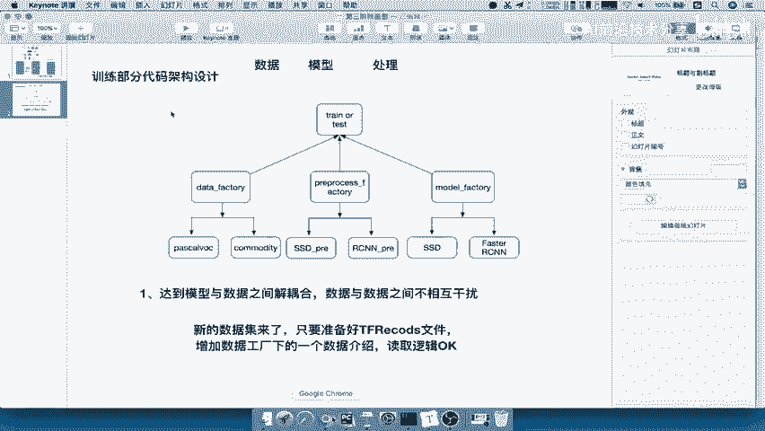

```
project/
├── datasets/          # 数据工厂模块 (Data Factory)
├── preprocessing/     # 预处理工厂模块 (Process Factory)
├── nets/             # 模型工厂模块 (Model Factory)
├── configs/          # 配置文件
└── ...               # 其他辅助文件夹（如训练脚本、工具函数等）
```

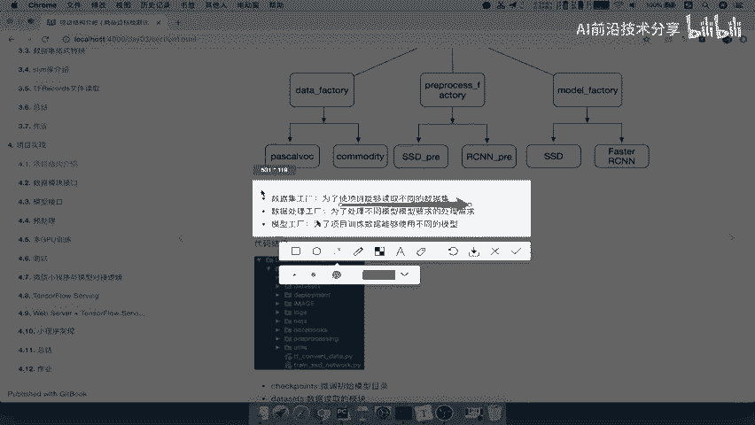

在这三个核心模块中：
*   `datasets`模块：用于读取和管理不同的数据集（如PASCAL VOC, COCO等）。
*   `preprocessing`模块：包含各种图像预处理和数据增强方法。
*   `nets`模块：存放不同的模型网络定义（如SSD, Faster R-CNN, YOLO等）。

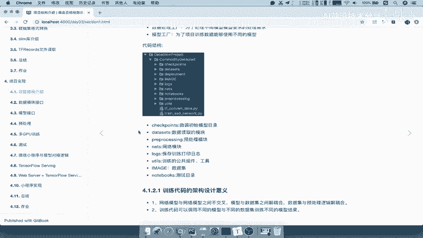

其他目录主要用于存放配置、训练主程序、工具脚本等，我们将在后续课程中逐一添加和讲解。

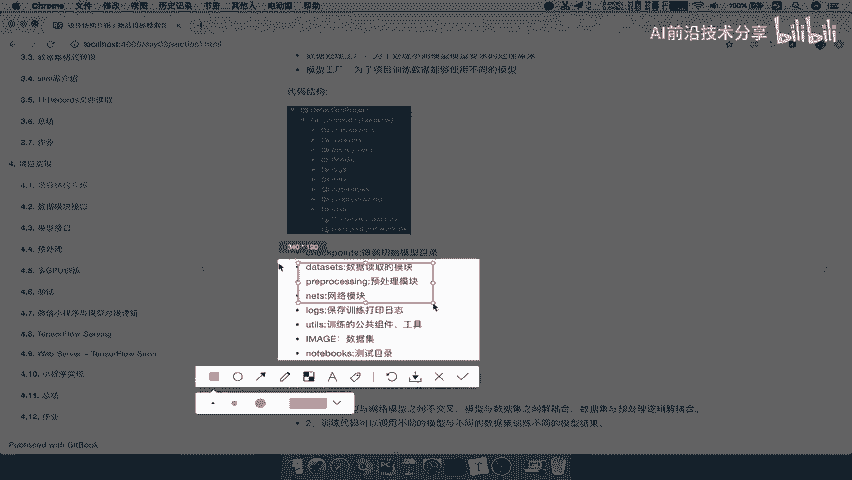

## 总结

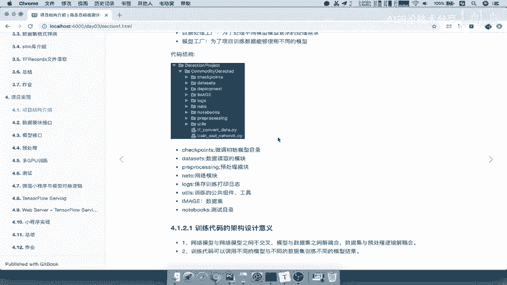

本节课中，我们一起学习了目标检测项目训练与测试部分的代码架构设计。我们明确了将代码划分为**数据工厂**、**预处理工厂**和**模型工厂**三个核心模块的设计思想，其核心优势在于实现了各组件间的**解耦合**。这种设计使得组合不同的数据集、模型和预处理流程变得非常灵活，为后续的模型训练、测试和迭代奠定了坚实的基础。下一节，我们将开始着手实现这些工厂模块。