# 课程 P49：49.01_数据接口：商品格式转换实现 🛠️

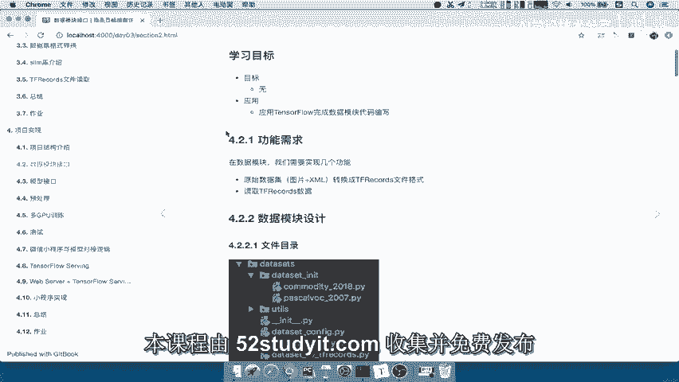

在本节课中，我们将学习如何为商品数据集编写数据接口模块，核心任务是实现数据格式的转换，将原始的图片和XML标注文件转换为TensorFlow的TFRecords格式，以便后续高效地读取和训练模型。

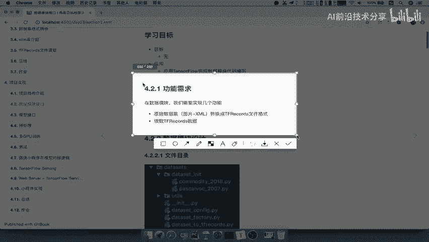

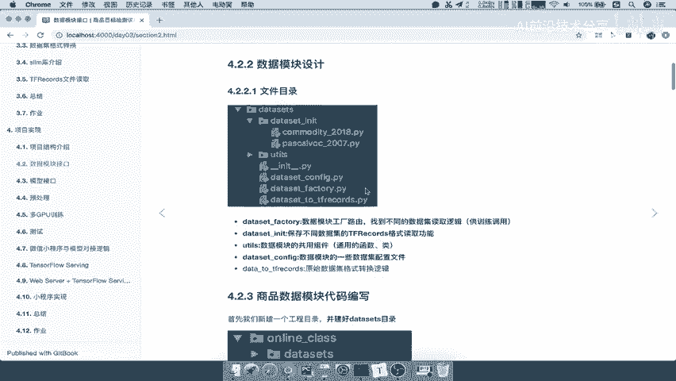

## 概述 📋

我们的目标是修改并完善数据读取模块，使其能够适配商品数据集。具体而言，我们将创建一个数据工厂模式，以支持不同数据集的读取逻辑。本节课将首先完成将商品数据集转换为TFRecords文件的需求。

## 模块设计 🏗️

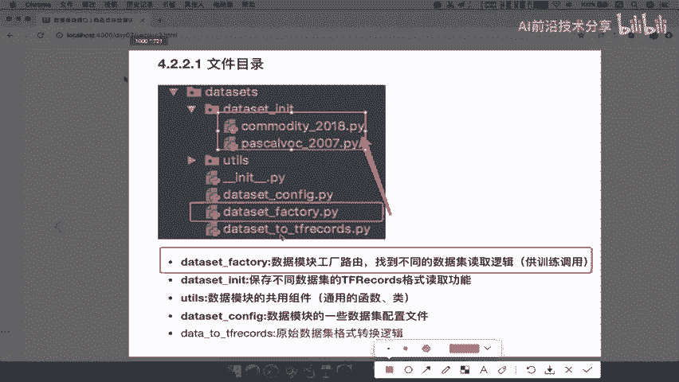

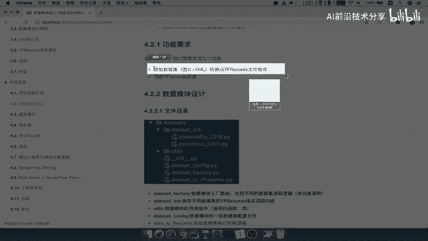

上一节我们明确了功能需求，本节中我们来看看模块的目录结构设计。整个数据接口模块的目录安排如下：

*   **dataset_factory**：数据工厂，负责根据配置获取不同数据集的读取逻辑。
*   **dataset_init**：保存不同数据集的具体读取逻辑。
*   **utils**：存放一些公共的工具组件。
*   **dataset_config**：存放数据读取过程中涉及的各种配置。
*   **dataset_to_tfrecords**：一个独立的文件，专门负责数据集的转换过程，逻辑较为简单，因此直接放在`datasets`目录下。

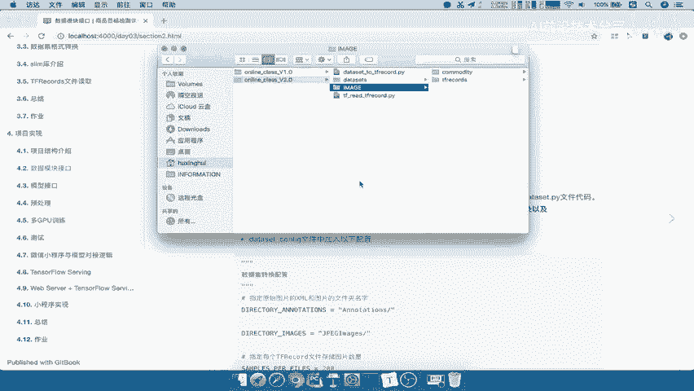

这样的设计使得代码结构清晰，易于维护和扩展。

## 实现商品数据集转换 🔄

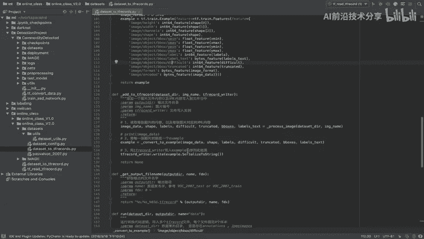

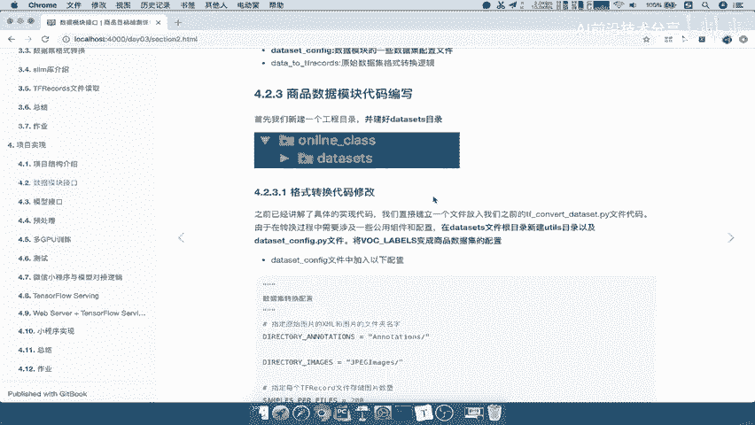

接下来，我们开始实现第一个核心需求：将原始商品数据集转换为TFRecords文件。

首先，我们需要建立项目环境。我们将基于之前数据模块的代码版本进行修改。

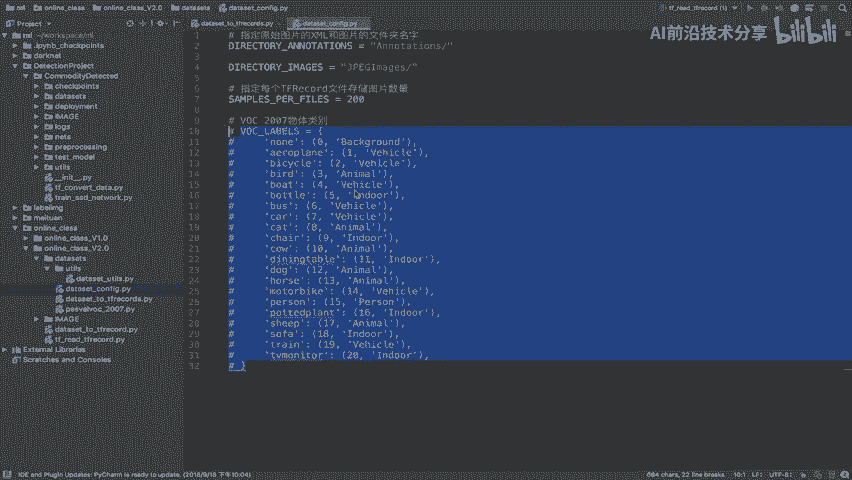

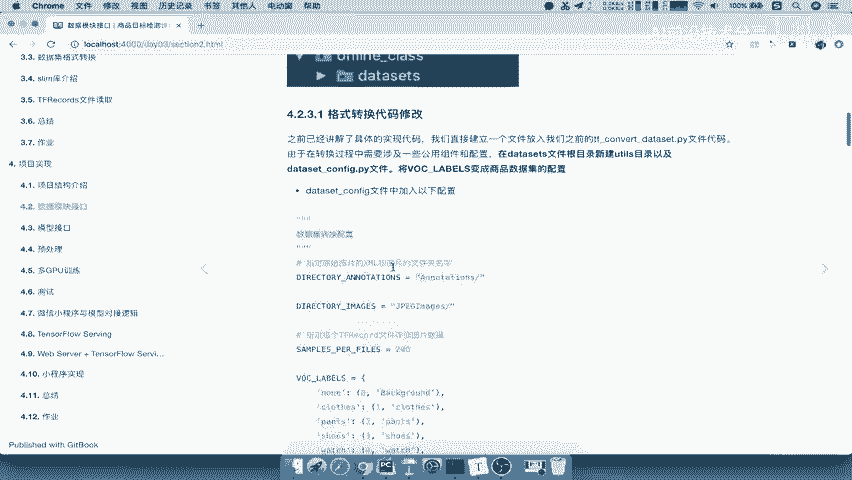

以下是具体的操作步骤：

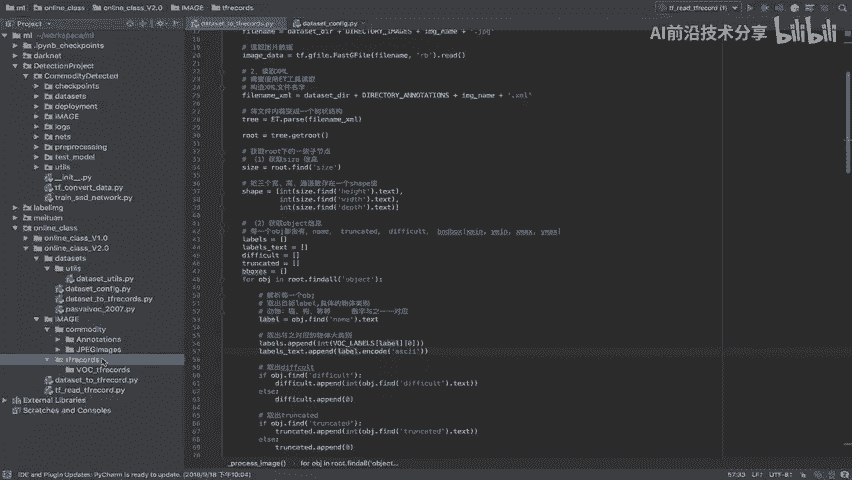

1.  新建一个项目文件夹，例如 `online_class_v2.0`。
2.  将之前数据模块版本的相关代码（`datasets`, `utils`目录）复制到新文件夹中。
3.  将商品数据集（包含`commodity`图片和`TFRECORD`相关文件）放入新项目下的`image`目录中。

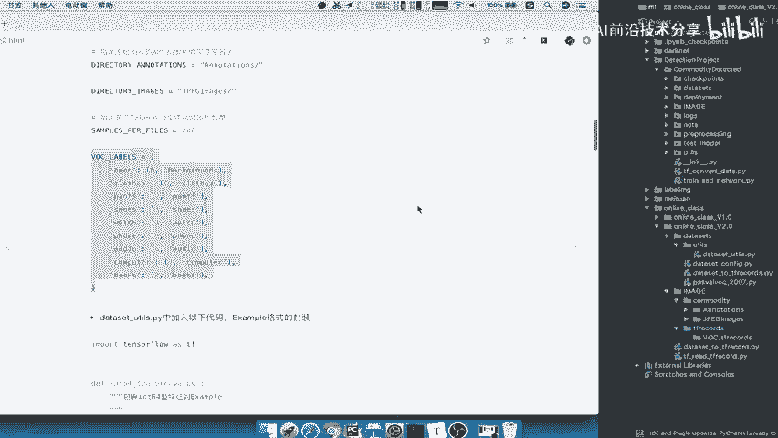

完成环境搭建后，我们开始修改转换逻辑。关键的修改点在于数据集的类别配置。原始代码使用的是VOC2007数据集的类别，我们需要将其替换为商品数据集的类别。

我们创建一个新的配置文件，例如在 `dataset_config` 中定义商品数据集的类别列表：
```python
# dataset_config/commodity_config.py
COMMODITY_LABELS = ['手机', '平板电脑', '笔记本电脑', '耳机', ...] # 你的商品类别列表
```
然后，在转换脚本 `dataset_to_tfrecords.py` 中，导入并使用这个新的配置。

接下来，指定输入和输出路径。
*   **输入路径**：指向 `image/commodity` 目录下的图片和XML文件。
*   **输出路径**：我们新建一个目录来存储生成的TFRecords文件，例如 `image/commodity_tfrecord`。

在转换时，我们需要为生成的数据集文件命名。命名应遵循一定规范，通常包含数据集名称和日期，并区分训练集（train）和测试集（test）。即使当前商品数据集未明确划分，也建议先以 `train` 命名，便于后续统一读取逻辑。

例如，可以这样命名生成的文件：`commodity_2018_train.tfrecord`

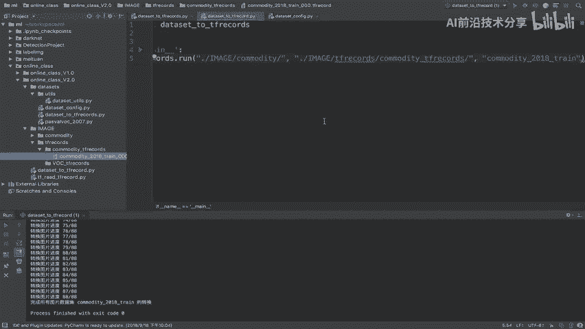

运行转换脚本后，我们可以在输出目录 `image/commodity_tfrecord` 中看到生成的 `.tfrecord` 文件，这标志着第一个需求已成功实现。

## 总结 📝

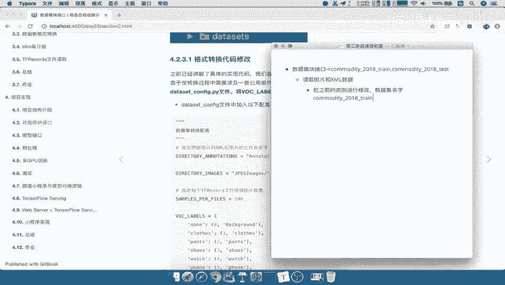

本节课中我们一起学习了数据接口模块的初步实现。我们首先设计了模块的目录结构，引入了数据工厂的概念。然后，我们重点完成了将商品数据集从原始格式（图片+XML）转换为TFRecords文件的过程。关键步骤包括：搭建项目环境、修改数据集类别配置、指定输入输出路径以及规范输出文件的命名。

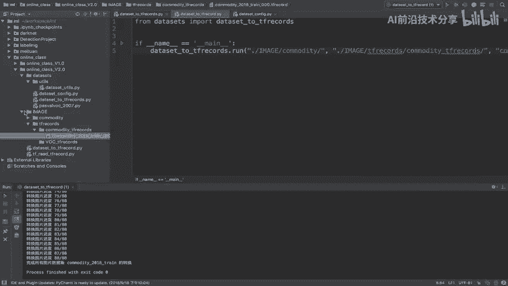

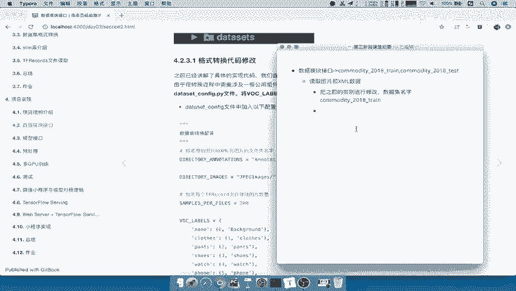

通过本节课的学习，我们已经为商品数据准备好了高效的存储格式，为后续构建能够读取多种数据集的数据工厂打下了坚实的基础。下一节课，我们将在此基础上，实现数据工厂和TFRecords数据集的读取逻辑。