# 课程P5：目标检测应用场景与开发环境搭建 🎯

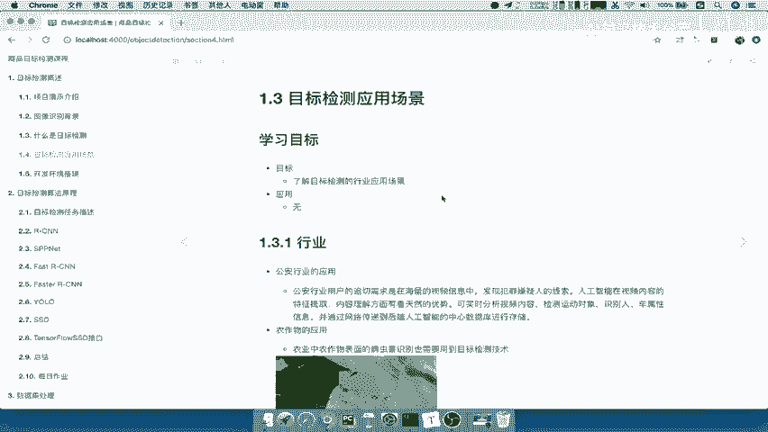

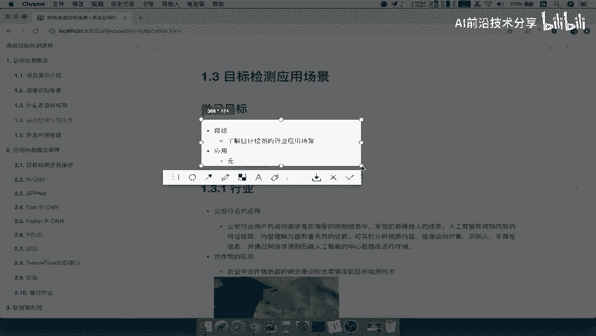

在本节课中，我们将学习目标检测技术的实际应用场景，并了解如何搭建后续学习所需的开发环境。目标检测是计算机视觉的核心任务之一，理解其应用有助于我们明确学习方向。

## 目标检测应用场景

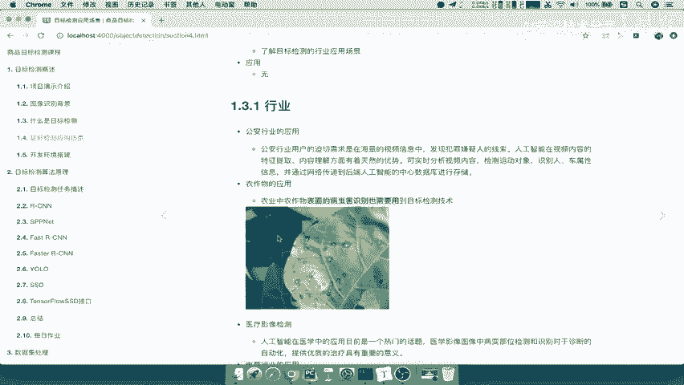

上一节我们介绍了目标检测的基本概念，本节中我们来看看它在现实世界中的具体应用。目标检测的含义是：**在图像或视频中定位并识别出感兴趣物体的位置和类别**。

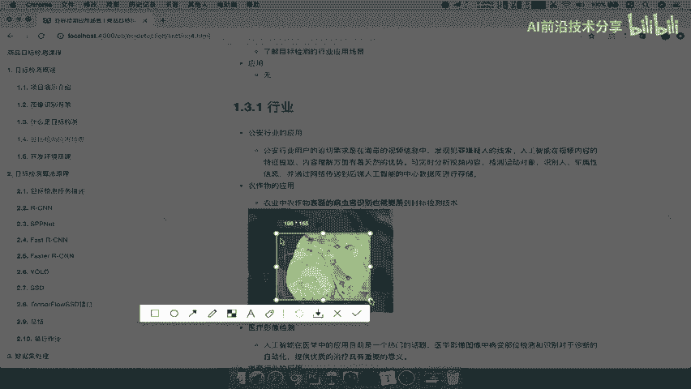

以下是目标检测在几个主要行业领域的应用介绍。

### 1. 公共安全领域
在公共安全领域，目标检测技术可用于分析监控视频或图片内容。系统可以检测画面中是否有人出现，一旦识别到人员，便能定位其出现过的具体位置。这为安防监控、轨迹追踪等任务提供了技术支持。

### 2. 农业领域
在农业领域，目标检测可用于农作物表面的病虫害识别。具体方法是：在农田附近安装摄像头，定时（例如每周）拍摄作物图片。系统通过分析这些图片，实时监测农作物叶片的状况。一旦检测到图片中存在病害区域并做出标记，系统便能发出预警，提示农户农作物可能出现问题，以便及时观察和处理。

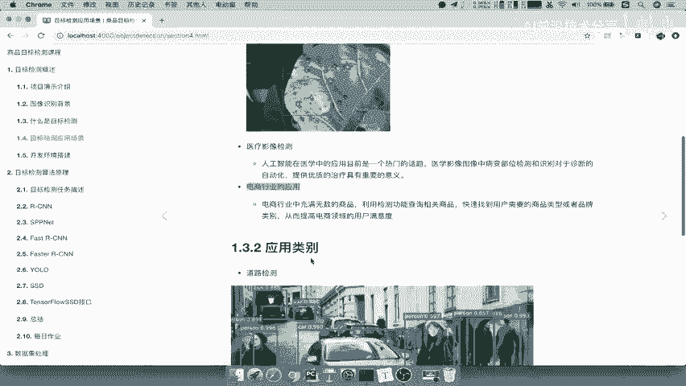

### 3. 医疗影像领域
医疗影像检测是当前的热门应用。其原理与农业应用相似：系统获取医学影像（如X光片、CT扫描图），然后对影像进行识别分析，检测出某个特定部位是否存在异常（例如肿瘤区域）。这能为医生提供更准确的诊断辅助信息。

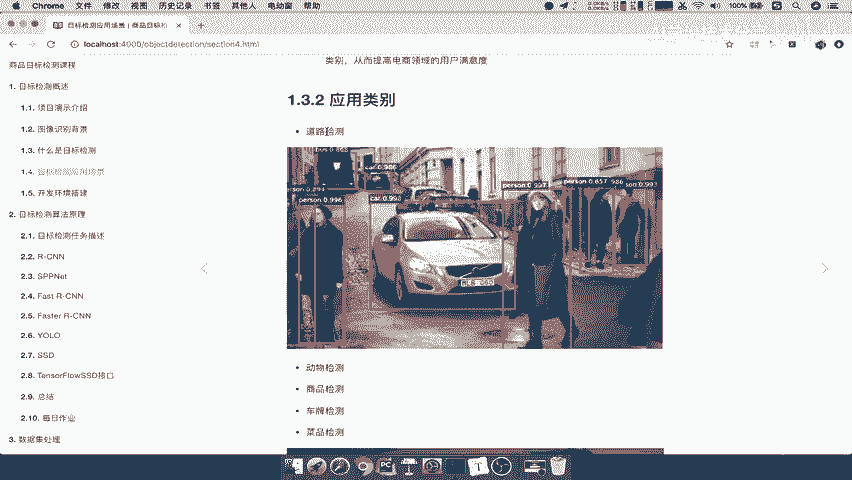

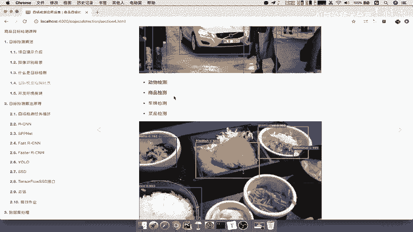

### 4. 电子商务领域
目标检测在电商行业有广泛的应用场景。例如，当你在街上看到一个商品或品牌，却不知道其具体名称时，可以拍摄一张照片并上传至购物平台（如淘宝）。平台通过目标检测技术，能够识别出照片中的主体物品。如果模型足够精细，甚至可以识别出具体的品牌。这样，用户就能快速获得想要的商品信息。

以上是行业层面的应用。从检测的具体对象类别来看，目标检测还包括以下场景：

以下是几种常见的目标检测类别场景。

*   **道路检测**：检测道路上的行人、车辆等。
*   **动物与商品检测**：识别图像中的动物或各类商品。
*   **车牌检测**：自动识别车辆牌照信息。
*   **菜品检测**：拍摄菜品图片，检测图片中包含哪些菜肴类别，可用于菜品审核或自动点餐。
*   **车型检测**：拍摄汽车照片，检测并识别出汽车的品牌或具体型号。

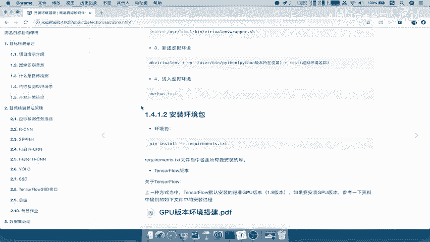

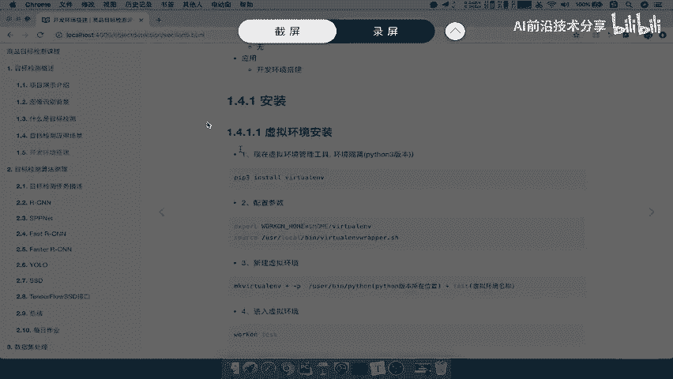

目标检测的应用场景非常广泛。只有深入到具体公司的特定业务中，你才会发现更多创新的应用方式。

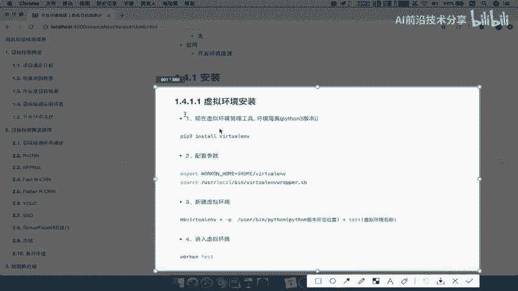

## 开发环境搭建

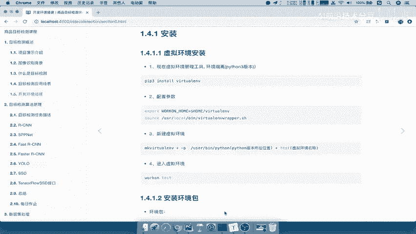

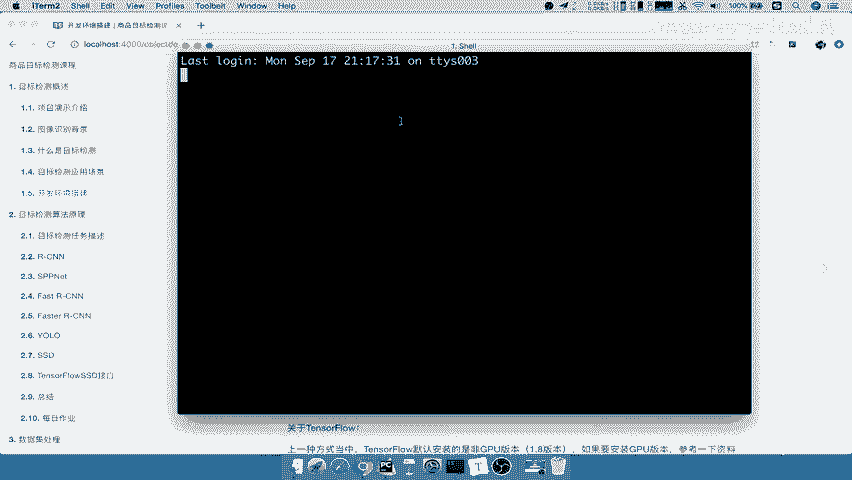

在开始正式的开发或学习相关知识之前，我们需要先搭建好开发环境。由于搭建过程较为耗时，本教程不进行逐步演示，而是将详细步骤整理在配套文件中，请自行查阅并按照步骤安装。

环境搭建主要分为两部分：**虚拟环境安装**和**安装依赖包**。

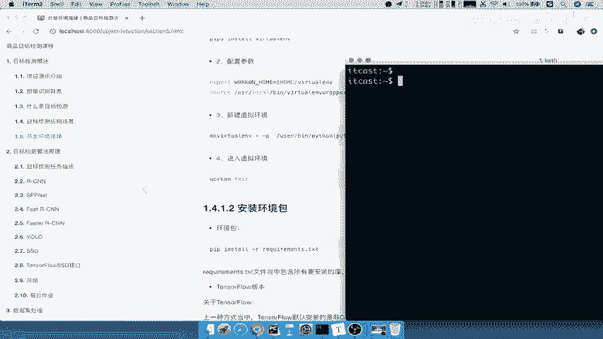

### 1. 虚拟环境安装
虚拟环境是一个环境隔离工具，它允许你为每个Python项目创建独立的运行环境，从而避免不同项目之间的依赖包互相干扰。

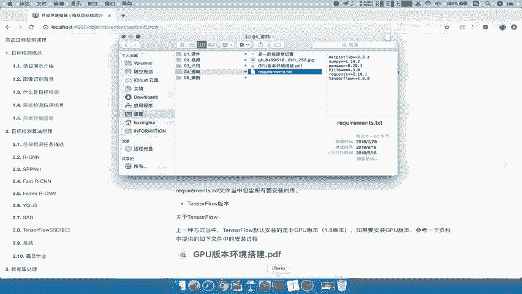

安装过程大致如下：首先下载并配置 `virtualenv` 和 `virtualenvwrapper` 工具，然后使用命令新建一个虚拟环境。之后，你便可以在这个隔离的环境中安装项目所需的包。

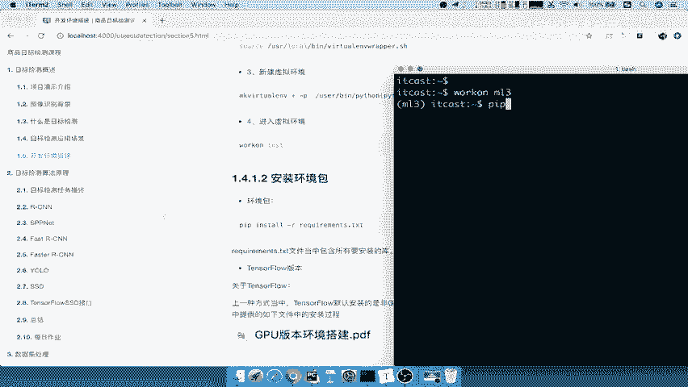

以下是一个简单的命令示例：
```bash
# 创建名为 ml_env 的虚拟环境
mkvirtualenv ml_env
# 进入该虚拟环境
workon ml_env
# 退出虚拟环境
deactivate
```
具体的安装和配置命令请参考提供的教程文档。

### 2. 安装依赖包
进入创建好的虚拟环境后，我们需要安装项目所需的第三方库。通常，我们会使用一个名为 `requirements.txt` 的文件来记录所有依赖包及其版本号。

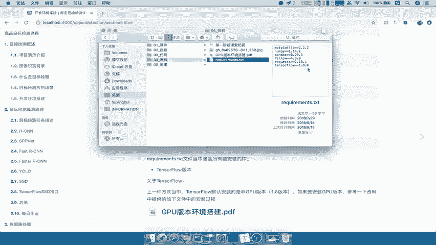

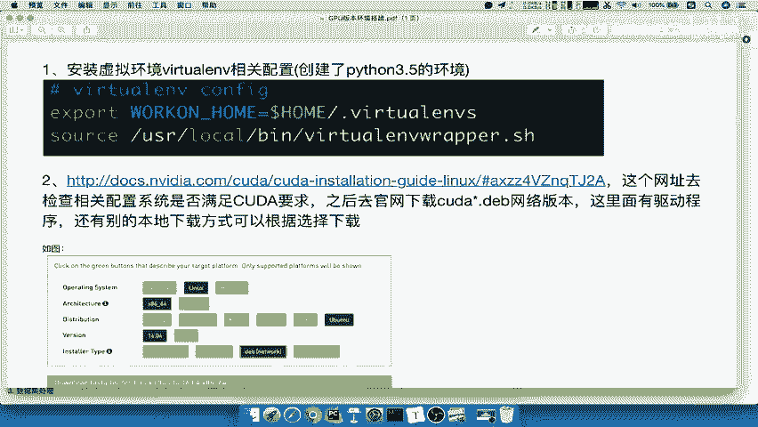

安装命令如下：
```bash
# 确保已进入目标虚拟环境 (例如 ml_env)
pip install -r requirements.txt
```
执行此命令后，`pip` 会自动安装 `requirements.txt` 文件中列出的所有包。

**关于TensorFlow版本的说明**：上述方式安装的是TensorFlow的CPU版本。如果你需要安装GPU版本以利用显卡进行加速计算（后续的多GPU训练需要），请参考提供的 **“GPU版本环境搭建.pdf”** 文档，按照其中的步骤进行安装。

### 3. 操作系统平台建议
我们推荐的开发平台是 **Ubuntu 16.04** 或更高版本。macOS 系统也可以。**不推荐使用 Windows 系统**，因为在Windows上可能会遇到各种兼容性和安装问题。如果没有macOS，建议使用Ubuntu环境进行安装。

---

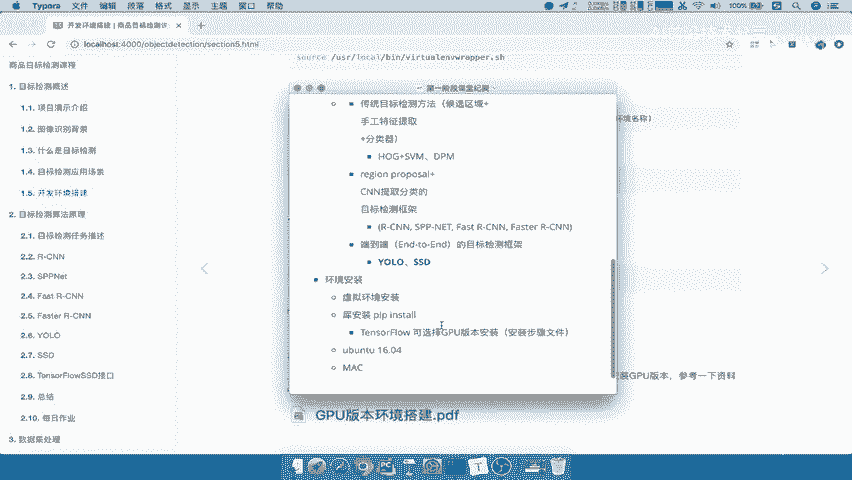

本节课中我们一起学习了目标检测在公共安全、农业、医疗和电商等多个领域的实际应用，了解了其巨大的实用价值。同时，我们也介绍了为后续实践搭建Python虚拟环境以及安装必要依赖包（包括TensorFlow GPU版本）的总体步骤和注意事项。准备好开发环境是进行后续学习和项目开发的第一步。