# 课程 P50：数据接口设计 - 读取数据接口与基类定义 🧱

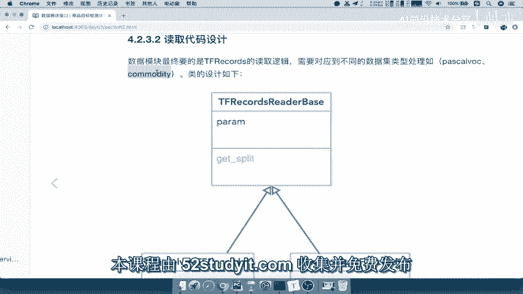

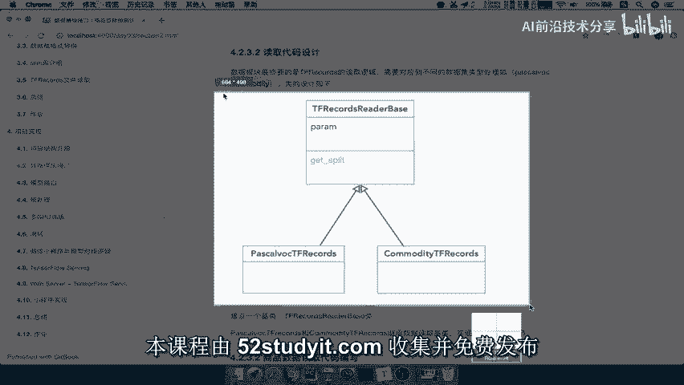

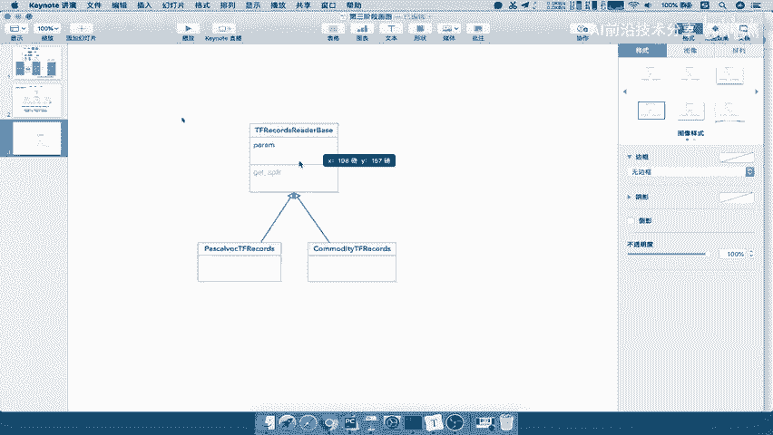

在本节课中，我们将学习如何设计一个通用的数据读取接口。我们将创建一个基类，用于统一不同数据集（如Pascal VOC和COCO）的读取逻辑，从而提高代码的复用性和可维护性。

## 设计思路与目标

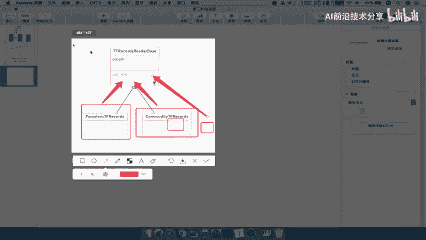

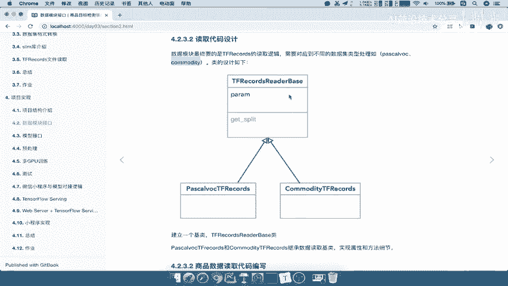

上一节我们讨论了数据处理流程。本节中，我们来看看如何设计一个可扩展的数据读取模块。

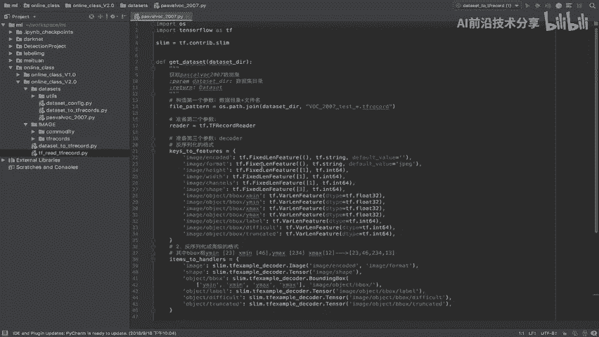

我们的核心目标是：通过设计一个基类，让所有不同类型的数据集读取类都能继承它。这样，每个数据集只需实现自己的特定配置，而通用的读取逻辑则由基类提供。

## 基类设计分析

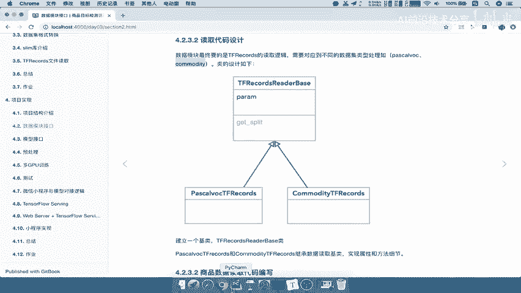

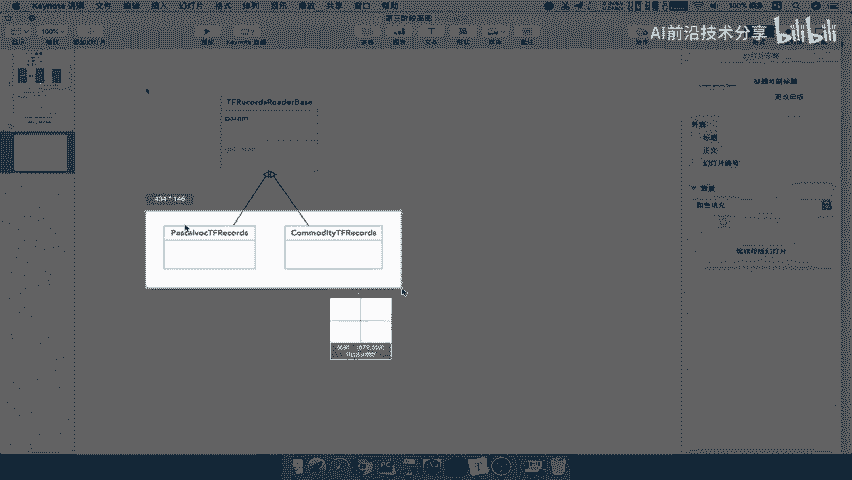

首先，我们需要分析不同数据集的共同点和差异点。通过观察Pascal VOC数据集的读取代码，我们发现以下信息是必需的：
*   数据集文件的匹配路径和文件名。
*   数据集的描述信息，如总样本数、训练集/测试集样本数、类别数量等。

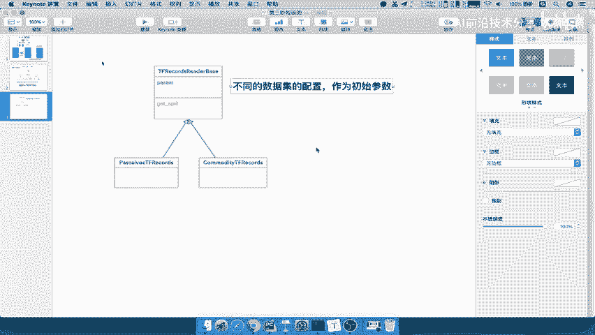

对于COCO数据集，其读取逻辑框架是相似的，主要区别在于上述的具体配置参数（例如，COCO有80个类别，而Pascal VOC有20个）。因此，我们可以将这些**可变的配置作为参数**传递给基类。

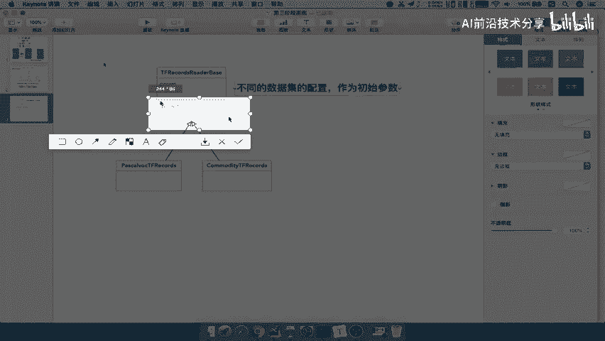

## 实现数据读取基类

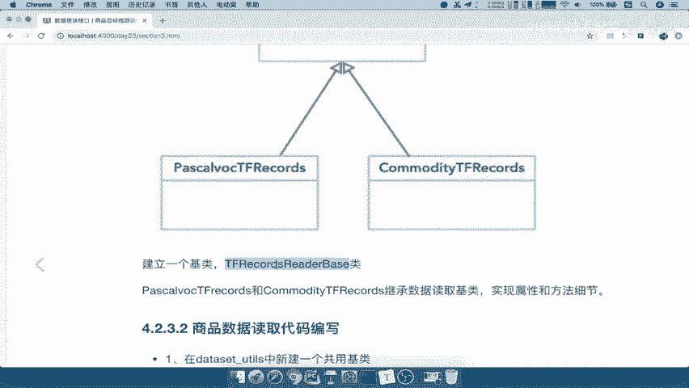

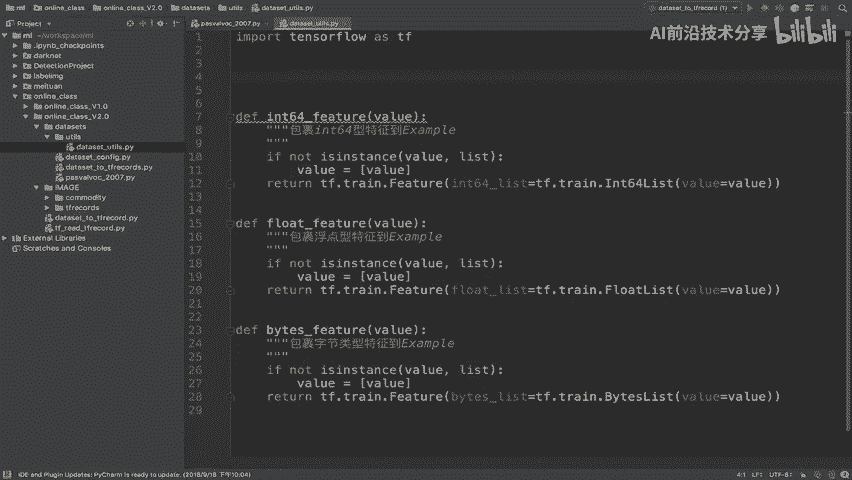

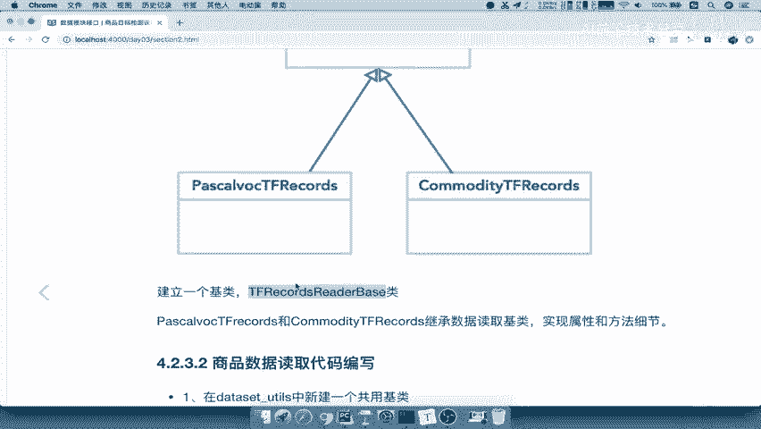

基于以上分析，我们现在开始实现基类。我们将它放在公共工具模块 `utils` 中。

以下是基类 `TFRecordReaderBase` 的核心代码框架：

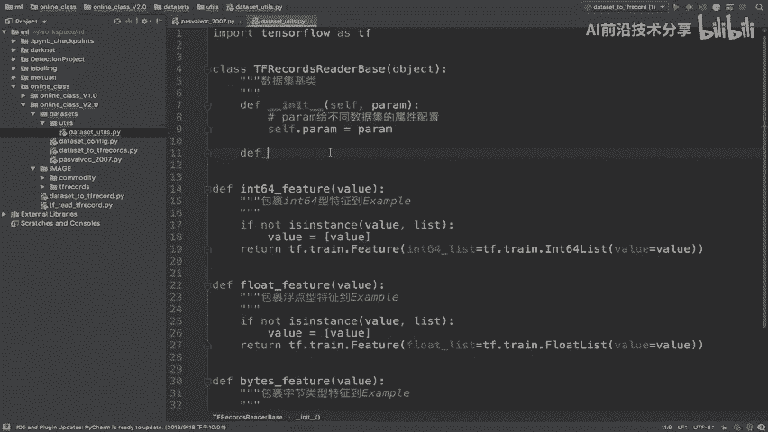

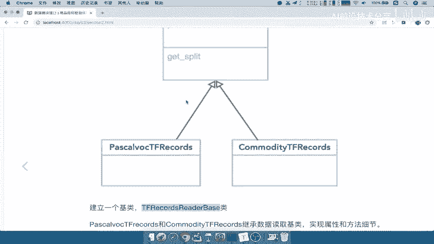

```python
class TFRecordReaderBase(object):
    """
    数据集读取基类
    """
    def __init__(self, params):
        """
        初始化基类
        :param params: 不同数据集的配置参数字典
        """
        self.params = params  # 存储数据集特定配置

    def get_data(self, dataset_dir, mode):
        """
        获取数据规范（TensorFlow Dataset对象）
        :param dataset_dir: 数据集目录路径
        :param mode: 模式，指定是读取训练集('train')还是测试集('test')
        :return: 返回对应的数据规范
        """
        # 基类中暂不实现具体逻辑，由子类重写
        return None
```

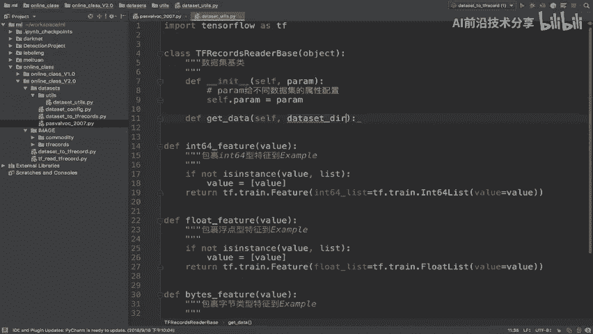

**代码解释**：
1.  **`__init__` 方法**：接收一个 `params` 参数。这个字典包含了数据集的特定配置（如类别数、样本数等），子类在初始化时会传入自己的配置。
2.  **`get_data` 方法**：这是核心接口。它接收两个参数：
    *   `dataset_dir`：数据集所在的根目录。
    *   `mode`：用于指明当前需要读取的是训练集还是测试集，这对于分离训练和评估数据至关重要。
3.  基类中的 `get_data` 方法暂时返回 `None`，具体的读取和解析 `TFRecord` 文件的逻辑将在继承它的子类中实现。

## 后续步骤：创建子类

设计好基类后，我们的工作就完成了一半。接下来，针对每一个具体的数据集（如 `PascalVOCReader`、`COCOReader`），我们需要：

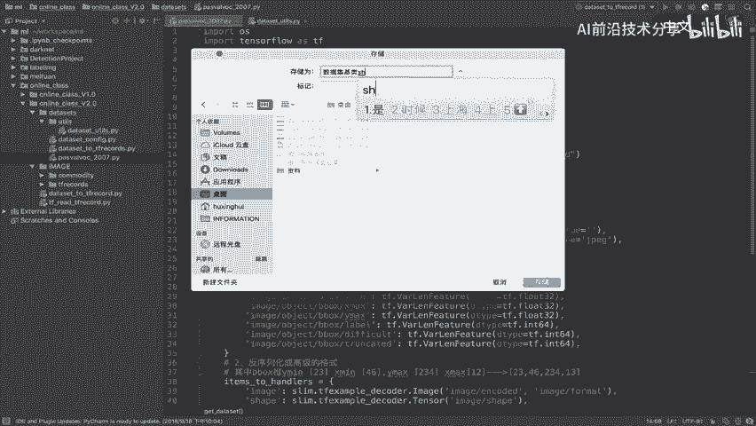

1.  定义该数据集独有的配置参数字典 `params`。
2.  创建一个类并继承 `TFRecordReaderBase`。
3.  在该子类中，根据数据集格式，具体实现 `get_data` 方法，完成从 `TFRecord` 文件到最终 `TensorFlow Dataset` 对象的转换。

这样，在使用时，我们只需要实例化对应的子类（例如 `reader = PascalVOCReader(voc_params)`），然后调用统一的 `reader.get_data(dataset_path, ‘train’)` 接口即可获得数据，无需关心底层是哪个数据集。

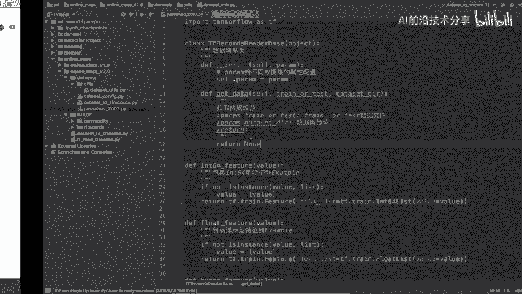

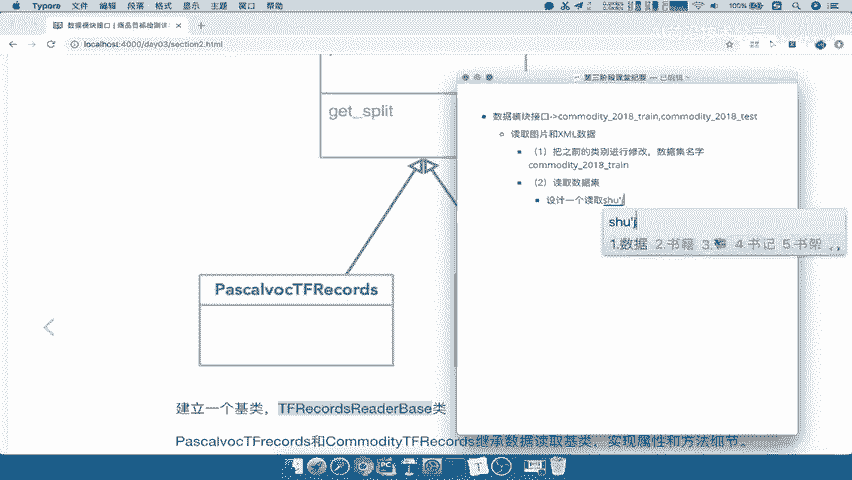

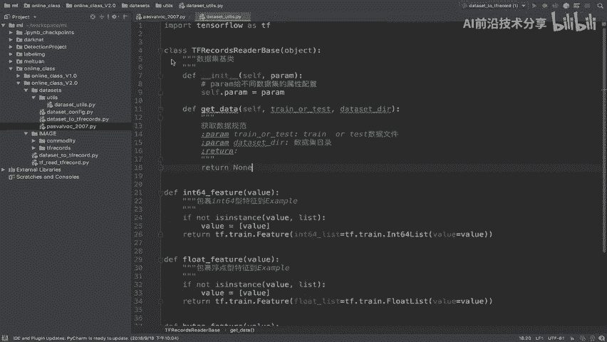

## 总结

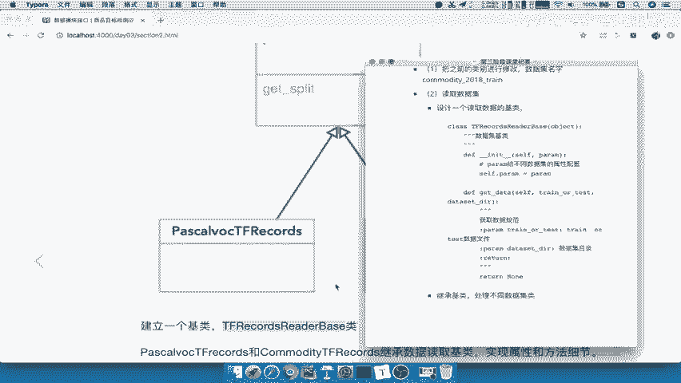

本节课中我们一起学习了数据读取接口的设计。我们通过分析不同数据集的共性，设计了一个名为 `TFRecordReaderBase` 的基类。这个基类通过**参数化配置**和**统一的 `get_data` 接口**，为各种数据集提供了一个可扩展的读取框架。在接下来的课程中，我们将基于此基类，实现具体数据集的读取子类。