# 课程P51：51.03_数据接口：商品数据读取子类实现 🛒


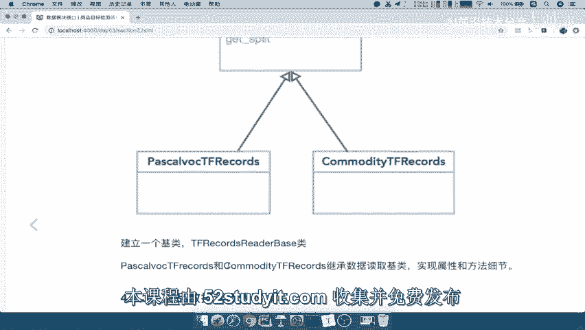

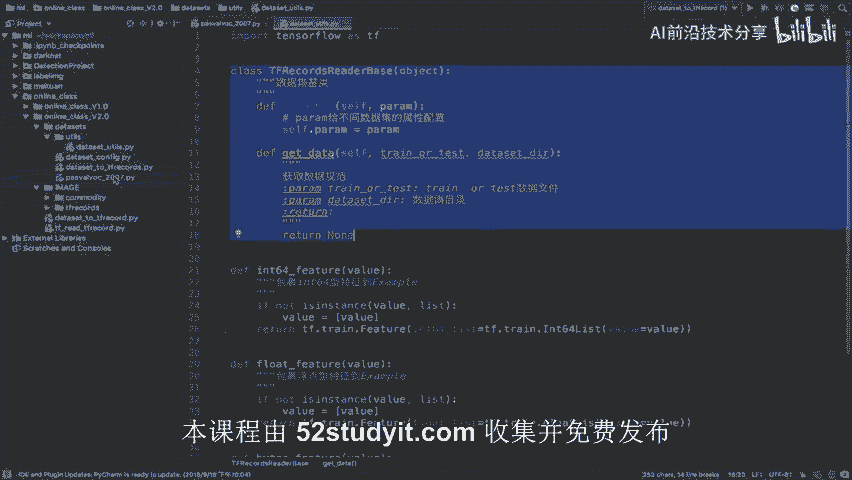

在本节课中，我们将学习如何为特定的数据集（例如商品数据集）创建数据读取子类。我们将基于之前建立的通用数据读取基类，实现一个专门用于读取商品数据集的子类，并学习如何通过配置文件来管理数据集的特定属性。

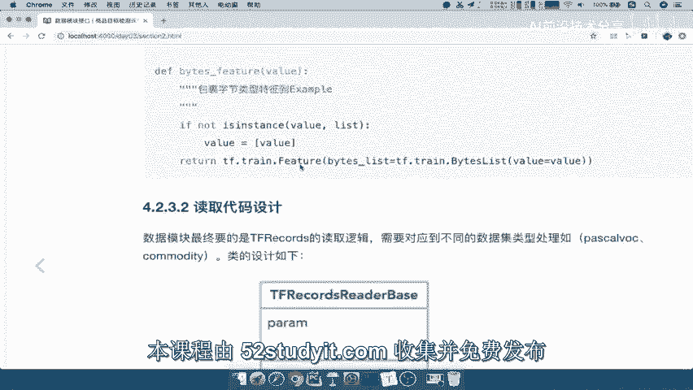

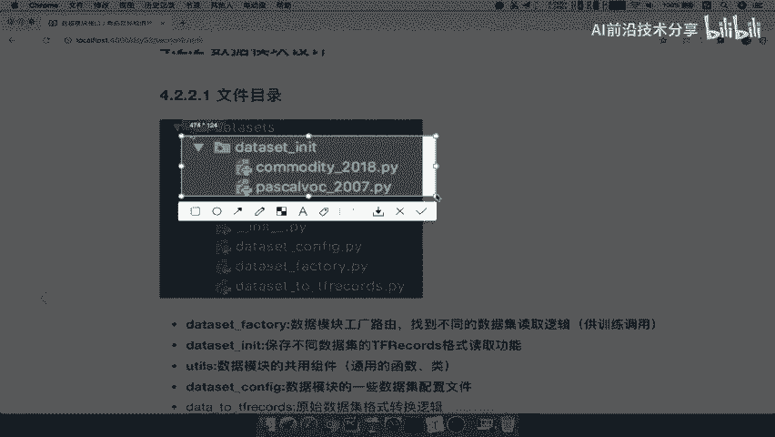

---

## 概述

上一节我们介绍了数据读取的基类设计。本节中，我们来看看如何为具体的数据集（如商品数据集）实现一个子类。核心在于将数据集特有的属性（如文件匹配模式、样本数量、类别数等）从硬编码中分离出来，通过配置文件进行管理，从而提高代码的复用性和可维护性。

## 创建数据集初始化文件夹

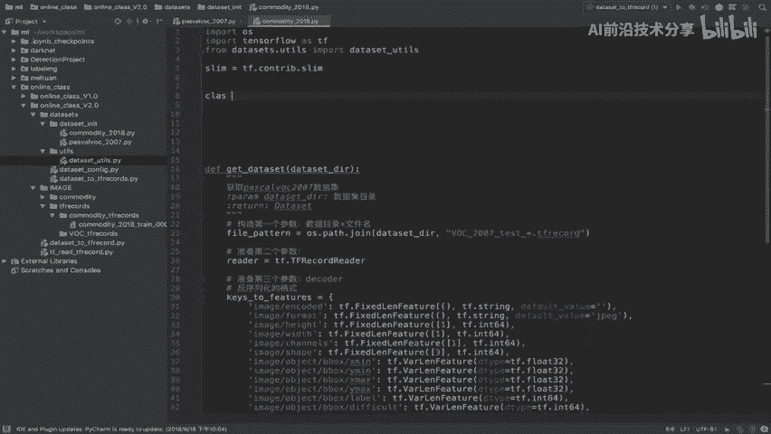

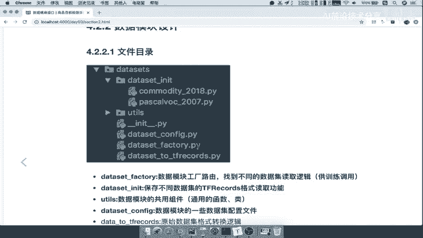

首先，我们需要一个专门存放不同数据集读取逻辑的目录。按照项目结构，我们在 `datasets` 目录下创建一个名为 `dataset_init` 的文件夹。

```python
# 在项目目录中创建文件夹
# datasets/dataset_init/
```

这个文件夹将用于存放所有特定数据集（如Pascal VOC、商品数据集）的读取类实现。

## 创建商品数据集读取子类

接下来，我们在 `dataset_init` 文件夹中创建商品数据集的读取类。我们复制一份已有的数据集类模板（例如Pascal VOC的类），并将其重命名为 `commodity_2018.py`。

这个新文件将用于实现读取我们的商品数据集目录。

## 导入基类并定义子类

在 `commodity_2018.py` 文件中，我们首先需要从基类模块中导入我们之前定义的通用数据读取基类 `Dataset`。

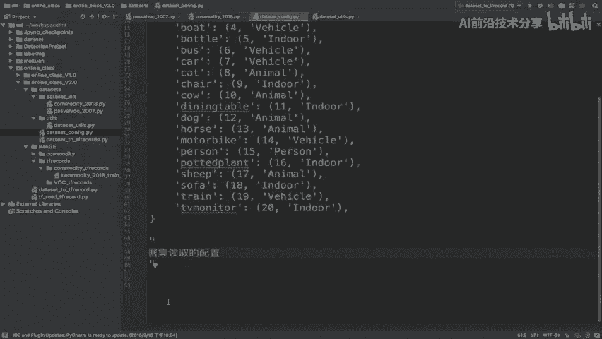

```python
from datasets.dataset import Dataset
```

然后，我们定义一个继承自 `Dataset` 基类的子类。

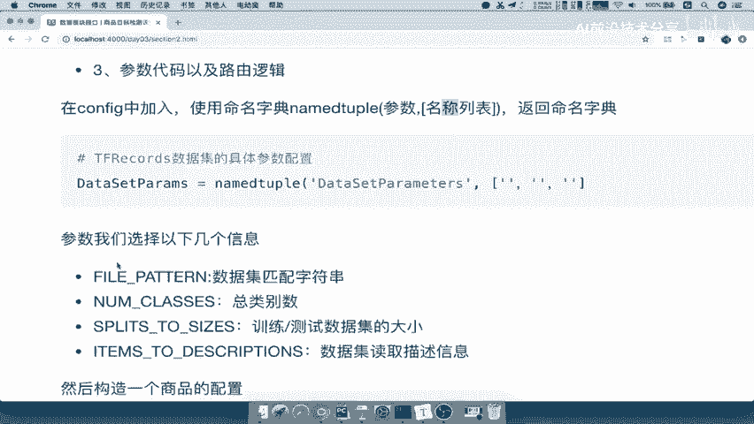

```python
class CommodityTfrecord(Dataset):
    """商品数据集读取类"""
    def __init__(self, param):
        pass

    def get_data(self, dataset_dir, train_or_test):
        pass
```

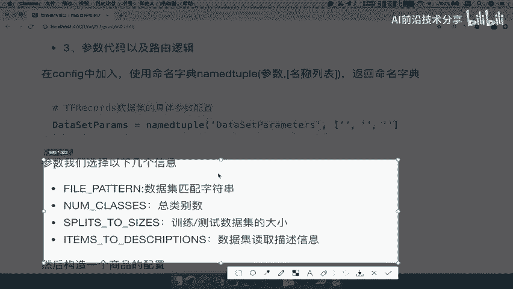

`__init__` 方法用于初始化类并接收配置参数 `param`。`get_data` 方法则是核心，用于根据目录和训练/测试模式获取具体的数据。

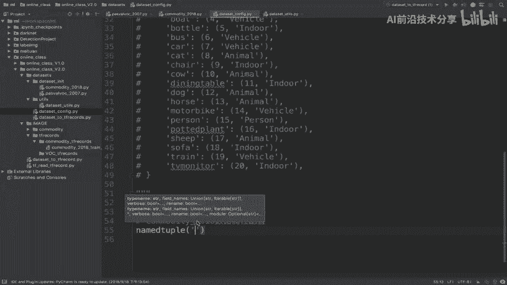

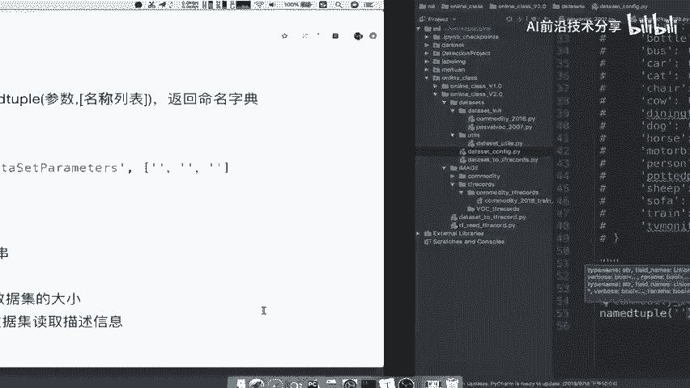

## 实现数据获取逻辑

现在，我们需要将具体的数据集读取逻辑填充到 `get_data` 方法中。这个逻辑通常包括根据文件模式匹配数据文件、获取样本数量、类别信息等。

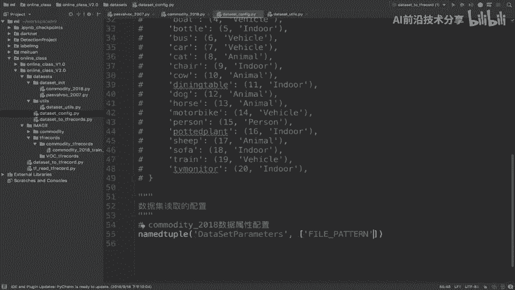

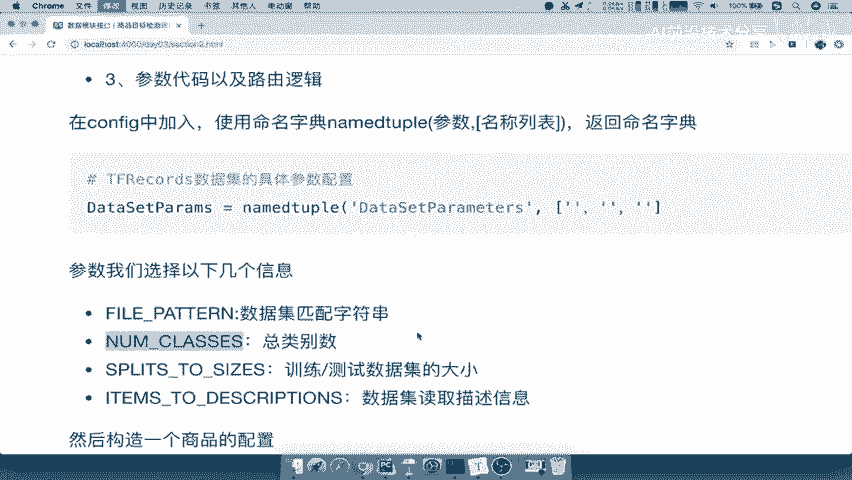

关键点在于，这些原本硬编码在方法内的属性（如文件匹配模式 `fpattern`、样本数 `nsamples`、类别数 `num_classes`），现在应该从传入的 `param` 配置参数中动态获取。

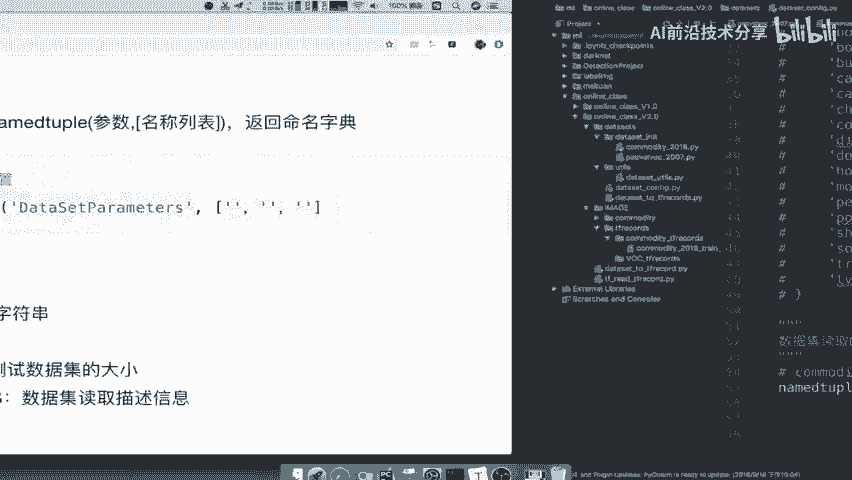

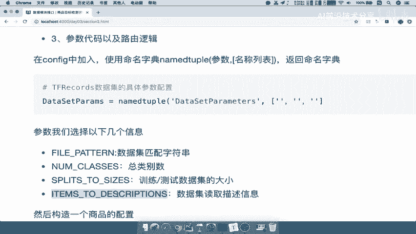

因此，我们的任务转变为：如何设计 `param` 这个参数，使其能灵活承载不同数据集的属性。

## 设计数据集配置参数

`param` 参数应该包含数据集的所有相关属性。我们决定在 `dataset_config.py` 文件中集中配置这些属性。

我们使用 `collections.namedtuple` 来定义一个清晰的数据集参数结构。`namedtuple` 可以创建一个带有字段名的轻量级对象，非常适合用来表示配置。

以下是配置步骤：

1.  从 `collections` 导入 `namedtuple`。
2.  定义一个 `namedtuple` 来指定数据集参数的字段（即属性名）。
3.  为商品数据集创建具体的参数实例，并填充对应的值。

```python
# 在 dataset_config.py 中
from collections import namedtuple

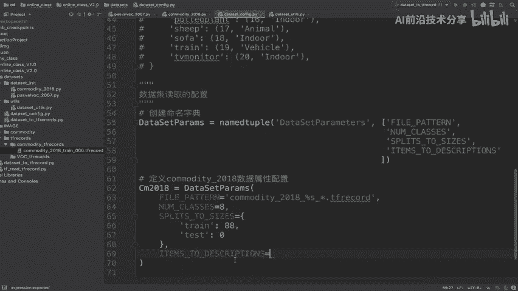

# 1. 定义参数结构
DatasetParams = namedtuple('DatasetParams', ['fpattern', 'num_classes', 'split_to_size', 'item_to_description'])

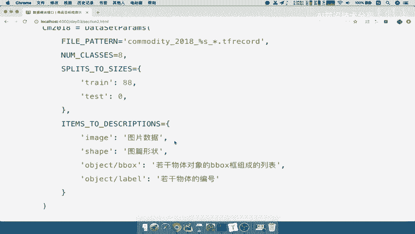

# 2. 为商品数据集创建配置实例
cm_2018 = DatasetParams(
    fpattern='commodity_2018_%s_*.tfrecord',  # 文件匹配模式
    num_classes=8,                            # 类别数量
    split_to_size={'train': 88, 'test': 0},   # 训练集和测试集大小
    item_to_description={'image': '...', 'label': '...'}  # 数据描述字典
)
```

这样，`cm_2018` 这个对象就包含了商品数据集的所有必要属性。当创建 `CommodityTfrecord` 类的实例时，可以将 `cm_2018` 作为 `param` 传入。

## 在子类中使用配置参数

回到 `commodity_2018.py` 文件中的 `get_data` 方法，我们现在可以使用 `self.param` 来访问所有配置好的属性，替换掉原来的硬编码值。

```python
def get_data(self, dataset_dir, train_or_test):
    # 使用配置中的文件匹配模式
    file_pattern = os.path.join(dataset_dir, self.param.fpattern % train_or_test)
    # 使用配置中的数据集划分大小
    num_samples = self.param.split_to_size.get(train_or_test)
    # 使用配置中的类别数
    num_classes = self.param.num_classes
    # 使用配置中的数据描述
    item_to_description = self.param.item_to_description

    # ... 后续的数据读取和处理逻辑
```

## 添加异常处理

为了代码的健壮性，我们还需要添加一些基本的异常处理。例如，检查传入的 `train_or_test` 参数是否合法，以及数据集目录是否存在。

```python
def get_data(self, dataset_dir, train_or_test):
    # 检查模式参数是否合法
    if train_or_test not in ['train', 'test']:
        raise ValueError(f"训练/测试数据集名称指定错误: {train_or_test}")

    # 检查数据集目录是否存在
    if not tf.gfile.Exists(dataset_dir):
        raise ValueError("数据集目录不存在")

    # ... 其余的数据获取逻辑
```

## 总结

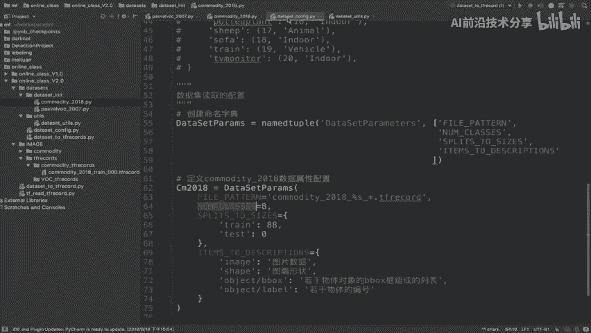

本节课中，我们一起学习了如何为商品数据集实现一个数据读取子类。我们首先创建了专门存放数据集初始化类的目录，然后建立了继承自通用基类的 `CommodityTfrecord` 子类。通过将数据集属性（如文件模式、样本数等）抽取到独立的配置文件 `dataset_config.py` 中，并使用 `namedtuple` 进行管理，我们大大增强了代码的清晰度和可配置性。最后，我们在子类的 `get_data` 方法中使用了这些配置参数，并添加了必要的异常处理，从而完成了一个健壮、可复用的数据集读取子类实现。