# 课程 P52：数据接口 - 数据读取工厂逻辑实现 🏭

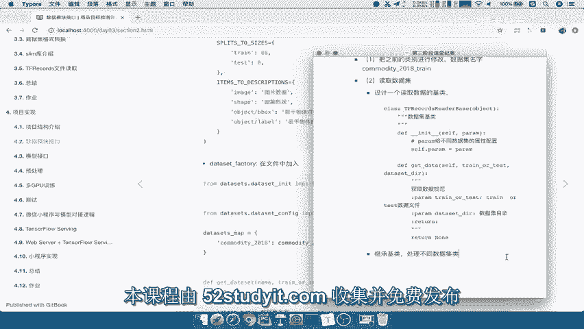

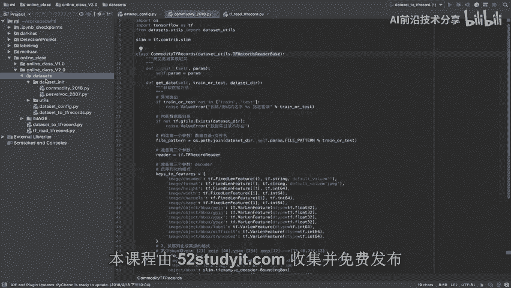

在本节课中，我们将学习如何实现一个数据读取工厂。这个工厂的核心作用是提供一个统一的接口，让训练代码能够根据指定的数据集名称，自动调用对应的数据读取逻辑，而无需关心具体的数据集实现细节。

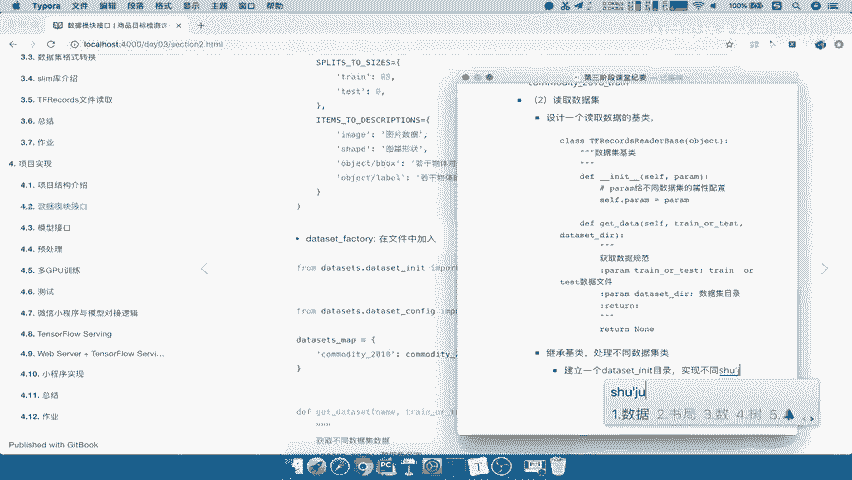

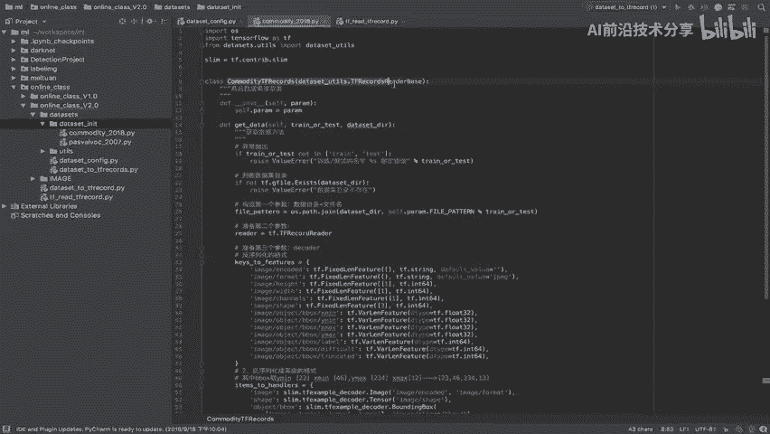

上一节我们完成了商品数据集的读取逻辑改造，并设计了一个基类。本节中，我们来看看如何创建一个工厂来统一管理和调用这些不同的数据集类。

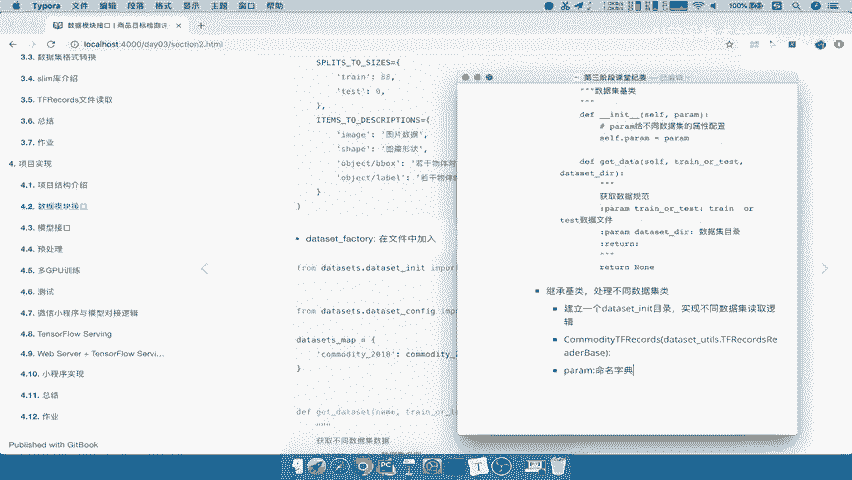

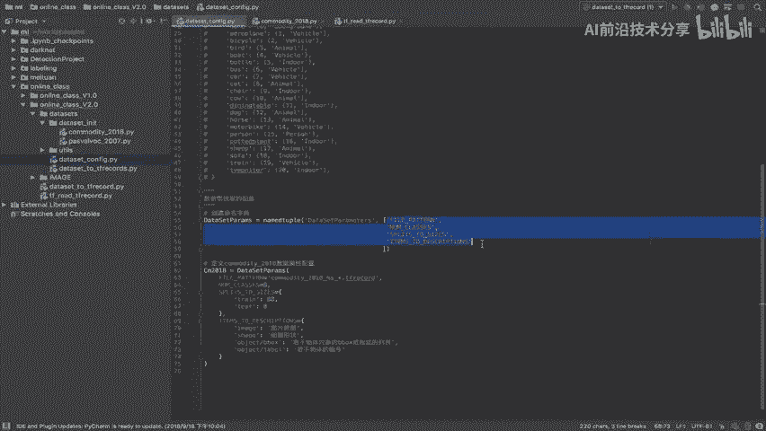

## 概述：数据工厂的设计思路

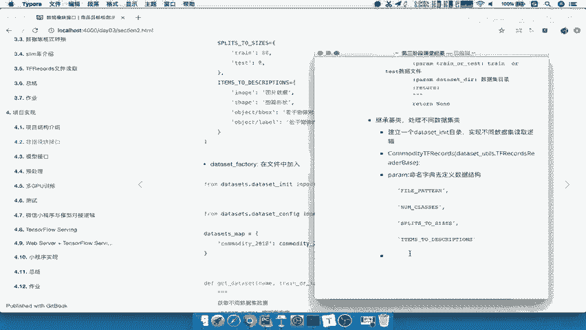

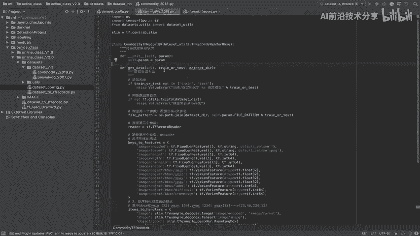

数据工厂的核心思想是“路由”或“映射”。我们预先定义一个字典，将数据集名称映射到对应的数据集类。当外部代码需要获取数据时，只需提供数据集名称、训练/测试模式和数据目录，工厂就会根据名称找到对应的类，实例化并调用其数据读取方法。

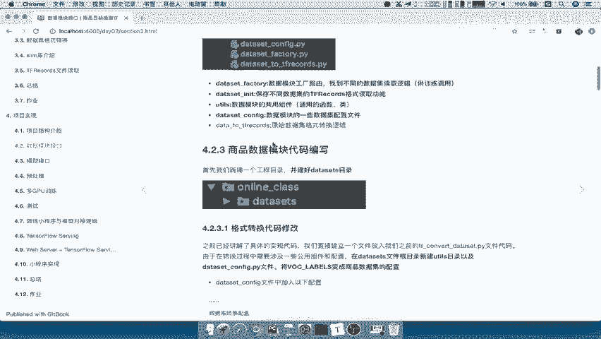

以下是实现数据工厂的关键步骤：

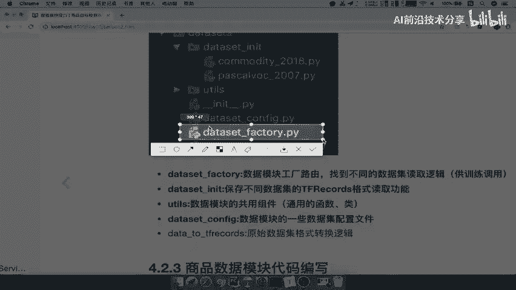

1.  **导入必要的模块**：包括具体的数据集类和配置文件。
2.  **定义数据集映射字典**：建立数据集名称到具体数据集类的映射关系。
3.  **实现工厂函数**：接收外部参数，根据映射字典调用对应的数据读取逻辑。

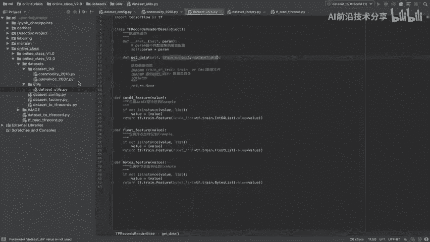

## 第一步：创建工厂文件并导入模块

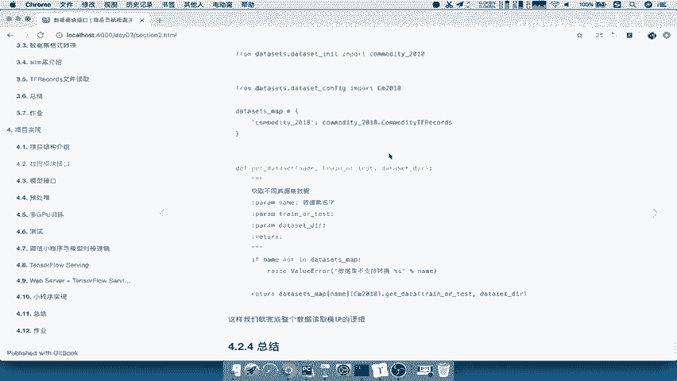

首先，在项目根目录的 `datasets` 文件夹下，创建一个名为 `dataset_factory.py` 的 Python 文件。

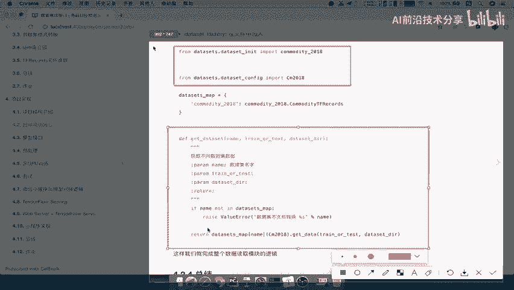

在这个文件中，我们需要导入之前定义的商品数据集类以及相关的配置参数。

```python
# 导入具体的数据集读取逻辑类
from datasets.dataset_init.commodity_2018 import CommodityTFRecords
# 导入该数据集的配置参数
from datasets.dataset_config import cm2018
```

## 第二步：定义数据集映射字典

接下来，我们定义一个字典来管理所有可用的数据集。字典的键是数据集的名称，值是对应的数据集类。这样，当需要新增数据集时，只需在此字典中添加新的映射即可。

```python
# 定义数据集种类字典，建立名称到类的映射
datasets_map = {
    ‘commodity_2018’: CommodityTFRecords,
    # 未来可以在此添加新的数据集，例如：
    # ‘another_dataset’: AnotherDatasetClass,
}
```

## 第三步：实现工厂函数

现在，我们实现核心的工厂函数 `get_dataset`。这个函数是提供给外部训练代码调用的统一接口。

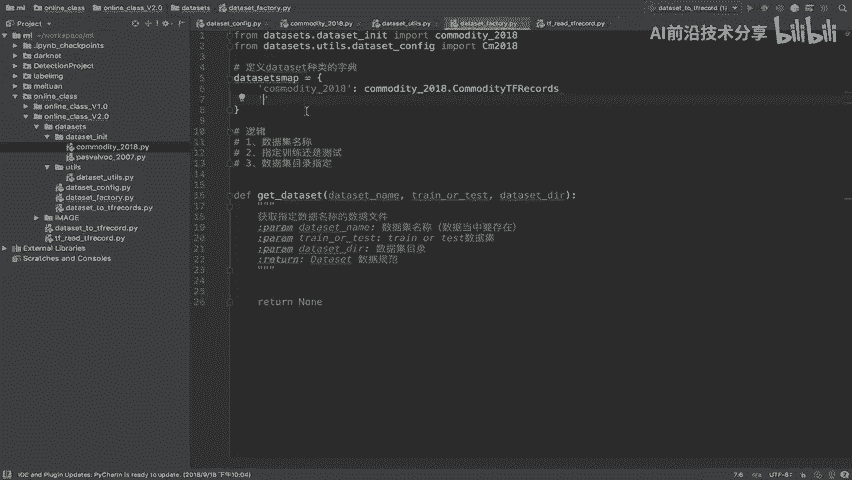

函数需要接收三个参数：
*   `dataset_name`: 数据集名称，必须存在于 `datasets_map` 中。
*   `train_or_test`: 指定是加载训练集（‘train’）还是测试集（‘test’）。
*   `dataset_dir`: 数据集所在的根目录路径。

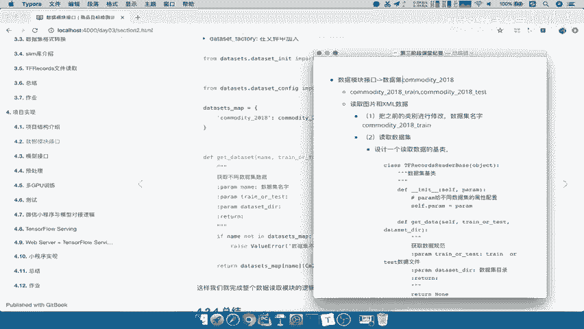

函数的逻辑是：
1.  检查传入的 `dataset_name` 是否在映射字典中，如果不存在则报错。
2.  从字典中获取对应的数据集类。
3.  实例化该类（传入配置参数 `cm2018`），并调用其 `get_data` 方法，将 `train_or_test` 和 `dataset_dir` 参数传递进去。
4.  返回 `get_data` 方法的结果，即符合规范的数据集对象。

```python
def get_dataset(dataset_name, train_or_test, dataset_dir):
    “””
    获取训练数据：根据指定的数据集名称，返回对应的数据读取对象。
    Args:
        dataset_name: 数据集名称，必须存在于当前数据字典中。
        train_or_test: 指定加载训练集（‘train’）还是测试集（‘test’）。
        dataset_dir: 数据集目录。
    Returns:
        一个符合数据规范（如 tf.data.Dataset）的数据集对象。
    “””
    # 检查数据集名称是否有效
    if dataset_name not in datasets_map:
        raise ValueError(f“你所输入的数据集名称 ‘{dataset_name}’ 不存在。”)

    # 根据名称获取对应的数据集类，并实例化（传入配置），然后调用其数据读取方法
    dataset_class = datasets_map[dataset_name]
    return dataset_class(param=cm2018).get_data(train_or_test, dataset_dir)
```

## 总结与回顾

本节课中我们一起学习了数据读取工厂的逻辑与实现。我们主要完成了三件事：

1.  **创建工厂文件**：在 `datasets` 目录下建立了 `dataset_factory.py` 文件。
2.  **建立映射关系**：定义了 `datasets_map` 字典，将字符串形式的数据集名称关联到具体的 Python 类。
3.  **实现统一接口**：编写了 `get_dataset` 函数。该函数作为对外的唯一接口，接收参数后，通过字典映射找到正确的类，并调用其数据读取方法，最终返回标准化的数据。

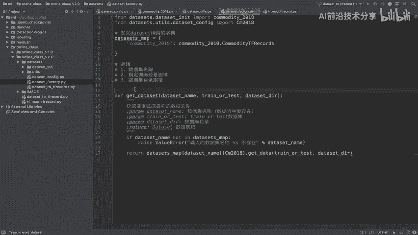

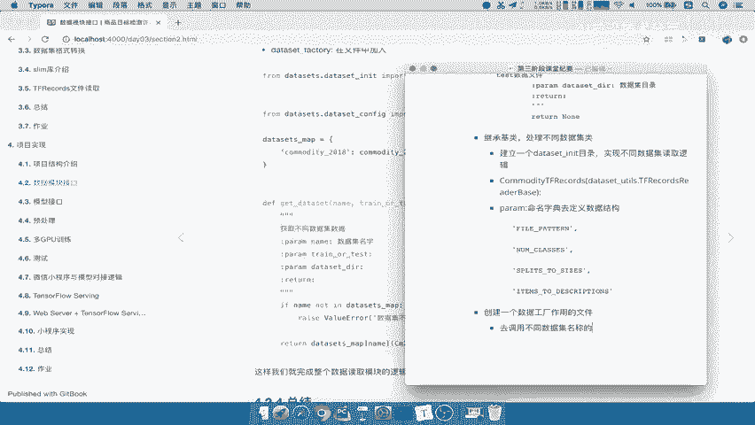

通过这个工厂模式，训练代码变得非常简洁和灵活。未来要支持新的数据集，开发者只需：
1.  在 `dataset_init` 目录下实现新的数据集类。
2.  在配置文件中添加其参数。
3.  在 `datasets_map` 字典中添加一行映射。

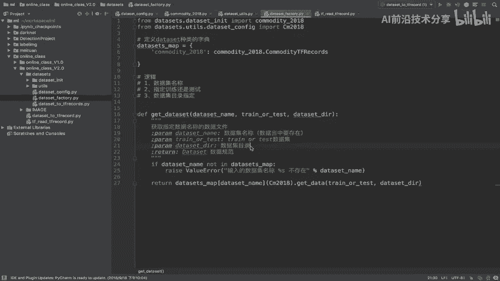

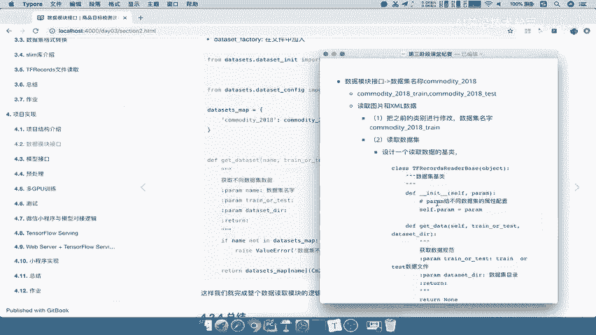

之后，训练时只需更改 `dataset_name` 参数，即可无缝切换不同的数据集，实现了代码的高内聚和低耦合。