# 🧠 课程 P53：数据接口设计与模块总结


在本节课中，我们将学习如何设计一个统一的数据接口，并对整个数据模块的封装逻辑进行总结。我们将看到如何通过一个工厂类来调用不同的数据集，以及如何通过继承基类来扩展对新数据集的支持。

---

## 🛠️ 代码运行与数据模块接口

上一节我们介绍了数据集的基类设计，本节中我们来看看如何在训练代码中调用我们封装好的数据接口。

我们完成了所有逻辑，并提供了 `DatasetFactory` 类。在外部训练时，我们调用这个工厂类来实现数据读取。

因此，我们使用之前的逻辑 `tf_read_tf_record` 来读取数据。我们需要调用方法，所以将原来的代码替换掉。

以下是具体步骤：

1.  从 `datasets` 文件导入 `DatasetFactory`。
2.  导入 `DatasetFactory` 后，直接调用其下面的方法。
3.  该方法需要参数：数据集名称、是训练集还是测试集、以及数据集的目录。

具体实现代码如下：

```python
from datasets import DatasetFactory

# 调用工厂方法获取数据集
dataset = DatasetFactory.get_dataset(
    name='commodity',          # 数据集名称，需在工厂中定义
    split='train',             # 指定训练集或测试集
    data_dir='./images/tfrecords/commodity_tfrecords'  # 数据集目录
)
```

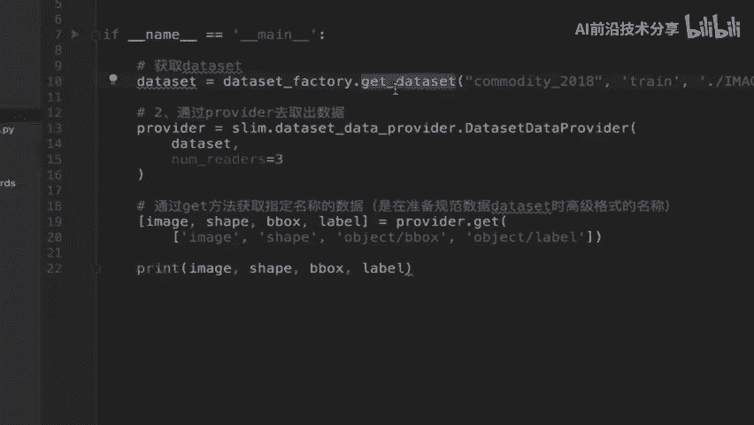

运行此代码。如果提示数据集目录不存在，请检查路径是否正确（例如，检查是否缺少字母，如将 `commodity` 误写为 `comodity`）。

修改逻辑结构后，我们同样成功读取了数据，并打印出了 Tensor。

整个数据模块提供给外部的接口，就是这样一个 `DatasetFactory.get_dataset` 调用。

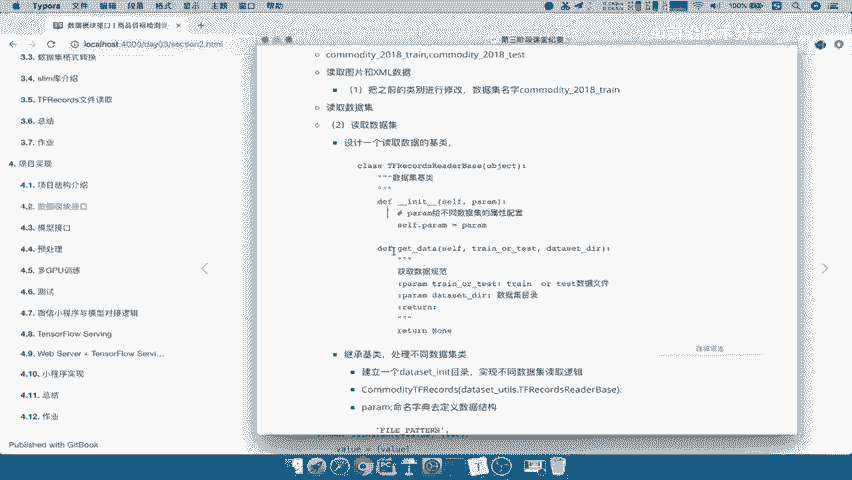

---

## 📊 数据模块总结

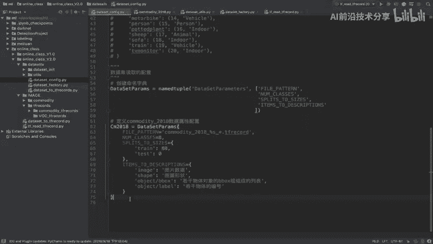

现在，我们来总结一下数据模块接口完成的工作。

首先，我们修改了读取图片和 XML 数据的逻辑，主要是简单修改了 `work_labels` 部分。数据转换的逻辑相对简单。

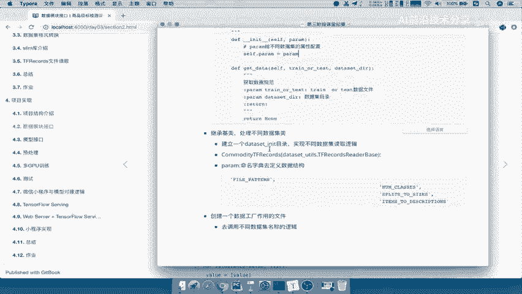

重点在于数据的读取方式。我们设计了一个基类，为不同数据集的读取逻辑提供继承基础。这个基类包含了数据集的配置参数和获取数据集的方法。

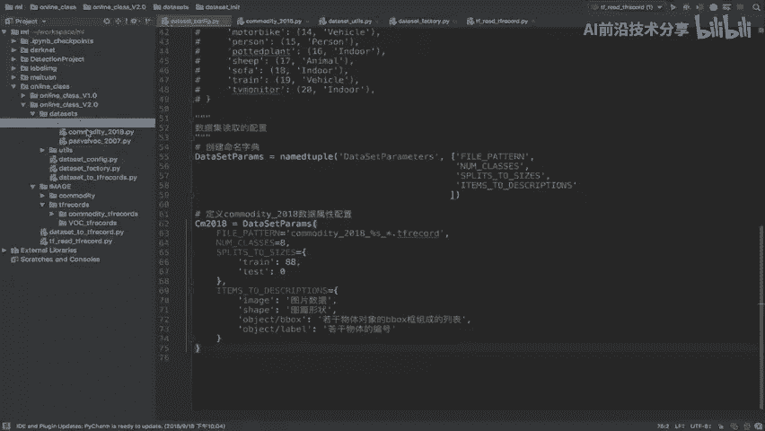

配置参数非常重要，它们在 `DataConfig` 类中进行定义。每增加一个新的数据集，只需在配置中添加相应的属性即可。

继承基类的具体数据集类，必须实现数据读取逻辑。我们可以将无数个实现不同数据集读取逻辑的代码文件，都放在 `datasets/` 目录下的 `__init__.py` 文件中。

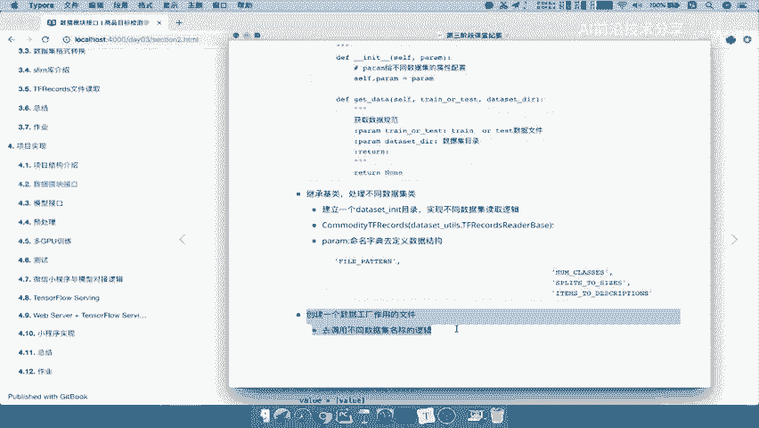

在这些文件中，需要继承基类，定义好配置字典，并实现 `get_data` 方法。

最后，我们对外只提供一个统一的接口文件，即数据工厂文件 `dataset_factory.py`。

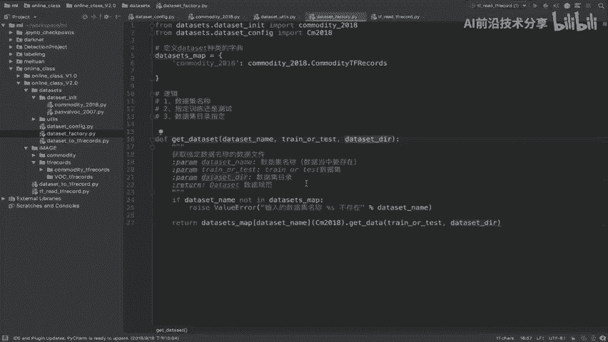

`DatasetFactory` 可以调用并获取指定的数据集（训练集或测试集）及其目录。这就是我们对数据模块进行的封装。

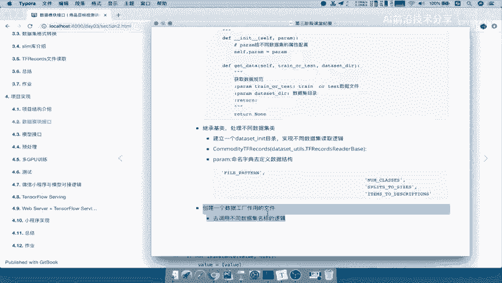

---

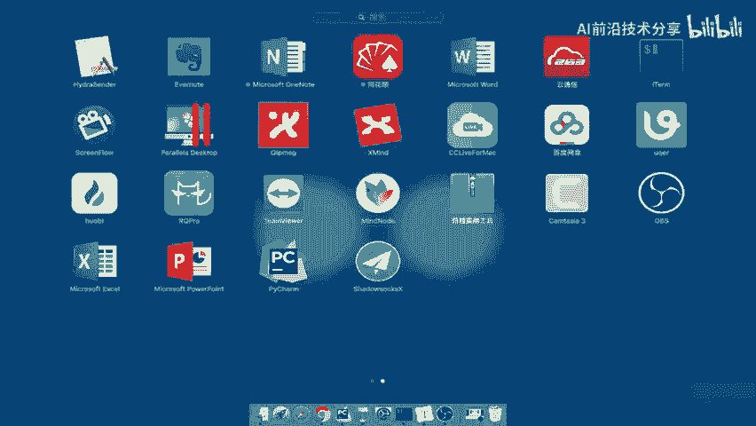

## 🗺️ 数据模块设计总览

我们用图表来总结数据模块的相关要点。

**数据模块设计总结**

设计目的是为了能够调用不同的数据集。因此，我们设计了一个数据集的基类 `TFRecordsBase`。

这个基类包含两个主要部分：
*   **配置属性**：数据集的参数。
*   **`get_dataset` 方法**：用于获取数据集。

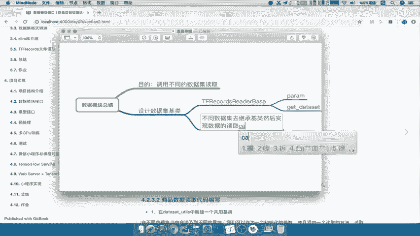

不同的数据集需要继承这个基类，并实现各自的数据读取操作。在读取时，可以选择不同的后端（例如，是读取原始文件还是读取 TFRecord）。

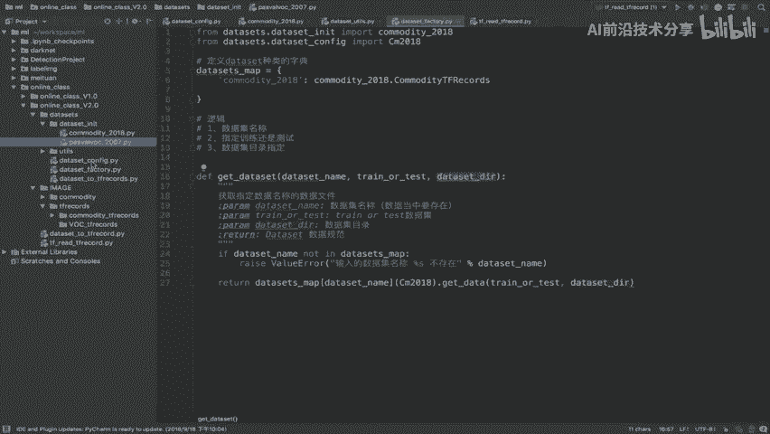

我们对外提供一个工程文件 `dataset_factory.py`，供训练逻辑使用。这样就实现了训练工程可以灵活调用不同的数据集，达成了我们最初的初衷。

在整个项目结构中，`data_factory` 负责调用不同的数据集，无论是训练还是测试都可以通过它来调用。

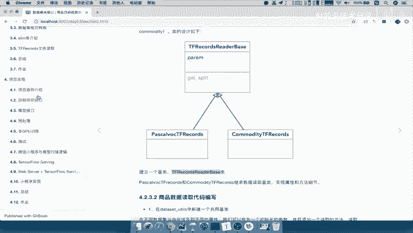

---

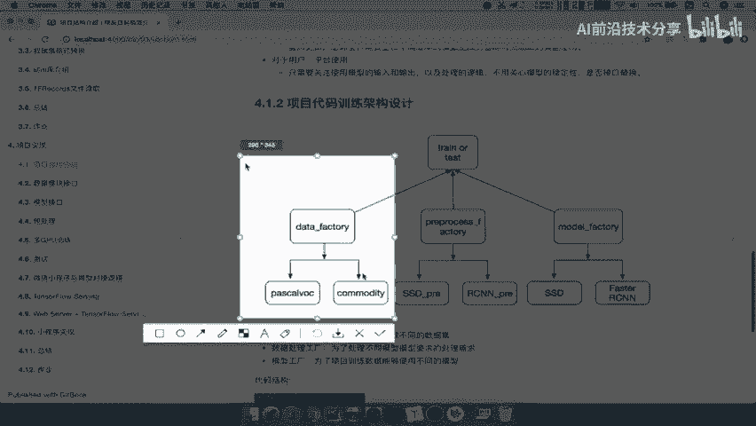

## ✅ 课程总结

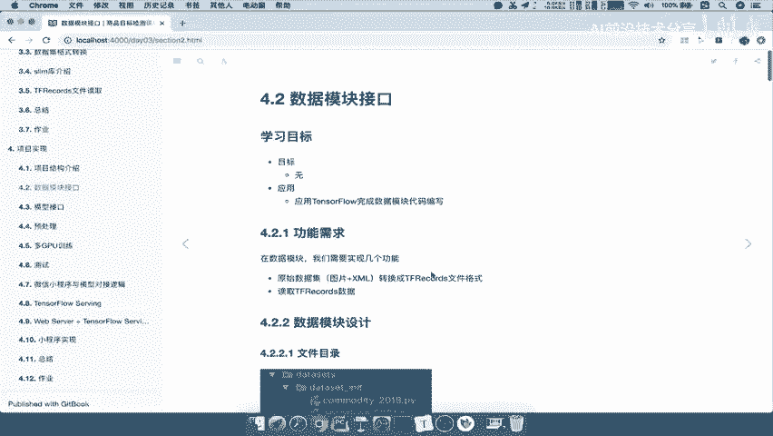

本节课中，我们一起学习了如何构建一个统一的数据接口。我们通过设计一个基类来规范不同数据集的读取方式，并利用工厂模式对外提供简洁的调用接口。这使得我们的代码结构更清晰，扩展新数据集更加方便。核心在于理解基类继承、配置管理和工厂模式的应用。