# 课程P54：模型接口与工厂模式实现 🧩

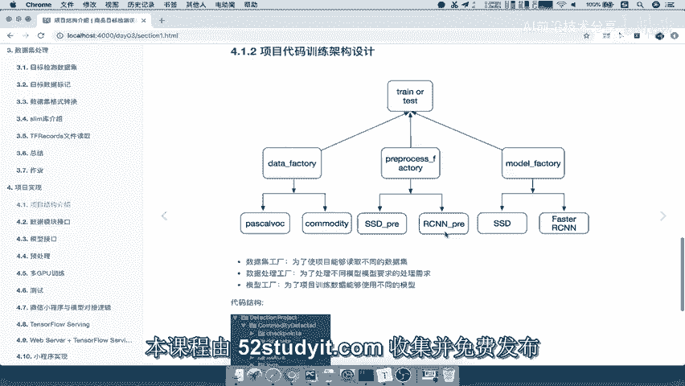

在本节课中，我们将学习如何为深度学习项目设置模型接口，并实现一个模型工厂。我们将利用TensorFlow等框架提供的现成模型，通过工厂模式来统一管理和调用不同的网络模型，而无需自己从头实现。

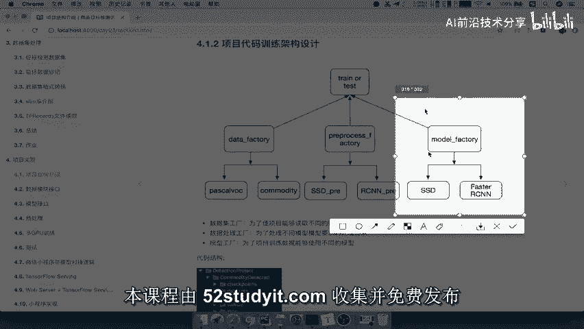

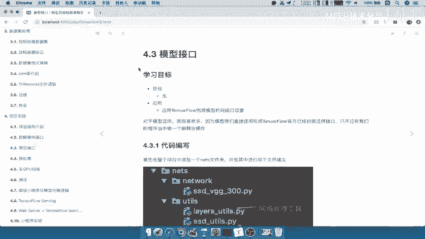

---

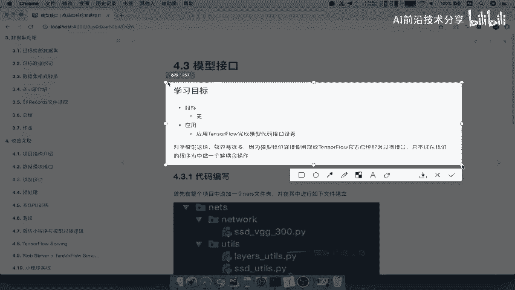

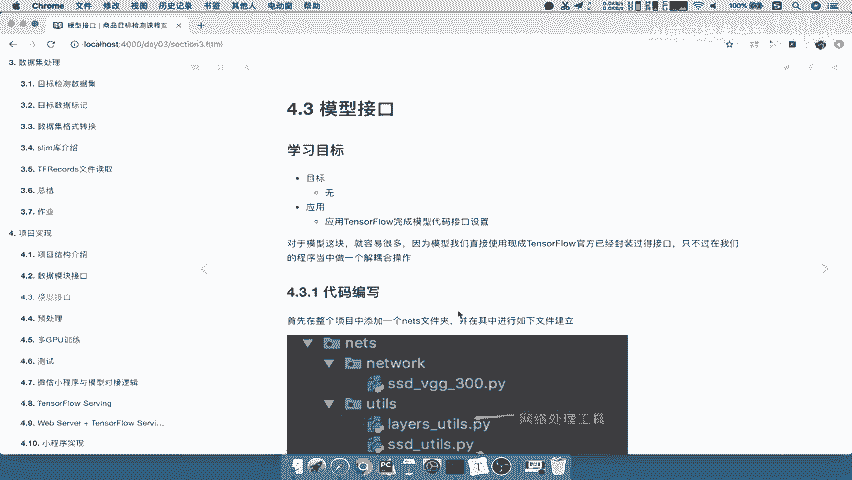

## 项目目录结构 📁

上一节我们介绍了项目的整体规划，本节中我们来看看如何组织模型相关的代码文件。

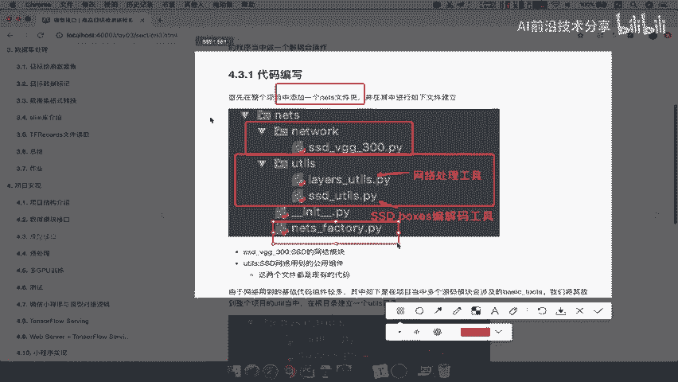

以下是项目目录结构的关键部分：

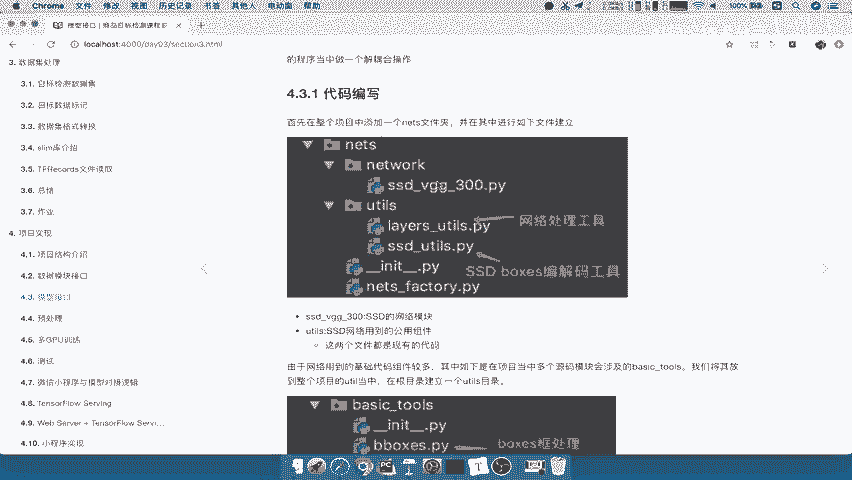

*   `nets/`：存放所有与网络模型相关的代码。
    *   `nets_model/`：存放具体的网络模型定义文件（例如SSD_VGG300）。
    *   `utils/`：存放该网络模型专用的工具函数（如边界框编解码工具）。
*   `utils/`（项目根目录下）：存放全局通用的基础工具函数（如非极大值抑制NMS），供多个模块调用。

这种结构将专用工具与通用工具分离，使代码更清晰、易于维护。

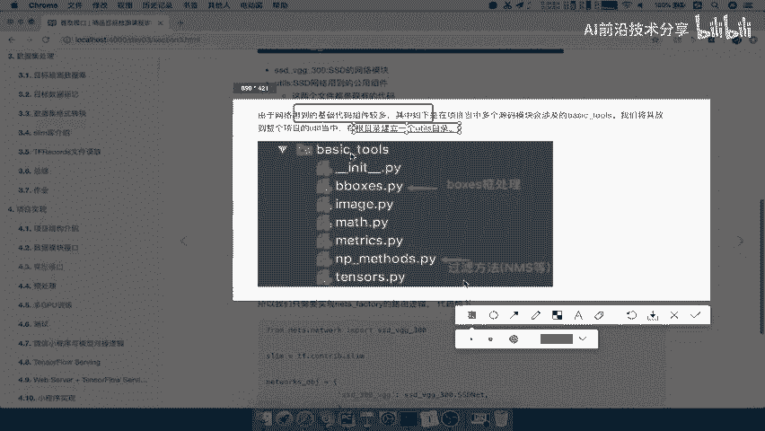

---

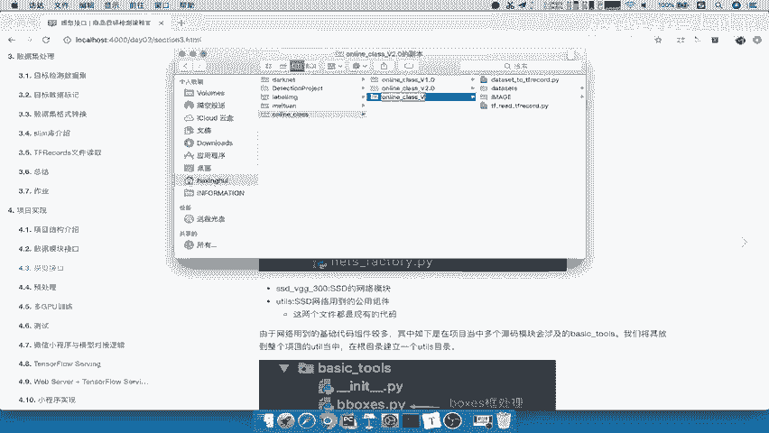

## 步骤一：搭建目录与导入源码 🛠️

首先，我们需要创建上述目录结构，并将已有的模型源码和工具代码放入对应位置。

1.  在项目根目录下创建 `nets` 文件夹。
2.  在 `nets` 文件夹内创建 `nets_model` 和 `utils` 两个子文件夹。
3.  将现成的SSD_VGG300模型定义文件复制到 `nets/nets_model/` 目录下。
4.  将SSD_VGG300模型专用的工具函数复制到 `nets/utils/` 目录下。
5.  在 `nets/nets_model/` 和 `nets/utils/` 目录中分别创建 `__init__.py` 文件，使其成为可导入的Python模块。
6.  在项目根目录下创建 `utils` 文件夹，并将通用的基础工具函数（如 `basic_tools`）复制到其中。

完成以上步骤后，模型模块所需的基础文件和工具就准备就绪了。

---

## 步骤二：实现模型工厂（Nets Factory）🏭

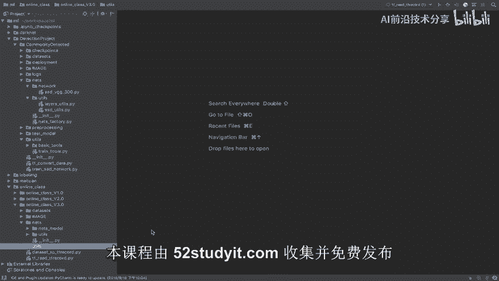

目录搭建完成后，接下来我们实现核心的模型工厂。工厂模式的作用是根据传入的名称，动态返回对应的网络模型类。

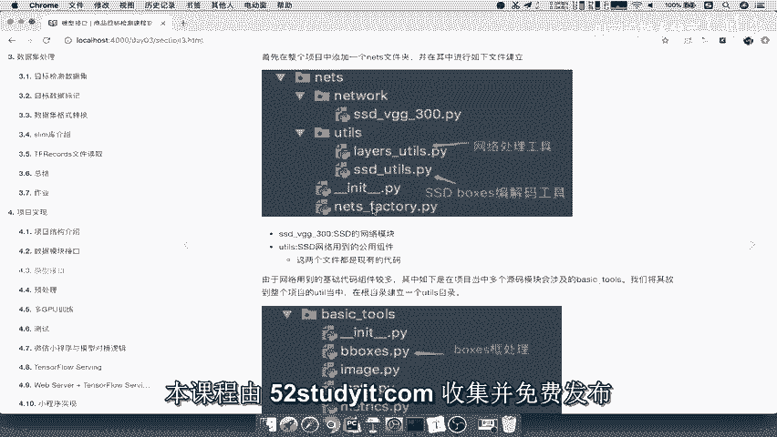

我们在 `nets/` 目录下创建一个新文件 `nets_factory.py`。

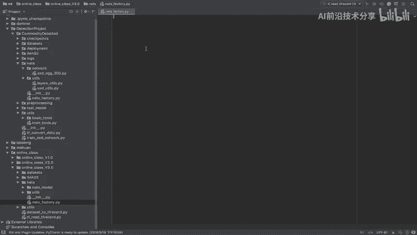

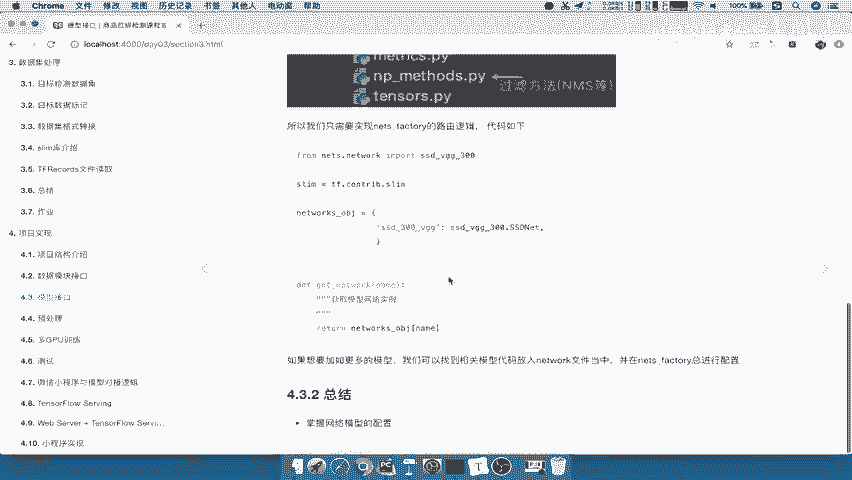

以下是该文件的核心代码实现：

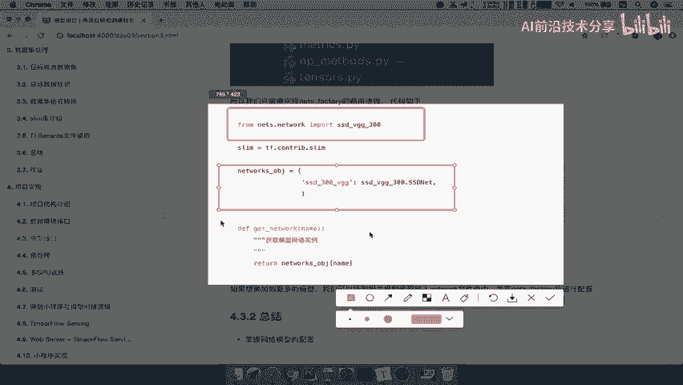

```python
# nets_factory.py
from nets.nets_model.ssd_vgg300 import SSDNet

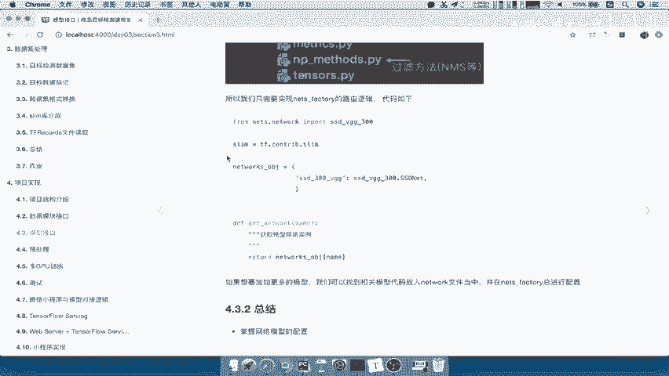

def get_network(network_name):
    """
    根据网络名称获取对应的网络模型类。
    参数:
        network_name (str): 指定的网络模型名称。
    返回:
        class: 对应的网络模型类。
    """
    # 定义可用网络模型的映射字典
    networks = {
        'ssd_vgg300': SSDNet,
        # 未来可以在此添加更多模型，例如:
        # 'yolo_v3': YOLONet,
        # 'faster_rcnn': FasterRCNNNet,
    }
    
    # 根据名称从字典中获取对应的网络类
    network_class = networks.get(network_name)
    
    if network_class is None:
        raise ValueError(f"未知的网络名称: {network_name}。请使用以下之一：{list(networks.keys())}")
    
    return network_class
```

**代码解释**：
*   首先从模型定义文件中导入具体的网络类（例如 `SSDNet`）。
*   定义一个函数 `get_network`，它接收一个参数 `network_name`（网络名称）。
*   在函数内部，创建一个字典 `networks`，将字符串名称映射到具体的网络类。
*   函数通过 `network_name` 查询字典，并返回对应的网络类。如果名称不存在，则抛出错误提示。

这样，在训练或推理时，只需调用 `get_network('ssd_vgg300')` 即可获得SSD_VGG300模型的类，之后再进行实例化。

---

## 总结 📝

本节课中我们一起学习了如何为深度学习项目构建模型接口。

1.  我们规划并创建了清晰的目录结构，将模型代码、专用工具和通用工具合理组织。
2.  我们实现了一个简单的模型工厂（`nets_factory.py`），它利用字典映射和工厂模式，提供了统一、灵活的模型获取接口。这使得在项目中切换或扩展不同模型变得非常简单，只需在工厂的映射字典中添加新的键值对即可。

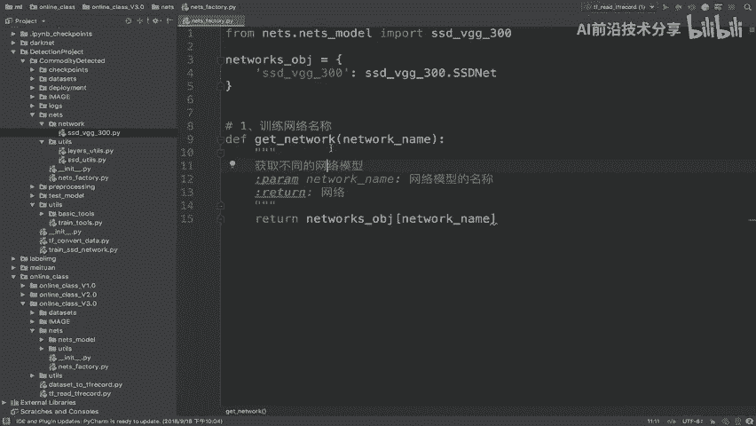

通过本节课的内容，我们为后续的训练流程准备好了模型调用的基础设施。在下一节中，我们将开始构建训练流程，并实际使用这个模型工厂。