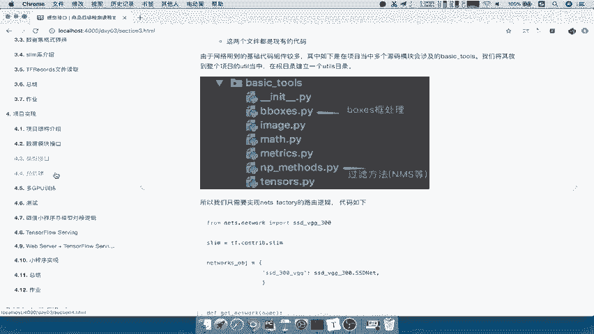
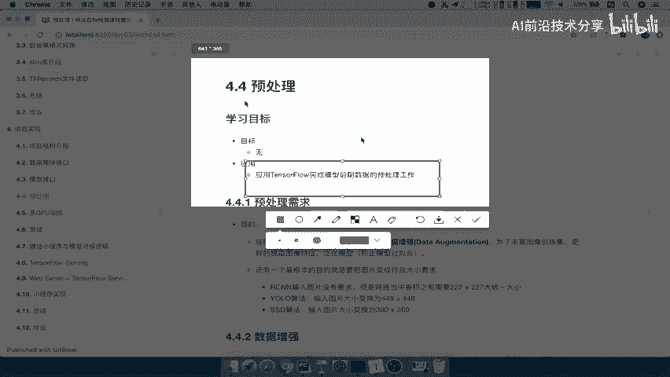
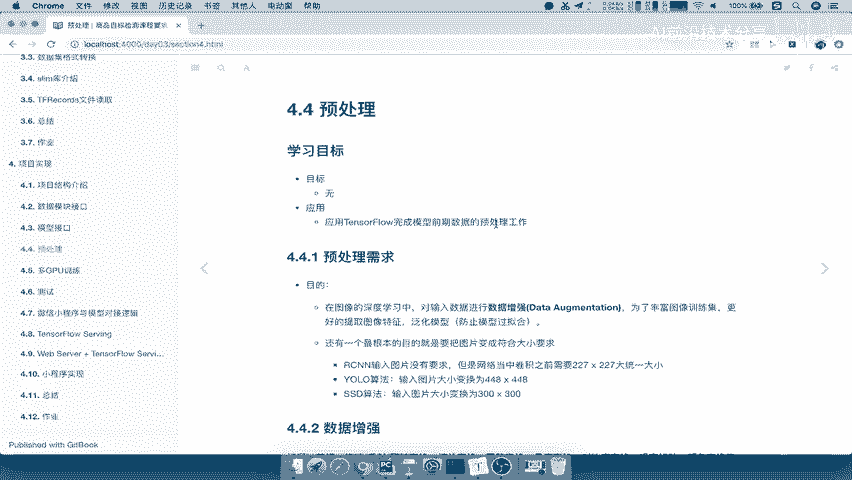
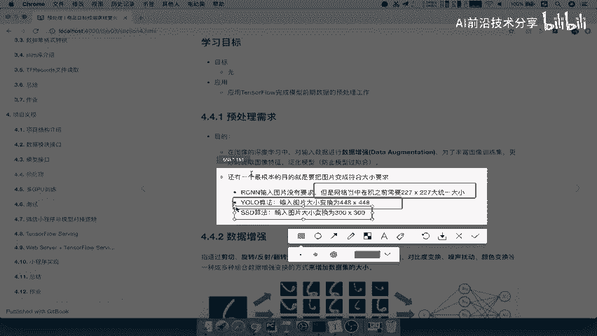
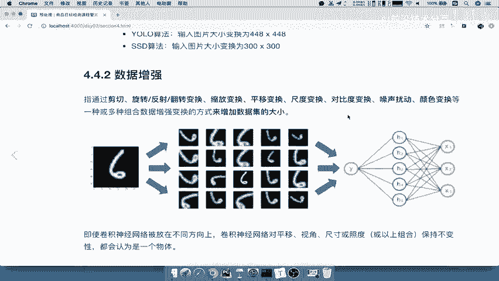
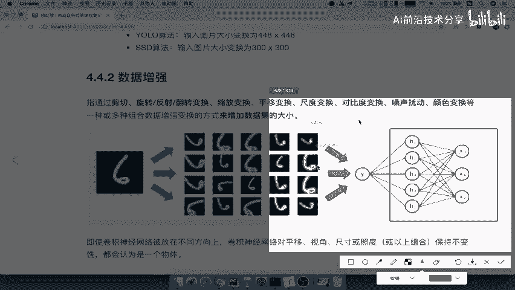
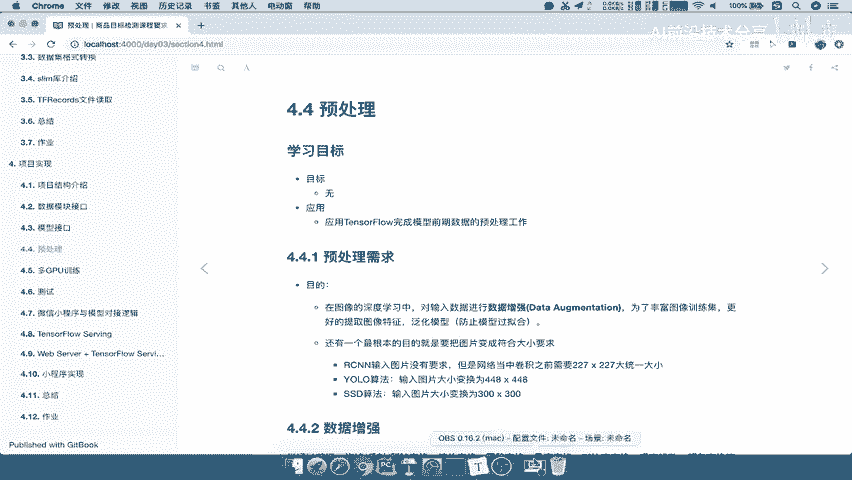

# 课程 P55：预处理接口与数据增强 🛠️

在本节课中，我们将要学习深度学习流程中的一个关键模块——**预处理**。我们将重点介绍预处理的需求、核心目的，并深入探讨**数据增强**的概念、类型、技术及其重要性。



## 概述





上一节我们介绍了模型接口的构建。本节中，我们来看看另一个至关重要的模块：**预处理**。预处理不仅仅是简单的图像变形，它在整个训练流程中扮演着核心角色，主要目的是进行**数据增强**，以丰富数据集、提升模型特征提取能力和泛化能力。

## 预处理的需求与目的

预处理模块的核心需求源于图像深度学习的实践。其根本目的是对输入数据进行**数据增强**。



数据增强是一个专门的领域，旨在通过一系列技术手段来丰富图像训练集，从而更好地提取图像特征并**泛化模型**，防止模型对训练数据**过拟合**。

此外，不同的算法对输入图像的尺寸有严格要求。例如：
*   YOLO 算法要求输入为 `448×448`。
*   SSD 算法要求输入为 `300×300`。

因此，预处理模块的另一个关键任务是将各种尺寸的原始图片调整到算法所要求的固定大小。

综上所述，预处理模块的目的可总结为：
1.  对数据集进行**数据增强**。
2.  丰富数据以提取更好特征，**防止过拟合**。
3.  将图片尺寸调整到算法要求的固定大小。

## 数据增强详解

那么，数据增强具体是什么，它又是如何帮助模型泛化、防止过拟合的呢？

### 什么是数据增强？

**数据增强**是指通过一系列图像变换操作（如剪切、旋转、缩放、平移等）的组合，来**增加数据集有效大小的技术**。

其核心思想是：通过对原始图像进行各种合理的变换，生成新的、多样化的训练样本，从而在不实际收集新数据的情况下，扩充数据集。

例如，一张原始图片经过多种变换后，可以生成20张不同的变体。这相当于将1个样本变成了20个样本输入网络进行训练，极大地增加了数据的多样性。

### 为什么需要数据增强？

进行数据增强主要有两个原因：
1.  **防止过拟合**：这是最主要的原因。当训练数据不足时，模型容易记住训练集中的噪声或不重要的细节（即过拟合），导致在新数据上表现不佳。数据增强通过提供更多样化的数据，迫使模型学习更通用、更本质的特征。
2.  **扩充小数据集**：在实际项目中，收集和标注大量数据成本高昂。数据增强是一种低成本、高效率的数据扩充方式。

为了理解数据增强如何防止过拟合，我们来看一个例子：

假设数据集中只有两张汽车图片用于训练分类模型（品牌A和品牌B）。一张品牌A的车头朝左，一张品牌B的车头朝右。神经网络在训练时，可能会将“车头方向”这个非常明显但非本质的特征，作为区分两个品牌的主要依据。

当模型训练完成后，输入一张**车头朝右的品牌A汽车**图片时，模型很可能错误地将其分类为品牌B。这是因为数据集太小，模型找到了最具代表性（但非本质）的特征。

解决方法有两种：
*   **直接收集更多数据**：收集品牌A车头朝右、品牌B车头朝左的图片，打破特征与标签的虚假关联。
*   **进行数据增强**：对现有的两张图片进行水平翻转等变换，人工创造出所需的新样本。

### 数据增强的两种类型

根据增强发生的时机和方式，数据增强可分为两类：

**1. 离线增强**
*   **定义**：在训练开始之前，预先对数据集中的所有图像执行变换操作，并将生成的新图像**物理保存**到磁盘或数据库中。
*   **特点**：从根本上增加了数据集的物理大小。训练时直接读取增强后的数据集。

**2. 在线增强**
*   **定义**：在训练过程中，数据**输入模型之前**，实时地、随机地对每批（或每张）图像执行变换操作。
*   **特点**：原始数据集大小不变。每次迭代时，输入的图像都可能经过不同的随机变换，相当于在“飞行中”动态生成新的训练样本。这种方式更灵活，能产生近乎无限的数据变体。

以下是两种类型的对比总结：



| 类型 | 操作时机 | 数据集大小 | 特点 |
| :--- | :--- | :--- | :--- |
| **离线增强** | 训练开始前 | **物理增加** | 一次性生成，存储开销大，但训练时效率高。 |
| **在线增强** | 数据输入模型前 | **逻辑增加** | 动态生成，存储开销小，能提供更多样的样本。 |

### 常见的数据增强技术

以下是一些基础且强大的数据增强方法，被广泛应用于各种模型的训练中：



**1. 翻转**
对图像进行水平或垂直方向的翻转。
```python
# TensorFlow 示例：随机水平翻转
augmented_image = tf.image.random_flip_left_right(original_image)
```

**2. 旋转**
将图像旋转一定角度（如90°，180°，270°）。

**3. 随机裁剪**
从原始图像中随机裁剪出一部分区域，然后将其缩放回原始尺寸。这迫使模型不依赖于物体的完整出现或固定位置。

**4. 色彩变换**
调整图像的亮度、对比度、饱和度和色调。

**5. 平移与缩放**
将图像在平面内移动一定像素，或进行一定比例的缩放。

### 数据增强的效果

数据增强能显著提升模型的训练效果和泛化能力。从下图所示的在MNIST数据集上的训练曲线可以看出：
*   **绿色/粉色线（无增强）**：代表损失和准确率的变化。
*   **红色/蓝色线（有增强）**：代表使用了数据增强后的损失和准确率。

可以观察到，使用了数据增强的模型（红/蓝线）能够**更快地**降低损失、提高准确率，并且最终能达到更好的性能平台。这说明数据增强有效提升了模型的学习效率和泛化能力。

## 总结

本节课中我们一起学习了预处理与数据增强的核心知识。

我们首先明确了**预处理模块**的需求和目的：进行数据增强、调整图像尺寸以适配算法，最终目标是提升模型泛化能力、防止过拟合。

接着，我们深入探讨了**数据增强**。我们了解到，数据增强是通过一系列图像变换来逻辑上扩充数据集的技术。它主要分为**离线增强**和**在线增强**两种类型。我们还介绍了几种常见的增强技术，如翻转、旋转、裁剪等。

最后，我们通过实例看到了数据增强对模型训练效果的积极影响，它能加速模型收敛并提升最终性能。



理解并合理应用数据增强，是构建鲁棒、高性能深度学习模型的关键一步。在接下来的实践中，我们将学习如何使用TensorFlow等工具具体实现这些预处理和数据增强操作。