# 课程 P56：56.02_预处理接口：预处理工厂代码 🏗️

在本节课中，我们将学习如何搭建一个数据预处理的工厂模块。这个模块将作为统一的接口，根据不同的模型需求，提供对应的数据增强或预处理方法，从而简化训练和测试流程。

## 概述

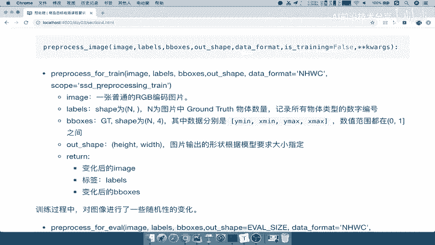

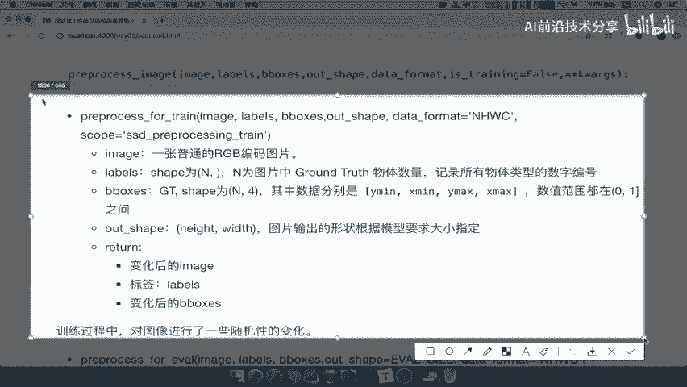

数据增强是提升模型泛化能力的重要手段。然而，我们无需为每个模型手动编写复杂的增强逻辑。TensorFlow 等框架通常会参考 VGG、Inception 等经典论文，将常用的数据增强方法封装成 API。本节课，我们将学习如何利用这些封装好的 API，构建一个灵活的预处理工厂。

## 预处理 API 简介

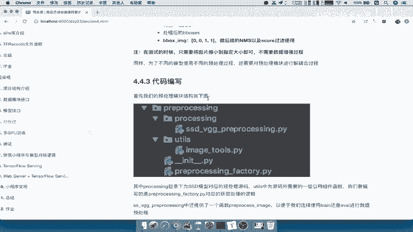

上一节我们提到了数据增强的重要性，本节中我们来看看如何具体使用封装好的 API。

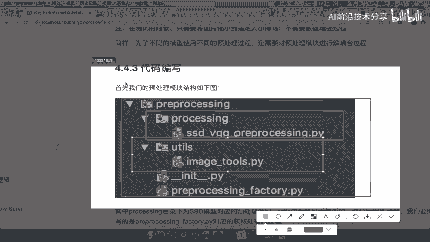

在 TensorFlow 的 SSD VGG 预处理代码中，核心的预处理功能位于 `ssd_vgg_preprocessing` 文件中。该文件提供了两个关键函数，通过 `preprocess_image` 函数进行调用。

这个函数允许你指定当前是训练模式还是测试模式。区分这两种模式的原因在于：
*   **训练时**：目的是通过数据增强来扩充数据集，增加模型的鲁棒性。
*   **测试/验证时**：只需将输入图片调整到模型要求的大小即可，无需进行随机变换。因为如果测试时对图像进行了翻转等随机操作，将无法与原始标注对应，也无法正确显示预测结果。

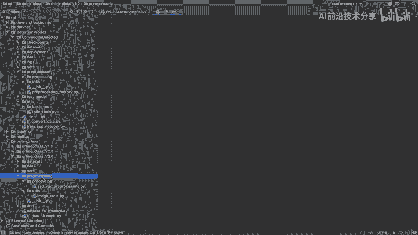

因此，在预处理阶段，我们明确分为**训练预处理**和**测试预处理**。

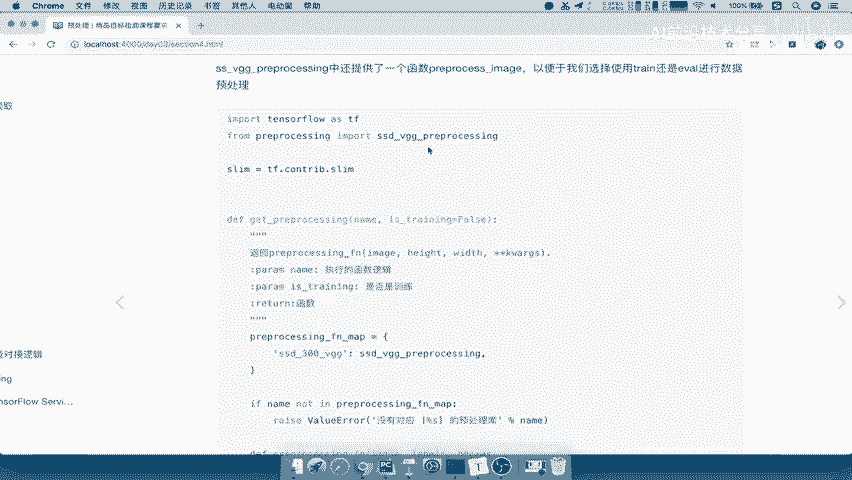

以下是两种模式的核心区别：
*   **训练过程**：会对图像进行随机性变化（数据增强）。
*   **测试过程**：仅将图片缩放到指定尺寸，不进行数据增强。

## 搭建预处理模块

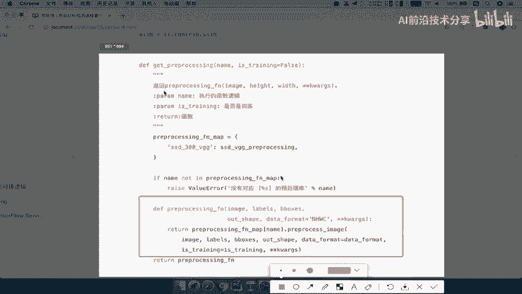

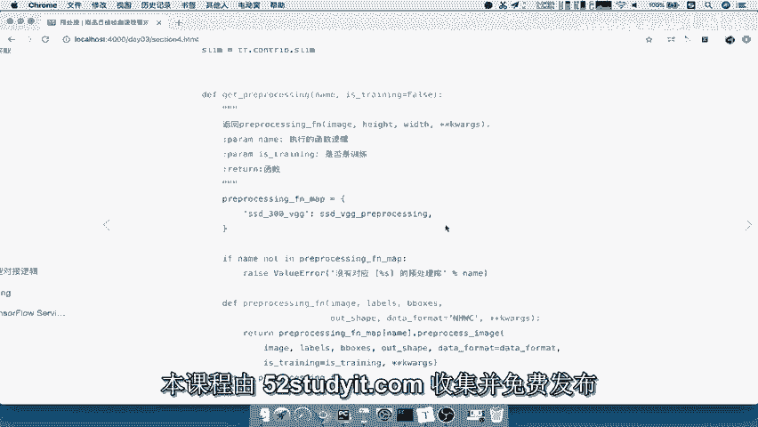

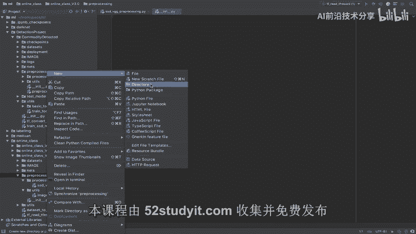

理解了预处理的核心概念后，我们现在开始搭建自己的预处理模块。

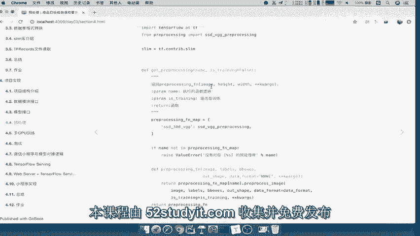

首先，我们需要了解预处理模块的目录结构。该结构与我们之前构建的模块类似，旨在为不同模型组织不同的预处理需求。

以下是模块的目录结构：
```
preprocessing/
├── __init__.py
├── ssd_vgg_preprocessing.py
└── utils/
    └── image_tools.py
```

*   `preprocessing/`：主目录，存放所有预处理相关代码。
*   `ssd_vgg_preprocessing.py`：针对 SSD VGG 模型的具体预处理逻辑。
*   `utils/image_tools.py`：预处理过程中用到的图像工具函数。

**注意**：相关的底层 API（如具体的图像变换函数）我们无需自己编写，可以直接使用框架或社区提供的成熟代码。因此，我们可以直接将上述目录和文件结构复制到我们的项目（例如 `v3.0` 版本）中。

## 实现预处理工厂

目录搭建完成后，我们最后一步是实现一个预处理工厂。这个工厂的作用是：根据用户提供的模型名称，返回对应的预处理函数。

我们将在 `preprocessing_factory.py` 文件中编写此工厂。

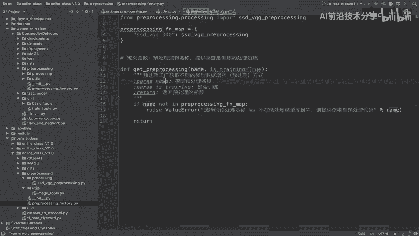

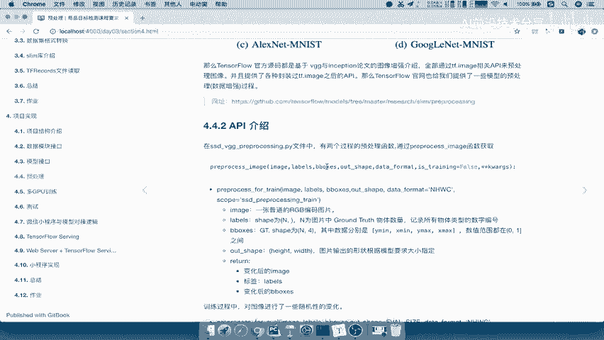

以下是实现预处理工厂的步骤：

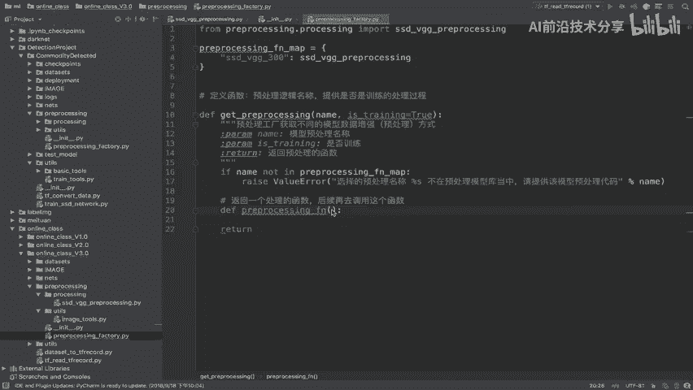

1.  **导入必要的模块**：首先导入我们需要的预处理模块。
2.  **定义工厂函数**：创建一个函数（例如 `get_preprocessing`），它接收两个参数：预处理名称 (`name`) 和是否为训练模式 (`is_training`)。
3.  **建立名称映射**：在函数内部，定义一个字典 (`preprocessing_fn_map`)，将支持的预处理名称映射到对应的模块。
4.  **检查有效性**：判断用户传入的 `name` 是否在支持的映射中。如果不在，则抛出错误提示。
5.  **返回处理函数**：如果名称有效，则返回一个**闭包函数**。这个闭包函数内部会调用具体预处理模块的 `preprocess_image` 方法，并固定 `is_training` 参数。这样做的好处是，将具体的参数（如图像、标签、边界框等）延迟到实际训练循环中再传入，使得工厂接口更简洁。

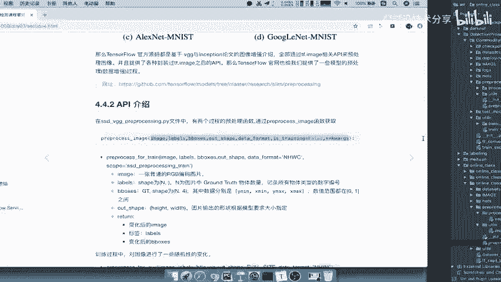

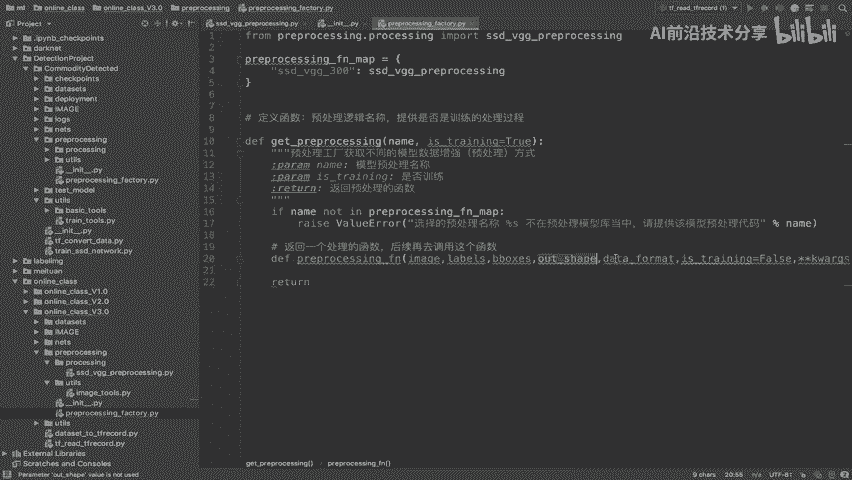

以下是 `preprocessing_factory.py` 的核心代码框架：

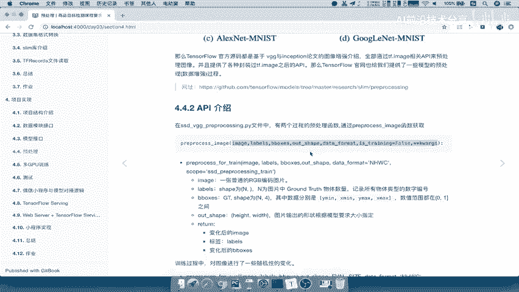

```python
from preprocessing import ssd_vgg_preprocessing

def get_preprocessing(name, is_training=True):
    """
    预处理工厂：获取不同模型的数据增强/预处理方法。
    Args:
        name: 预处理名称，例如 'ssd_vgg_300'。
        is_training: 是否为训练模式。
    Returns:
        一个预处理函数。
    """
    # 支持的预处理方法映射
    preprocessing_fn_map = {
        'ssd_vgg_300': ssd_vgg_preprocessing,
    }

    # 检查名称是否有效
    if name not in preprocessing_fn_map:
        raise ValueError('您提供的预处理名称 "%s" 不在预处理模型库中。请提供正确的模型预处理代码。' % name)

    # 获取对应的预处理模块
    preprocessing_module = preprocessing_fn_map[name]

    # 定义一个闭包函数，延迟参数传入
    def preprocessing_fn(images, labels, bboxes, out_shape, data_format='NHWC'):
        """
        实际的预处理函数。
        Args:
            images: 输入图像。
            labels: 图像标签。
            bboxes: 边界框。
            out_shape: 输出图像形状。
            data_format: 数据格式，默认为 'NHWC'。
        Returns:
            处理后的图像、标签和边界框。
        """
        return preprocessing_module.preprocess_image(
            image=images,
            labels=labels,
            bboxes=bboxes,
            out_shape=out_shape,
            data_format=data_format,
            is_training=is_training  # 使用工厂函数传入的 is_training 参数
        )

    # 返回这个预处理函数
    return preprocessing_fn
```

通过这种方式，外部代码只需调用 `get_preprocessing(‘ssd_vgg_300’, is_training=True)` 就能获得一个配置好的预处理函数，然后在训练循环中传入具体的批次数据即可。

## 总结

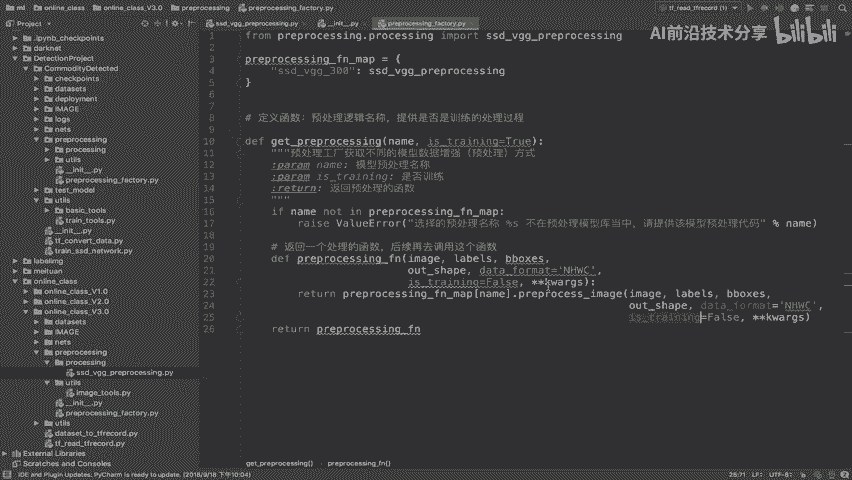

本节课中我们一起学习了如何构建一个数据预处理的工厂模块。

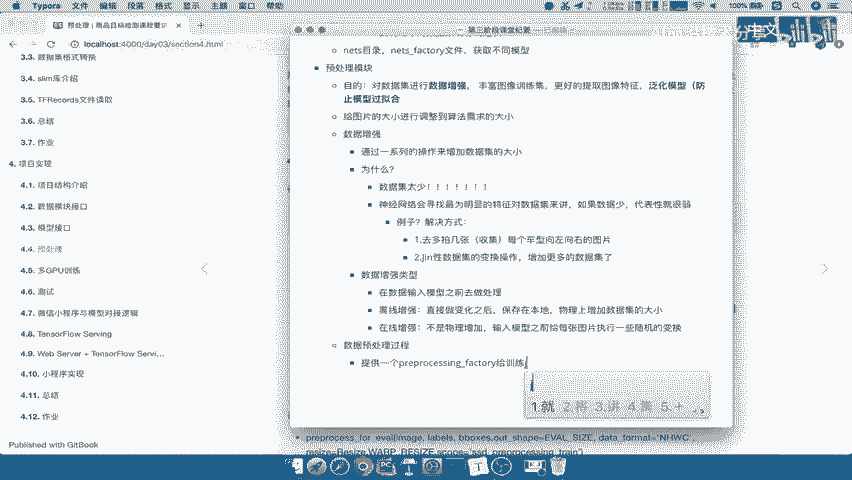

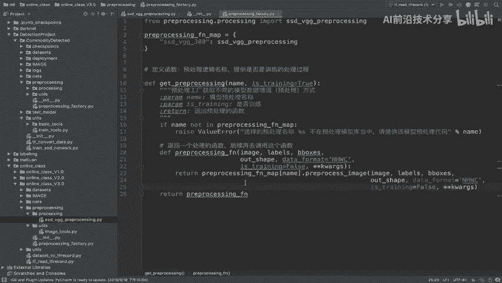

我们首先了解了训练与测试阶段预处理的区别。接着，我们搭建了预处理模块的目录结构。最后，我们实现了一个关键的 `preprocessing_factory`，它作为一个灵活接口，根据模型名称和模式返回对应的预处理函数。这个设计使得数据增强流程模块化、可配置，极大方便了后续的训练代码编写。