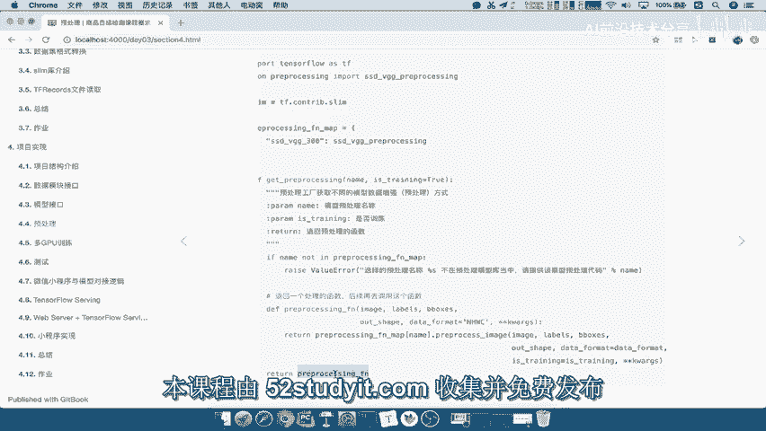
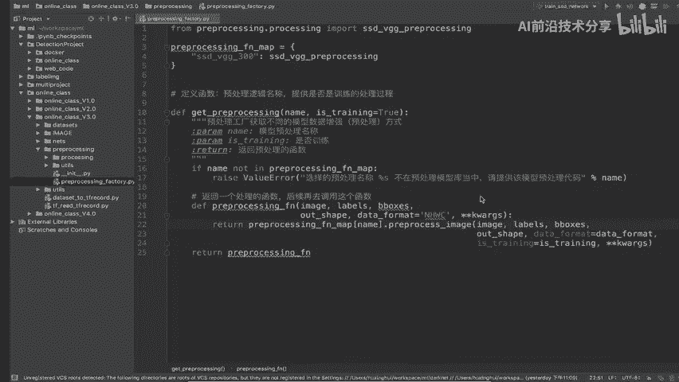

# 课程 P57：预处理工厂代码参数错误调整 🛠️

在本节课中，我们将学习如何调整预处理工厂代码中的参数错误。我们将重点关注如何移除冗余参数、正确传递参数，以及优化代码结构，使其更清晰、更易于维护。

## 概述

上一节我们介绍了预处理工厂的基本概念。本节中，我们来看看在具体实现时遇到的一个常见问题：参数定义与传递存在错误。我们将通过分析代码片段，逐步修正这些问题。

## 参数问题分析与修正

在之前的代码中，我们在最外层定义了一个参数 `is_training=True`。这个参数的意图是：在首次获取预处理函数时，判断当前是否处于训练模式。

然而，在函数内部调用时，我们无需再次指定 `is_training` 参数。因此，我们需要删除内部调用中的 `is_training` 参数。

以下是需要修正的代码逻辑示意图：

具体修正步骤如下：

以下是参数调整的具体步骤：

1.  **删除内部调用的 `is_training` 参数**：在函数内部调用预处理方法时，移除显式传递的 `is_training` 参数，因为它已由外层工厂函数的状态决定。
2.  **确保 `extra_train` 参数正确传递**：`extra_train` 参数应通过工厂函数的外层参数传入，并在内部调用时使用。
3.  **处理 `data_format` 参数**：`data_format` 参数已在工厂函数的参数列表中指定了默认值。因此，在内部调用时，我们无需再重复定义它，而是直接使用传入的值。

修正后的参数传递逻辑可参考下图：

通过以上调整，我们使参数传递路径更加清晰，避免了重复定义和潜在的冲突，让预处理工厂的接口更加简洁和健壮。

## 总结

本节课中我们一起学习了如何修正预处理工厂代码中的参数错误。我们主要完成了三件事：移除了内部调用的冗余 `is_training` 参数，确保了 `extra_train` 参数的正确传递路径，并将 `data_format` 参数统一到工厂函数参数列表中管理。这些调整使得代码逻辑更清晰，更易于理解和使用。