# 课程P58：数据、模型与预处理接口参数总结 📚

在本节课中，我们将对之前讲解的数据模块接口、模型接口以及预处理模块接口进行统一梳理和总结。我们将明确每个接口在训练时需要提供的具体参数，以便后续在构建训练流程时，无需再深入每个模块的细节，可以直接调用。

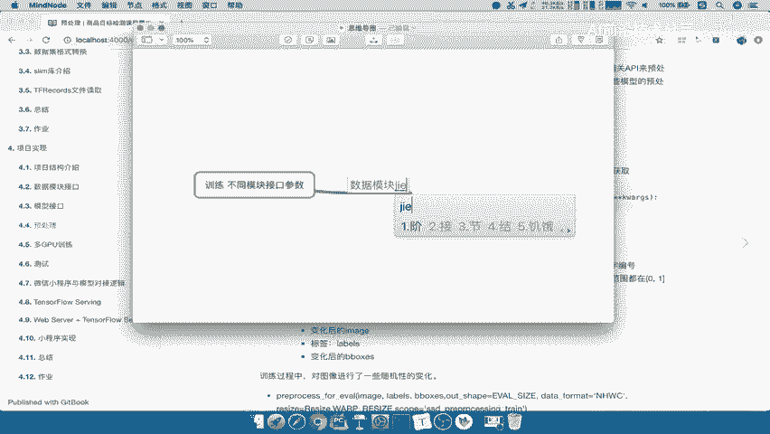

---

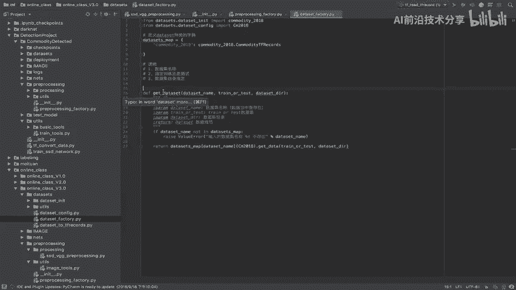

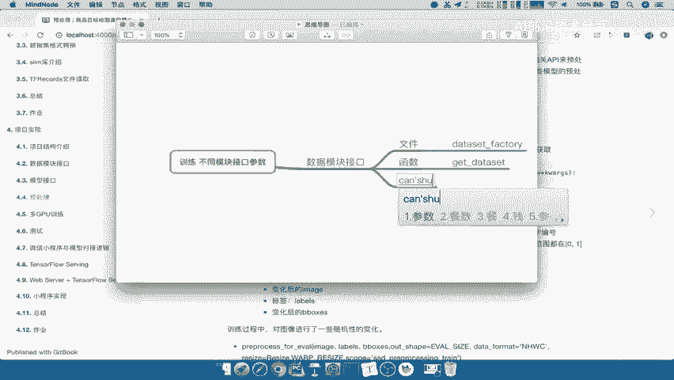

## 数据模块接口 📊

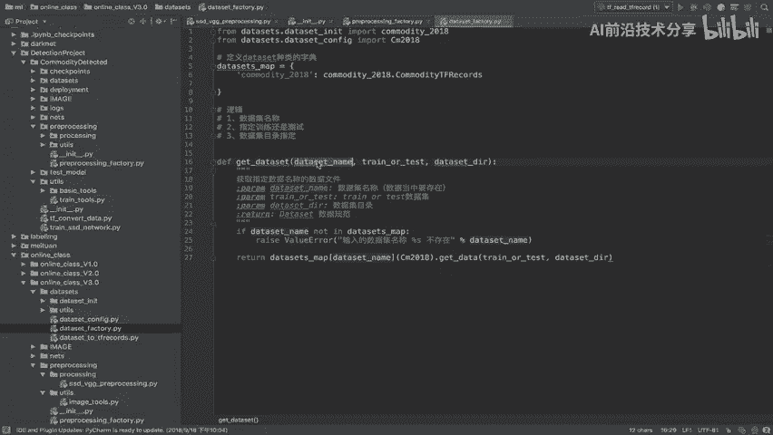

上一节我们介绍了数据模块的构成，本节中我们来看看其接口的具体调用方式。

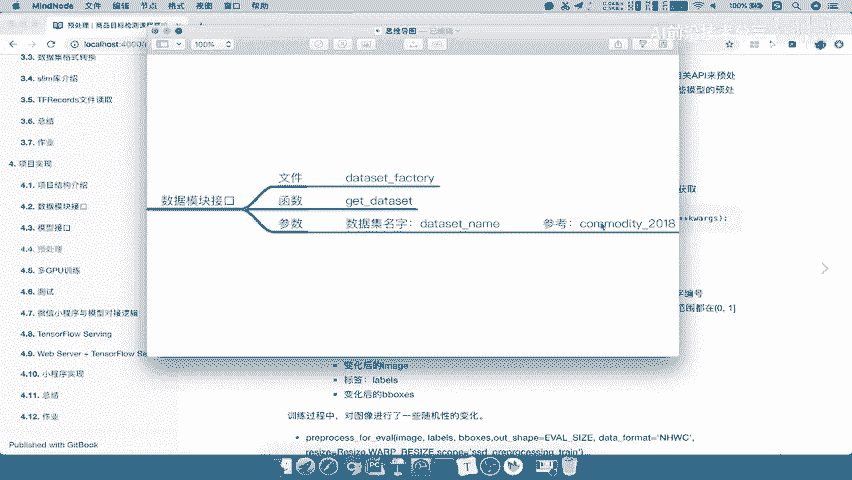

**文件**：`dataset_factory.py`
**函数**：`get_dataset`
**参数**：
以下是调用 `get_dataset` 函数时必须提供的参数列表：
*   `dataset_name`：数据集的名称，例如 `coco_2017`。
*   `is_training`：一个布尔值，用于指定加载的是训练集还是测试集。
*   `dataset_dir`：数据集在本地存储的根目录路径。

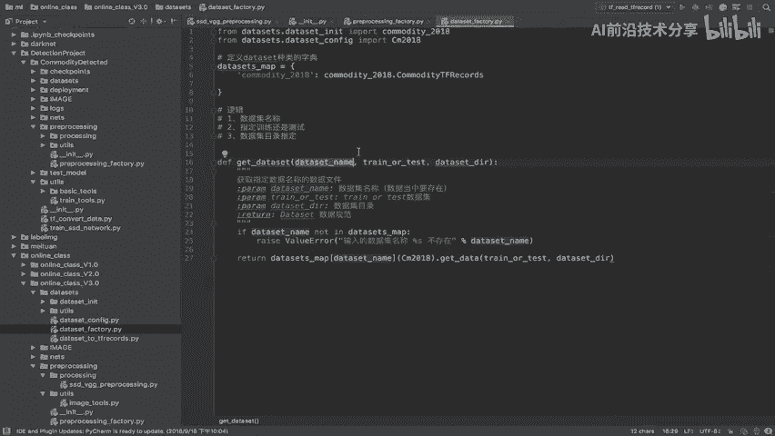

---

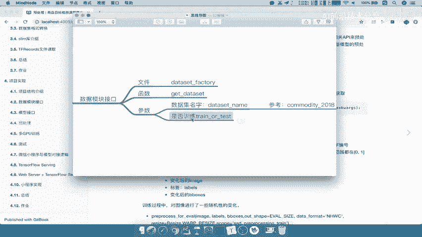

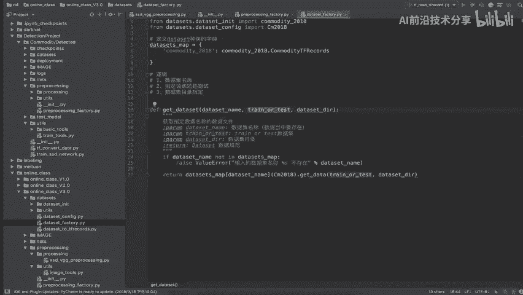

## 模型接口 🤖

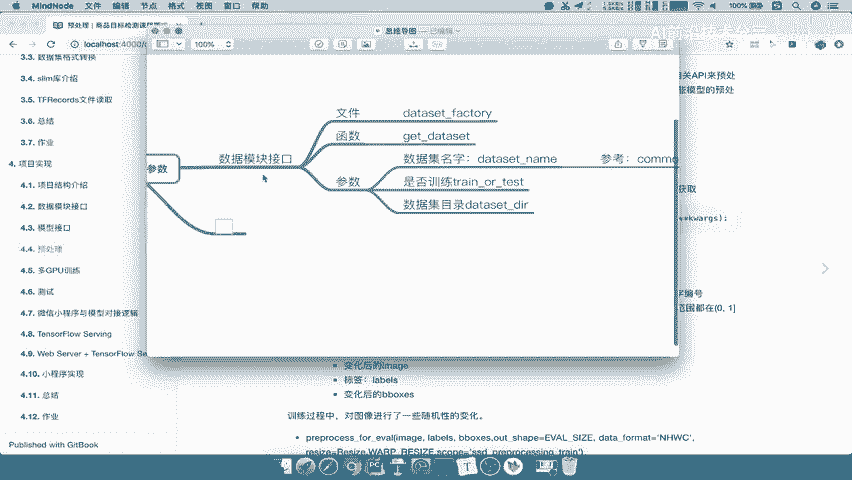

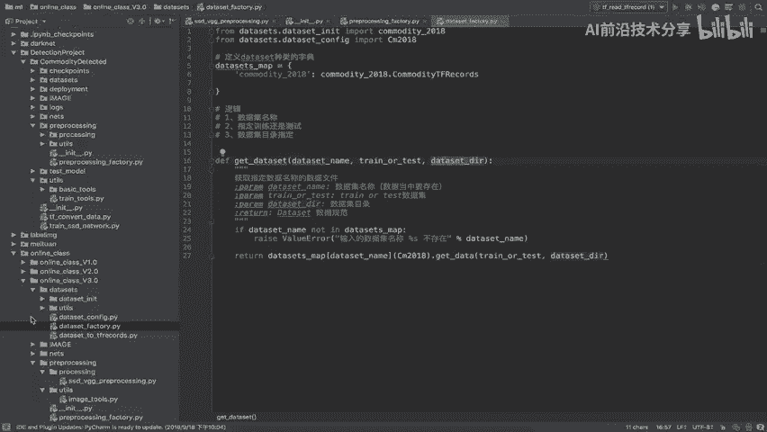

了解了数据如何加载后，我们接下来看看如何获取模型。

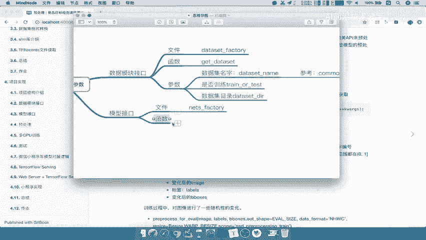

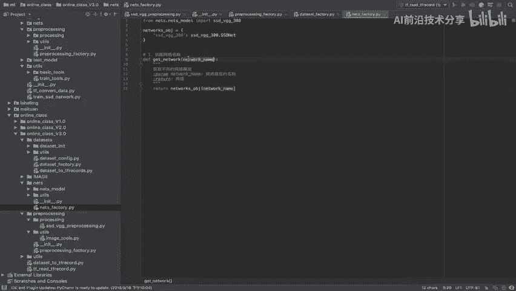

**文件**：`nets_factory.py`
**函数**：`get_network`
**参数**：
调用 `get_network` 函数仅需一个参数：
*   `network_name`：需要构建的神经网络模型的名称。

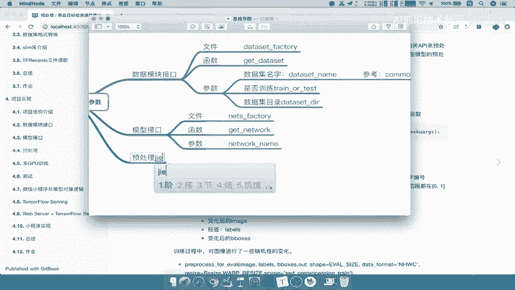

---

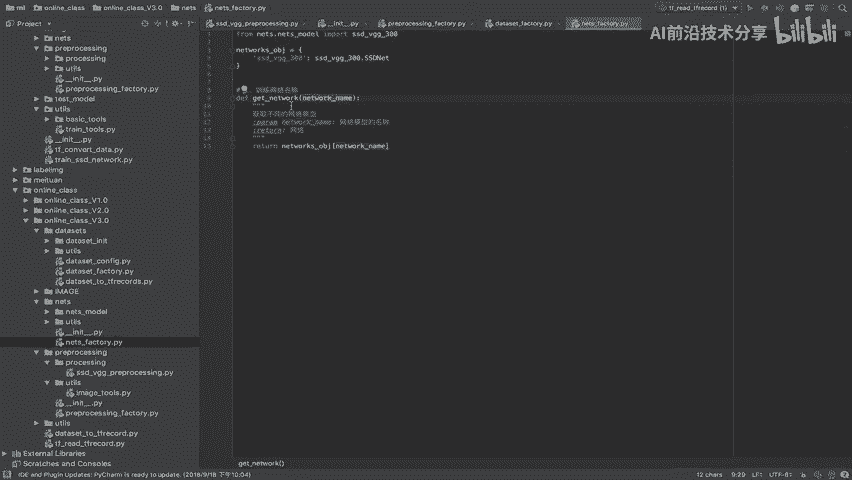

## 预处理接口 ⚙️

模型和数据准备就绪后，数据在输入模型前需要经过预处理。预处理接口较为特殊，它返回一个可调用的处理函数。

**文件**：`preprocessing_factory.py`
**函数**：`get_preprocessing`
**参数**：
`get_preprocessing` 函数本身接收两个参数，并返回一个处理函数：
*   `name`：预处理策略的名称。
*   `is_training`：指定是否使用训练阶段的预处理流程。

其返回的 `preprocessing_fn` 函数则需要更多参数来完成具体的图像变换，以下是该函数所需的参数列表：
*   `image`
*   `labels`
*   `bboxes`
*   `out_shape`：输出图像的尺寸（例如 `[300, 300]`）。
*   `data_format`：数据格式（例如 `‘NHWC’` 或 `‘NCHW’`）。
*   `is_training`：是否处于训练模式。
*   `**kwargs`：其他可能的关键字参数。

---

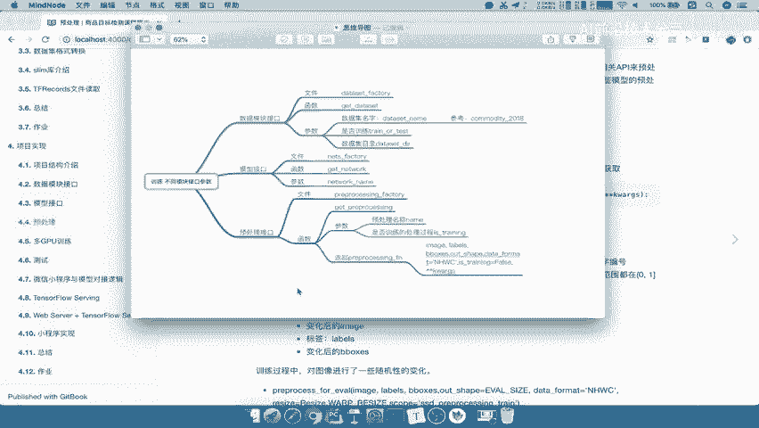

本节课中，我们一起学习了训练流程中三个核心模块的接口调用方法及其参数。我们总结了数据模块的 `get_dataset`、模型模块的 `get_network` 以及预处理模块的 `get_preprocessing` 函数的具体使用方式。有了这些清晰的接口定义作为基础，接下来我们就可以开始构建并深入讲解完整的模型训练过程了。