# 课程 P59：训练步骤与设备部署介绍 🚀

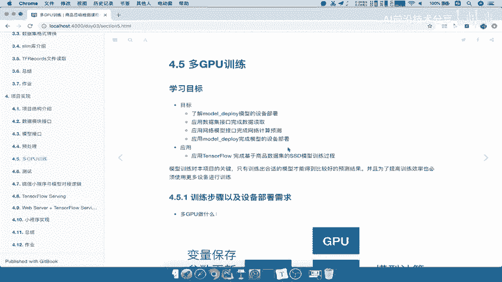

在本节课中，我们将学习深度学习模型训练的核心流程，并了解如何将训练任务合理地部署到CPU和GPU设备上，以构建一个高效的多GPU训练环境。

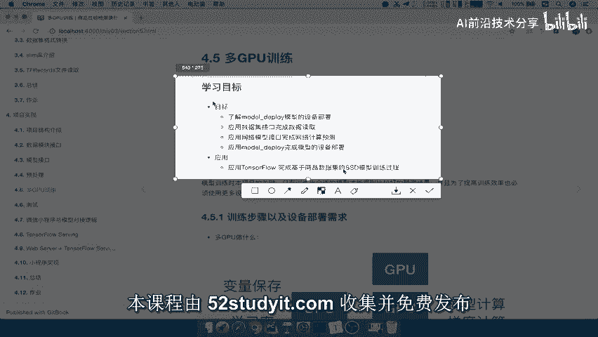

---

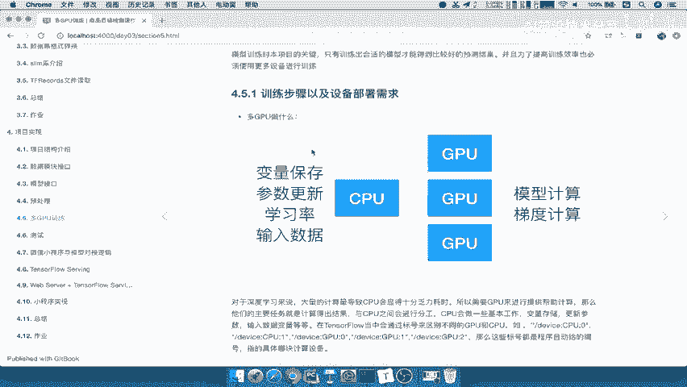

## 多GPU训练的必要性

模型训练是整个项目的关键环节。只有训练出性能良好的模型，才能将其导出并供他人使用。那么，为什么我们需要使用多GPU进行训练呢？

上一节我们介绍了训练的重要性，本节中我们来看看多GPU训练具体在做什么。

我们参考下图来理解多GPU训练中设备的分工：

在训练设备中，通常包含CPU和GPU。CPU也可以用于训练模型和计算输出结果。然而，CPU处理大量计算时非常耗时，训练一个模型可能需要长达一个月的时间，这显然效率过低。

因此，我们需要计算速度更快的设备，这就是图形处理器（GPU）。GPU在并行计算方面比CPU快很多。具体细节我们不做深入探讨。

以下是CPU和GPU在训练中的主要分工：

*   **CPU的角色**：主要负责变量的保存和参数的统一更新。它像一个中转站或调度中心。我们通常将创建的变量存储在CPU上。
*   **GPU的角色**：主要负责计算量大的任务，如模型的前向传播、反向传播和梯度计算。GPU相当于执行具体工作的“劳工”。

可以这样理解：CPU管理**参数（Parameters）**，而GPU执行**工作（Jobs）**。了解CPU和GPU的分工后，我们就知道在训练中应该将哪些任务分配给它们。

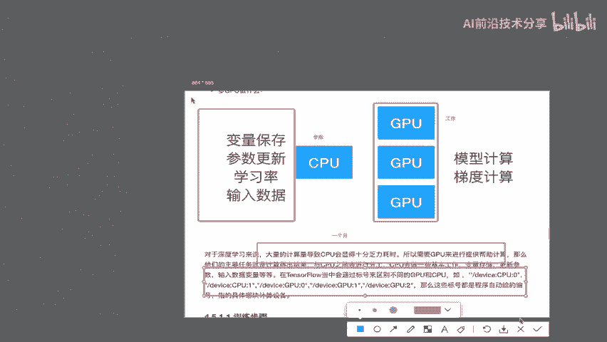

在TensorFlow中，设备有默认的命名规则，例如 `device:CPU:0`、`device:GPU:0`、`device:GPU:1` 等。程序会自动进行标记，我们通常无需关心`GPU:0`具体对应哪块物理显卡。默认情况下，计算任务会分配到各个可用的GPU上。

这就是多GPU训练的基本概念和分工。

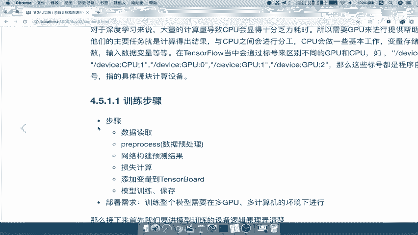

---

## 训练步骤与设备部署

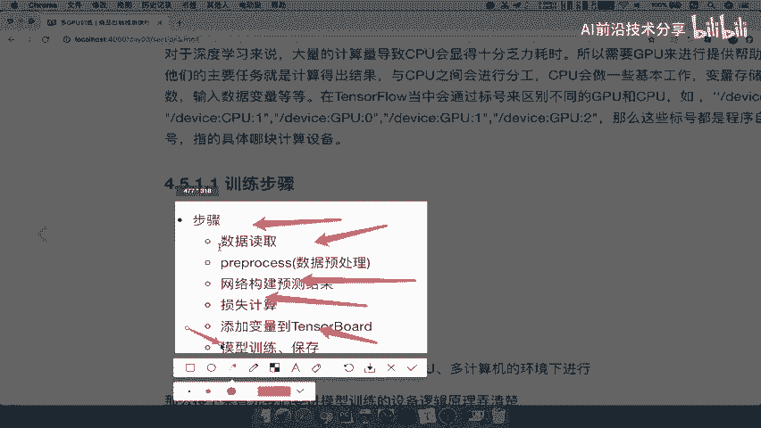

我们知道了训练过程中CPU和GPU的职责，接下来需要了解完整的训练步骤，并探讨如何将这些步骤与设备部署相结合。

首先，回顾一下模型训练的基本步骤：

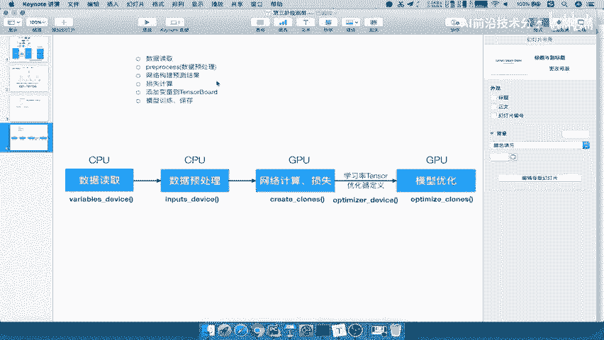

1.  **数据读取**
2.  **数据预处理**
3.  **网络模型构建**
4.  **计算结果与损失**
5.  **添加监控**：将损失、准确率等需要观察的变量通过 `summary` 添加到TensorBoard。
6.  **模型训练与保存**

那么，如何将这些训练步骤与多GPU环境下的设备部署结合起来呢？下图展示了具体的结合方式：

以下是每个步骤在设备上的具体部署策略：

*   **数据读取与预处理**：这些步骤中产生的变量和张量（`tensor`），默认都存储在CPU的内存中。即使有多个CPU，任务也默认在CPU上完成。
*   **网络模型构建与损失计算**：这是定义计算图的过程。在TensorFlow中，我们先定义计算，然后在会话（session）中运行。我们将定义计算图（包括损失计算）的任务指定给GPU执行。这意味着我们需要**指定设备**来运行这些计算任务。
*   **优化器定义与变量存储**：定义优化器（如设置学习率）时，相关的变量同样默认存储在CPU上。
*   **优化计算**：真正的优化计算（如根据损失计算梯度）需要在每个GPU设备上运行。我们定义计算操作，并在各个GPU上分别计算损失和梯度。

通过以上方式，我们将训练流程中的各项任务明确地分配到了合适的设备上。

在TensorFlow中，虽然提供了指定设备运算的原生操作，但在复杂的多设备环境下手动管理非常麻烦。因此，我们通常会使用一个专门的工具库来简化部署，例如 **`tf.contrib.model_pruning`** 或其他设备部署模块。该库提供了以下关键函数来帮助我们在不同设备上定义计算：

*   `variable_device`
*   `input_device`
*   `create_comments`
*   `optimized_column`

这些函数用于在指定设备上定义变量、输入和计算操作。

---

## 总结 📝

本节课中，我们一起学习了深度学习模型训练的核心流程与多GPU设备部署策略。

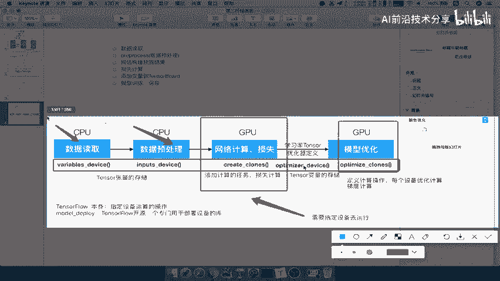

我们首先了解了为什么需要多GPU训练，并明确了CPU和GPU在训练中的不同角色：CPU负责变量存储和参数调度，GPU负责繁重的计算任务。

接着，我们梳理了标准的训练步骤，并深入探讨了如何将这些步骤与设备部署相结合。关键点在于，将数据预处理和变量定义放在CPU上，而将模型计算图定义、损失计算和梯度优化等计算密集型任务分配到各个GPU上执行。

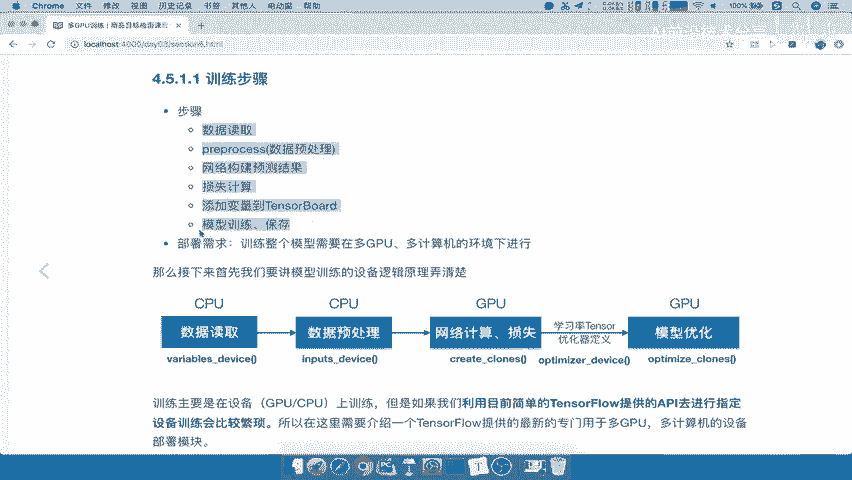

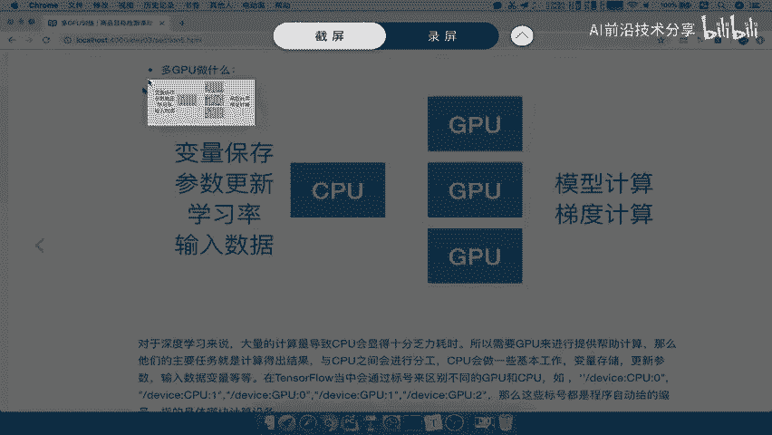

最后，我们提到可以使用TensorFlow的相关工具库来简化多设备环境下的部署和管理工作。

请务必理解并掌握文中展示的两张示意图，它们清晰地概括了多GPU训练的分工以及训练步骤与设备部署的对应关系。理解这些概念是构建高效训练管道的基础。

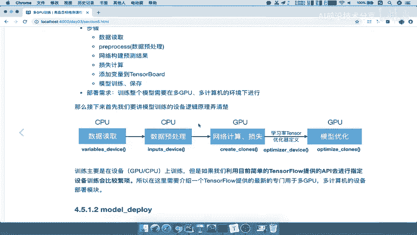

