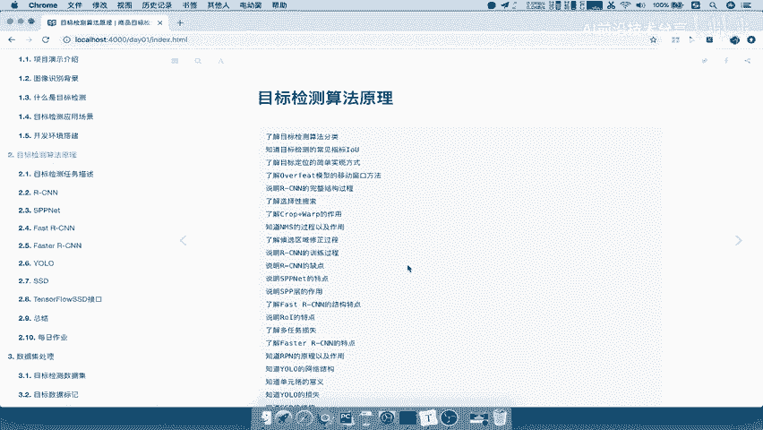
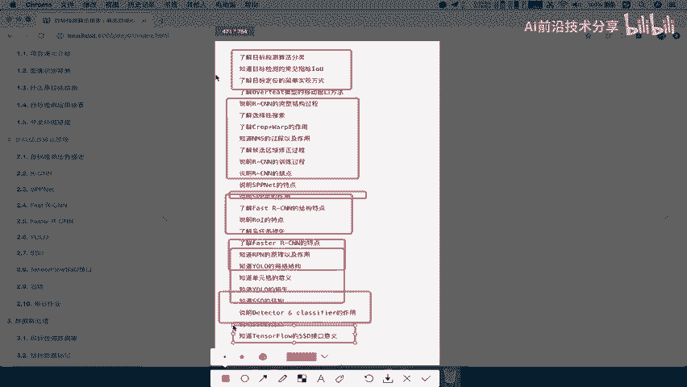
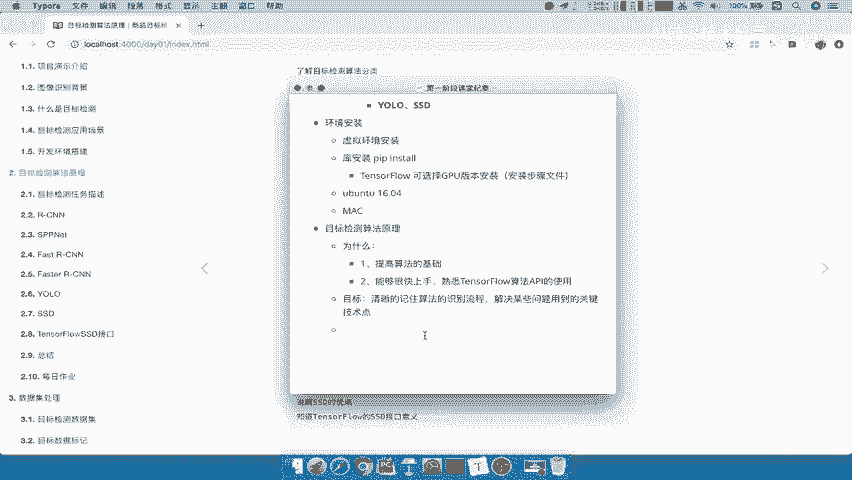

# 课程P6：目标检测算法原理铺垫 🎯

在本节课中，我们将学习目标检测算法的基础原理，为后续深入理解各类经典模型做好铺垫。我们会明确学习目标检测算法的目的，并梳理需要掌握的核心要点。

## 为什么要学习算法原理？🤔

在正式讲解具体算法之前，我们首先需要明确两个问题：为什么要学习这些算法，以及在学习过程中需要掌握到什么程度。

以下是学习目标检测算法原理的两个主要原因：

1.  **夯实算法基础**：深入理解算法的原理和过程，能让你在技术理解和应用上建立更扎实的基础，相比他人更具优势。
2.  **熟练使用开发接口**：在实际项目开发中，我们常常需要调用框架（如TensorFlow）提供的API。如果不了解底层算法，可能连API的参数含义、返回值如何使用都无法理解，更谈不上高效开发。因此，学习原理是为了能够**快速上手并熟练使用TensorFlow等框架的API**。

## 我们需要掌握到什么程度？📚

那么，学习这些算法是否意味着我们要亲手实现每一个复杂的模型呢？并非如此。在项目实践中，我们的核心目标是快速理解算法原理，并能够迅速应用于实际项目。

因此，我们的学习目标是：**清晰地掌握每个算法的识别流程，并理解其核心特点**。具体来说，你需要知道每个算法是为了解决什么问题而设计的，以及它**采用了哪些关键技术**来解决这些问题。

例如，当提到某个算法时，你应该能说出它应用了何种技术，以及该技术是如何运作的。我们的重点在于理解原理，而非从零开始编码实现。

基于以上两点，我们将快速梳理并熟悉一系列经典的目标检测算法，为后续的项目实践打下坚实的理论基础。

---

本节课中，我们一起学习了学习目标检测算法原理的必要性和应掌握的程度。我们明确了学习目的是为了夯实基础并熟练使用开发工具，同时确定了学习重点是理解算法的流程和关键技术点，而非重复造轮子。接下来，我们将正式进入具体算法的学习。