# TensorFlow 模型部署教程 P60：Model Deploy 库介绍 🚀

在本节课中，我们将学习 TensorFlow 中用于简化多设备（如多GPU）训练的 `model_deploy` 库。我们将了解其核心概念、主要组件以及基本使用方法。

## 概述

`model_deploy` 库位于 TensorFlow 的 `slim` 模块下，旨在简化在单台计算机的多个 GPU 或 CPU 上进行模型训练的操作。它通过封装设备管理和模型复制逻辑，使得多设备训练比手动管理设备更加简单。

## 核心概念介绍

上一节我们介绍了库的基本定位，本节中我们来看看其核心术语。

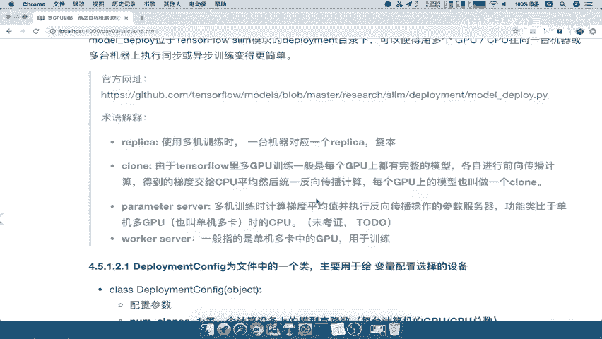

在 `model_deploy` 中，理解以下术语至关重要：

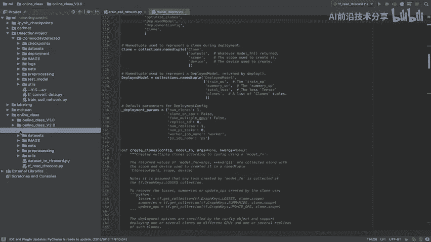

*   **Replica**：指代一台独立的机器。在单机多设备场景下，通常只有一个 Replica。
*   **Clone**：这是最关键的概念。它指的是复制到每个计算设备（如每个 GPU）上的模型副本。在多 GPU 训练中，每个 GPU 都会获得一个完整的模型克隆，用于独立进行前向和反向传播计算。梯度最终会汇总以更新主模型参数。
*   **Parameter Server** 与 **Worker Server**：在分布式多机训练场景中，Parameter Server 专门负责存储和更新模型参数变量，而 Worker Server 上的设备则负责进行计算。对于单机多 GPU 训练，我们主要关注 **Clone** 的概念。

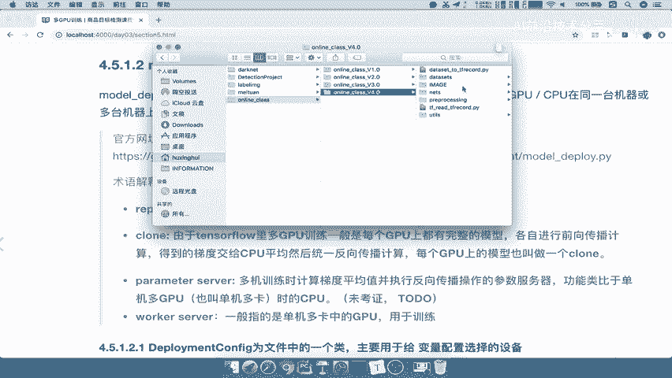

## Model Deploy 库结构

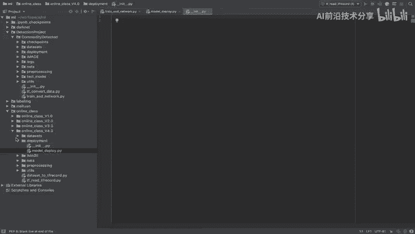

了解了核心概念后，我们来看看这个库提供了哪些主要组件。

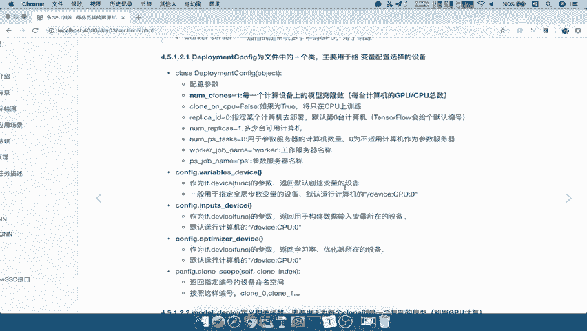

`model_deploy` 主要包含一个配置类和一些辅助函数：

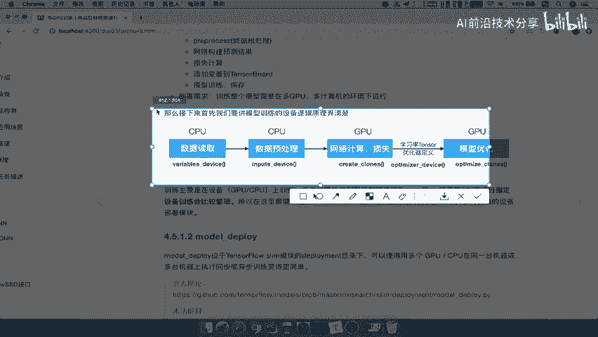

1.  **`DeploymentConfig` 类**：用于初始化和配置训练部署的环境。它指定了变量、输入数据和优化器应放置在哪个设备上。
2.  **`create_clones` 函数**：负责为每个计算设备创建模型克隆。
3.  **`optimize_clones` 函数**：负责为每个模型克隆定义优化操作（如前向传播、损失计算、梯度计算等）。

### DeploymentConfig 配置详解

以下是 `DeploymentConfig` 类中一些重要参数的介绍：

*   `num_clones`：每个 Replica（机器）上模型克隆的数量，通常等于可用的 GPU 数量。
*   `clone_on_cpu`：布尔值，指示是否在 CPU 上创建克隆（用于没有 GPU 或调试的情况）。
*   `replica_id`：当前机器的 ID，默认为 0（第一台机器）。
*   `num_replicas`：可用的机器总数。
*   `num_ps_tasks`：Parameter Server 的数量。
*   `worker_job_name` 和 `ps_job_name`：分别为 Worker 和 Parameter Server 任务指定的名称。

对于常见的单机多 GPU 训练，我们主要配置 `num_clones`（GPU数量）等前面几个参数即可。

### 设备指定方法

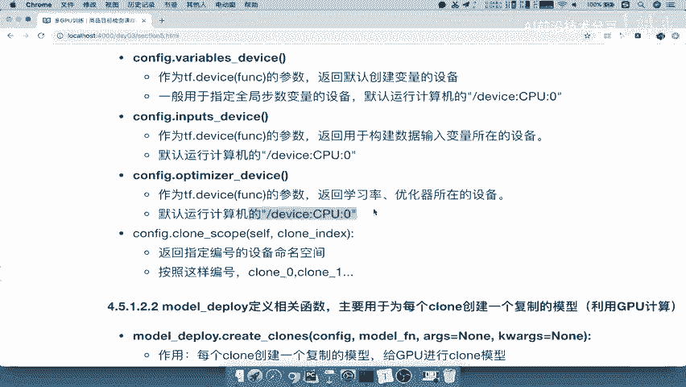

`DeploymentConfig` 还提供了指定设备的方法：

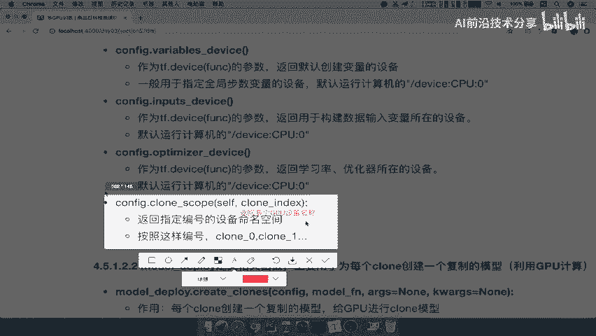

*   `variable_device()`：指定全局变量存放的设备，默认为 `CPU:0`。
*   `input_device()`：指定输入数据变量的设备，默认为 `CPU:0`。
*   `optimizer_device()`：指定优化器相关张量的设备，默认为 `CPU:0`。
*   `clone_device(clone_index)`：根据克隆索引返回对应的设备名称（如 `GPU:0`, `GPU:1`）。

例如，`clone_device(0)` 返回第一个克隆的设备名。

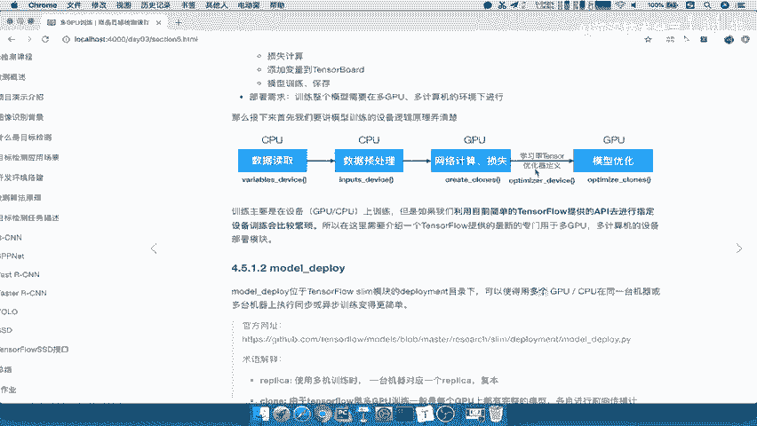

## 基本使用流程

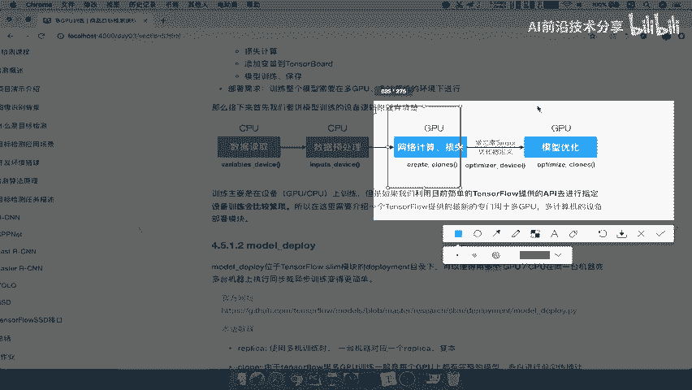

根据库源码提供的范例，使用 `model_deploy` 进行多 GPU 训练的基本流程如下：

1.  创建 `DeploymentConfig` 对象，配置克隆数量等参数。
2.  使用 `create_clones` 函数，传入配置和模型构建函数，为每个设备创建模型克隆。
3.  使用 `optimize_clones` 函数，传入克隆列表和优化器，为每个克隆定义训练操作。
4.  在训练循环中，将数据分发到各个克隆设备上执行定义好的操作。

## 总结

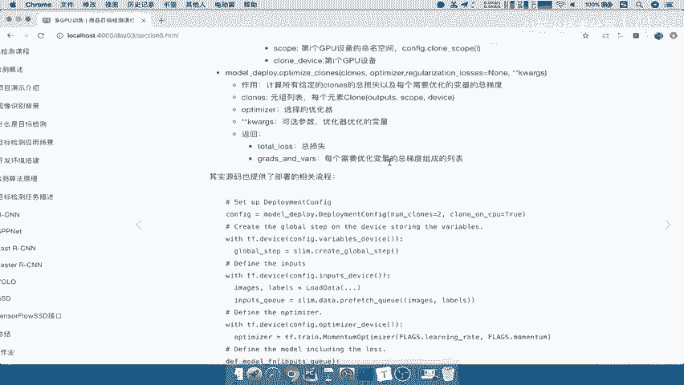

本节课中我们一起学习了 TensorFlow `slim.model_deploy` 库。我们了解了其用于简化多设备训练的目的，掌握了 **Clone** 这一核心概念，认识了 `DeploymentConfig` 配置类以及 `create_clones` 和 `optimize_clones` 两个关键函数。通过该库，我们可以更高效地组织和管理在多个 GPU 上的模型训练任务。