# 课程P61：训练运行结果显示与初始配置确定 🚀

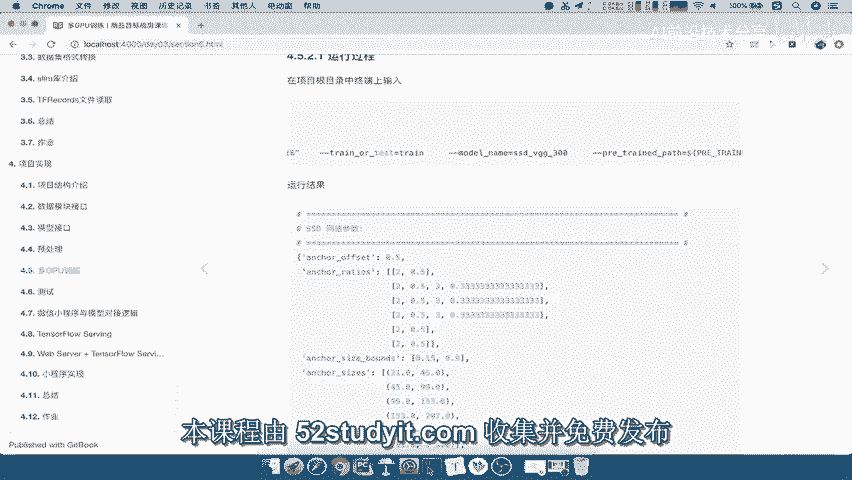

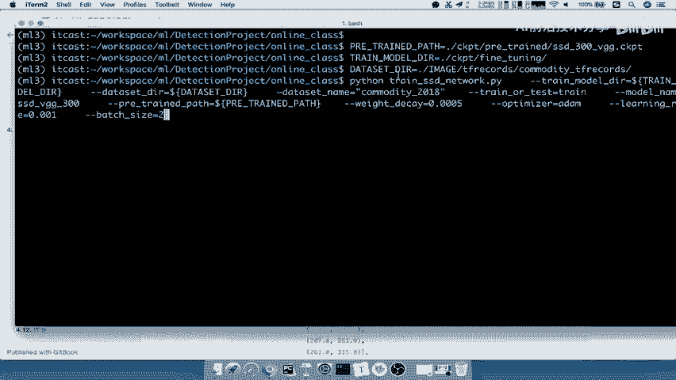

在本节课中，我们将学习如何实现SSD模型的训练过程。主要内容包括：查看训练代码的运行结果与流程，理解关键命令行参数，以及为编写训练代码进行必要的初始配置确定。

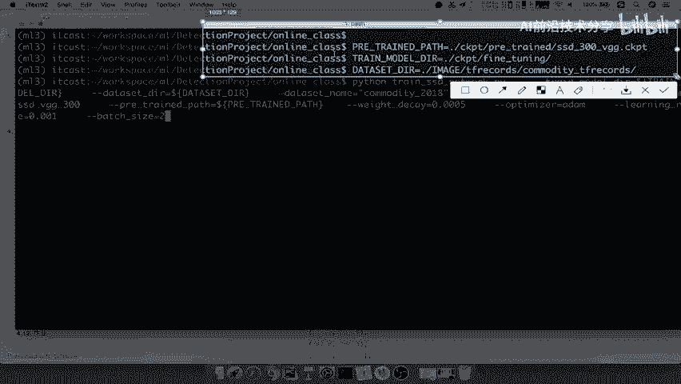

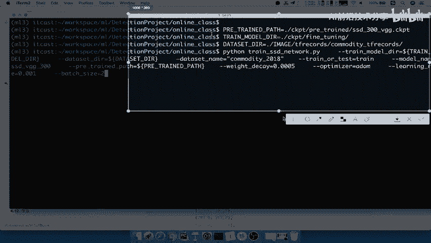

---

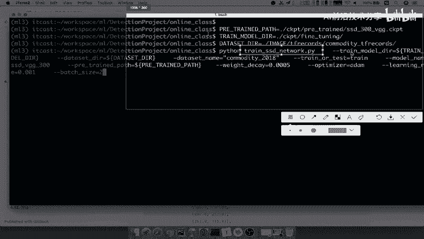

## 训练运行结果与流程展示

上一节我们介绍了训练的整体思路，本节中我们来看看具体的代码运行过程。

首先，训练代码在项目的根目录下通过命令行参数启动。

以下是运行训练的核心命令示例：
```bash
python train_ssd_network.py --pretrained_model_path=... --fine_tuning_checkpoint_path=... --dataset_dir=...
```

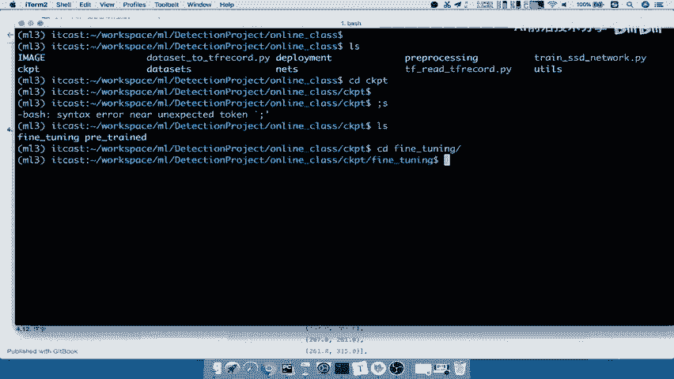

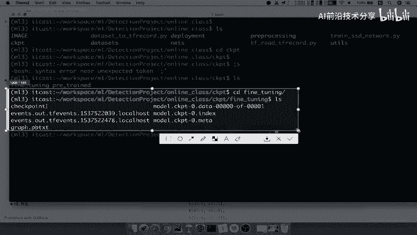

运行该命令后，控制台会打印训练过程信息。这些信息包括网络参数（如SSD模型中的长宽比）和训练数据文件的路径。

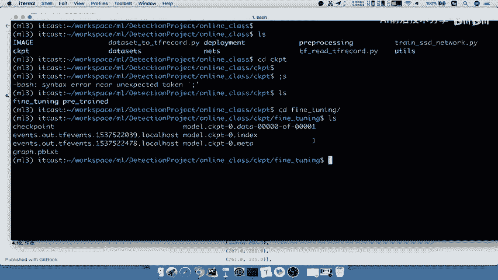

程序会首先尝试从微调检查点目录（`fine_tuning`）读取参数。如果该目录为空，则从预训练模型（`pretrained`）中读取参数。随后，训练过程开始，模型会按步骤进行迭代。

训练过程中，控制台会打印每一步的全局步数（`global step`）和每秒步数等信息。`Summary`信息也会在特定步数（例如第5步）被保存。

由于训练耗时较长（尤其在仅使用CPU的环境下），我们可以使用 `Ctrl+C` 中断训练。

训练中断或完成后，生成的模型文件会保存在指定目录。在项目根目录的 `ckpt` 文件夹下：
*   `pretrained/`：存放预训练模型文件。
*   `fine_tuning/`：存放本次训练（微调）过程中保存的模型检查点，所有更新的参数都保存在这里。

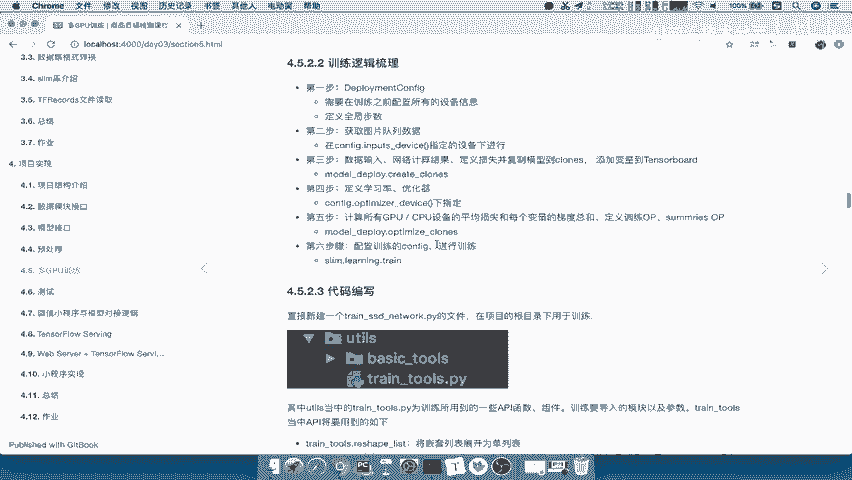

---

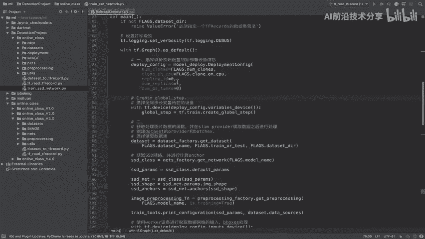

## 训练逻辑梳理与项目结构

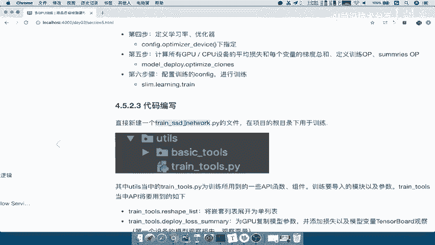

了解了运行流程后，我们接下来梳理训练的逻辑步骤，并查看项目代码结构。

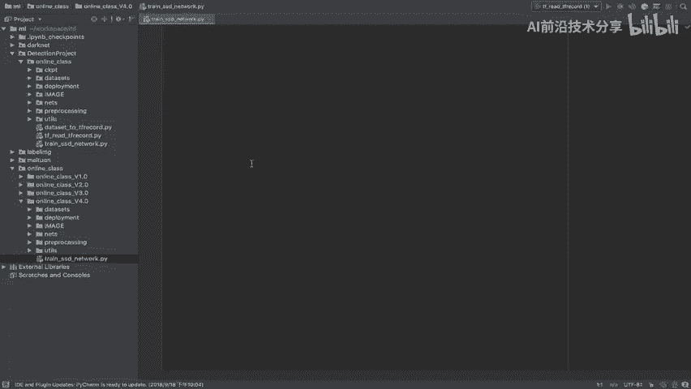

完整的训练逻辑可以梳理为以下几个步骤：

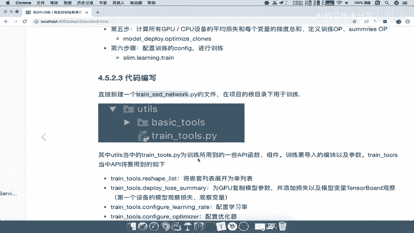

1.  **设备与全局配置**：配置训练环境（如GPU数量），并定义记录训练进度的全局步数。
2.  **获取数据队列**：读取并准备图片数据输入队列。
3.  **构建计算图**：将数据输入网络进行计算，定义损失函数，并将模型复制到每个GPU设备上。同时，添加变量观察器到TensorBoard。
4.  **定义学习率与优化器**：设置动态学习率策略和模型优化器。
5.  **执行训练操作**：利用优化器计算梯度，更新模型参数以最小化损失，并计算平均损失。该步骤会返回训练操作（`train_op`）和汇总操作（`summary_op`）。
6.  **启动训练**：最后，使用 `tf.train.Supervisor` 或类似API配置会话（`CONFIG`），并调用 `slim.learning.train` 启动训练循环。

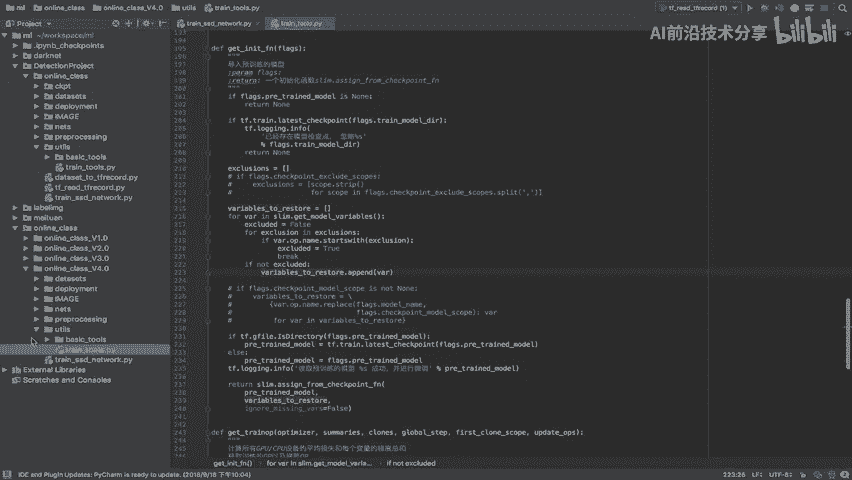

这个流程与我们之前讨论的通用训练流程是一致的。

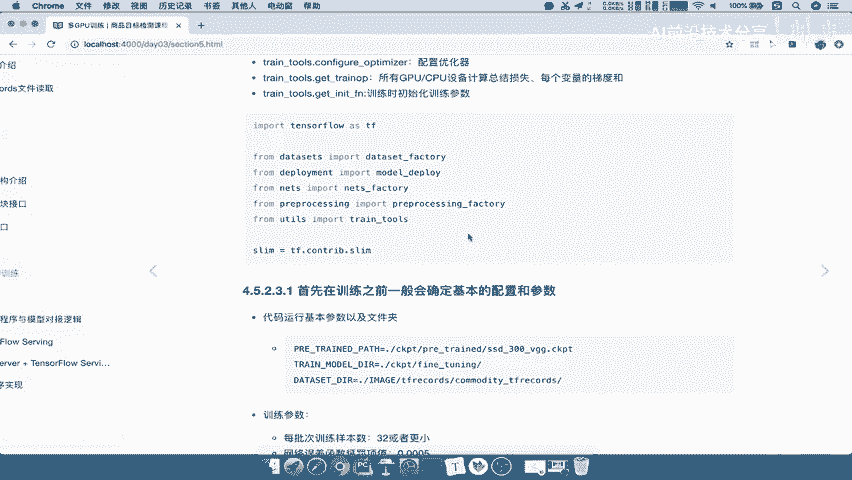

接下来，我们查看项目代码结构。我们从 `3.0` 版本复制一份到 `4.0` 版本作为基础。关键的训练逻辑代码文件如下：
*   `train_ssd_network.py`：训练主脚本，包含参数配置和训练主循环。
*   `utils/train_tools.py`：存放训练所需的公共工具函数，如形状变换、多GPU模型复制、学习率配置等。

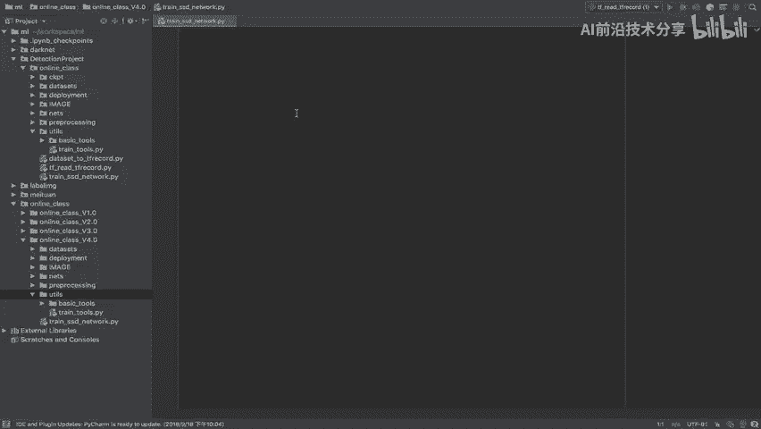

---

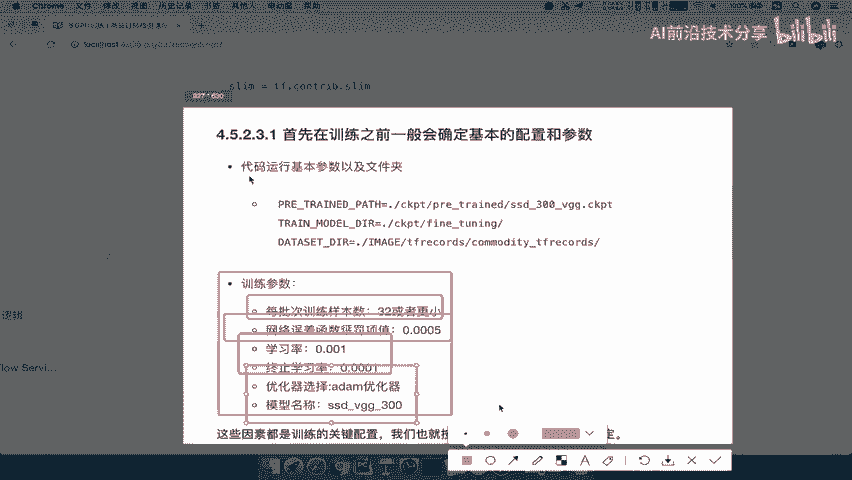

## 训练初始配置确定

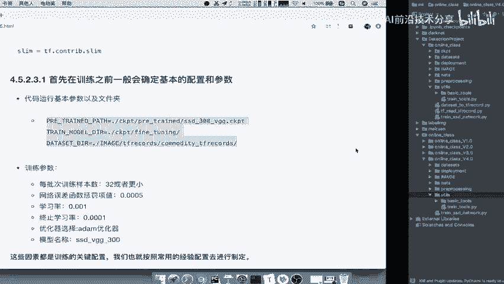

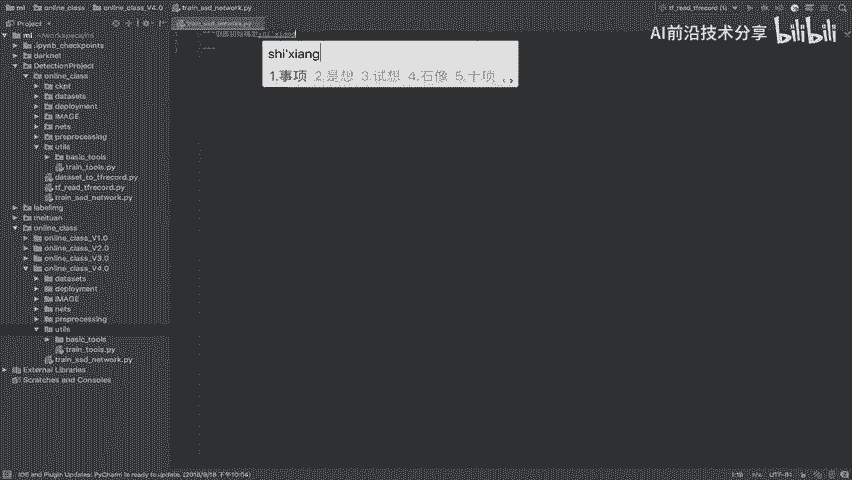

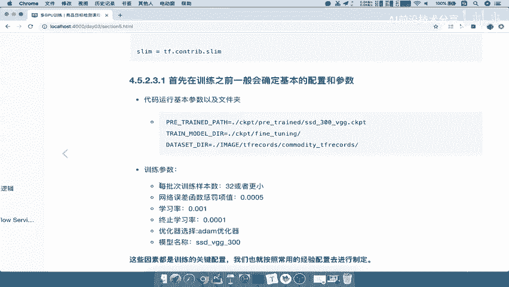

在开始编写训练代码之前，我们必须先确定一些核心的初始配置。这些配置通常分为两类：路径参数和训练超参数。

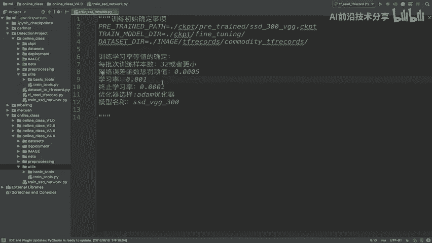

以下是需要确定的关键配置项列表：

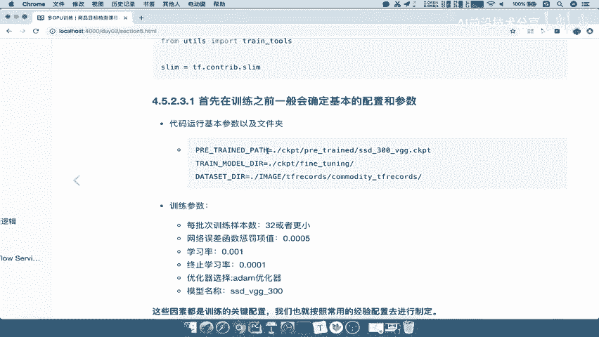

*   **预训练模型路径** (`pretrained_model_path`)：用于微调的基础模型存放位置。
*   **微调输出路径** (`fine_tuning_checkpoint_path`)：训练过程中保存的检查点文件输出目录。
*   **数据集目录** (`dataset_dir`)：训练数据（TFRecords格式）的存放位置。
*   **批次大小** (`batch_size`)：每次迭代训练所使用的样本数量。
*   **权重衰减系数** (`weight_decay`)：用于防止模型过拟合的L2正则化惩罚项系数。
*   **初始学习率** (`learning_rate`) 与 **最终学习率** (`end_learning_rate`)：定义学习率衰减的起止值。
*   **优化器选择** (`optimizer`)：如 `Adam`、`Momentum` 等。
*   **模型名称** (`model_name`)：所使用SSD模型的变体名称（如 `ssd_300`）。

这些参数的值并非随意设定，而是参考了社区经验（例如谷歌在原始论文中使用的数值）和常见实践。我们将根据这些配置创建或确认相应的文件夹结构。

例如，在项目根目录下，我们需要建立 `ckpt` 文件夹，并在其下创建 `fine_tuning` 和 `pretrained` 两个子目录，分别用于存放微调输出和预训练模型。

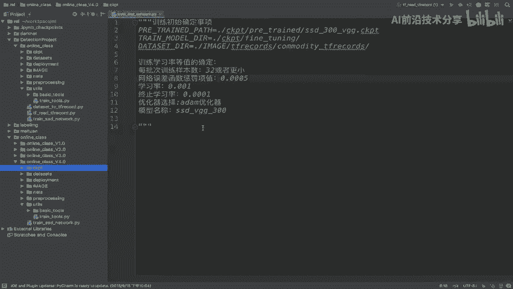

---

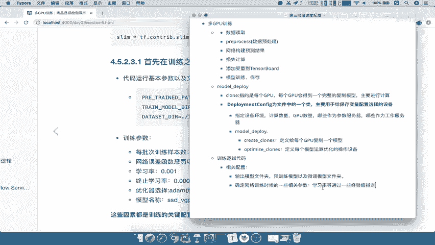

本节课中我们一起学习了SSD模型训练的完整运行流程，梳理了从数据输入到模型更新的代码逻辑步骤，并明确了在编写训练代码前必须确定的各项初始配置（包括路径和超参数）。这些准备工作是成功实现模型训练的基础。