# 课程P62：设备配置与全局步数定义 🛠️

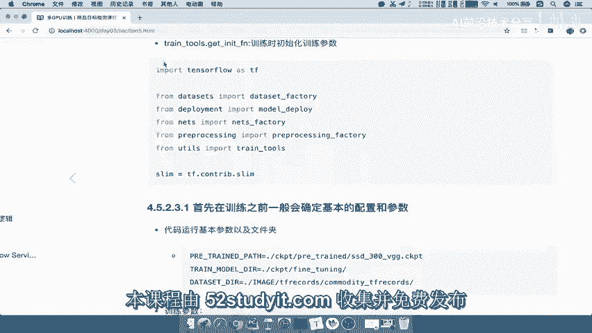

在本节课中，我们将学习如何为分布式训练配置计算设备，并定义用于记录训练进度的全局步数。这是构建一个完整训练流程的第一步。

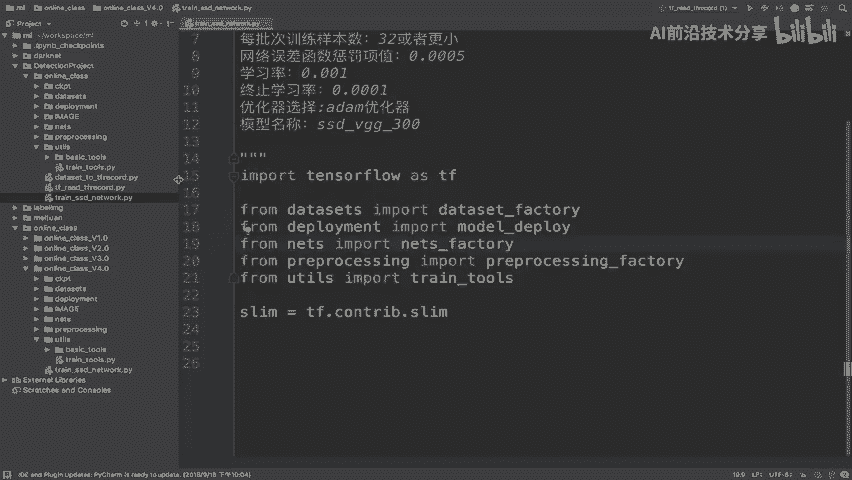

## 概述

我们将按照一个清晰的步骤来编写代码。每个步骤的内容都比较多，因此我们将逐一进行。本节课程对应第一个步骤：配置部署参数和定义全局步数。

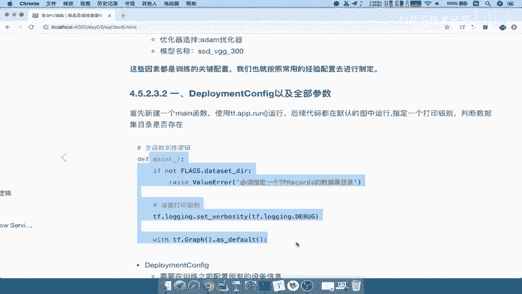

## 第一步：导入必要的库

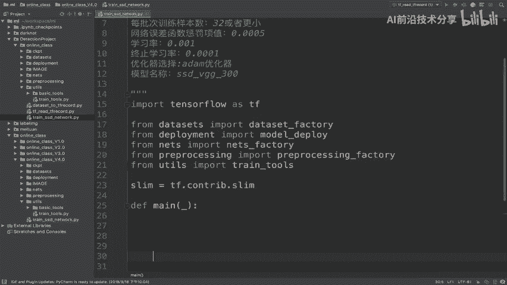

首先，我们需要将所有必需的库导入到代码中。

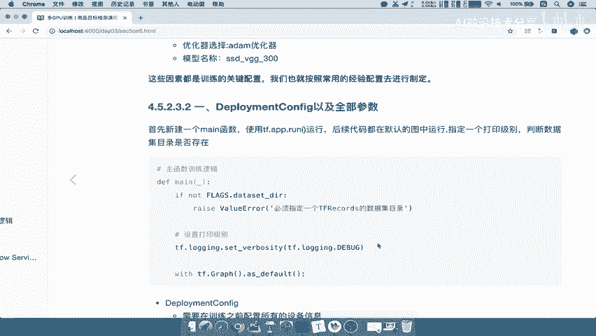

```python
import tensorflow as tf
```

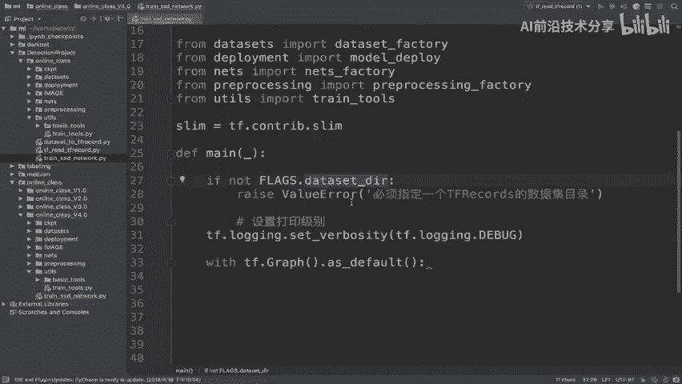

接下来，我们从预定义的模型接口中导入参数。这些参数，包括模型文件夹的名称，都必须明确指定。

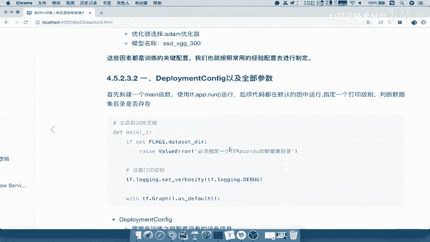

```python
# 假设从某个模块导入预定义的参数
from config import model_params
```

## 第二步：定义主函数结构

我们将定义一个主函数。在TensorFlow中，通常使用 `tf.app.run()` 来启动程序，它会调用我们定义的 `main` 函数。

```python
def main(_):
    # 主函数逻辑将在这里编写
    pass

if __name__ == '__main__':
    tf.app.run(main)
```

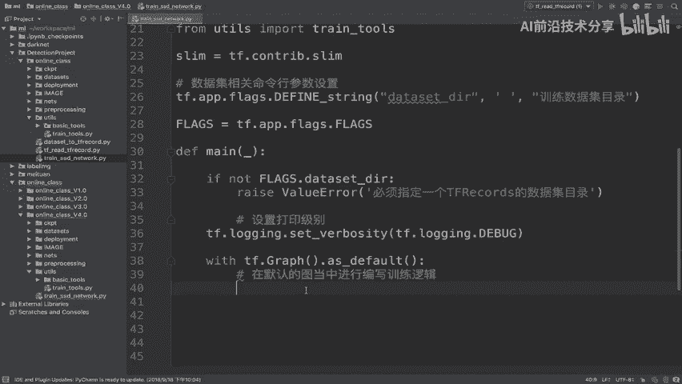

在 `main` 函数中，我们将编写主要的训练逻辑。一开始，我们可以进行一些基础配置，例如检查文件夹是否存在或设置日志打印级别。

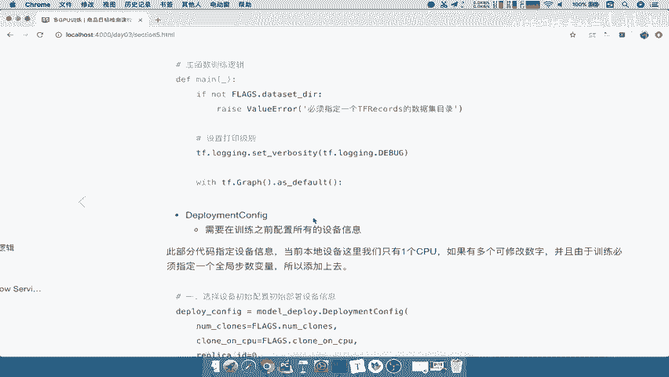

```python
def main(_):
    # 基础配置：设置日志级别等
    tf.logging.set_verbosity(tf.logging.INFO)
    # 检查数据目录等逻辑...
```

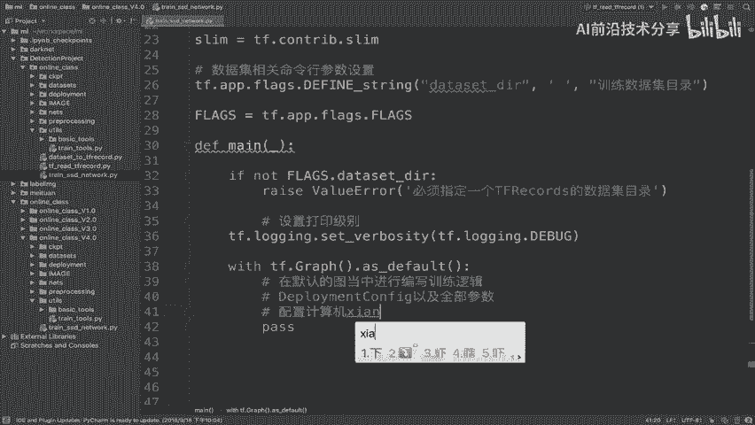

## 第三步：配置命令行参数

我们需要配置一些通过命令行传入的参数，例如数据集目录。

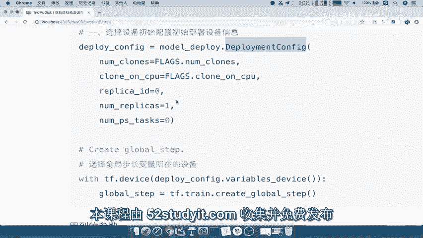

以下是数据集相关的命令行参数设置：

```python
# 定义数据集目录参数
tf.app.flags.DEFINE_string(
    'dataset_dir',
    '',
    '训练数据集目录'
)
```

同样地，我们也需要配置设备相关的参数。

以下是设备相关的命令行参数配置：

```python
# 定义可用GPU设备数量的参数
tf.app.flags.DEFINE_integer(
    'num_gpus',
    1,
    '可用设备的GPU数量'
)

# 定义是否仅在CPU上运行的参数
tf.app.flags.DEFINE_boolean(
    'clone_on_cpu',
    False,
    '是否只在CPU上运行'
)
```

我们可以通过 `tf.app.flags.FLAGS` 来获取这些在命令行中设置的值。

## 第四步：配置部署参数 (Deployment Config)

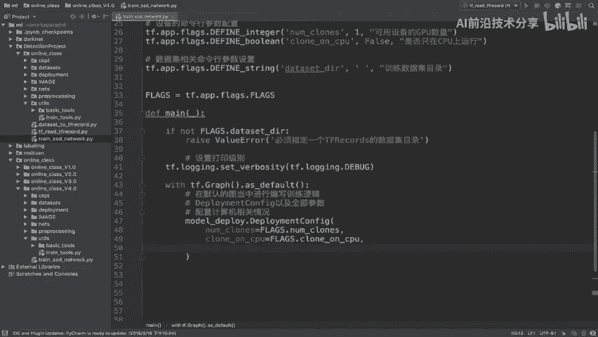

在默认的计算图中编写训练逻辑。第一步是配置 `DeploymentConfig`。

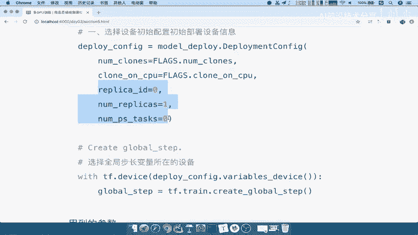

这个配置用于定义集群属性或计算资源的相关情况，例如有多少台设备、是否仅在CPU上运行、主设备的ID等。

```python
# 配置 DeploymentConfig
deploy_config = model_deploy.DeploymentConfig(
    num_clones=FLAGS.num_gpus,
    clone_on_cpu=FLAGS.clone_on_cpu,
    replica_id=0,
    num_replicas=1,
    num_ps_tasks=1
)
```

配置完成后，我们返回这个 `deploy_config` 对象，它将在后续步骤中使用。

## 第五步：定义全局步数

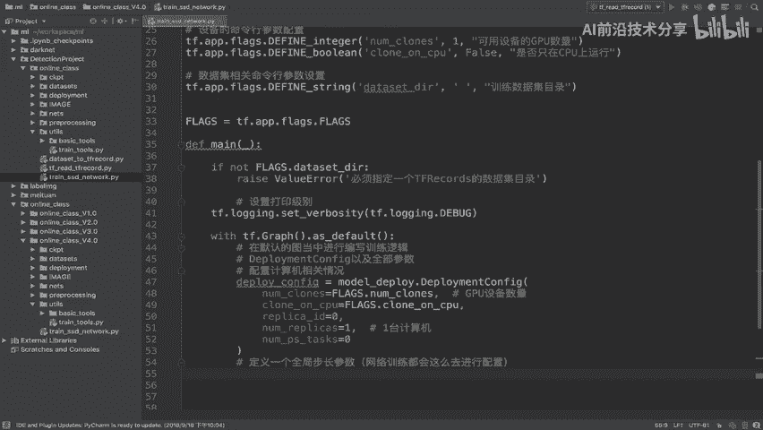

在网络训练中，通常需要定义一个全局步长变量来记录训练的总步数。这类变量参数通常会被放置在指定的设备上。

在TensorFlow中，我们可以使用 `tf.device()` 来指定变量创建的设备。我们将使用 `deploy_config` 中定义的变量放置策略。

```python
# 在指定设备上创建全局步数变量
with tf.device(deploy_config.variables_device()):
    global_step = tf.train.create_global_step()
```

这样，我们就创建了一个名为 `global_step` 的变量，用于追踪训练的全局进度。

## 总结

本节课中，我们一起完成了训练流程的第一步编写：
1.  我们导入了必要的库和参数。
2.  我们定义了程序的主函数结构。
3.  我们配置了数据集和设备相关的命令行参数。
4.  我们使用 `DeploymentConfig` 配置了分布式训练的环境。
5.  我们在指定的设备上创建了用于记录训练进度的全局步数变量。

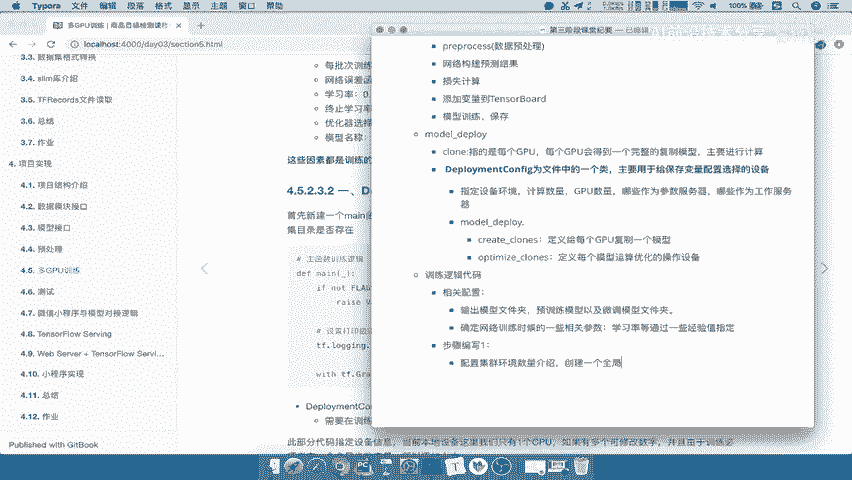

这一步为后续构建完整的训练循环奠定了基础。下一节，我们将在此基础上继续编写数据输入和模型构建的代码。