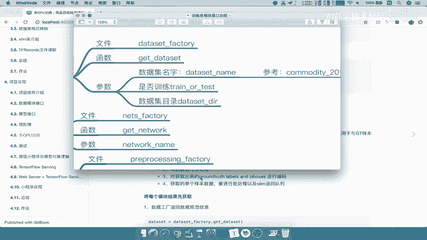
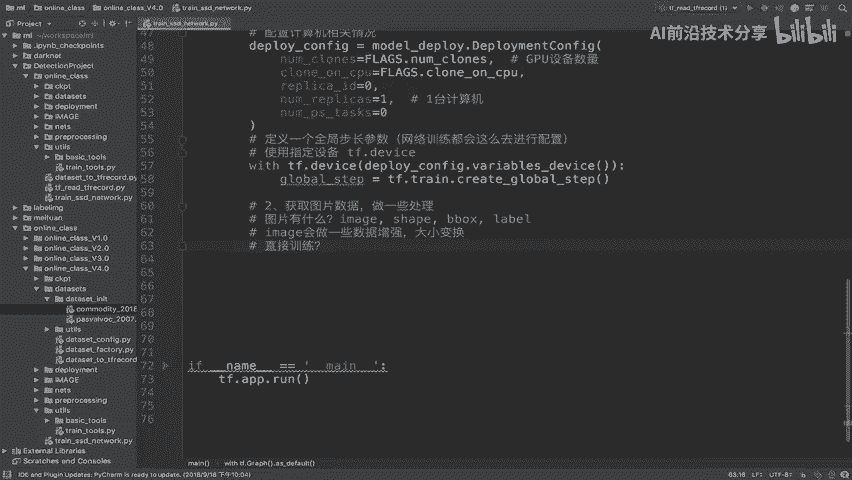
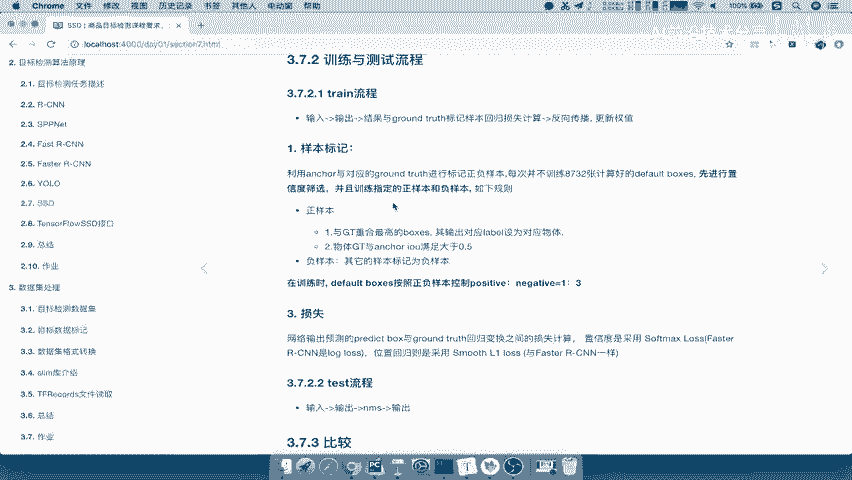
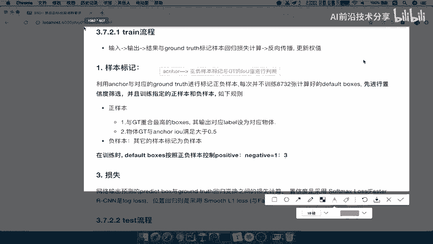
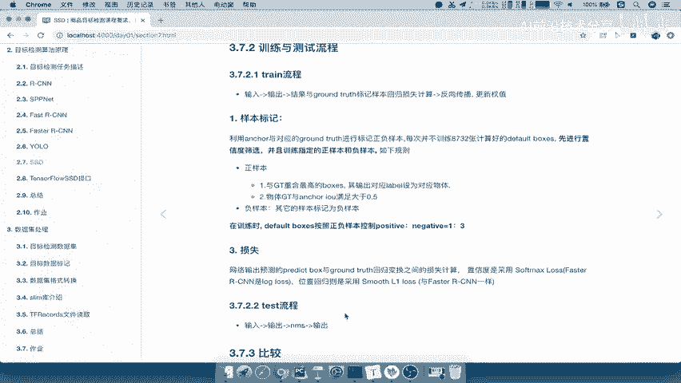
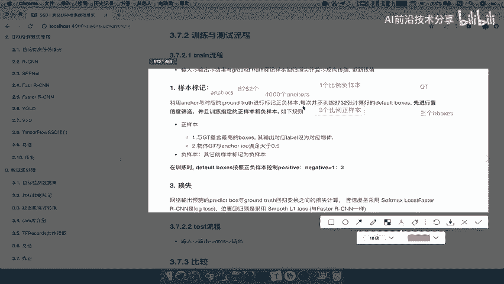
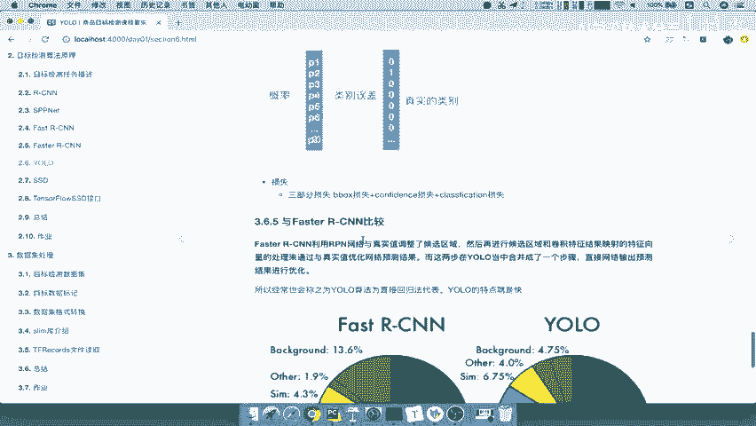
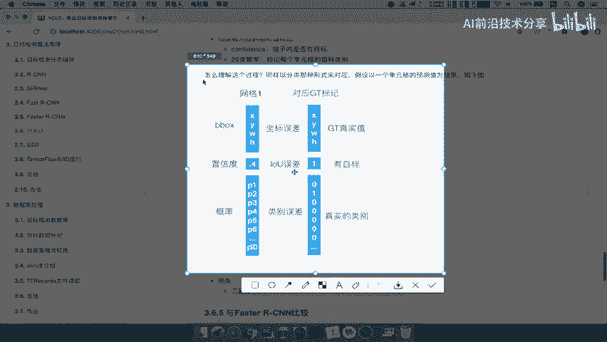
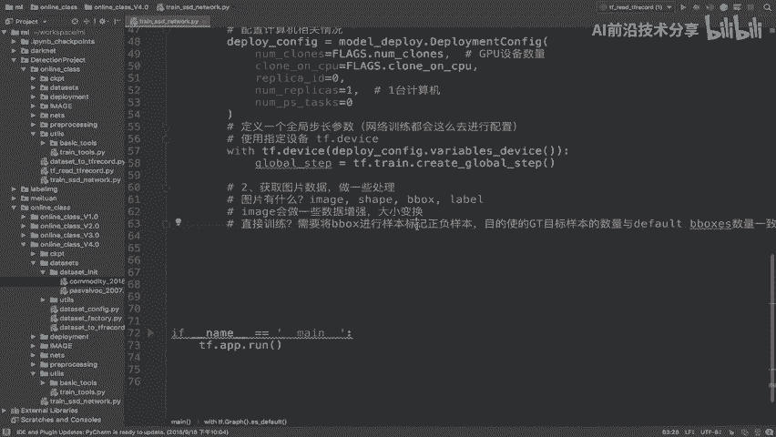
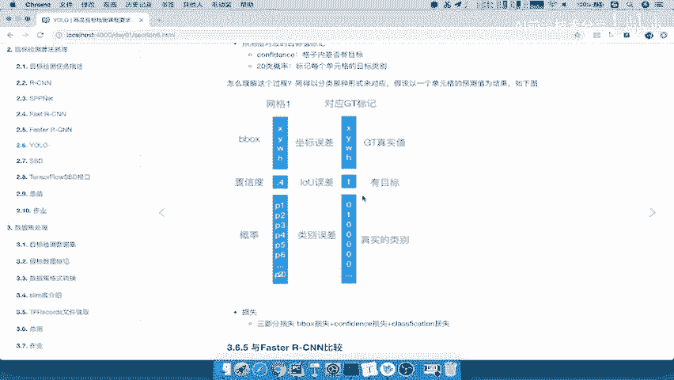

# 课程 P63：63.05_训练：图片数据读取与处理逻辑介绍 🖼️➡️🔢

在本节课中，我们将要学习SSD目标检测模型训练流程中的第二步：如何读取图片数据并进行必要的预处理。我们将重点分析从数据集中获取哪些信息，以及为什么不能直接将原始数据送入网络训练。

## 概述

上一节我们介绍了训练流程的整体步骤。本节中，我们来看看第二步的具体任务：获取图片队列数据以及处理样本标记。核心目标是理解我们需要处理哪些数据，以及为何要进行这些处理。

## 数据来源与内容

首先，我们需要明确数据从哪里来以及包含什么内容。我们的数据集模块接口是通过 `dataset_factory.get_dataset` 获取的，它返回一个符合 `DATASET` 规范的对象，其中包含了图片的相关内容。

回顾我们之前定义的数据集（以commodity2018为例），读取出来的数据包含以下几项：
*   `Image`
*   `image_shape`
*   `b_box`
*   `label`

在实际训练中，`image_shape` 和 `label` 可能不会被直接使用。因此，我们主要获取和处理的是以下三项：
1.  **Image**（图片）
2.  **b_box**（边界框）
3.  **label**（标签）

## 数据处理需求分析

获取数据后，我们不能直接将其输入网络。以下是对两类核心数据的处理需求分析。

### 图片（Image）处理

图片本身需要经过一系列变换，主要包括：
*   **形状/大小变换**：将图片调整到网络所需的固定尺寸。
*   **数据增强**：通过随机翻转、色彩抖动等方式增加数据多样性，提升模型泛化能力。

### 边界框与标签（b_box & label）处理

这是本步骤的关键。我们不能直接将原始的 `b_box` 和 `label` 送入网络训练。原因在于SSD网络的训练机制。

SSD网络会为每个特征图位置生成一系列默认的锚点框（default anchors），总数可能多达8752个。而一张图片中的真实目标框（Ground Truth， GT）数量通常很少（例如只有3个）。

这就产生了一个问题：**如何用少量的GT去计算大量锚点框的损失？**

解决方案是进行 **“样本标记”** 。这个过程的目标是：**为每一个用于训练的锚点框分配一个对应的目标值（或标记其为背景）**。

具体流程如下：
1.  计算每个锚点框与所有GT框的IOU（交并比）。
2.  根据IOU阈值，将锚点框标记为**正样本**（包含物体）或**负样本**（背景）。
3.  对于正样本锚点框，将其与最匹配的GT框进行关联。这样，每个参与训练的锚点框都有了明确的回归目标（对于正样本）或类别目标（对于负样本是背景类）。

通过这种方式，我们将**数量不匹配的原始GT框，转换成了与训练锚点框数量一致的目标张量**，从而可以逐一对位地计算损失函数。

用公式表示核心匹配原则之一：
**正样本锚点框的偏移量目标 = GT框坐标 - 锚点框坐标**

## 本节总结

本节课中我们一起学习了训练流程第二步的核心逻辑：
1.  我们从数据集中主要获取 **图片（Image）、边界框（b_box）和标签（label）** 三种数据。
2.  **图片**需要经过尺寸调整和数据增强等预处理。
3.  更关键的是对 **边界框和标签** 的处理。由于SSD网络会产生大量锚点框，必须通过**样本标记**过程，为每个训练用的锚点框分配一个对应的回归目标或背景标签，使其数量与网络输出对齐，才能进行有效的损失计算。

下一节，我们将深入代码，具体实现这些数据的读取与处理逻辑。