# 课程P64：64.06_训练：数据模块与网络模型获取结果 🧩

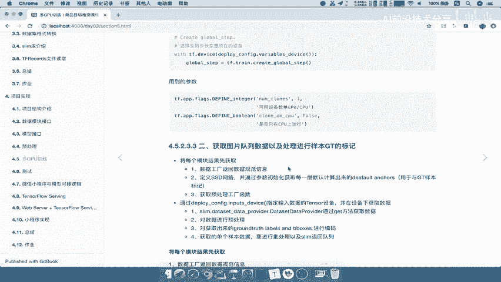

在本节课中，我们将学习如何从数据模块和网络模型中获取训练所需的关键信息。我们将分步获取数据规范、网络计算的锚框以及预处理函数，为后续的训练步骤做好准备。

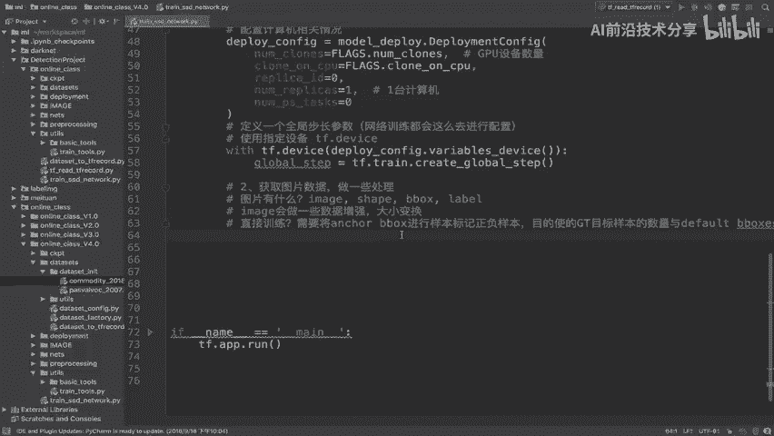

---

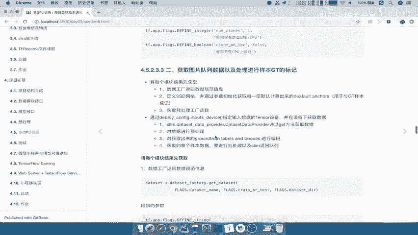

上一节我们分析了获取图片数据的需求。根据这些需求，我们需要从不同的模块中提取信息。

以下是获取每个模块结果的具体步骤：

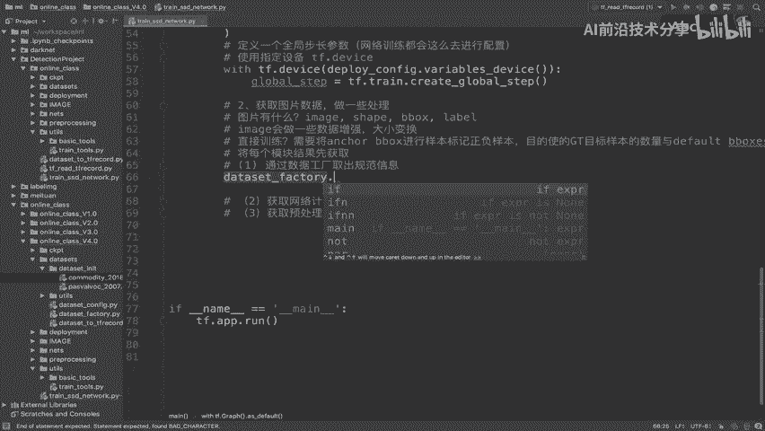

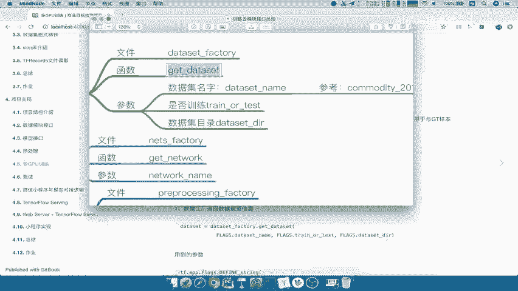

1.  **通过数据工程，取出规范信息**：我们将从数据工厂中获取图片的规范信息。
2.  **获取网络计算的锚框结果**：我们将从网络模型中获取计算出的默认锚框，用于后续的正负样本标记。
3.  **获取预处理函数**：我们将从预处理工厂中获取数据增强和预处理函数。

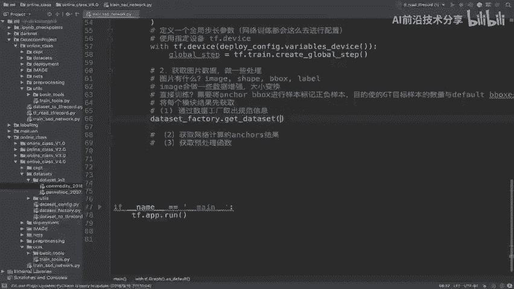

---

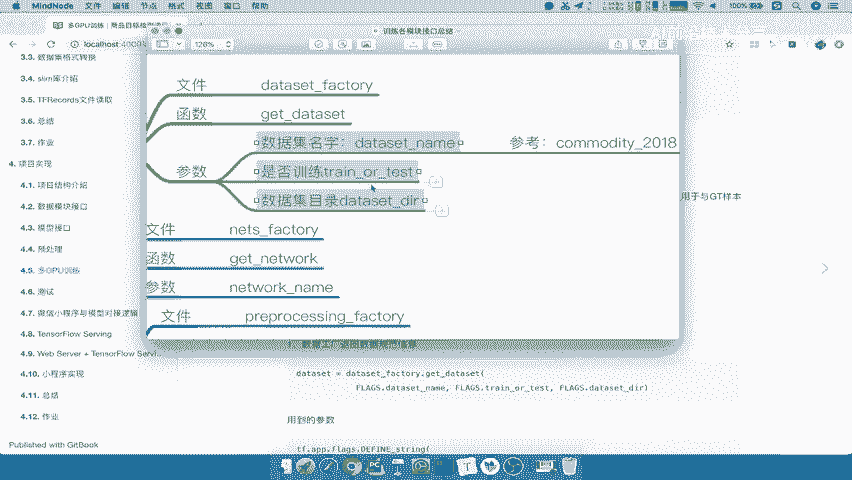

### 第一步：获取数据规范信息

首先，我们需要从数据工厂获取数据集的规范信息。我们使用 `get_dataset` 这个API。

```python
# 从命令行参数中获取数据集配置
dataset_name = flags.dataset_name  # 例如：'commodity_2018'
train_or_test = flags.train_or_test  # 例如：'train'
dataset_dir = flags.dataset_dir

# 调用数据工厂获取数据规范
dataset = dataset_factory.get_dataset(dataset_name, train_or_test, dataset_dir)
```
这里的 `dataset` 是一个数据规范对象，它描述了如何读取和处理数据，而不是数据本身。

---

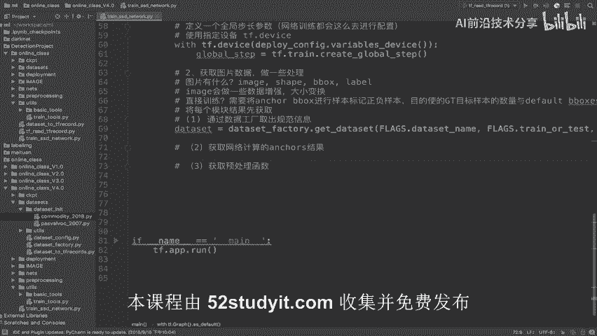

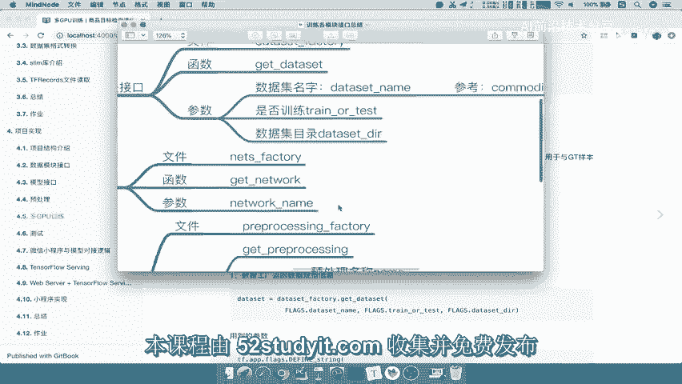

### 第二步：获取网络计算的锚框

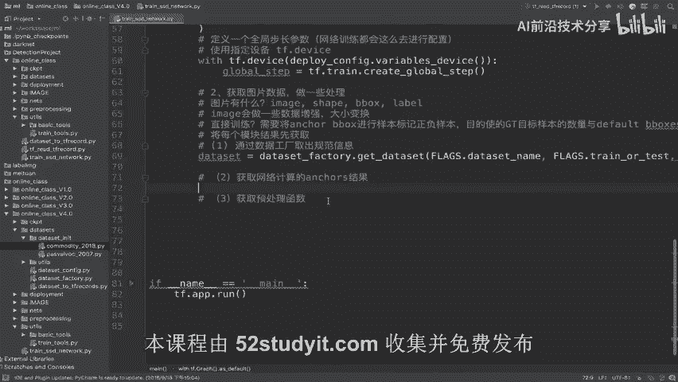

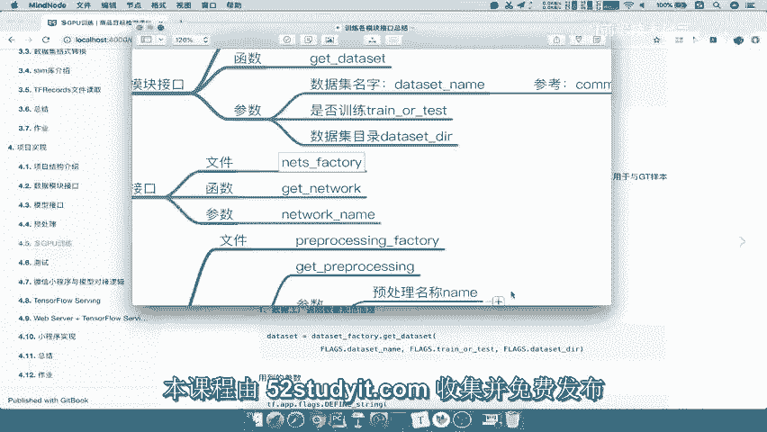

接下来，我们需要从网络模型中获取计算出的锚框。这需要我们先获取网络类，然后初始化网络并调用其锚框生成函数。

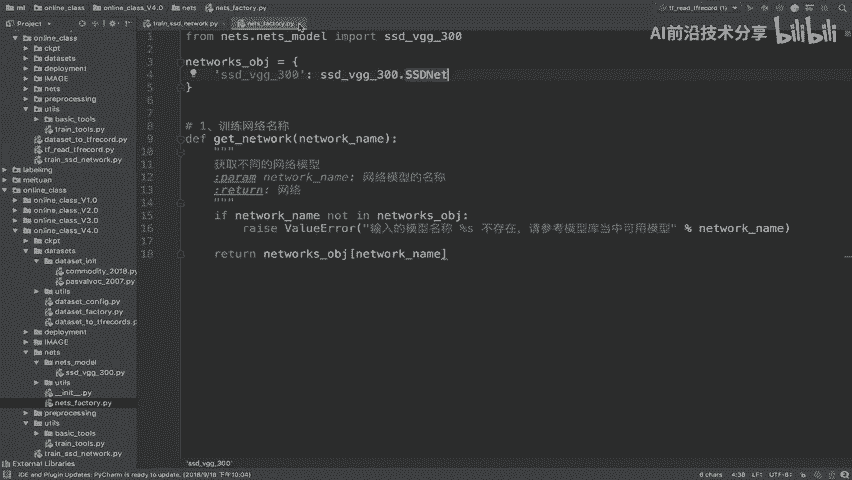

```python
# 1. 从网络工厂获取网络类
model_name = flags.model_name  # 例如：'SSD_VGG'
ssd_class = nets_factory.get_network(model_name)

# 2. 获取网络的默认参数
ssd_params = ssd_class.default_params

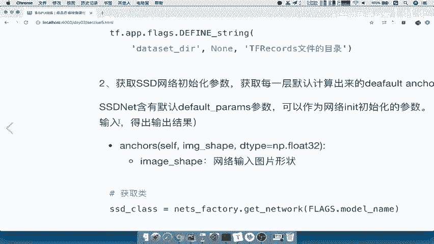

# 3. 使用默认参数初始化网络实例
ssd_net = ssd_class(ssd_params)

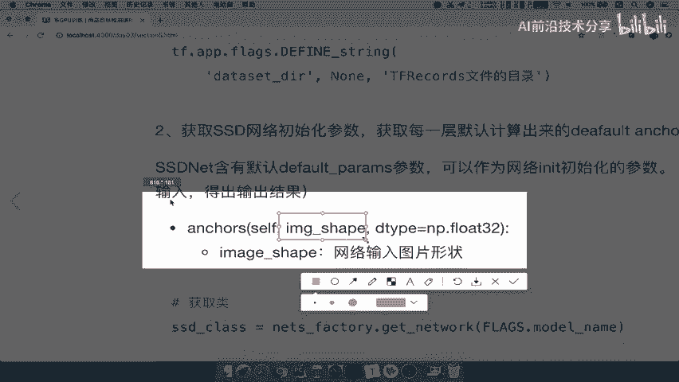

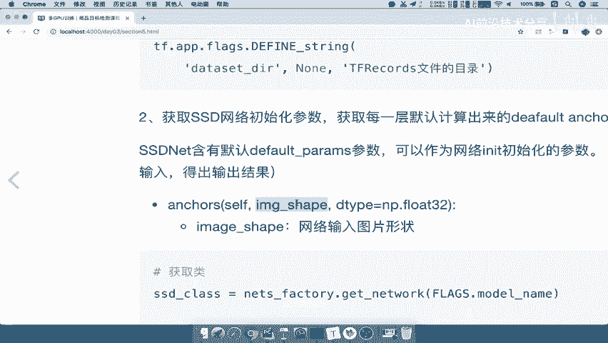

# 4. 从网络参数中获取输入图片的形状
ssd_shape = ssd_net.params.image_shape  # 例如：(300, 300)

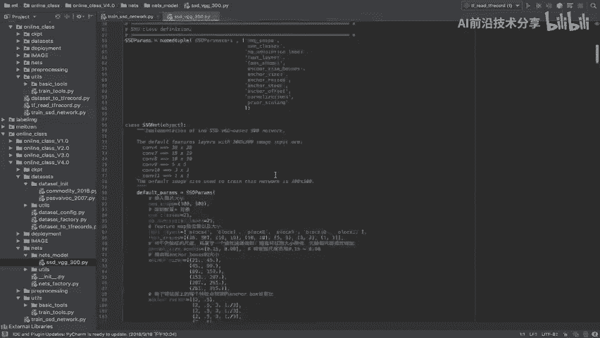

# 5. 调用网络的锚框生成函数，获取所有默认候选框
ssd_anchors = ssd_net.anchors(ssd_shape)
```
`ssd_anchors` 就是SSD网络为不同特征图层计算出的所有默认锚框，它们将用于与真实边界框进行匹配和标记。

---

### 第三步：获取预处理函数

最后，我们需要获取预处理函数。这部分逻辑通常也封装在工厂中，根据数据集名称和模式（训练/测试）返回相应的预处理管道。

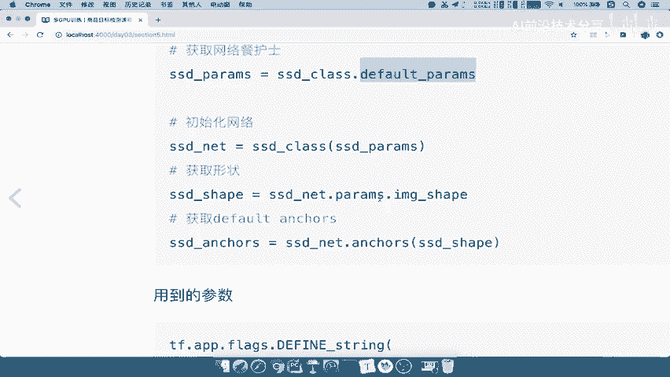

```python
# 获取预处理函数（此处为示意，具体API名称可能不同）
preprocess_fn = preprocess_factory.get_preprocess(dataset_name, train_or_test)
```
`preprocess_fn` 是一个函数，它接收原始图片和标注，并返回经过缩放、裁剪、颜色抖动等增强处理后的数据。

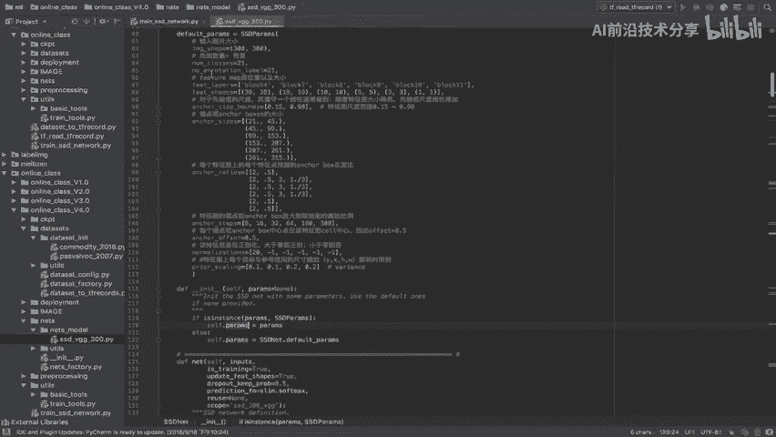

---

### 步骤总结

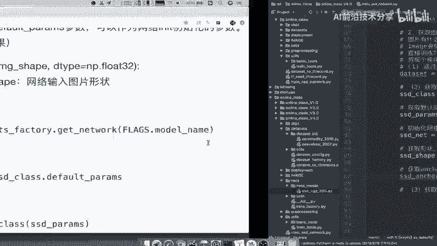

在本节中，我们完成了训练准备工作的第一步：从各个工厂模块获取核心组件。

1.  我们从 `dataset_factory` 获取了数据规范 (`dataset`)。
2.  我们从 `nets_factory` 获取了网络类，并进一步获取了网络计算出的锚框 (`ssd_anchors`)。
3.  我们从 `preprocess_factory` 获取了预处理函数 (`preprocess_fn`)。

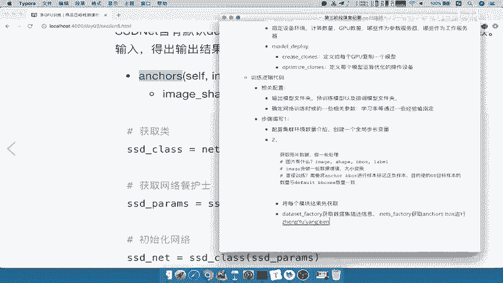

这些组件是构建数据流水线和执行训练的基础。下一节，我们将学习如何利用这些组件，实际地读取图片数据、应用预处理，并为锚框标记正负样本。