# 课程P65：网络参数修改、数据获取与预处理 🧠

在本节课中，我们将学习如何修改SSD网络的输出类别参数，并使用数据提供器（provider）从数据集中获取数据，最后对获取的数据进行预处理，为模型训练做好准备。

---

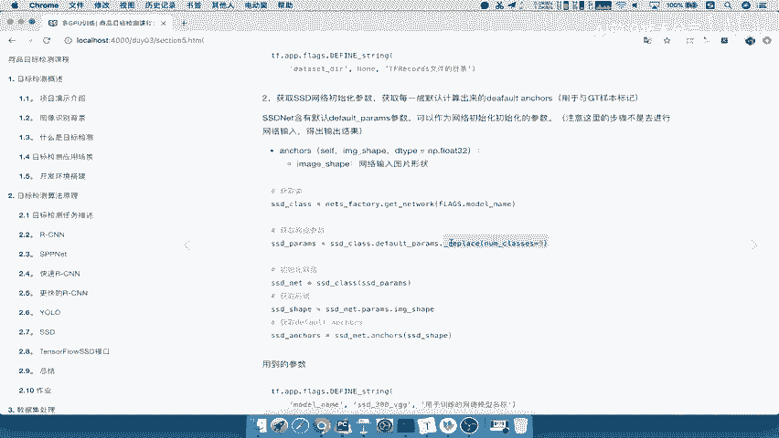

## 1. 修改网络参数 🔧

上一节我们获取了网络参数，但有一个关键参数尚未修改。现在，我们来看看如何修改它。

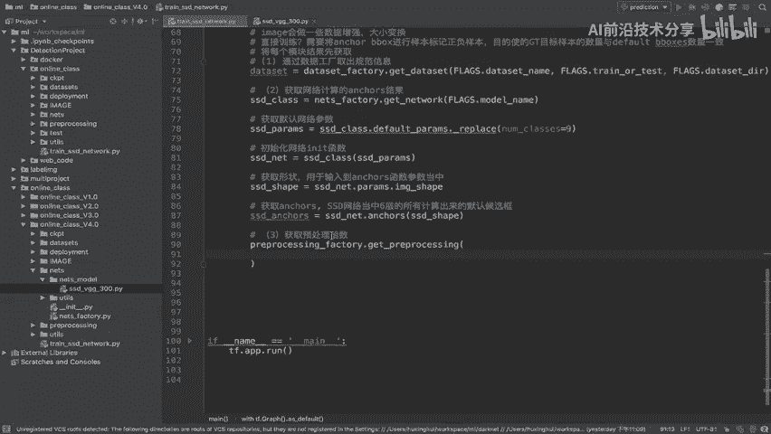

在SSD类的网络源码定义中，有一个参数叫做 `network.nb_classes`。这个参数定义了网络最终输出的类别数量。我们需要根据数据集的实际情况来修改它。

以下是修改步骤：

1.  获取默认参数 `default_params`。
2.  使用 `replace` 方法，将 `nb_classes` 参数的值修改为我们的目标类别数。
3.  对于Pascal VOC数据集，类别数为 `20`（20个物体类别）加上 `1`（背景类），因此总数为 `21`。

**代码示例：**
```python
# 修改网络输出类别数
default_params = default_params.replace(nb_classes=21)
```

完成此步骤后，网络参数的计算就正确了。

---

## 2. 获取数据预处理函数 📥

网络参数准备好后，下一步是处理数据。首先，我们需要获取数据预处理函数。

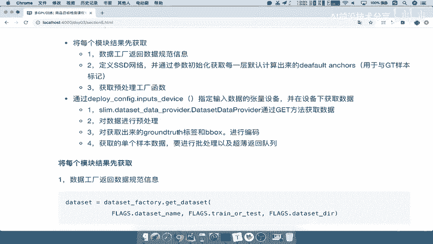

数据预处理函数存放在 `processing_factory` 模块中。我们通过调用 `get_preprocessing` 函数来获取它。

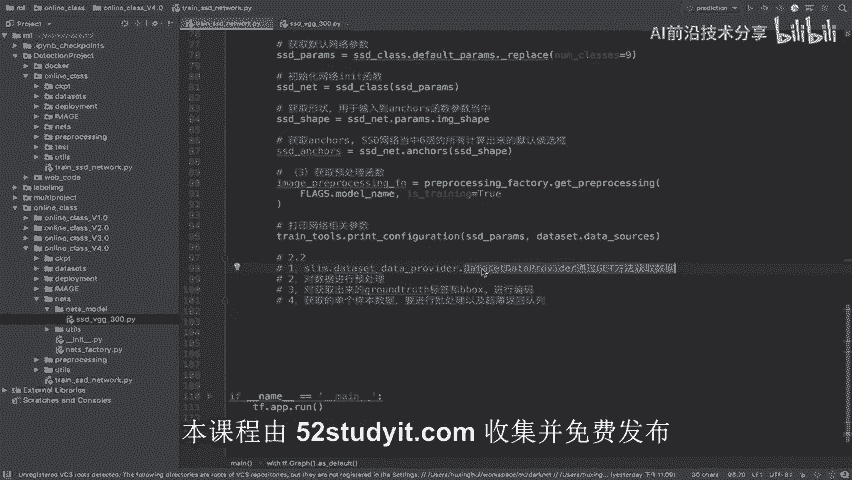

以下是获取预处理函数的步骤：

1.  第一个参数是预处理名称，它通常与模型名称相关，例如 `‘ssd_vgg’`。
2.  第二个参数 `is_training` 用于指定是否为训练模式。在本训练过程中，我们将其设为 `True`。

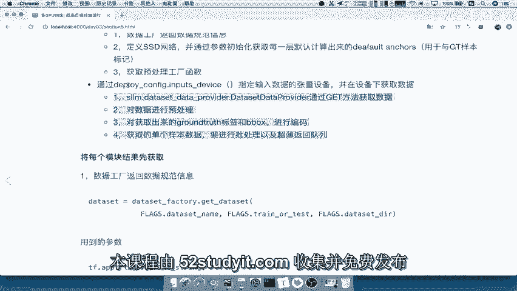

**代码示例：**
```python
# 获取数据预处理函数
image_preprocessing_fn = preprocessing_factory.get_preprocessing(
    model_name, # 例如 ‘ssd_vgg’
    is_training=True
)
```
这样，我们就得到了一个名为 `image_preprocessing_fn` 的函数，它将用于后续的数据预处理。

---

## 3. 打印网络参数 📋

在继续之前，我们可以先打印出当前的网络配置，以便确认参数设置是否正确。

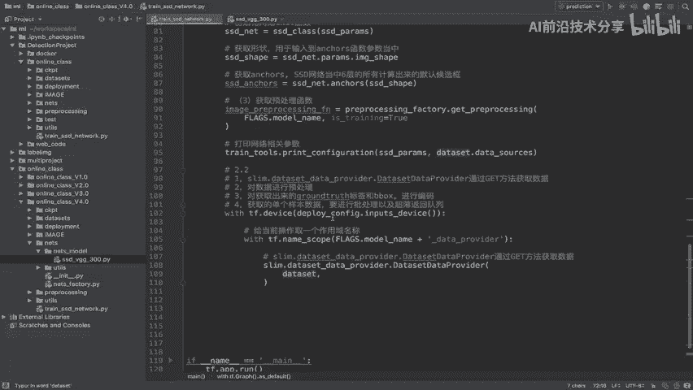

我们可以使用 `train_tools` 模块中的 `print_configuration` 函数来完成这个操作。

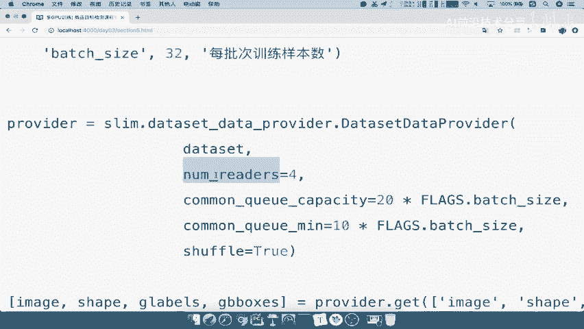

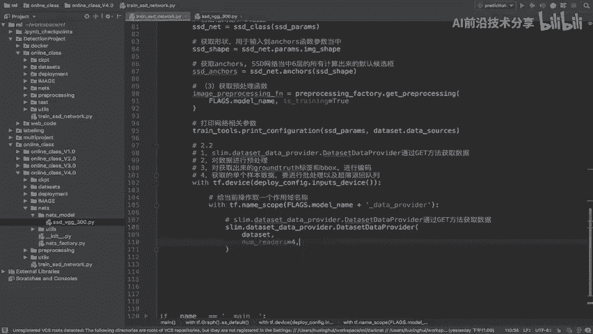

**代码示例：**
```python
# 打印网络相关参数
print_configuration(model_params)
```

---

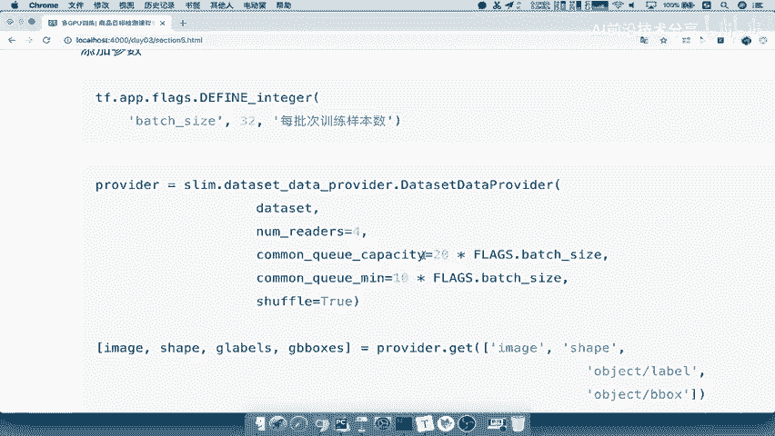

## 4. 使用Provider获取并预处理数据 🚀

现在，我们进入核心的数据处理环节。数据规范信息已经准备好，但数据本身还没有被加载。我们需要使用 `slim.dataset_data_provider` 来获取数据，并进行预处理。

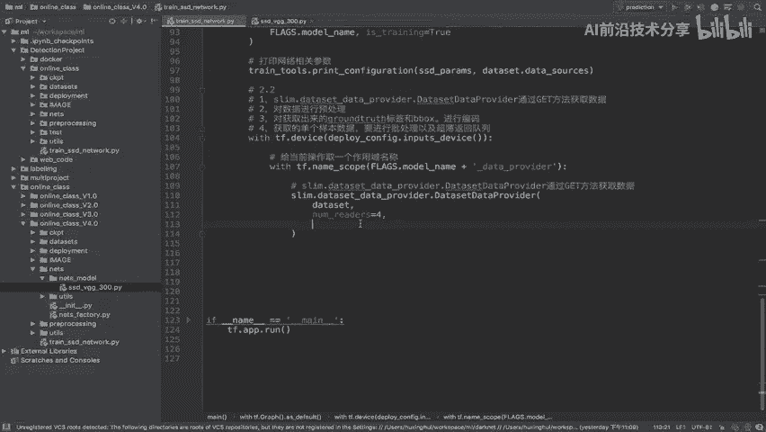

以下是完整的四个步骤，我们将逐一讲解：

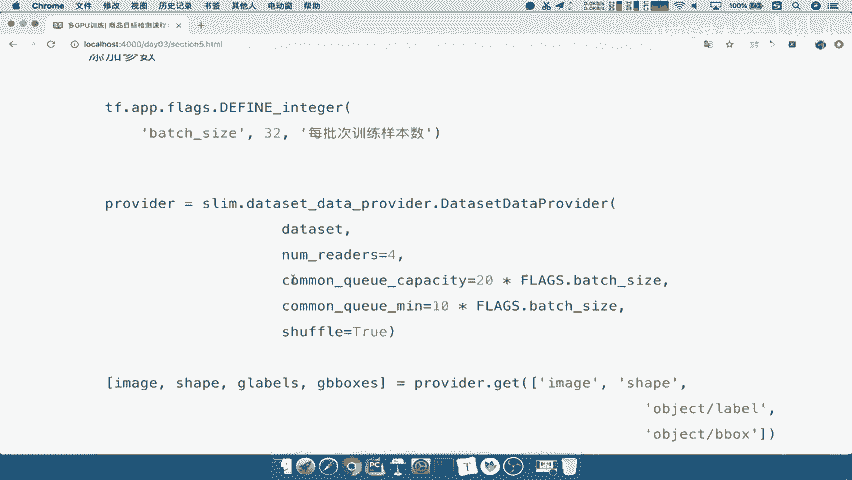

### 4.1 指定计算设备

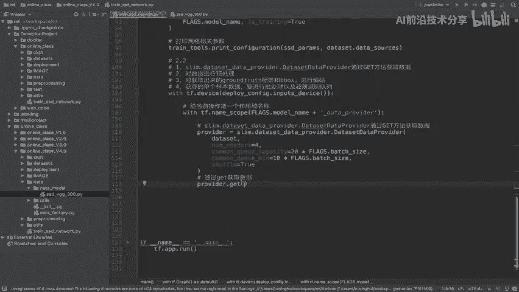

首先，我们需要指定在哪个设备上执行数据获取操作。通常，数据加载和预处理放在CPU上进行。

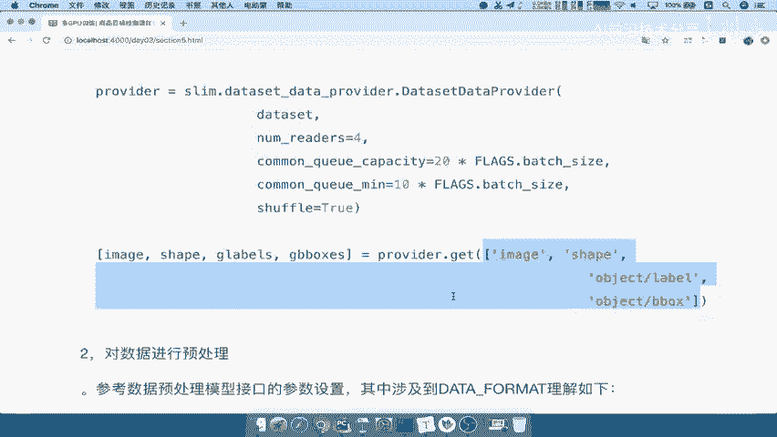

**代码示例：**
```python
with tf.device(deploy_config.input_device):
    # 在此设备下执行数据操作
```

### 4.2 创建数据提供器（Provider）

在指定的设备作用域内，我们创建一个命名空间来组织数据提供相关的操作。然后，实例化 `DatasetDataProvider` 来读取数据。

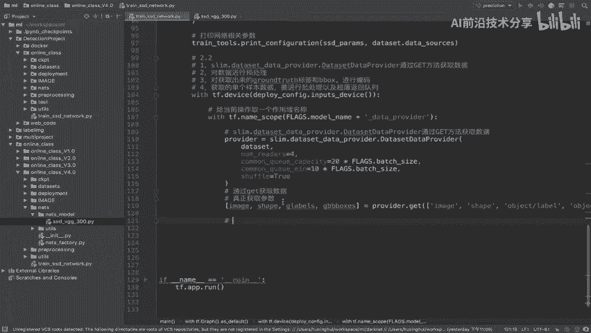

**关键参数包括：**
*   `dataset`: 数据集规范信息。
*   `num_readers`: 读取数据的线程数，例如 `4`。
*   `common_queue_capacity`: 队列容量。
*   `common_queue_min`: 队列最小容量。
*   `shuffle`: 是否打乱数据顺序。

**代码示例：**
```python
with tf.name_scope(‘data_provider’):
    provider = slim.dataset_data_provider.DatasetDataProvider(
        dataset,
        num_readers=4,
        common_queue_capacity=20 * batch_size,
        common_queue_min=10 * batch_size,
        shuffle=True
    )
```

### 4.3 从Provider获取原始数据

Provider实例化后，我们调用其 `get` 方法来获取具体的张量（tensors）。

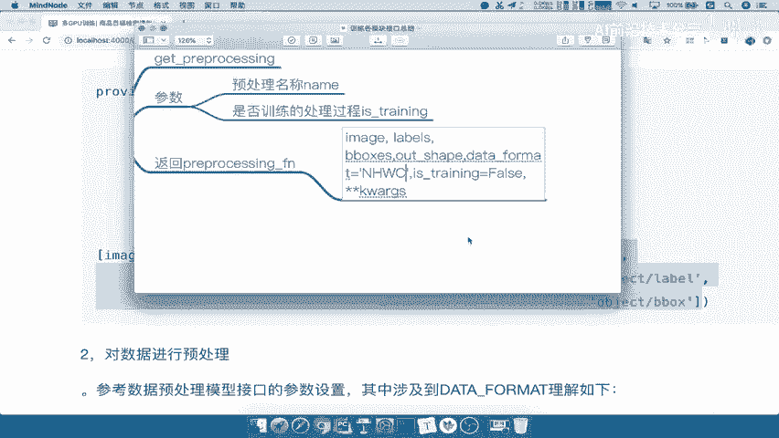

我们需要获取以下四项内容：
1.  `image`: 原始图像数据。
2.  `shape`: 图像的原始尺寸。
3.  `glabels`: 真实标签（ground truth labels）。
4.  `gbboxes`: 真实边界框（ground truth bounding boxes）。

**代码示例：**
```python
[image, shape, glabels, gbboxes] = provider.get([‘image’, ‘shape’, ‘object/label’, ‘object/bbox’])
```

### 4.4 对数据进行预处理

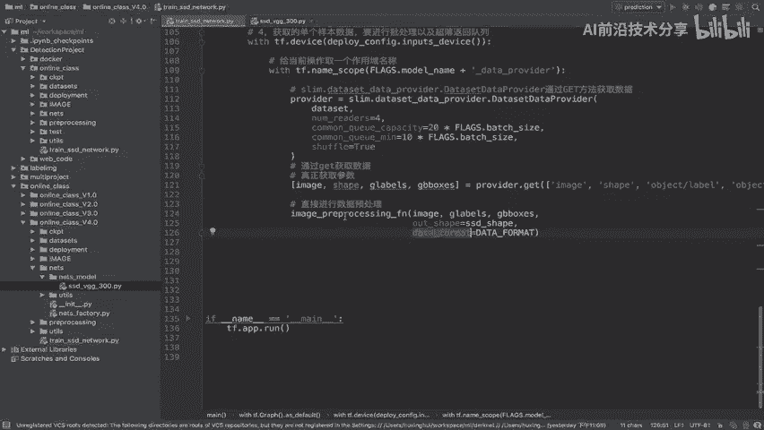

最后，我们使用之前获取的预处理函数 `image_preprocessing_fn` 来处理原始数据。


**预处理函数需要传入以下参数：**
*   `image`: 原始图像。
*   `labels`: 真实标签 (`glabels`)。
*   `bboxes`: 真实边界框 (`gbboxes`)。
*   `out_shape`: 模型期望的输入尺寸，例如 `[300, 300]`（SSD300）。
*   `data_format`: 数据格式，例如 `‘NHWC’`（批次数，高度，宽度，通道数）。

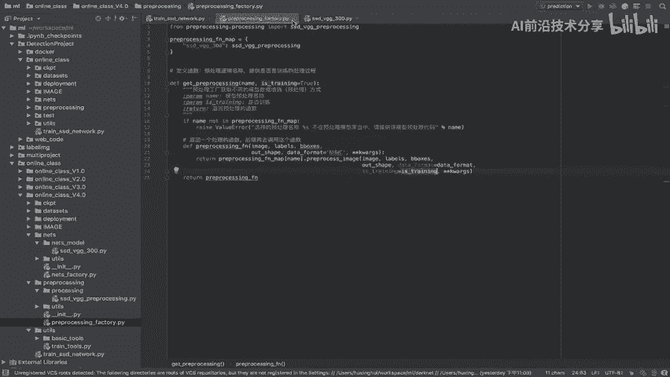

**代码示例：**
```python
# 对图像、标签和边界框进行预处理
processed_image, processed_glabels, processed_gbboxes = image_preprocessing_fn(
    image,
    labels=glabels,
    bboxes=gbboxes,
    out_shape=[300, 300],
    data_format=‘NHWC’
)
```
处理完成后，`processed_image` 的形状将变为 `[None, 300, 300, 3]`，符合SSD网络的输入要求。标签和边界框也完成了相应的转换（如归一化、数据增强等）。

---

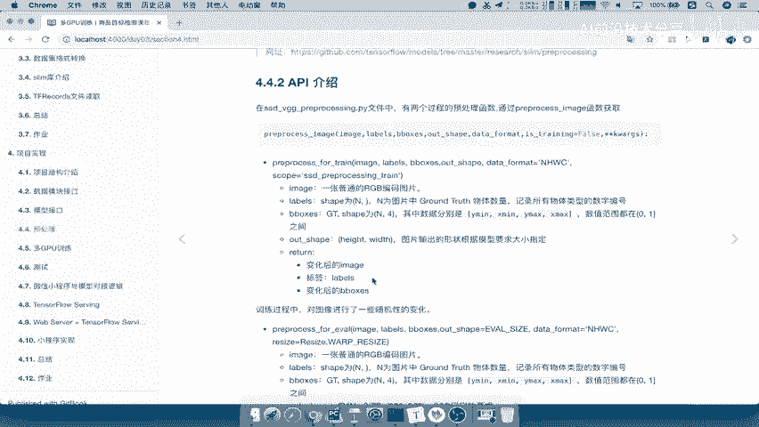

## 总结 📝

本节课中，我们一起学习了训练准备阶段的关键步骤：
1.  **修改网络参数**：调整了SSD网络的输出类别数，使其与数据集匹配。
2.  **获取预处理函数**：从工厂中获取了用于训练的数据预处理函数。
3.  **打印网络配置**：确认了当前的参数设置。
4.  **获取并预处理数据**：通过指定设备、创建数据提供器、读取原始数据并应用预处理函数，最终得到了可以直接输入SSD网络进行训练的标准化数据批次。

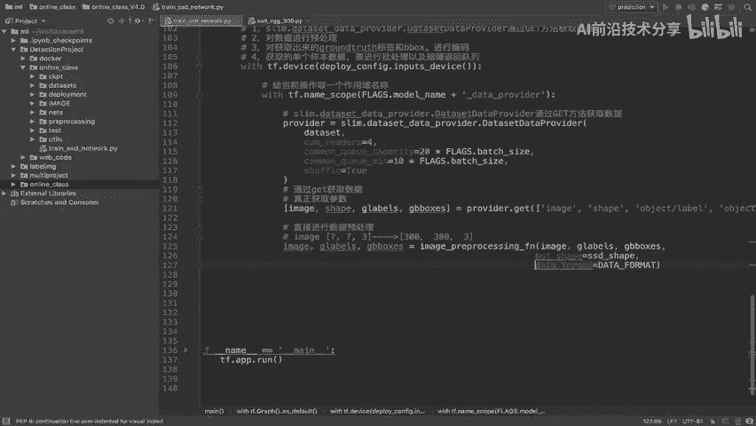

通过以上步骤，我们为模型的正式训练做好了充分的数据准备。下一节，我们将开始构建完整的训练流程。