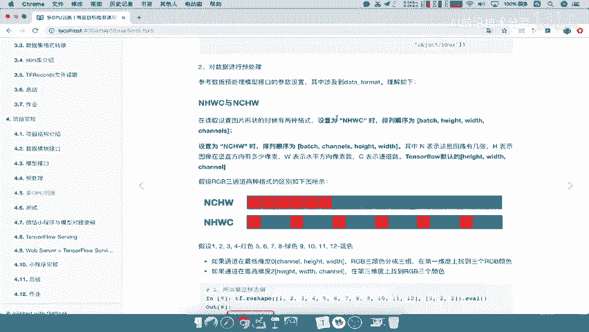
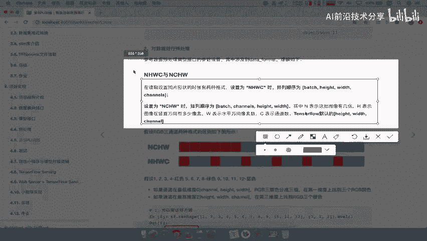
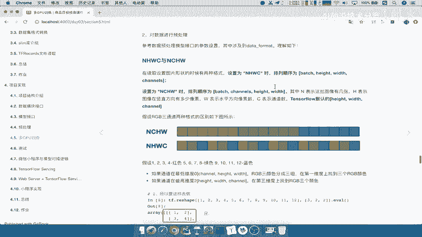
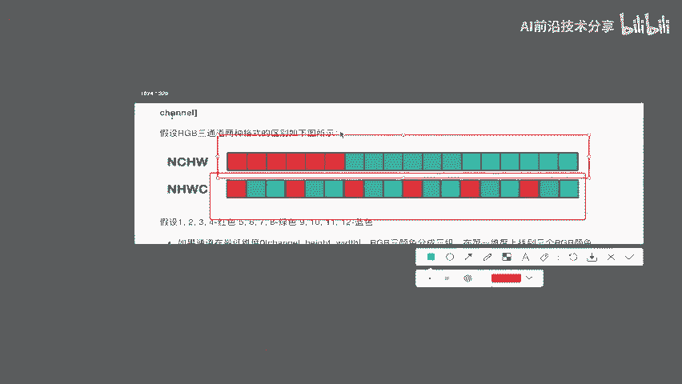
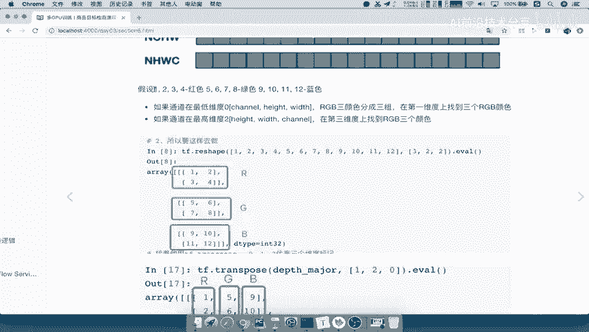
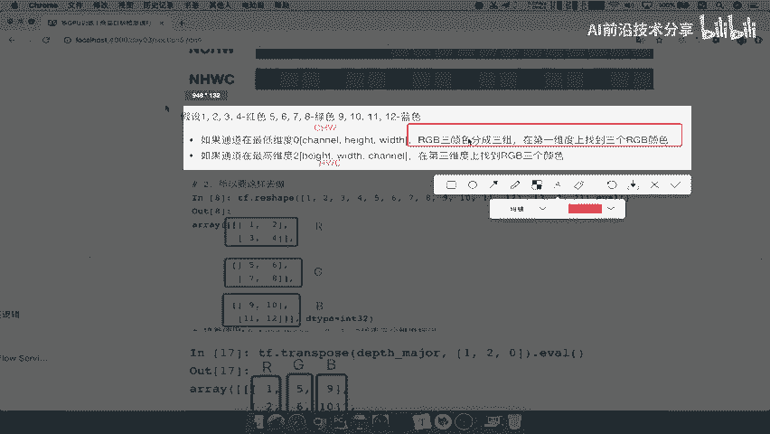
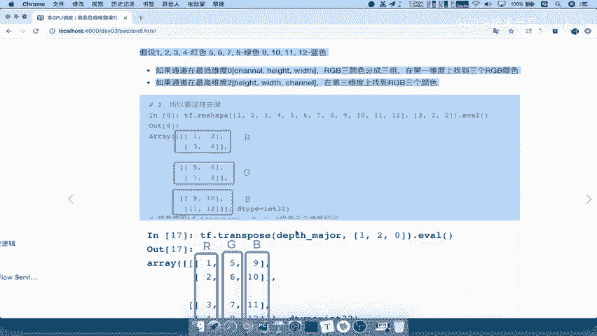
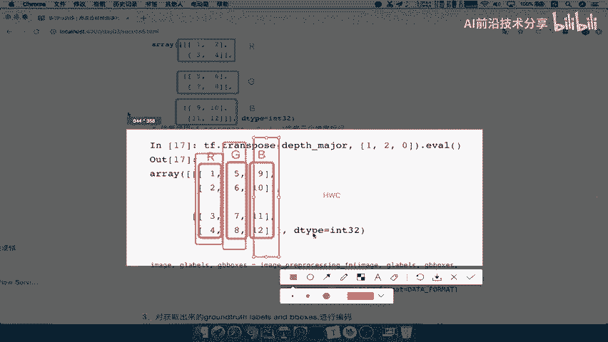
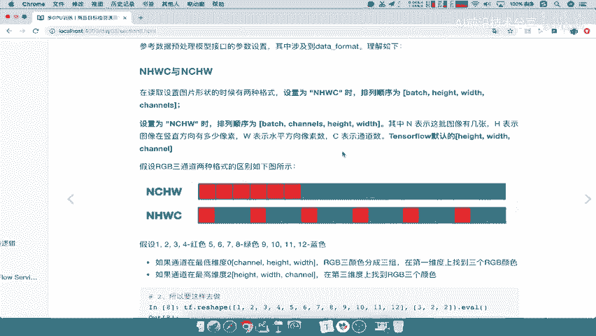

# 课程 P66：66.08_训练：NHWC与NCHW格式介绍 🧠

在本节课中，我们将要学习深度学习中两种常见的数据格式：NHWC与NCHW。理解它们的区别对于正确设置模型输入和处理图像数据至关重要。

## 概述

在深度学习中，尤其是在处理图像数据时，我们需要将图片组织成多维数组（张量）进行运算。NHWC和NCHW是描述这个多维数组维度顺序的两种主要格式。本节将详细介绍它们的含义、区别以及应用场景。

## NHWC与NCHW的区别

那么，NHWC和NCHW有什么区别呢？

在设置图片数据时，有两种格式可以选择。一种是NHWC，这意味着你的数据格式维度顺序为：批处理大小（Batch Size）、图片高度（Height）、图片宽度（Width）和通道数（Channels）。另一种是NCHW，它将通道数（Channels）放在第二个维度，即顺序为：批处理大小（Batch Size）、通道数（Channels）、图片高度（Height）和图片宽度（Width）。

这两种格式的核心区别在于维度的排列顺序不同。

## 默认格式与排列方式

TensorFlow默认使用的是NHWC格式。

这两种格式的区别在于数据的排列方式。如果是NHWC格式，数据可能按一种方式排列；如果是NCHW格式，则按另一种方式排列。这意味着我们可以通过不同的维度顺序来访问我们的数据。

## 通过例子理解

我们通过一个具体的例子来理解这两种格式。

假设我们有代表红（R）、绿（G）、蓝（B）三个通道的像素值，例如：
*   红色通道值：1, 2, 3, 4
*   绿色通道值：5, 6, 7, 8
*   蓝色通道值：9, 10, 11, 12

以下是两种格式下数据组织的关键区别：

*   对于**NCHW**格式，通道（C）在第二个维度（忽略批处理维度N后，它是第一个维度）。这意味着RGB三个颜色通道的数据被分成三组。你可以在三维数组的**第一个维度**上分别找到R、G、B三个完整的通道数据。
*   对于**NHWC**格式（或简化为HWC格式），通道（C）在最后一个维度。你可以在三维数组的**第三个维度**上找到每个像素点的RGB颜色值。

## 三维数组维度解析

为了更好地理解，我们来看一个三维数组的表示。

假设我们有一个代表NCHW格式（忽略N）的三维数组。在这个三维数组中：
*   **第一维度**：代表通道（Channels）。在这个维度上，你可以找到R、G、B三个独立的通道数据块。
*   **第二维度**：代表图片的高度（Height）。
*   **第三维度**：代表图片的宽度（Width）。

其结构可以用一个三维数组表示，其中第一维有三个元素，分别对应R、G、B通道。

而对于**NHWC**格式（忽略N），在一个三维数组中：
*   **第一维度**：代表图片的高度（Height）。
*   **第二维度**：代表图片的宽度（Width）。
*   **第三维度**：代表通道（Channels）。在这个维度的每个位置上，你可以找到一个像素点的（R, G, B）值。

其结构可以看作一个二维像素网格（H x W），其中每个网格点是一个包含三个元素（R, G, B）的向量。

## 数据处理中的应用

因此，在数据处理时，TensorFlow默认会使用其原生的NHWC格式（即高度、宽度、通道的顺序）来读取和排列像素，并进行后续的预处理和模型训练。理解这一点有助于确保数据输入格式与框架及模型期望的格式保持一致。

## 总结

本节课中，我们一起学习了NHWC和NCHW这两种重要的数据格式。
*   **NHWC**：维度顺序为（批大小， 高， 宽， 通道）。TensorFlow的默认格式。
*   **NCHW**：维度顺序为（批大小， 通道， 高， 宽）。在某些硬件（如NVIDIA GPU cuDNN）和框架（如PyTorch）上计算效率可能更高。

核心区别在于**通道（Channels）维度的位置**不同，这影响了数据在内存中的存储方式和访问模式。在实际工作中，需要根据所使用的深度学习框架和硬件优化需求来选择合适的格式。