# 课程 P67：对锚框进行正负样本标记 🏷️

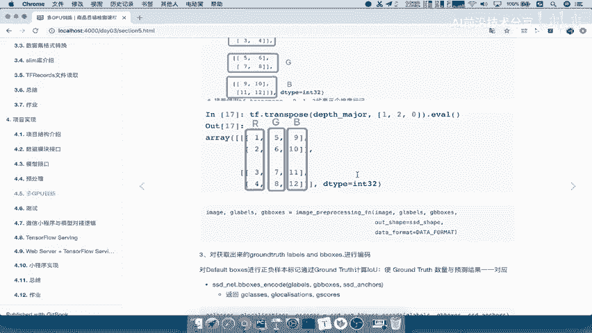

在本节课中，我们将学习如何为SSD目标检测网络中的锚框（Anchor Boxes）进行正负样本标记。这是将真实标注（Ground Truth）转换为网络训练所需目标值的关键步骤。

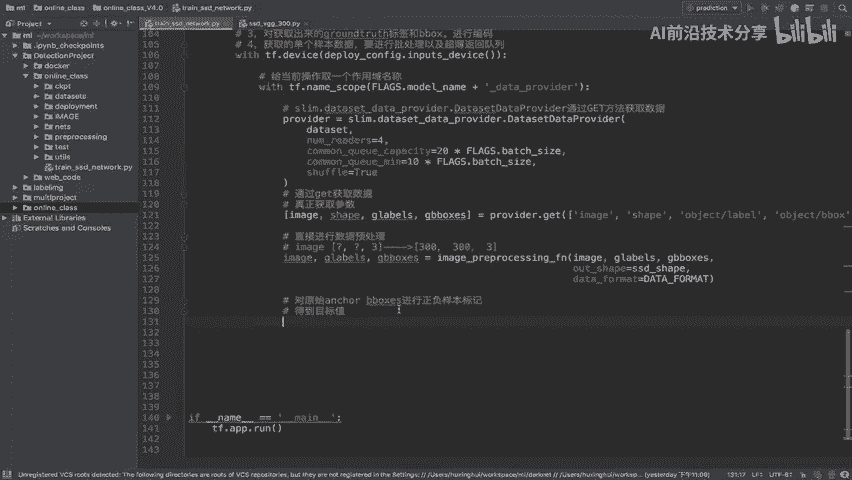

上一节我们介绍了数据预处理，获取了图像数据和真实边界框（gt box）。本节中我们来看看如何利用这些真实标注，为网络生成的所有锚框分配类别和位置目标。

## 锚框标记的目的

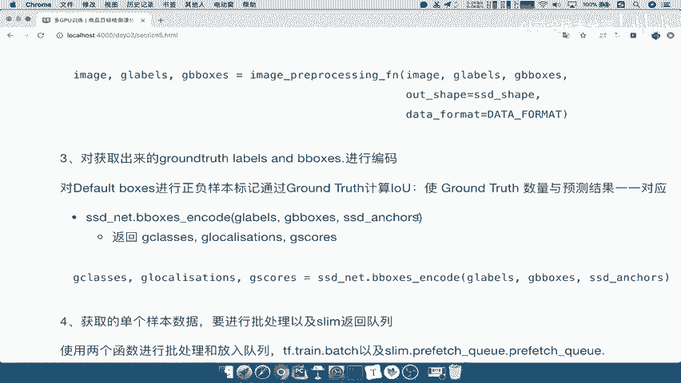

输入到网络中进行训练的数据，除了图像本身，还需要对应的目标标签。我们的任务是对网络生成的锚框进行标记，从而得到用于计算损失函数的目标值。在SSD网络中，这个标记过程通过一个特定的编码函数完成。

## 编码函数：`ssd_net.bboxes_encode`

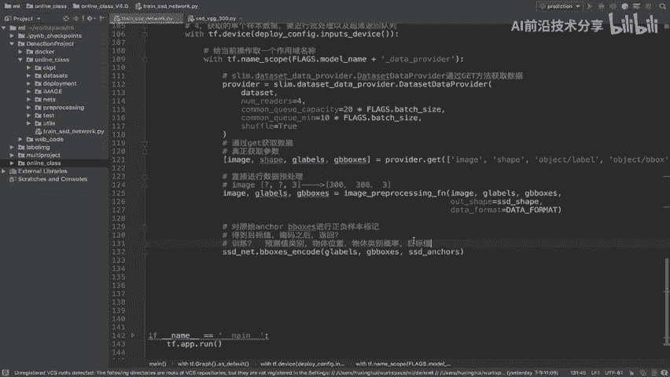

该函数利用真实标签（`gt_labels`）和真实边界框（`gt_boxes`），与网络生成的所有锚框进行一一对应的计算。核心是计算每个锚框与所有真实框之间的交并比（IoU），并根据IoU值为每个锚框分配一个对应的目标。

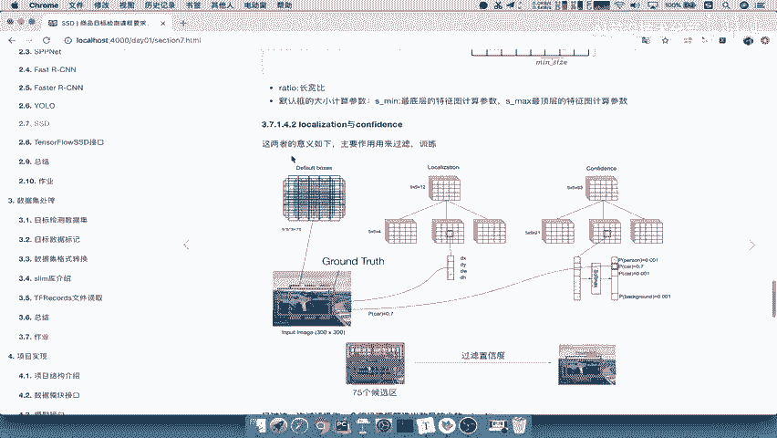

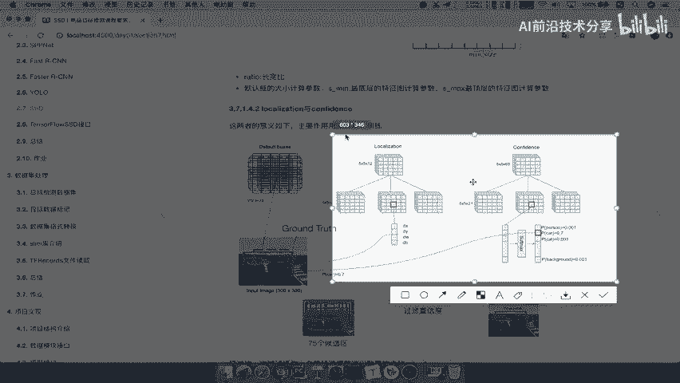

以下是该函数的核心作用：
*   **输入**：真实类别标签、真实边界框、锚框。
*   **处理**：计算锚框与真实框的IoU，根据阈值（如0.5）判断正负样本。
*   **输出**：编码后的目标值，其格式与网络预测值的格式保持一致。

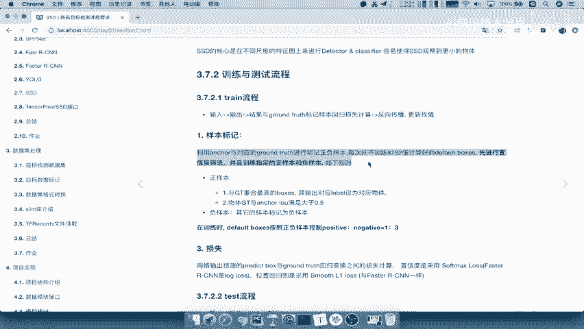

## 编码函数的输出

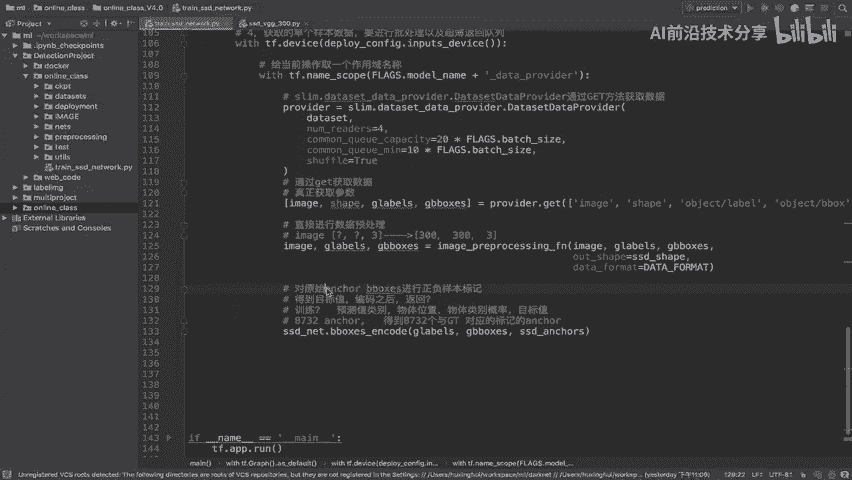

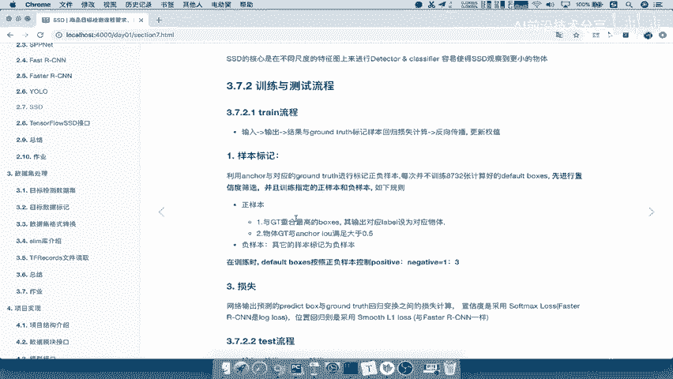

SSD网络的预测输出包含两部分：预测的类别概率和预测的边界框偏移量。因此，编码函数返回的目标值也必须与之对应。

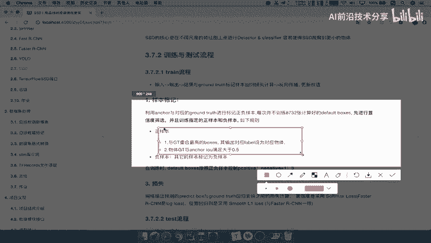

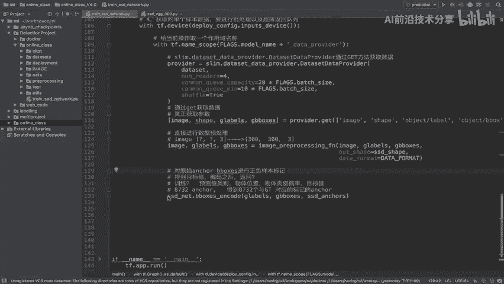

具体来说，函数返回三个值：
1.  **目标类别 (`gt_labels`)**: 每个锚框对应的真实物体类别编号。
2.  **目标位置 (`gt_localizations`)**: 每个锚框对应的真实边界框的位置编码（通常是相对于锚框中心的偏移量）。
3.  **目标分数 (`gt_scores`)**: 标记每个锚框是正样本还是负样本（例如，1表示正样本，0表示负样本）。

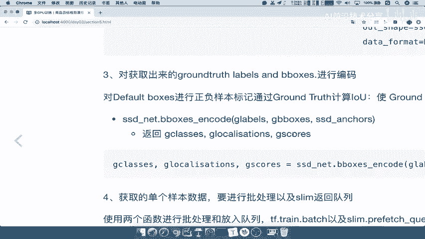

假设网络生成了8732个锚框，经过编码后，我们就得到了8732个标记好的目标值，它们将与网络的8732个预测值进行一一对应的损失计算。

## 总结

本节课中我们一起学习了SSD目标检测中锚框标记的核心过程。我们了解到，通过`bboxes_encode`函数，可以将少量的真实标注信息“分配”给大量的锚框，生成网络训练所需的目标类别、目标位置和正负样本标签。这个过程是连接数据标注与模型训练的关键桥梁，确保了模型能够学习到如何从锚框回归到真实物体的位置和类别。