# 课程P68：68.10_训练：批处理获取与数据形状变换 🧠

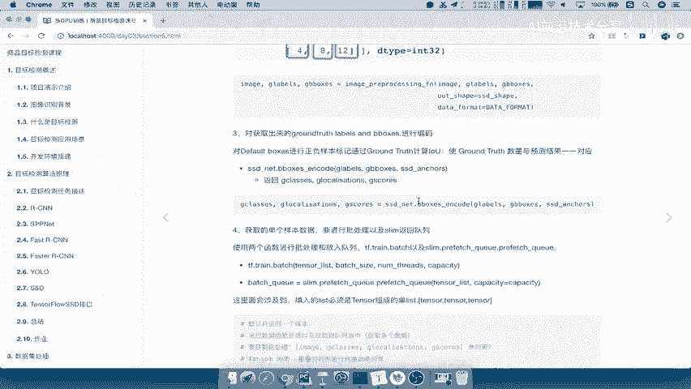

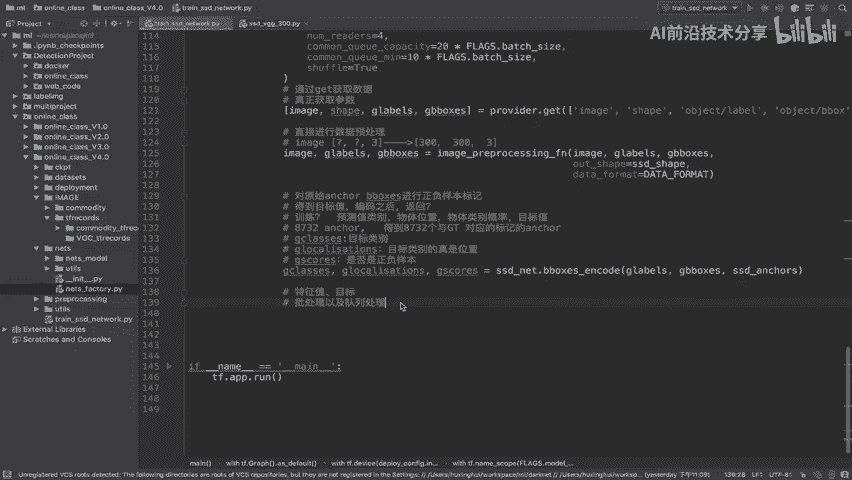

在本节课中，我们将学习如何对处理好的图片数据和标签进行批处理，以及如何将嵌套的列表数据转换为适合TensorFlow批处理函数要求的单层列表格式。

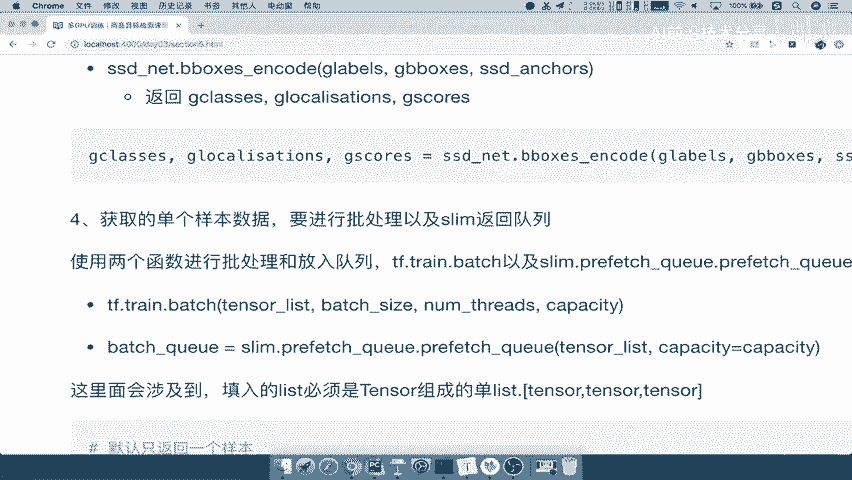

上一节我们介绍了如何读取和处理图片信息及其对应的正负样本标签。本节中，我们来看看如何将这些单个样本组织成批次，以便于高效训练。

## 批处理的需求与函数

在训练神经网络时，我们通常需要同时处理多个样本，而不是单个样本。TensorFlow提供了一个名为 `tf.train.batch` 的函数来实现批处理。

以下是 `tf.train.batch` 函数的核心参数：
*   `tensor_list`：一个由 `Tensor` 对象组成的列表。
*   `batch_size`：每个批次中包含的样本数量。
*   `num_threads`：用于入队的线程数。
*   `capacity`：队列的最大容量。

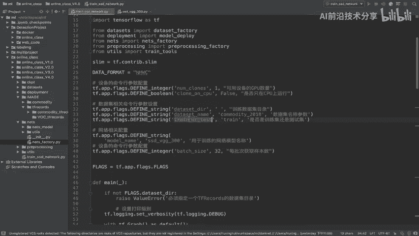

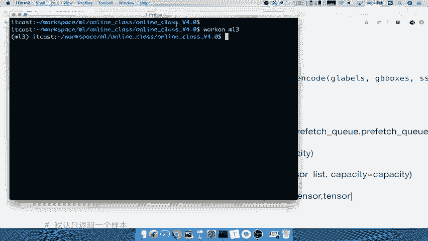

## 数据形状问题与转换

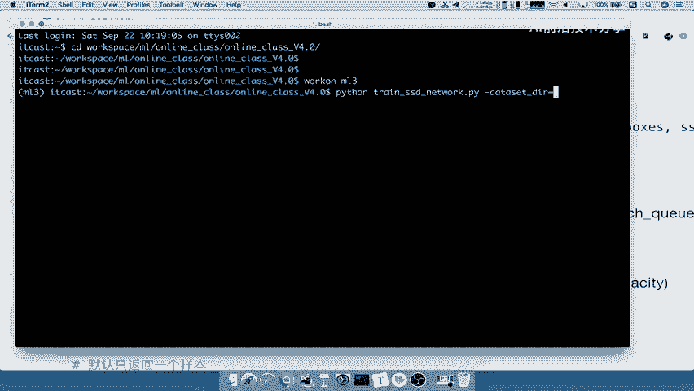

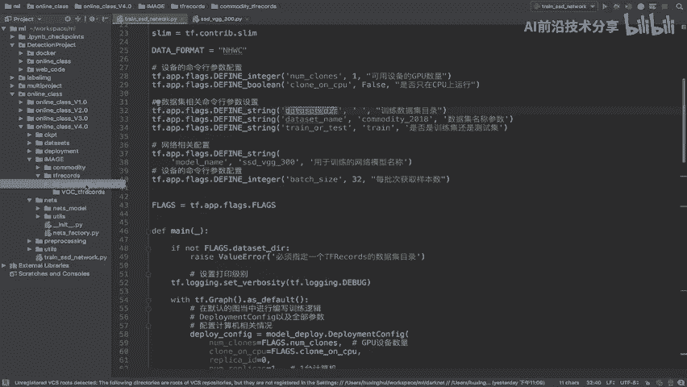

我们首先需要确定哪些数据需要进行批处理。这包括图片数据（`image`）、类别标签（`gclasses`）、位置坐标（`glocalization`）和置信度分数（`gscores`）。

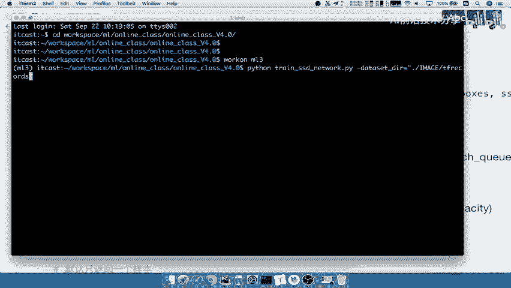

然而，直接将这些数据传入 `tf.train.batch` 会遇到问题。通过打印 `gclasses` 和 `glocalization` 的形状，我们发现它们本身是包含多个 `Tensor` 的嵌套列表（对应网络的六个预测层），而不是一个由单个 `Tensor` 组成的简单列表。

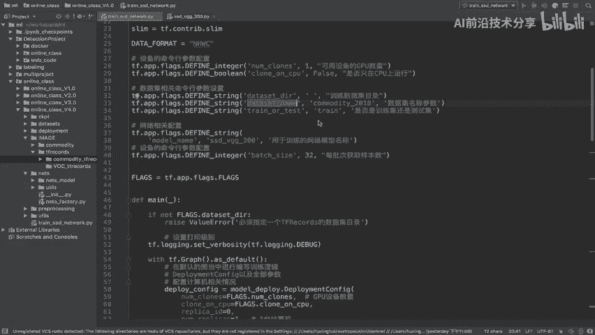

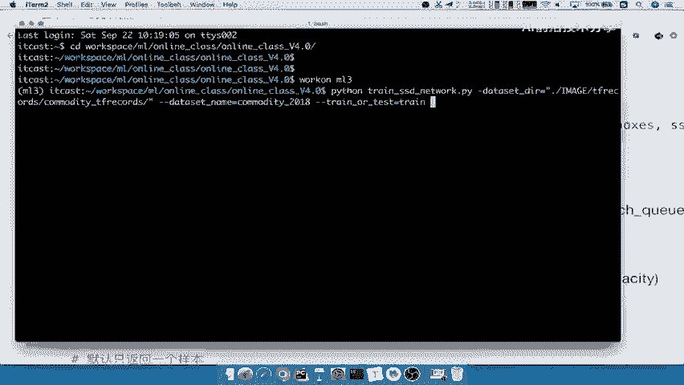

**代码示例：问题数据形状**
```python
# 打印查看数据结构
print(gclasses)   # 输出可能为: [<tf.Tensor...>, <tf.Tensor...>, ...] (一个列表)
print(glocalization) # 输出类似，也是一个列表
# 但 tf.train.batch 需要的是 tensor_list = [tensor1, tensor2, tensor3, ...]
```

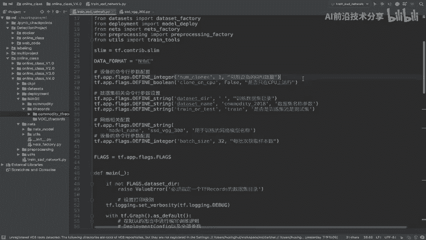

这不符合 `tf.train.batch` 对 `tensor_list` 参数的要求。因此，我们需要将这种嵌套的列表结构转换成一个扁平的、由单个 `Tensor` 组成的列表。

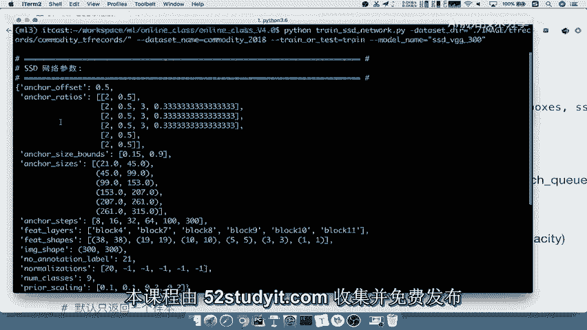

## 实施数据转换与批处理

为了解决上述问题，我们使用 `train_tools.reshape_list` 工具函数。这个函数的作用正是将嵌套的列表转换成一个单层的列表。

**代码示例：实施转换与批处理**
```python
# 1. 将需要批处理的数据组合成一个列表
data_to_batch = [image, gclasses, glocalization, gscores]

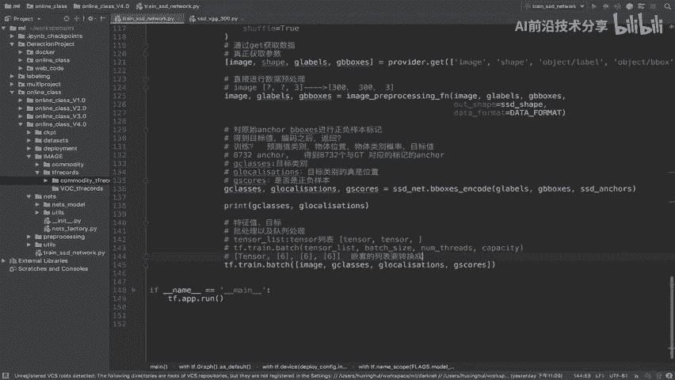

# 2. 使用 reshape_list 函数转换嵌套结构
flattened_list = train_tools.reshape_list(data_to_batch)

# 3. 将转换后的单层列表送入 tf.train.batch 函数
batch_tensors = tf.train.batch(
    tensor_list=flattened_list,
    batch_size=FLAGS.batch_size,
    num_threads=4,
    capacity=5 * FLAGS.batch_size
)

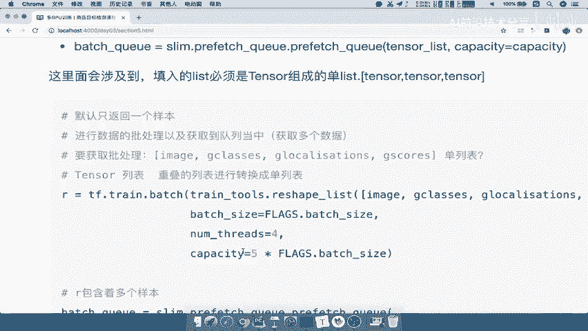

# 打印批处理后的结果以验证
print(batch_tensors)
```

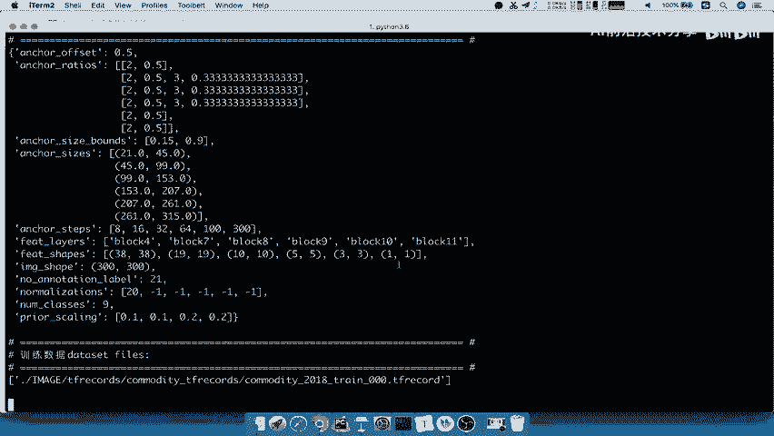

运行上述代码后，打印 `batch_tensors` 的结果显示，它现在是一个包含19个 `Tensor` 的列表（1个`image` + 6个`gclasses` + 6个`glocalization` + 6个`gscores`），并且每个 `Tensor` 的第一维（`batch` 维度）都变成了我们设定的批次大小（例如32）。这表明批处理已成功完成，数据形状符合后续训练步骤的要求。

本节课中我们一起学习了批处理的重要性，识别了数据形状不匹配的问题，并掌握了使用 `tf.train.batch` 和 `reshape_list` 工具将数据处理成适合训练批次的方法。这是构建高效训练流程的关键一步。