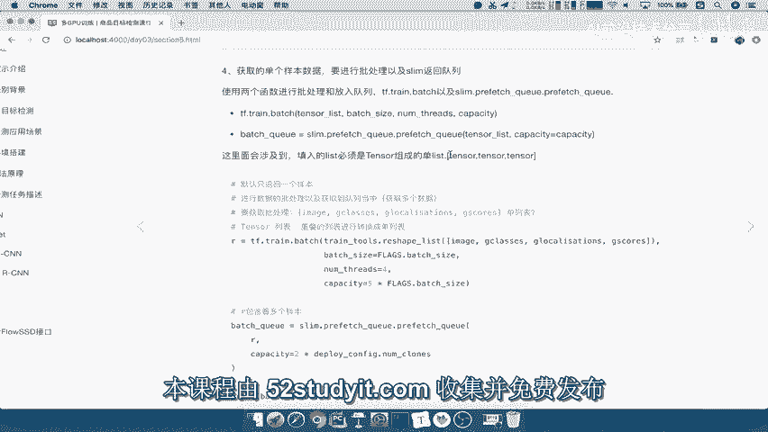
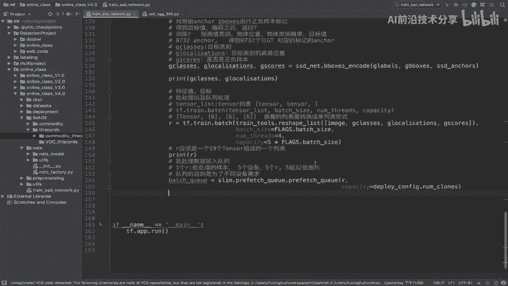
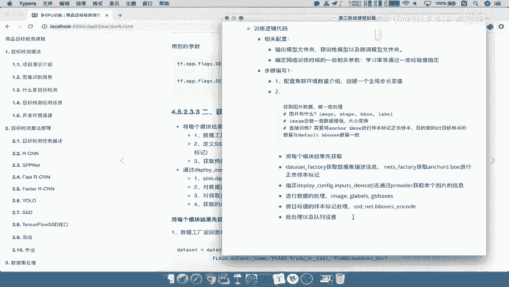

# 🚀 课程 P69：69.11_训练：批处理与队列设置

在本节课中，我们将学习如何对预处理后的数据进行批处理，并将其放入队列中，以便高效地供给多个设备进行模型训练。



---

上一节我们介绍了单个样本的数据预处理流程。本节中我们来看看如何将多个样本组织成批次，并利用队列机制进行管理。

批处理之后，数据从单个样本转变为多个样本的集合。接下来，当模型读取并获取这些数据以计算损失和进行前向传播时，需要一个队列机制。SLAM框架默认提供了这种队列机制，用于存放批处理数据。

以下是队列设置的核心函数 `prefetch` 的用法：

```python
bench_queue = prefetch(tensor_list, capacity=0)
```

*   `tensor_list`：需要放入队列的张量列表。注意，传入的必须是一个由张量组成的列表。
*   `capacity`：队列的容量大小。

我们之前打印的批处理结果 `R` 已经是一个由张量组成的列表形式，因此可以直接传入 `prefetch` 函数。

现在，我们将批处理数据放入队列：

```python
# 放入队列：批处理数据
bench_queue = prefetch(tensor_list=R, capacity=0)
```

参数 `capacity` 定义了队列的大小。队列的目的是为了满足不同设备的数据需求。例如，如果有五个训练设备，每个设备都需要一个批次的数据（即一个 `R`），那么总共就需要五个 `R`，相当于五组批处理样本。

因此，`capacity` 通常应设置得大一些，至少等于设备数量。设备数量可以从部署配置中获取：



```python
# 从部署配置中获取设备数量，并以此设置队列容量
num_devices = deployment_config.NCS
bench_queue = prefetch(tensor_list=R, capacity=num_devices)
```

这样，`bench_queue` 中就会准备好足够多组（例如五组）的批处理数据。

---

当我们完成数据放入队列的操作后，就可以从中取出数据供模型使用了。至此，我们第一阶段的核心目标——获取网络对接数据以及处理样本的GT标记——已经全部完成。

最后，我们来总结一下整个第二步的关键步骤：

1.  **提取与规范数据**：从各个模块中提取出原始数据、标注信息等。
2.  **指定设备与获取数据**：在指定的CPU设备上，通过 `provider` 获取单张图片的信息。
3.  **数据预处理**：对获取的图片进行一系列处理操作。
4.  **生成训练目标**：利用 `SSDNetBBoxesEncoder` 工具，根据处理后的 `image`、`label` 和 `gt_bbox` 生成模型训练所需的目标值标记，区分正负样本。
5.  **批处理与队列设置**：将多个单样本数据组合成批次，并放入队列中，为多设备并行训练做好准备。

以上就是我们在数据准备第二步中需要完成的所有工作。

---



本节课中我们一起学习了如何将预处理后的数据组织成批，并通过设置队列来高效管理这些批次数据，为后续的多设备模型训练做好了准备。