# 课程P7：目标检测任务描述 🎯

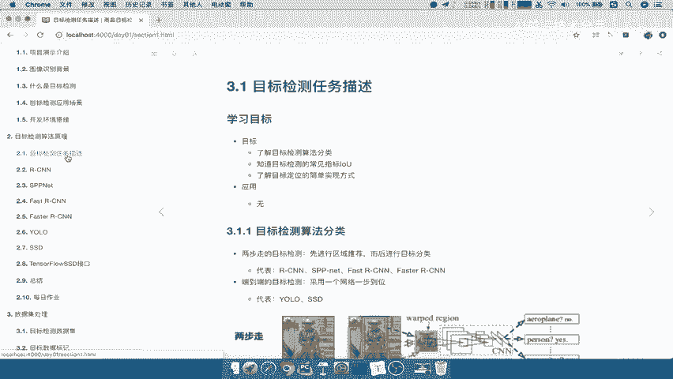

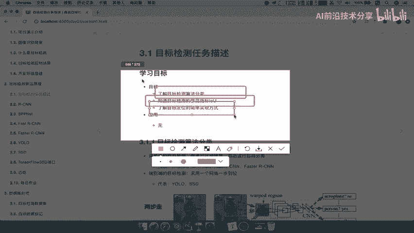

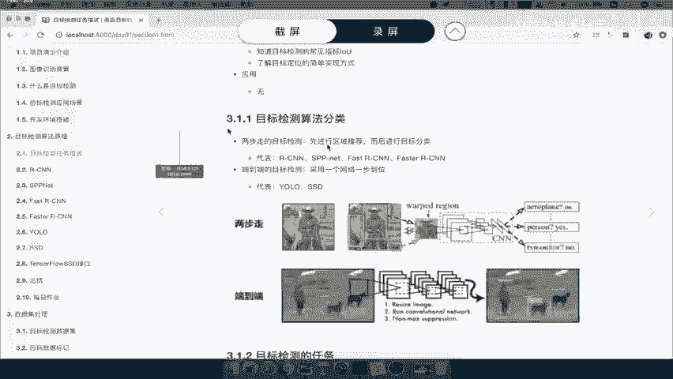

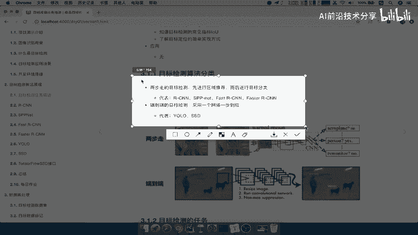

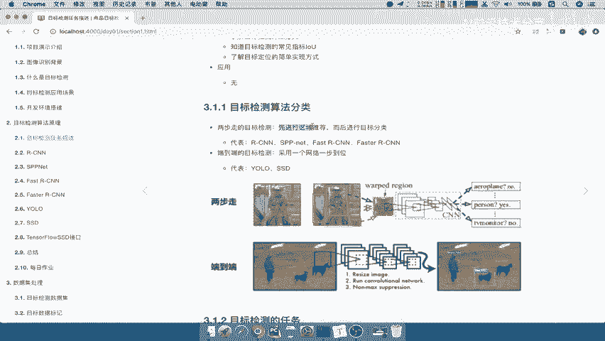

在本节课中，我们将学习目标检测任务的基本概念。我们将了解目标检测算法的分类、常见的评估指标，并探讨一种实现目标定位的简单方法。

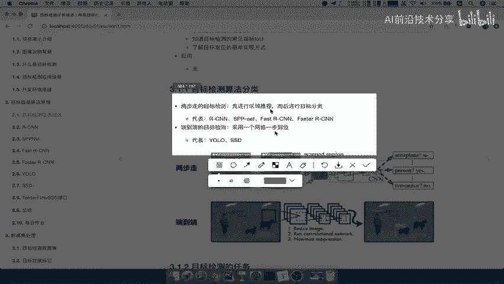

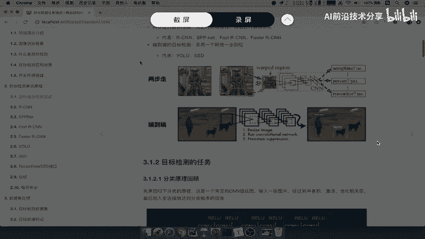

## 算法分类 🔍

上一节我们介绍了课程目标，本节中我们来看看目标检测算法的分类。目标检测算法主要分为两大类。

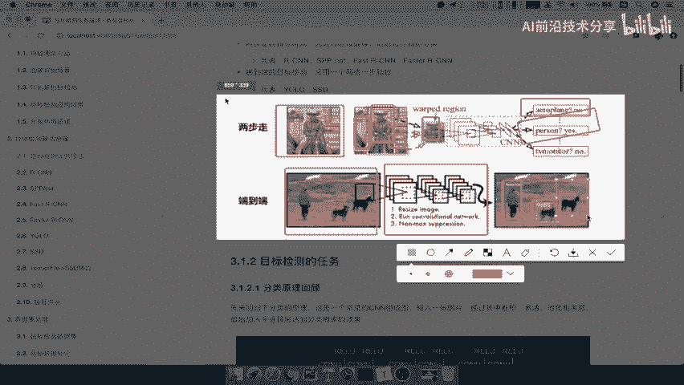

以下是两种主要算法类别及其特点：

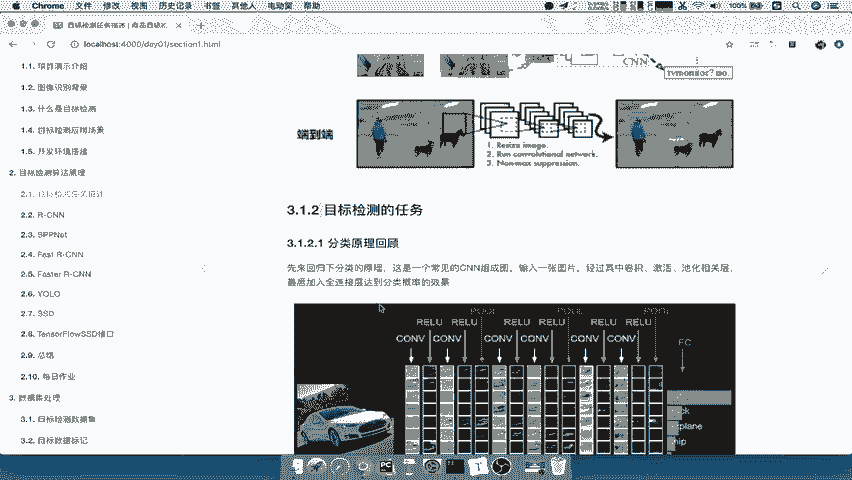

*   **两步走的目标检测**：这类算法首先进行区域推荐，然后对推荐的区域进行分类。
*   **端到端的目标检测**：这类算法通过一个网络直接从输入图像得到物体的类别和位置，一步到位。

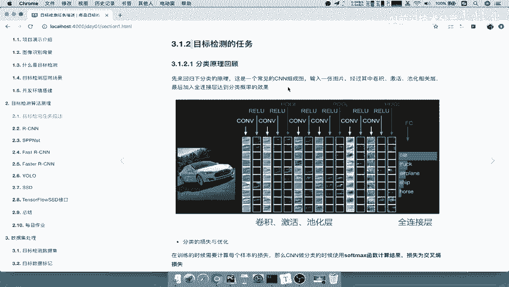

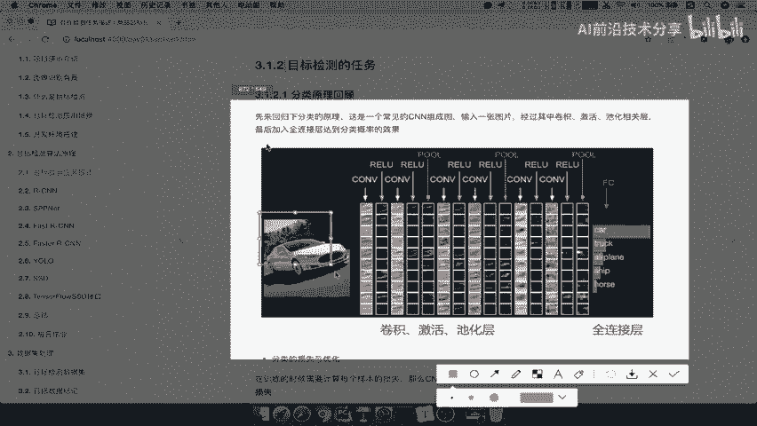

为了更直观地理解，我们可以看下面的对比图。两步走的方法（如R-CNN系列）先找出图像中可能包含物体的区域，再对这些区域进行分类。而端到端的方法（如YOLO、SSD）则直接将整张图输入网络，一次性输出所有检测到的物体及其位置。

## 任务回顾与定义 📝

上一节我们介绍了算法的分类，本节中我们来看看目标检测任务的具体定义。首先，让我们回顾一下基础的图像分类任务。

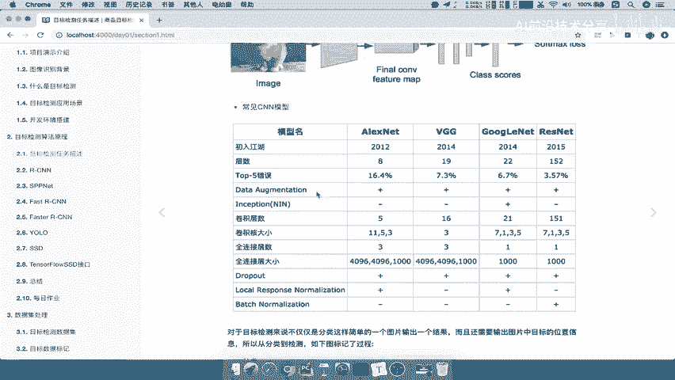

在图像分类中，我们使用卷积神经网络（CNN）。输入一张图片，经过卷积、激活、池化等层，最后通过全连接层输出。输出向量的长度等于类别数量，每个值代表该类别的概率。训练时，我们使用Softmax函数计算概率，并通过交叉熵损失函数进行优化。

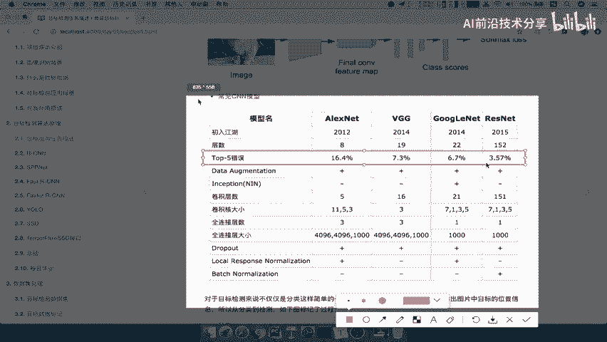

常见的分类模型有AlexNet、VGG、GoogleNet、ResNet等。随着模型发展，识别准确率不断提升，例如ResNet在ImageNet数据集上的Top-5错误率达到了3.57%，超过了人类的识别水平。

现在，我们引入目标检测。它比分类更复杂，需要同时完成两件事：

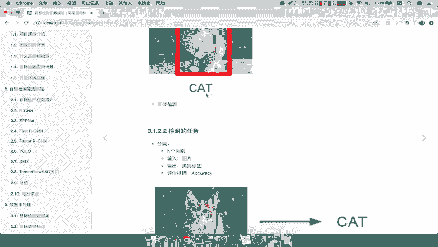

1.  **分类**：识别图像中的物体是什么。
2.  **定位**：找出物体在图像中的具体位置。

这里有一个重要的概念区分：
*   **分类+定位**：通常指图像中**只有一个**主要物体时，同时识别其类别和位置的任务。
*   **目标检测**：通常指图像中**有多个**物体时，识别所有物体类别和位置的任务。

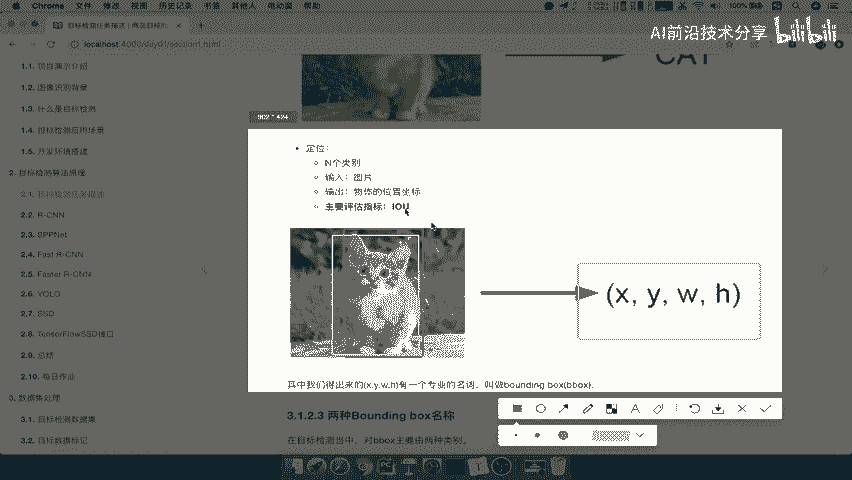

## 评估指标 📊

上一节我们明确了任务，本节中我们来看看如何评估模型的好坏。对于分类任务，我们通常使用准确率（Accuracy）来评估。

对于定位任务，我们需要评估预测的物体框（Bounding Box）与真实框的接近程度。这里涉及两个关键术语：
*   **Ground Truth Bounding Box (gt_bbox)**：数据集中人为标记的物体真实位置框。
*   **Predicted Bounding Box (pred_bbox)**：模型预测出的物体位置框。

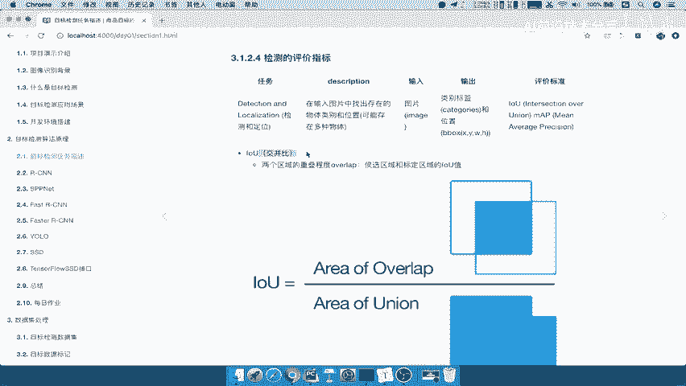

衡量这两个框重叠程度的指标叫做**交并比（Intersection over Union, IoU）**。其计算公式为：

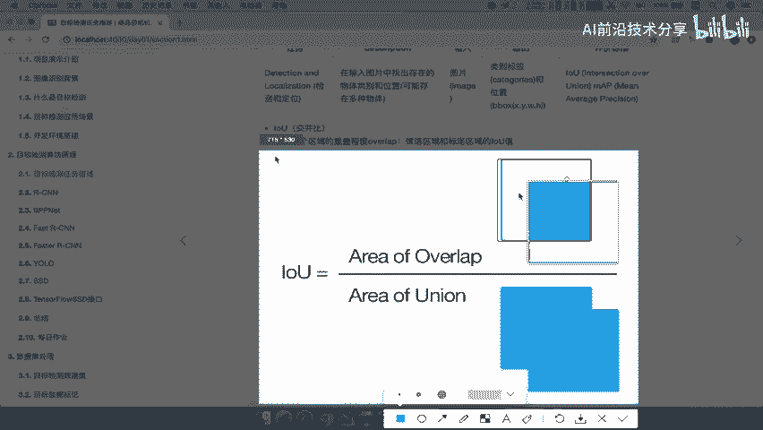

`IoU = (预测框与真实框的交集面积) / (预测框与真实框的并集面积)`

IoU值越高，说明预测框与真实框重叠得越好，定位越准确。当两个框完全重合时，IoU值为1。

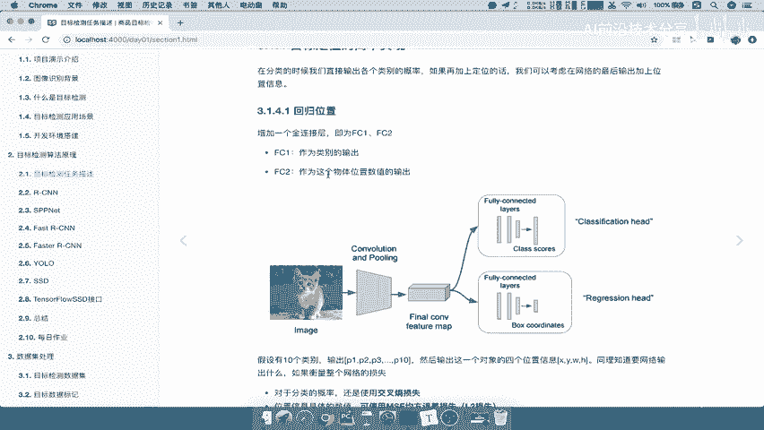

## 一种简单的实现思路 💡

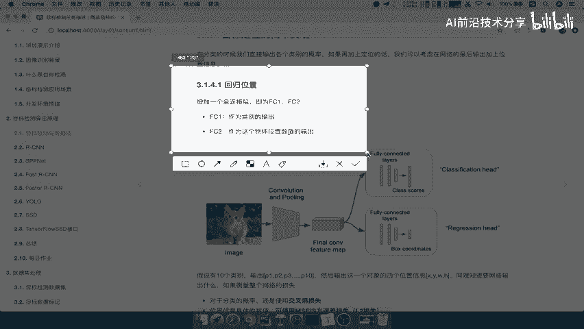

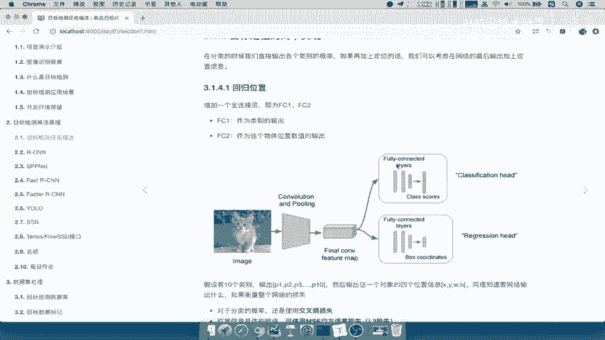

上一节我们介绍了评估指标，本节中我们来看看如何用简单的方法实现“分类+定位”。我们的目标是让网络同时输出类别和位置。

解决思路是扩展CNN网络的输出。假设我们要识别10个类别，网络原本会输出10个类别的概率值。我们可以**增加一个全连接层**，让它额外输出4个值，代表物体的位置（例如中心点坐标x, y和宽高w, h）。

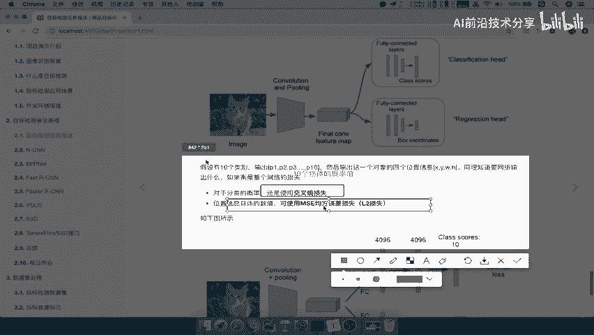

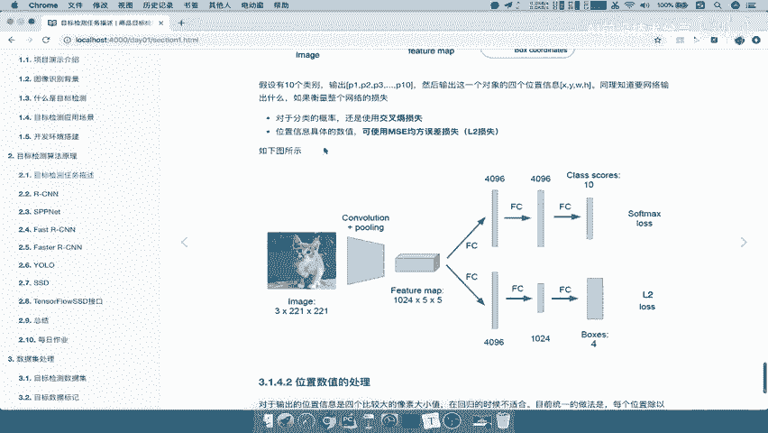

因此，网络的最终输出包含两部分：
1.  分类输出：10个类别的概率（使用Softmax）。
2.  定位输出：4个坐标值（一个回归问题）。

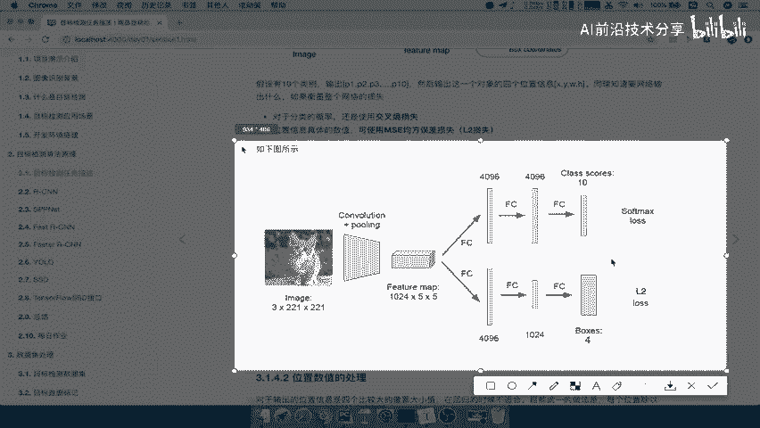

在训练时，我们需要计算两个损失：
*   **分类损失**：使用交叉熵损失函数，衡量预测类别与真实类别的差异。
*   **定位损失**：使用均方误差（MSE）损失函数，衡量预测坐标与真实坐标的差异。

总的损失是这两个损失的加权和，通过反向传播同时优化网络参数。对于坐标值，通常需要进行归一化处理（例如除以图像宽高），以便于模型训练。

## 总结 🏁

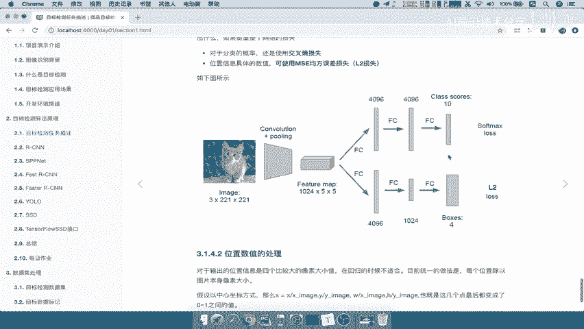

本节课中我们一起学习了目标检测的基础知识。我们了解了目标检测算法的两大分类（两步走 vs. 端到端），明确了分类+定位与目标检测的任务区别。我们学习了定位任务的核心评估指标IoU，并探讨了一种通过修改网络输出层来实现单物体分类与定位的简单思路。这为后续学习更复杂的目标检测算法奠定了基础。