# 课程 P70：多GPU训练模型复制与优化器配置 🚀

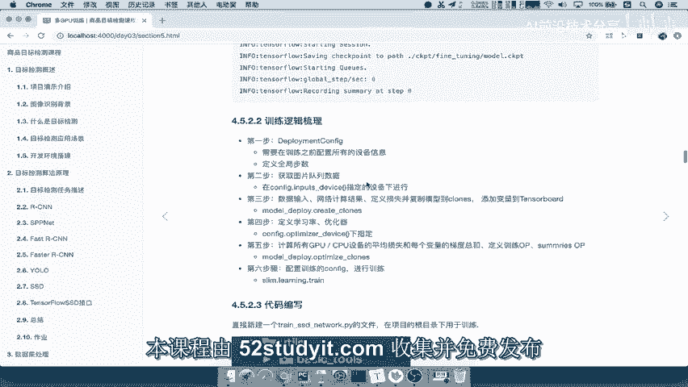

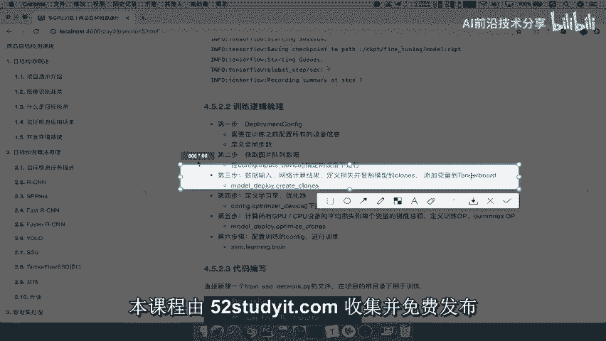

在本节课中，我们将学习如何将定义好的网络模型和损失计算过程复制到多个GPU设备上，并配置学习率与优化器，为后续的分布式训练做好准备。

## 概述

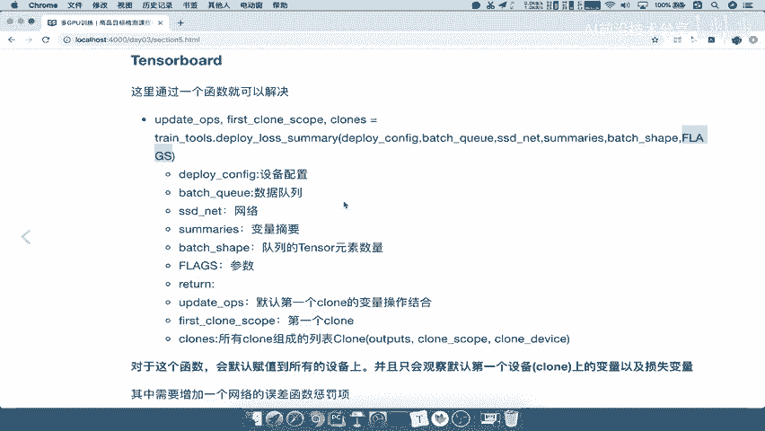

上一节我们完成了数据批处理队列的构建。本节我们将回到训练主流程，执行以下核心步骤：
1.  将网络模型、损失计算等操作复制到多个GPU设备。
2.  配置学习率衰减策略和优化器。

---

## 第三步：模型复制、损失计算与变量观察 🔄

数据准备就绪后，下一步是将数据输入网络进行计算，得到预测结果并定义损失函数。这些操作需要被复制到多个计算设备（Client）上，并为每个设备添加TensorBoard观察点。

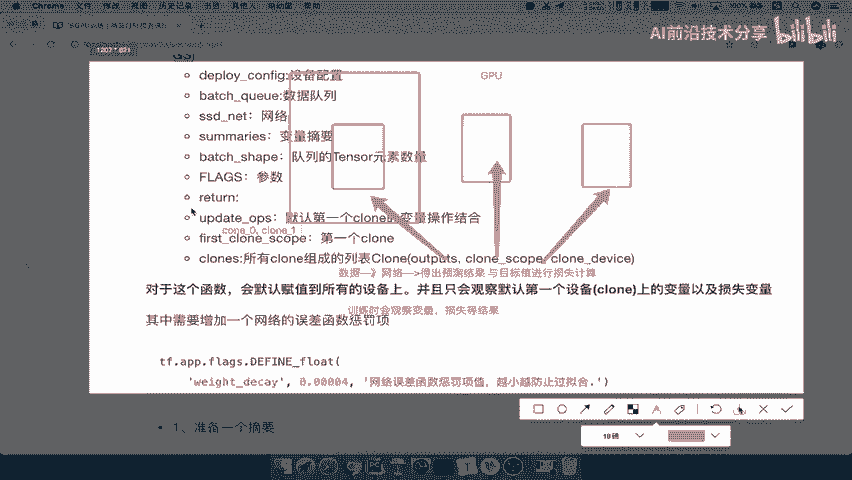

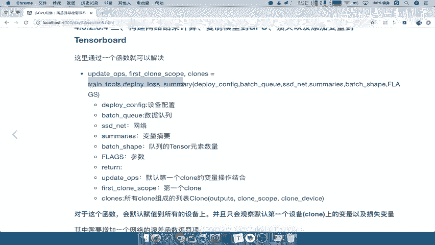

以下是实现这一步骤的关键操作：

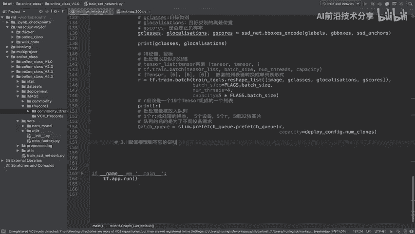

*   **使用函数**：`train_tools.deploy_loss_summary`
*   **函数作用**：该函数将网络配置、数据队列和网络模型作为输入，自动完成模型复制、损失计算和摘要（summary）添加。
*   **输入参数**：
    *   `cluster_config`：设备集群配置，指定复制份数。
    *   `batch_queue`：批处理数据队列。
    *   `net`：需要进行计算的网络模型。
    *   `summaries`：需要通过TensorBoard观察的变量集合。
    *   `batch_shapes`：指定队列中每个数据元素的张量形状。
*   **返回参数**：
    *   `first_clone_ops`：第一个设备上的所有操作集合。
    *   `first_clone_scope`：第一个设备的名称。
    *   `clones`：所有设备的输出、名称及其所在设备信息的集合。

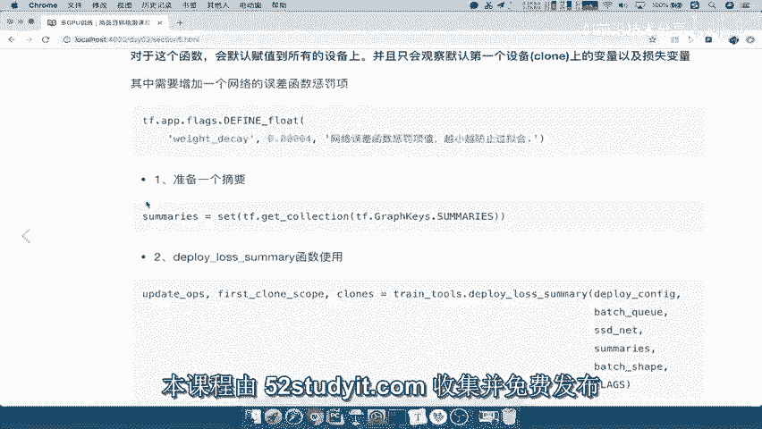

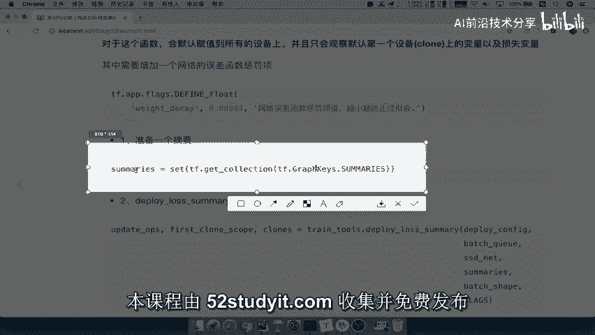

### 函数工作原理

假设我们有三个GPU设备。该函数执行以下流程：
1.  定义网络前向传播、计算预测结果和损失的操作。
2.  将这些完整的计算图复制到三个GPU设备上，每个设备都拥有独立的计算过程。
3.  默认选择第一个设备（`clone_0`）作为主要观察对象，将其上的变量和损失值添加到TensorBoard摘要中。

### 代码实现

我们将在训练流程的第三步调用此函数。

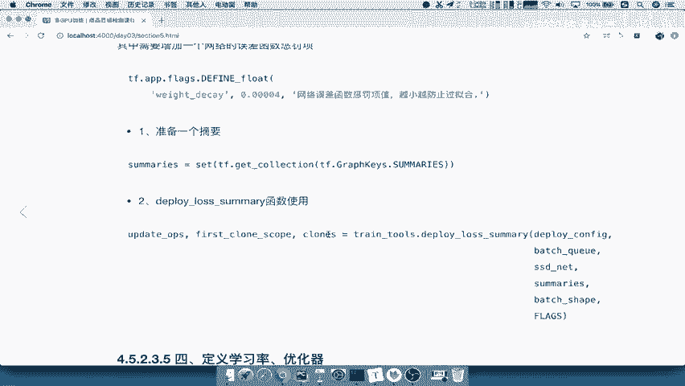

```python
# 第三步：复制模型到不同GPU设备，计算损失，并添加变量观察
# 获取需要观察的摘要集合
summaries = set(tf.get_collection(tf.GraphKeys.SUMMARIES))

# 定义批处理队列中数据的形状
# 假设数据包含图像和若干标注张量
batch_shapes = [1, ] + [3 * ssd_anchors.num_anchors]  # 示例形状，需根据实际网络结构调整

# 调用函数进行模型部署
first_clone_ops, first_clone_scope, clones = train_tools.deploy_loss_summary(
    cluster_config=deploy_config,
    batch_queue=batch_queue,
    net=ssd_net,
    summaries=summaries,
    batch_shapes=batch_shapes
)
```

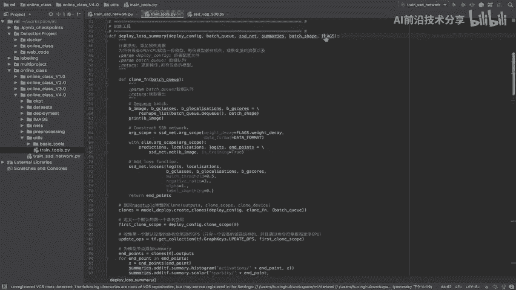

通过以上代码，我们完成了模型在多设备上的复制，并为监控训练过程准备好了观察点。

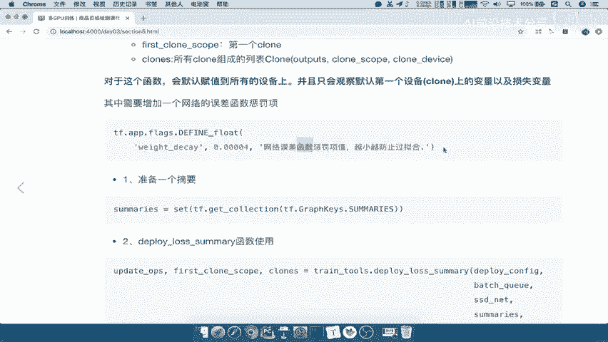

---

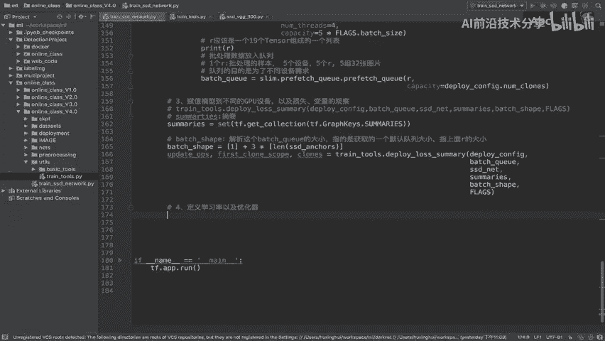

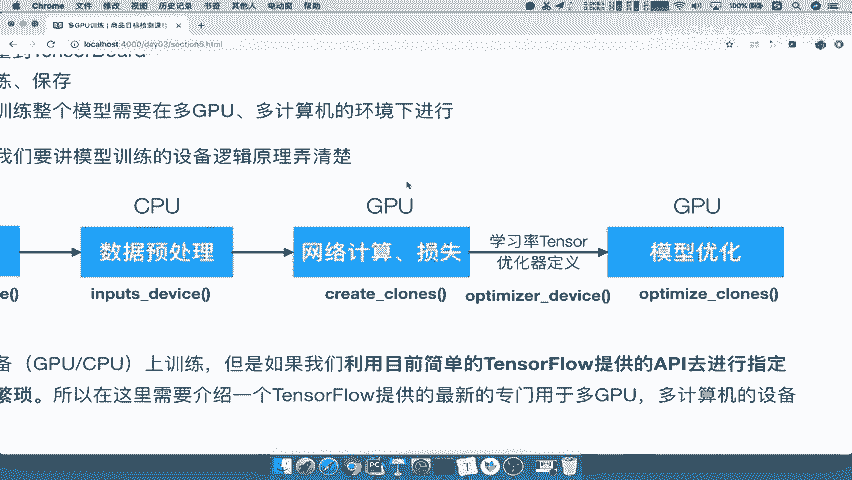

## 第四步：定义学习率与优化器 ⚙️

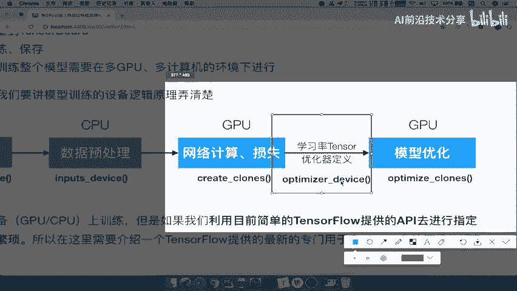

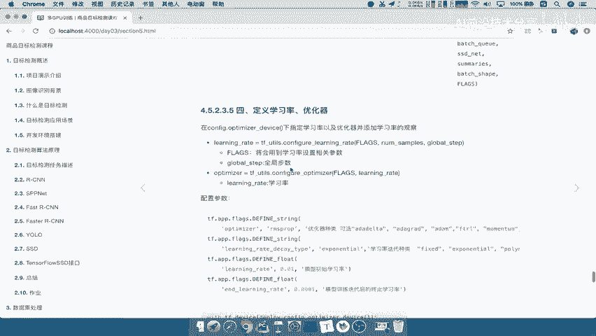

损失计算图在多设备上部署完成后，接下来需要定义学习率衰减策略和优化器，以便更新网络参数。

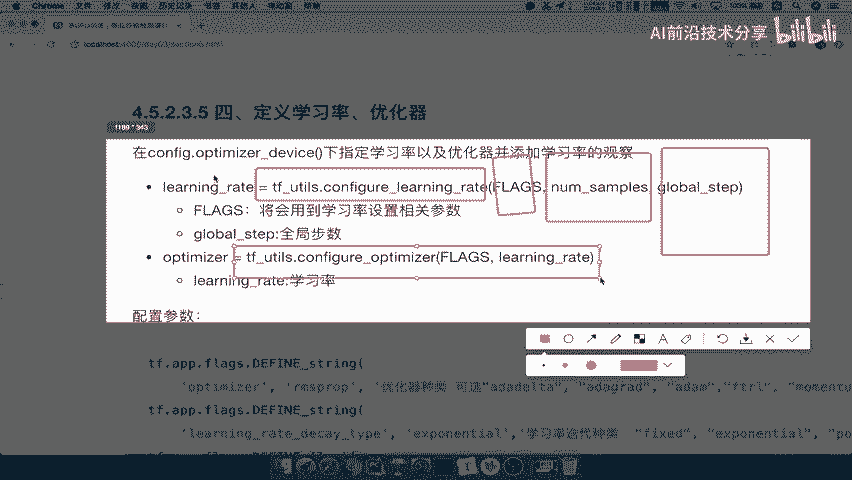

### 关键概念与函数

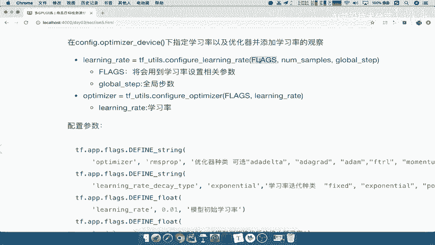

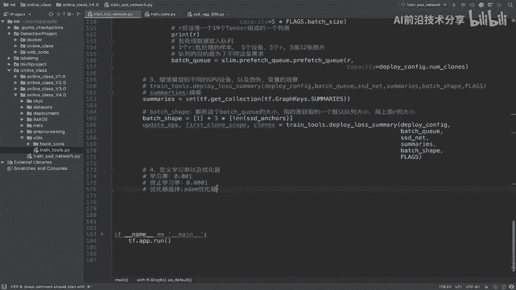

1.  **学习率配置**：使用 `train_tools.configure_learning_rate` 函数。它根据配置参数、总样本数和全局步数，生成一个随时间衰减的学习率张量。
2.  **优化器配置**：使用 `train_tools.configure_optimizer` 函数。它接收配置参数和学习率张量，返回一个优化器对象。
3.  **运行设备**：学习率和优化器的定义通常在CPU设备上进行，而梯度计算和参数更新则分布在各个GPU上。

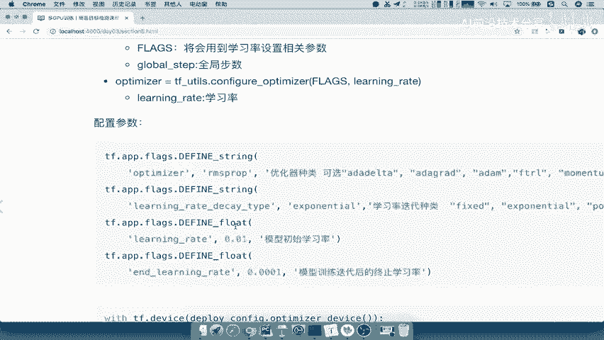

### 添加必要参数

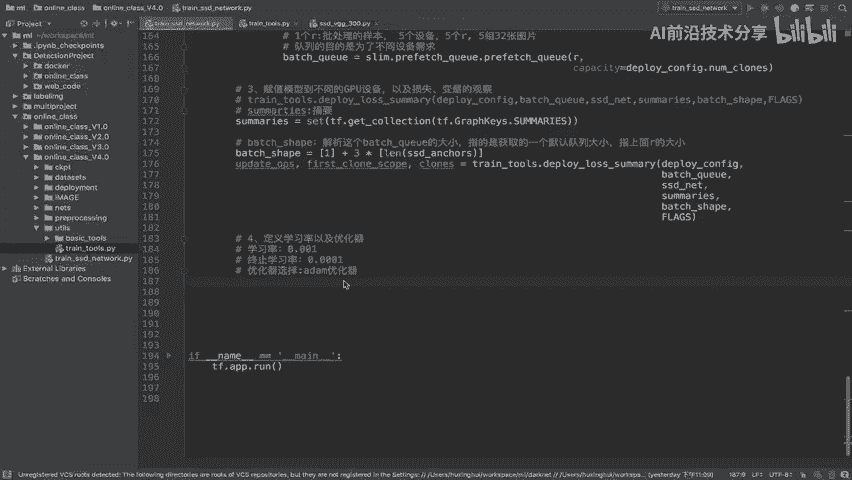

在配置之前，需要在命令行参数中添加相关配置项，例如学习率类型、初始学习率、终止学习率、优化器类型以及权重衰减系数等。

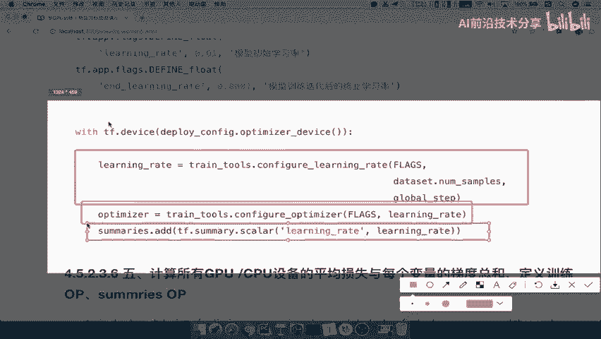

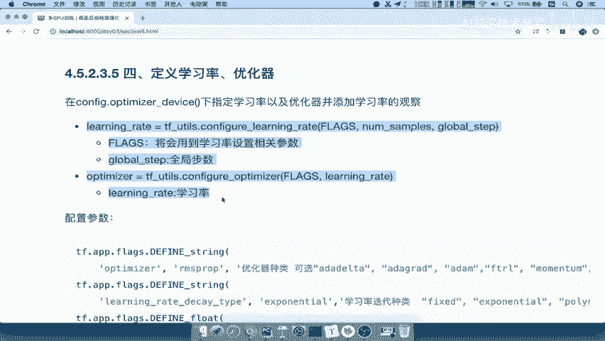

```python
# 在flags定义中添加训练相关参数
flags.DEFINE_string('learning_rate_decay_type', 'exponential', '学习率衰减类型')
flags.DEFINE_float('learning_rate', 0.01, '初始学习率')
flags.DEFINE_float('end_learning_rate', 0.0001, '终止学习率')
flags.DEFINE_string('optimizer', 'momentum', '优化器类型')
flags.DEFINE_float('weight_decay', 0.0005, '权重衰减系数，用于防止过拟合')
```

### 代码实现

我们将在指定的优化器设备（通常是CPU）上定义学习率和优化器。

```python
# 第四步：定义学习率与优化器
with tf.device(deploy_config.optimizer_device()):
    # 配置学习率
    learning_rate = train_tools.configure_learning_rate(
        flags.FLAGS,
        dataset.num_samples,  # 数据集中总样本数
        global_step
    )
    # 将学习率添加到摘要，便于在TensorBoard中观察
    summaries.add(tf.summary.scalar('learning_rate', learning_rate))

    # 配置优化器
    optimizer = train_tools.configure_optimizer(flags.FLAGS, learning_rate)
```

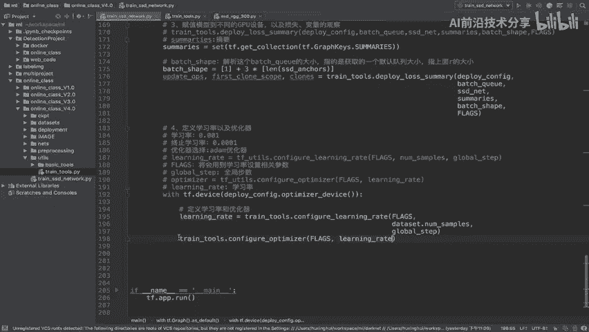

这段代码完成了学习率策略的定义和优化器的创建，并将学习率的变化情况添加到了监控摘要中。

---

## 总结

本节课中，我们一起学习了多GPU训练流程中的两个关键环节：

1.  **模型复制与观察**：我们使用 `deploy_loss_summary` 函数，将完整的网络计算图（包括前向传播和损失计算）复制到多个GPU设备，并设置了TensorBoard监控点，便于观察第一个设备上的训练变量。
2.  **学习率与优化器配置**：我们在CPU设备上定义了随着训练步数衰减的学习率策略，并创建了优化器对象，为下一步的多设备梯度计算和参数同步做好了准备。

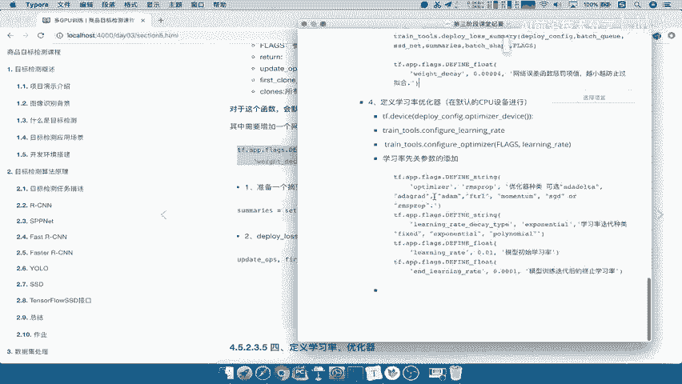

至此，我们已经构建了分布式训练的计算框架。下一节，我们将在此基础上实现梯度的计算、汇总与参数的更新操作。