# 课程 P71：分布式训练 - 总损失计算、梯度平均与训练配置 🚀

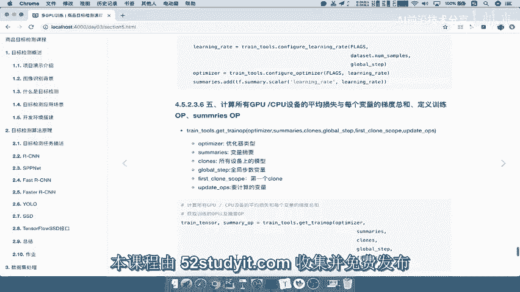

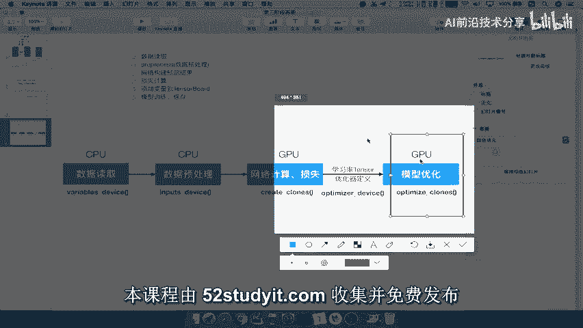

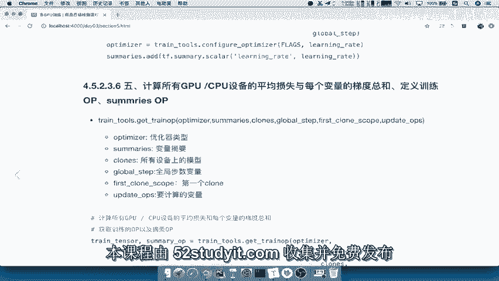

在本节课中，我们将学习分布式训练流程中的两个核心步骤：计算所有设备的总损失与平均梯度，以及配置最终的训练会话。我们将了解如何整合优化器、损失和梯度信息，并设置训练循环的参数，以启动多GPU设备的协同训练。

---

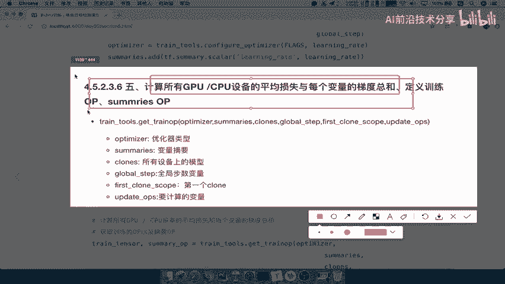

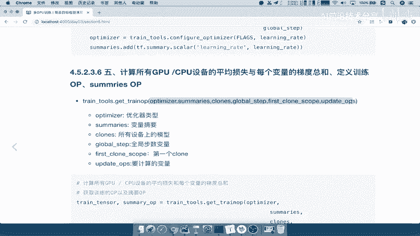

## 第五步：计算总损失与变量平均梯度 🔢

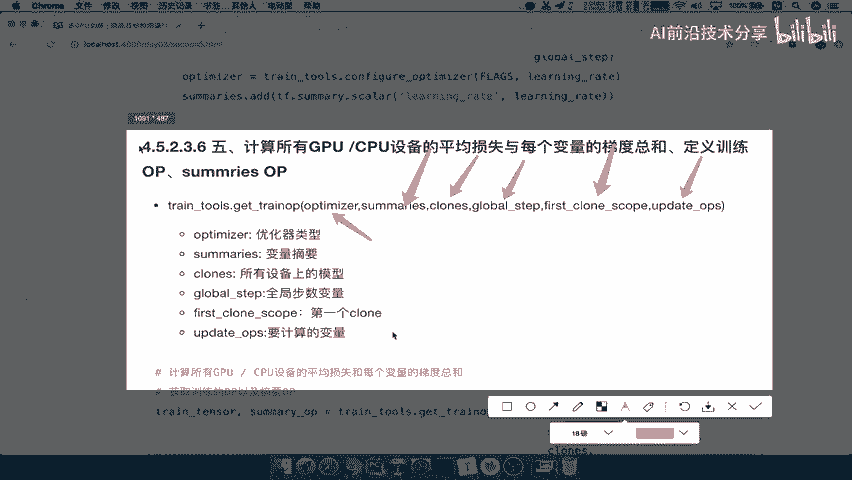

上一节我们配置了基础的学习率和优化器。本节中，我们来看看如何为分布式环境计算用于优化的关键指标：所有设备的总损失和每个可训练变量的平均梯度。

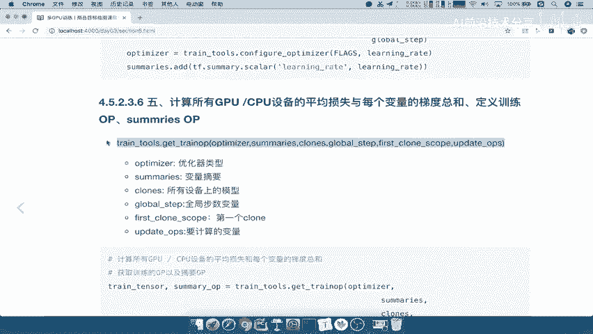

以下是实现此步骤的核心函数调用：

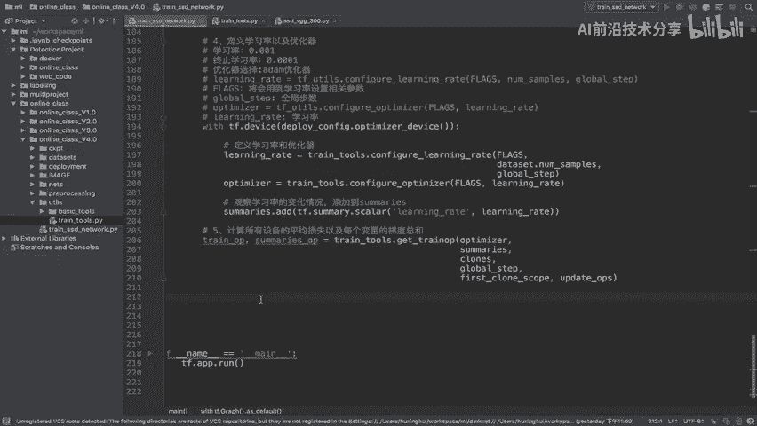

```python
train_op, summary_scalar_op = train_tools.get_a_train_op(
    optimizer=optimizer,
    summaries=summaries,
    clones=clones,
    global_step=global_step,
    update_ops=update_ops,
    variables_to_train=variables_to_train
)
```

*   **`train_op`**: 这是训练操作（Operation），它封装了计算梯度并应用更新（如 `optimizer.apply_gradients`）的逻辑。
*   **`summary_scalar_op`**: 这是用于记录标量摘要（如损失值）的操作，便于在TensorBoard等工具中可视化。

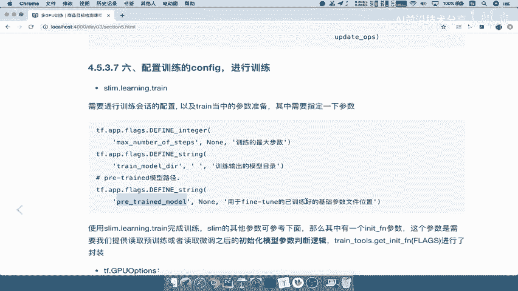

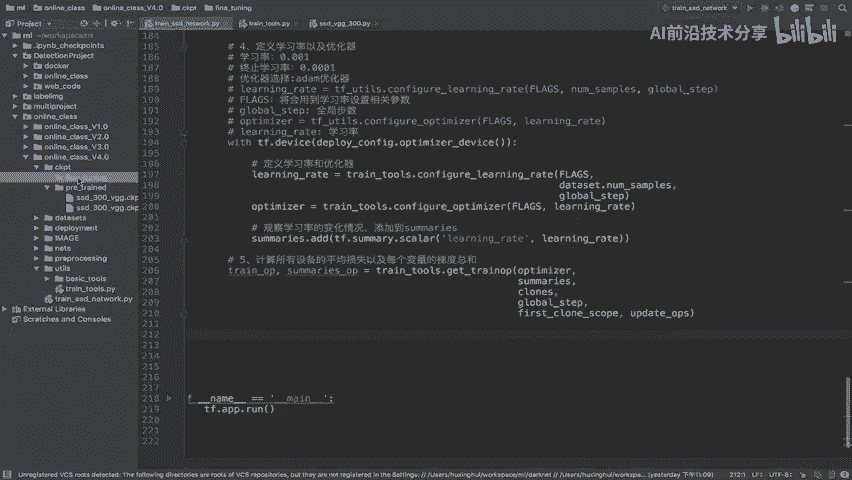

该函数内部主要完成以下工作：
1.  聚合所有计算设备（GPU）上的损失值，计算**总损失**。
2.  收集所有设备上对同一变量计算出的梯度，并计算其**平均值**。梯度平均是数据并行分布式训练的标准做法，公式可表示为：
    `平均梯度 = (设备1梯度 + 设备2梯度 + ... + 设备N梯度) / N`
3.  使用优化器（如Adam、SGD）和这些平均梯度来更新模型变量。
4.  返回用于执行训练和记录摘要的OP。

## 第六步：配置训练会话并启动训练 ⚙️

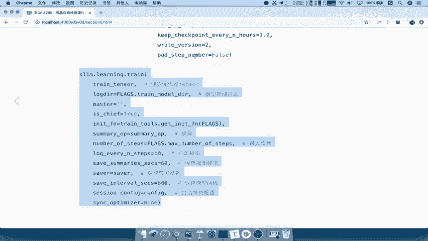

在获得了训练操作 `train_op` 后，我们需要配置训练会话并启动实际的训练循环。这一步涉及设置训练步数、模型保存、日志记录等参数。

以下是启动训练的核心代码结构：

```python
slim.learning.train(
    train_op=train_op,
    logdir=train_model_dir,
    master=FLAGS.master,
    is_chief=FLAGS.task == 0,
    init_fn=init_fn,
    summary_op=summary_scalar_op,
    number_of_steps=FLAGS.number_of_steps,
    log_every_n_steps=FLAGS.log_every_n_steps,
    save_summaries_secs=FLAGS.save_summaries_secs,
    save_interval_secs=FLAGS.save_interval_secs,
    saver=saver,
    session_config=config
)
```

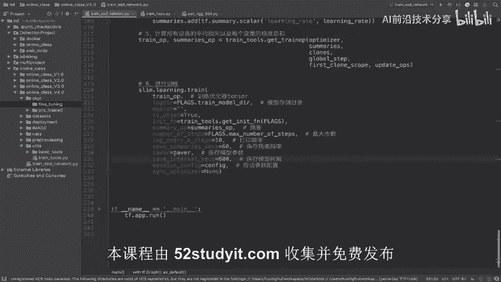

### 配置会话参数 (Session Config)

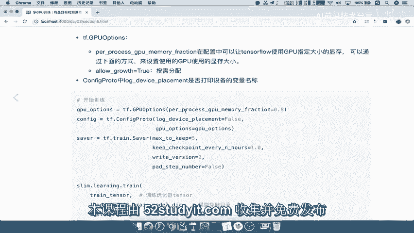

在创建 `slim.learning.train` 所需的 `config` 时，我们通常进行如下设置，以控制训练过程的行为：

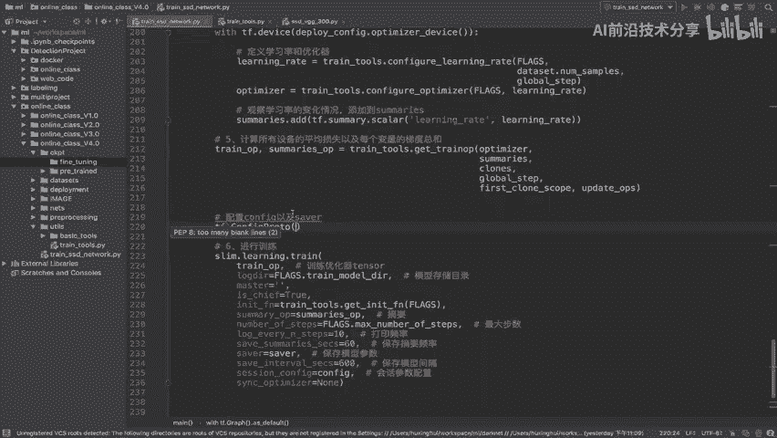

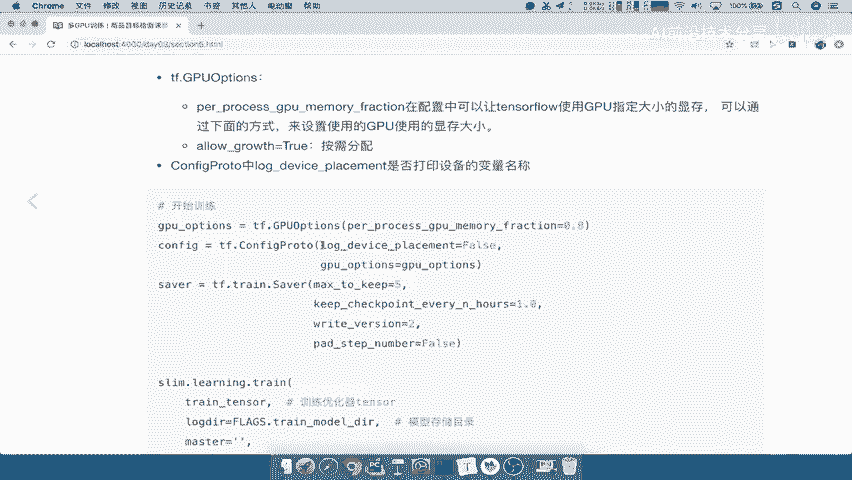

```python
config = tf.ConfigProto(
    log_device_placement=False,  # 是否打印每个操作所在的设备，通常设为False以避免输出过于冗长
    allow_soft_placement=True,   # 允许当指定设备不存在时，自动分配到其他可用设备
    gpu_options=tf.GPUOptions(per_process_gpu_memory_fraction=0.8)  # 限制每个GPU进程的内存使用率为80%，防止内存耗尽
)
```

### 配置模型保存器 (Saver)

`saver` 负责保存和恢复模型的检查点（checkpoint）。可以配置其保留最新模型的数量和保存策略。

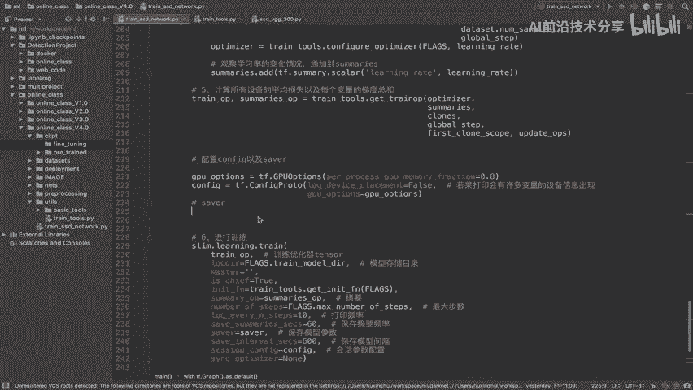

```python
saver = tf.train.Saver(
    max_to_keep=5,               # 最多保留5个最新的检查点文件
    keep_checkpoint_every_n_hours=0.5,  # 每0.5小时额外保留一个检查点
    pad_step_number=False        # 是否用0填充步数编号
)
```

### 初始化函数 (Init Function)

`init_fn` 是一个关键参数，它定义了模型参数的初始化逻辑。其核心作用是处理**预训练模型加载**与**微调模型恢复**的优先级。

以下是 `init_fn` 的典型逻辑：
1.  检查 `finetuning_dir`（微调输出目录）下是否存在已保存的模型。如果存在，则从中恢复，因为这是基于当前数据集训练得到的最新、最相关的参数。
2.  如果不存在，则从 `pretrain_dir`（预训练模型目录）加载基础权重。这通常是在大规模通用数据集（如ImageNet）上预训练的模型。
3.  通过 `train_tools.get_init_fn()` 函数可以实现这一逻辑。

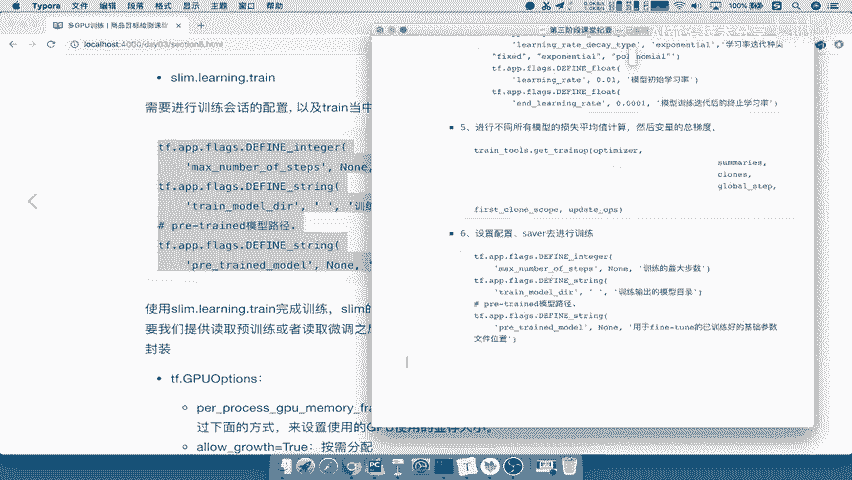

---

## 总结 📝

本节课中我们一起学习了分布式训练流程的最后两个环节：
1.  **计算总损失与平均梯度**：我们使用 `train_tools.get_a_train_op` 函数聚合所有GPU设备的损失，并计算每个可训练变量的梯度平均值，为优化器提供更新依据。
2.  **配置并启动训练**：我们详细介绍了 `slim.learning.train` 函数的各项参数，包括会话配置（控制设备与内存）、模型保存器设置以及至关重要的参数初始化函数 `init_fn`。`init_fn` 确保了训练能从正确的检查点（优先微调模型，其次预训练模型）开始，使训练过程能够高效、稳定地进行。

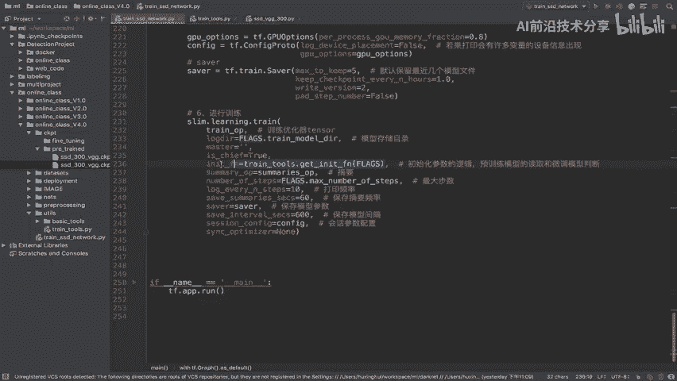

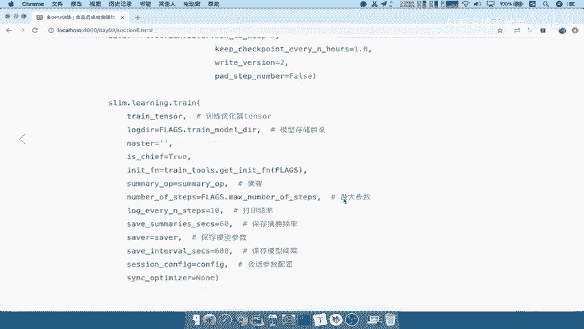

至此，一个完整的分布式模型训练配置流程就构建完成了。