# 课程 P72：SSD模型训练流程总结 🚀

在本节课中，我们将学习并总结SSD（Single Shot MultiBox Detector）模型的完整训练流程。我们将从代码运行开始，逐步讲解训练过程中的关键步骤，包括参数设置、数据读取、损失计算、优化器定义以及使用TensorBoard进行可视化监控，最后对整个训练流程进行梳理和总结。

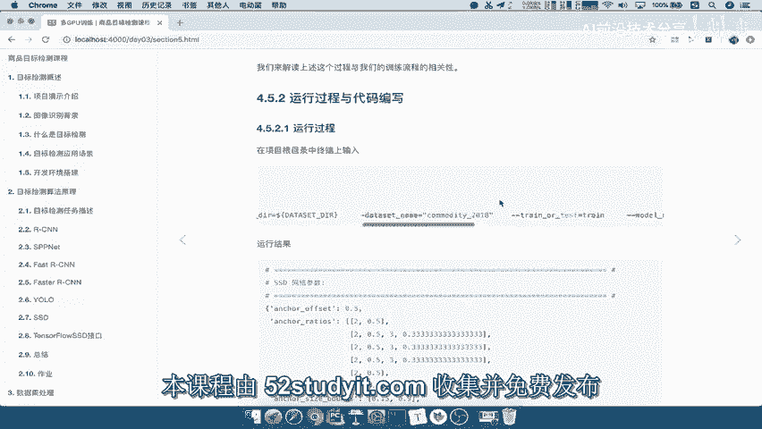

---

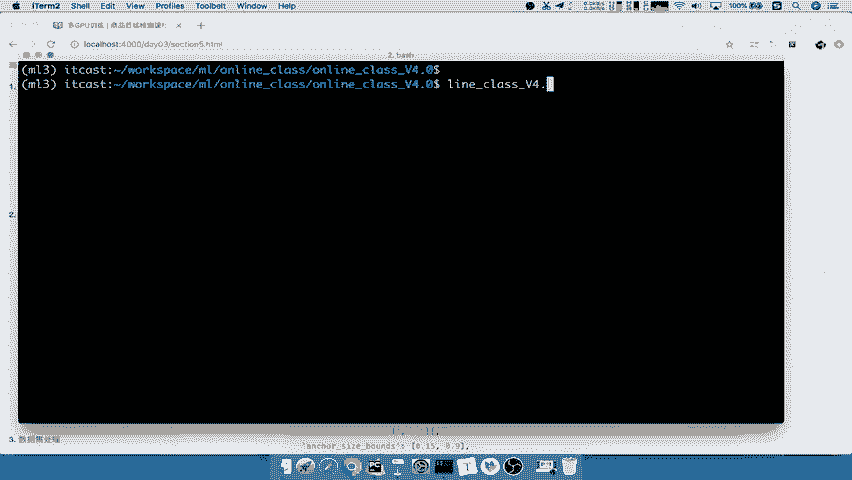

## 运行训练代码

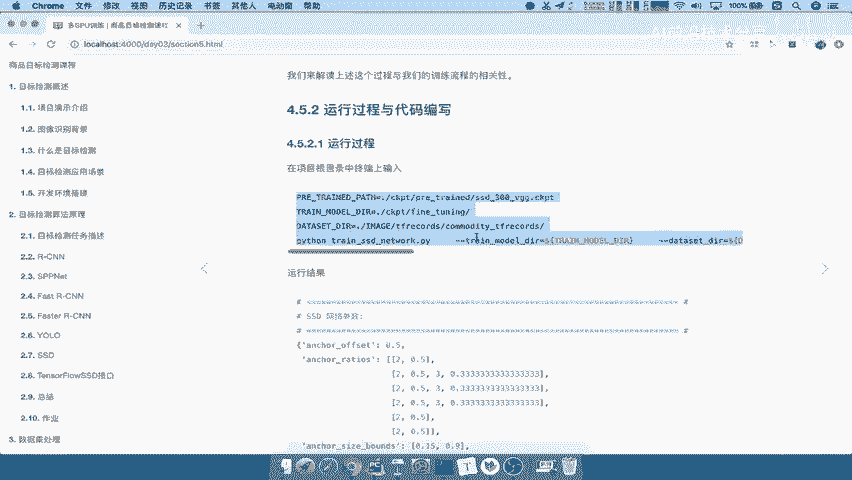

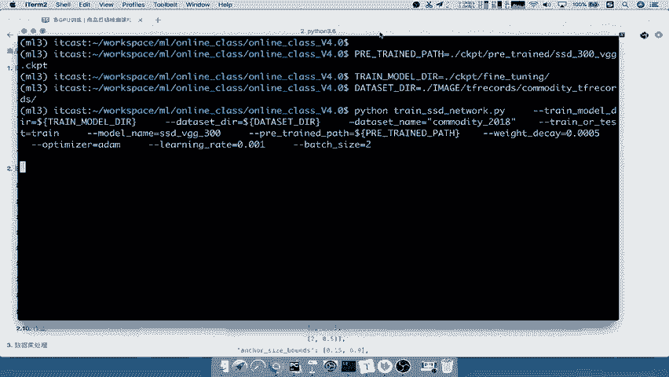

上一节我们介绍了训练代码的编写，本节中我们来看看如何运行它并开始训练过程。

我们直接运行之前编写的训练代码。代码中涉及的参数与之前定义的参数完全一致，包括预训练模型路径（`CKPT`）和微调模型的保存路径。

以下是运行命令示例：
```bash
python train_ssd_network.py --ckpt_path=./pretrained_model --save_dir=./finetuned_model
```

注意，我们的训练脚本位于 `train_ssd_network` 目录下。在终端中粘贴并执行上述命令。

在运行前，需要关闭代码中用于调试的Tensor打印语句，以避免输出混乱。找到代码中变换形状或打印张量的位置，将其注释或关闭。

运行成功后，控制台会显示读取了数据文件，并提示每批次（batch）加载的数据量。例如，GD训练可能设置为每批次2个数据。批次大小可以根据你的硬件和数据集情况随意指定，只要总训练步数和数据集足够即可。

训练过程现在已经开始。由于模型计算量庞大，训练可能非常耗时，使用GPU训练也可能需要一至数天时间。因此，在课堂演示中，我们使用现成模型进行训练，其效果可能不是最优的。在实际应用中，通常会使用已经训练了较长时间（例如两到三天）的模型以获得更好性能。

训练时，可以观察控制台输出的每秒步数（steps per second）。由于计算复杂，这个数值通常会非常小。

---

## 监控训练过程

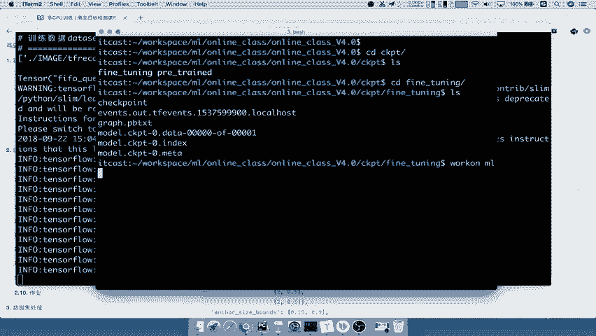

当训练开始后，模型文件会保存到指定的 `CKPT` 目录下的 `finetuning` 文件夹中。同时，会生成一个用于TensorBoard可视化的 `summary` 目录。

为了监控训练过程，我们可以新建一个终端，启动TensorBoard服务来观察训练指标。

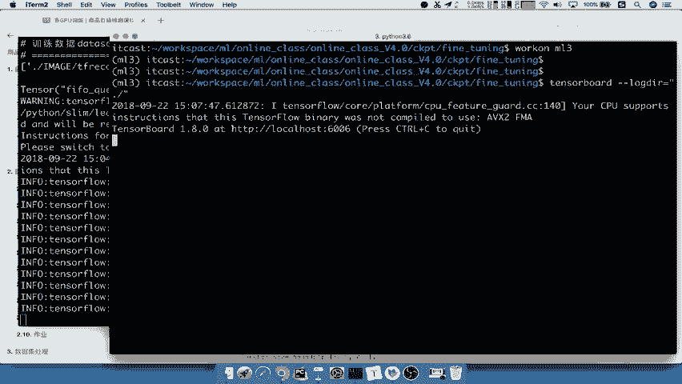

以下是操作步骤：
1.  首先，激活你的Python虚拟环境，因为TensorBoard依赖该环境。
2.  切换到你的工作空间和项目目录。
3.  进入保存summary日志的目录（通常是 `CKPT/finetuning` 下的某个文件夹）。
4.  运行TensorBoard命令。

示例命令如下：
```bash
source activate your_env_name
cd /workspace/detection_ml/online/v4
tensorboard --logdir=.
```

运行后，TensorBoard会启动一个本地服务。我们可以在浏览器中打开提供的地址（通常是 `http://localhost:6006`）来观察训练进程。

在TensorBoard中，我们可以查看以下内容：
*   **Scalars（标量）**：这里记录了全局训练步数（`global_step`）、损失值（`loss`）以及学习率（`learning_rate`）的变化曲线。这是我们最关心的部分，用于判断模型是否在有效学习。
*   **Images（图像）**：这里展示了训练过程中图像经过数据增强（如翻转、颜色变化）后的效果，以及模型预测的边界框与真实标注的对比。
*   **Graphs（计算图）**：这里展示了模型的计算图结构。由于SSD模型结构复杂，此图会非常庞大，通常不需要深入分析。
*   **Histograms（直方图）**：这里展示了模型各层参数（权重、偏置等）的分布变化情况。

目前，由于我们仅训练了很少的步数（例如19步），损失曲线可能呈现不稳定的状态，甚至暂时升高。随着训练步数增加，损失曲线通常会逐渐下降并趋于平缓。在演示中，我们暂停了训练，因此无法看到完整的收敛曲线。在实际训练中，你可以通过TensorBoard持续观察损失变化，以判断训练是否正常。

观察完毕后，可以关闭TensorBoard服务。

---

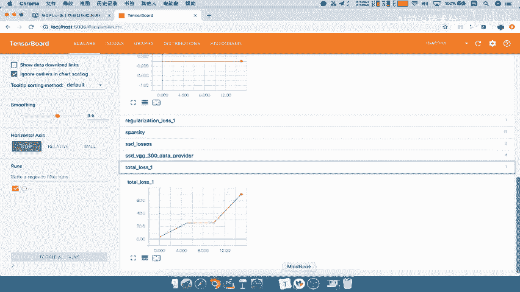

## 训练流程总结 🧠

整个训练程序虽然代码复杂，但我们可以按照清晰的数据流和操作流程来理解。

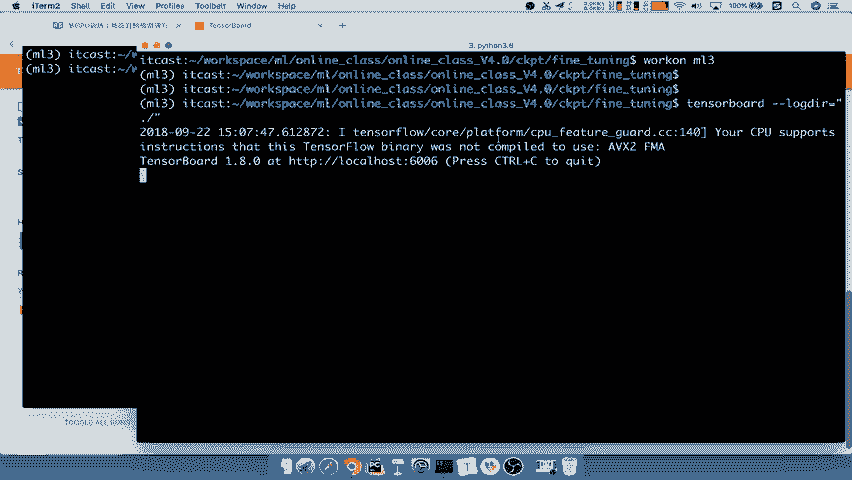

以下是训练流程的核心步骤总结：

1.  **初始化设置**
    *   定义训练设备（如GPU或CPU）。
    *   定义全局步数（`global_step`）变量，用于记录训练进度。

2.  **数据准备**
    *   读取数据集。
    *   对数据进行预处理和增强（如缩放、翻转）。
    *   对先验框（anchor boxes）进行编码，标记正负样本。

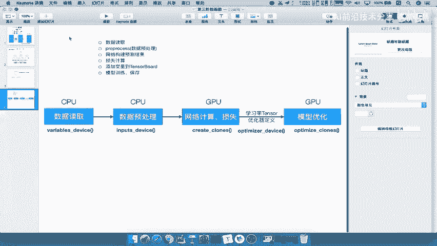

3.  **前向传播与损失计算**
    *   定义SSD网络结构。
    *   将数据输入网络，得到预测结果。
    *   计算损失（`loss`），包括定位损失（localization loss）和置信度损失（confidence loss）。

4.  **监控与可视化**
    *   添加TensorBoard的summary操作，用于监控损失、学习率等标量，以及图像和参数直方图。

5.  **优化器配置**
    *   定义学习率及其变化策略（如指数衰减）。
    *   定义优化器（如Adam或SGD），用于更新网络参数。

6.  **梯度计算与参数更新（分布式训练关键）**
    *   在每个GPU设备上独立计算损失和梯度。
    *   将所有GPU计算出的梯度汇总到CPU。
    *   由CPU统一执行优化器步骤，更新所有设备上的模型参数。

7.  **模型保存**
    *   定期将训练好的模型参数保存到指定路径（如`.ckpt`文件），以便后续评估或继续训练。

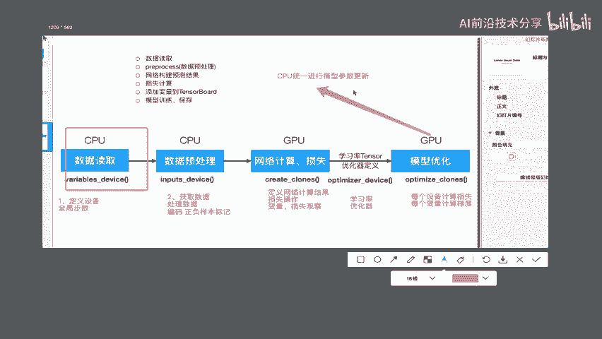

---

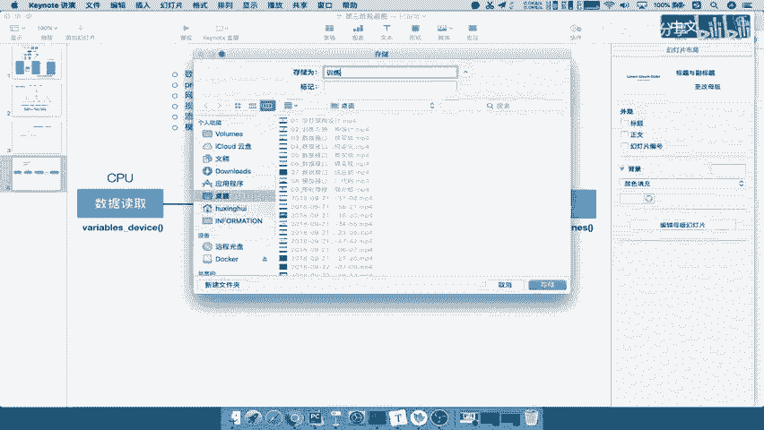

本节课中我们一起学习了SSD模型的完整训练流程。我们从运行训练脚本开始，了解了如何设置参数并启动训练。接着，我们学习了如何使用TensorBoard工具来可视化监控训练过程中的关键指标，如损失曲线和学习率。最后，我们系统性地总结了训练代码的七个核心步骤：从初始化、数据准备、前向计算损失，到配置优化器、计算梯度、更新参数以及保存模型。理解这个流程对于掌握任何深度学习模型的训练都至关重要。