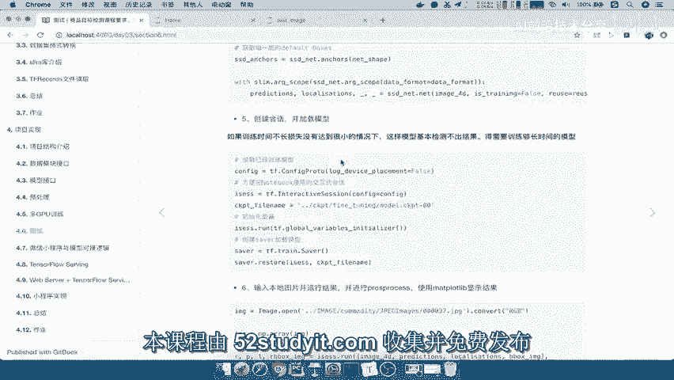
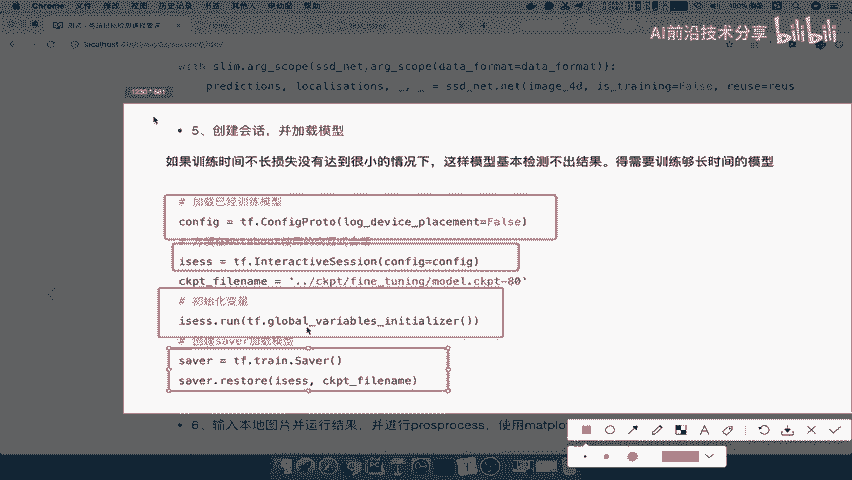
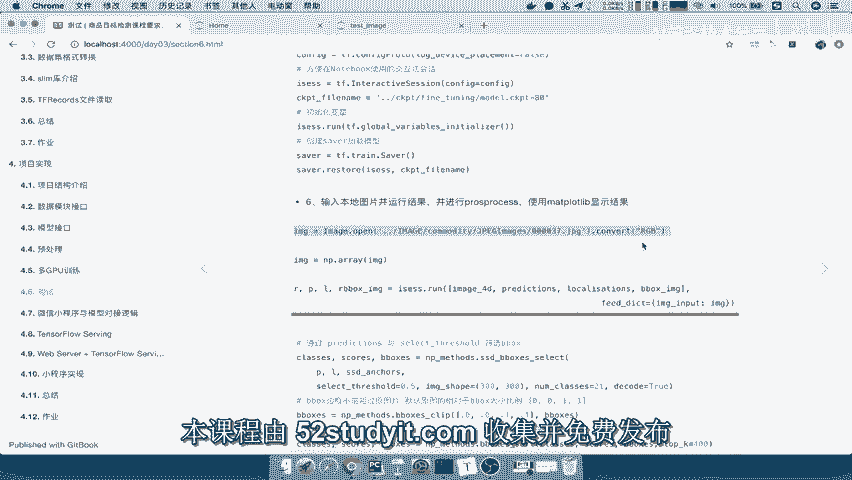
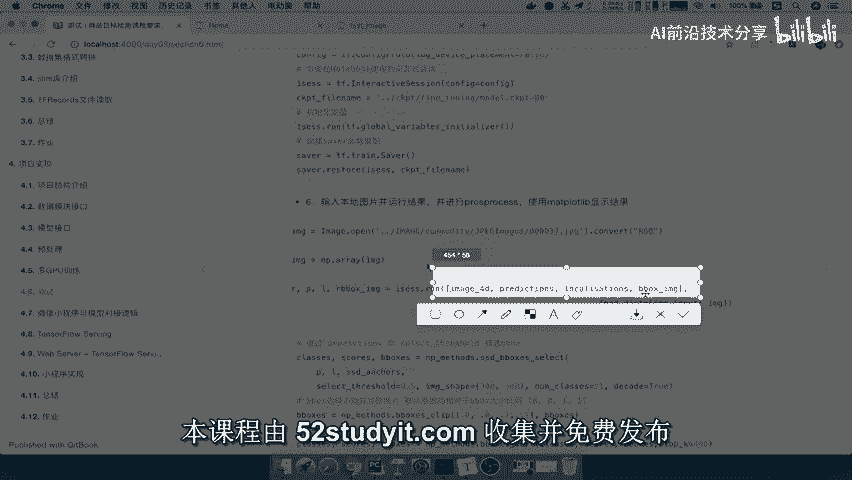
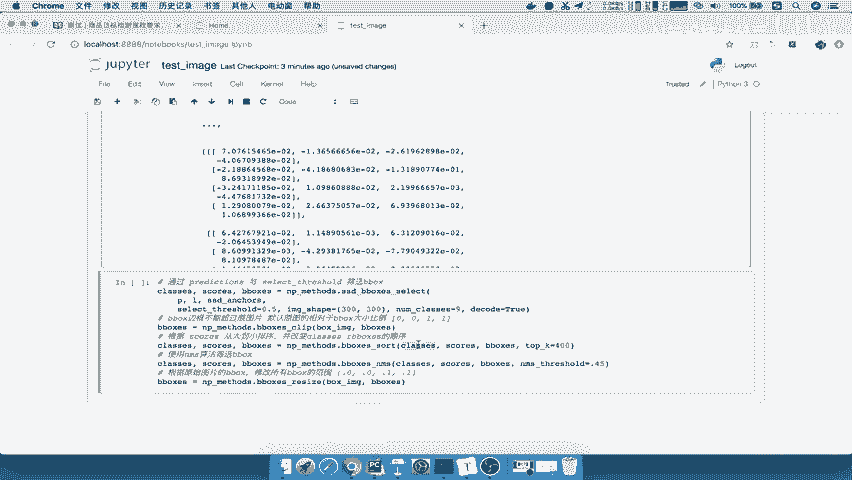
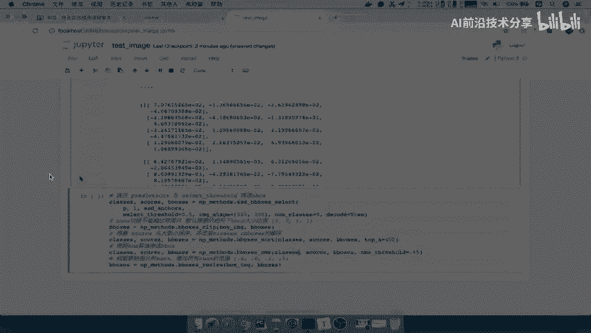
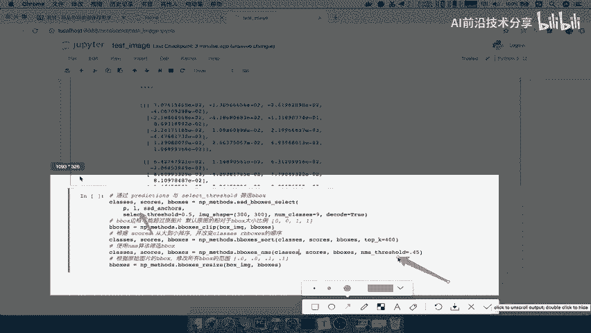
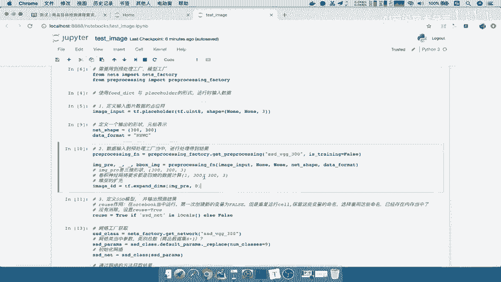

# 课程P74：74.02_测试：图片输入与结果标记 🖼️➡️📦



在本节课中，我们将学习如何加载已训练好的模型，输入一张图片，运行模型进行预测，并对预测结果（如物体位置框）进行筛选和可视化标记。我们将一步步完成从模型加载到结果展示的整个测试流程。

---



## 创建会话与加载模型

上一节我们完成了模型的训练与保存，本节中我们来看看如何加载模型并进行测试。首先，我们需要创建一个TensorFlow会话并加载之前保存的模型文件。

以下是创建交互式会话并加载模型的关键步骤：

1.  **创建交互式会话**：使用 `tf.InteractiveSession` 并配置相关参数，这便于在Notebook等交互式环境中使用。
2.  **初始化全局变量**：运行 `tf.global_variables_initializer()` 来初始化计算图中的所有变量。
3.  **创建Saver并恢复模型**：创建一个 `tf.train.Saver` 对象，并使用 `saver.restore()` 方法从指定的检查点文件（`.ckpt`）中恢复模型参数。

```python
# 示例代码
import tensorflow as tf

# 1. 创建交互式会话
sess = tf.InteractiveSession(config=tf.ConfigProto(log_device_placement=False))

# 2. 初始化全局变量
sess.run(tf.global_variables_initializer())

# 3. 创建Saver并加载模型
saver = tf.train.Saver()
model_path = ‘../ckpt/finetuning/model.ckpt-0‘ # 请替换为你的模型路径
saver.restore(sess, model_path)
```

**注意**：模型的效果取决于训练时长。仅训练几分钟的模型可能无法准确识别物体，因此在实际应用中应使用充分训练后的模型。



---



## 准备输入图片并运行模型

模型加载完毕后，下一步是准备输入数据。我们需要读取一张图片，并将其处理成模型可接受的格式（例如，调整尺寸、转换为数组、扩充维度等）。

以下是处理输入图片并运行模型进行预测的步骤：

1.  **读取并转换图片**：使用图像处理库（如PIL）打开图片，并将其转换为RGB格式的数组。
2.  **运行会话获取预测结果**：通过 `sess.run()` 方法，将处理后的图片数据传入模型的输入占位符，运行计算图，获取模型的输出张量。这些输出通常包括预测类别概率、边界框位置等信息。

```python
# 示例代码
from PIL import Image
import numpy as np

# 1. 读取并转换图片
image_path = ‘../images/commodity/example.jpg‘ # 请替换为你的图片路径
img = Image.open(image_path).convert(‘RGB‘)
img_array = np.array(img) # 将图片转换为numpy数组

# 2. 运行模型预测
# 假设 ‘image_input‘ 是模型的输入占位符，‘predictions‘ 和 ‘localizations‘ 是输出张量
feed_dict = {image_input: img_array}
predictions, localizations, bbox_image = sess.run([predictions_tensor, localizations_tensor, bbox_image_tensor], feed_dict=feed_dict)
```

---

## 筛选与处理预测结果

模型直接输出的原始结果通常包含大量预测框，我们需要对其进行筛选，只保留可能性高且位置准确的框。这个过程主要涉及分数阈值筛选和非极大值抑制。

以下是使用工具函数进行结果后处理的步骤：

1.  **获取锚框（Anchors）**：从网络定义中获取预定义的锚框（Default Boxes），用于后续的解码和筛选。
2.  **调用后处理方法**：使用提供的工具函数（如 `np_methods` 中的方法）对原始预测结果进行解码、阈值筛选、排序和非极大值抑制（NMS）操作。这些步骤是目标检测中的标准后处理流程。
3.  **关键参数**：
    *   `select_threshold`：分数阈值，低于此值的预测框将被直接过滤掉。
    *   `nms_threshold`：NMS操作的阈值，用于合并重叠度过高的框。调整这些参数可以控制筛选的严格程度。

```python
# 示例代码（概念性展示）
# 假设 ssd_anchors 是获取的锚框，np_methods 是后处理模块
from utils import np_methods

# 1. 获取锚框
ssd_anchors = ssd_net.anchors(net_shape) # net_shape 是网络输入形状

# 2. 进行后处理筛选
# 该函数内部完成了解码、阈值筛选、排序和NMS
rscores, rbboxes = np_methods.ssd_bboxes_select(
    predictions, localizations, ssd_anchors,
    select_threshold=0.5, nms_threshold=0.45,
    num_classes=9, decode=True)
```



---





## 可视化标记最终结果

最后，我们将筛选出的边界框和类别标签在原图上进行可视化标记，直观地查看模型的检测效果。

以下是使用可视化工具绘制结果框的步骤：

1.  **准备原图数据**：确保用于绘制的图片是原始的numpy数组格式。
2.  **调用绘图函数**：使用可视化工具（如 `utils.visualization` 模块中的函数），传入原图、预测的类别、分数和边界框坐标，函数会自动在图片上绘制标记。

```python
# 示例代码
from utils import visualization

# 1. 确保图片是numpy数组
image_to_draw = np.array(img) # 使用原图

# 2. 可视化结果
visualization.plt_bboxes(image_to_draw, predicted_classes, rscores, rbboxes)
```

运行上述代码后，程序会显示一张带有检测框和类别标签的图片。如果模型训练充分，你将能看到准确的物体检测结果。



---

## 课程总结

本节课中我们一起学习了完整的模型测试流程：

1.  **创建会话与加载模型**：我们使用 `tf.InteractiveSession` 和 `tf.train.Saver` 来恢复已保存的模型参数。
2.  **准备与输入数据**：我们学习了如何读取图片，将其转换为合适的格式，并通过 `sess.run()` 输入模型。
3.  **结果后处理**：我们了解了目标检测后处理的核心步骤，包括使用**分数阈值筛选**和**非极大值抑制（NMS）** 来过滤冗余的预测框。这些步骤通常由封装好的工具函数（如 `np_methods`）完成。
4.  **结果可视化**：最后，我们使用绘图工具将筛选后的边界框和类别标签绘制在原图上，直观评估模型性能。

记住，测试结果的准确性高度依赖于所加载模型的训练质量。一个训练充分的模型是获得良好检测效果的前提。通过本教程，你已经掌握了从加载模型到可视化结果的完整测试链路。