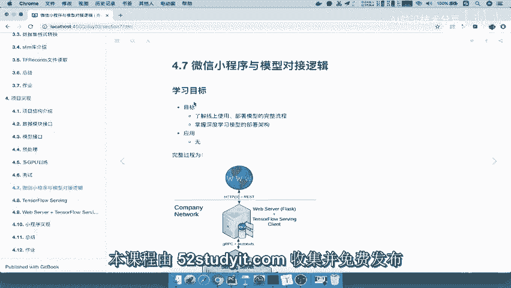
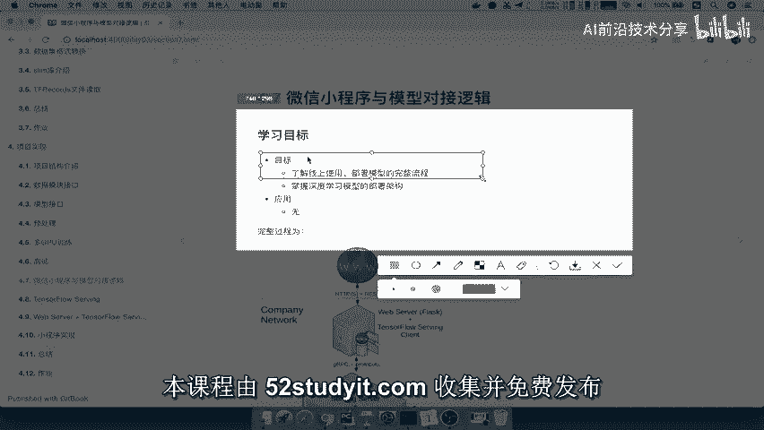
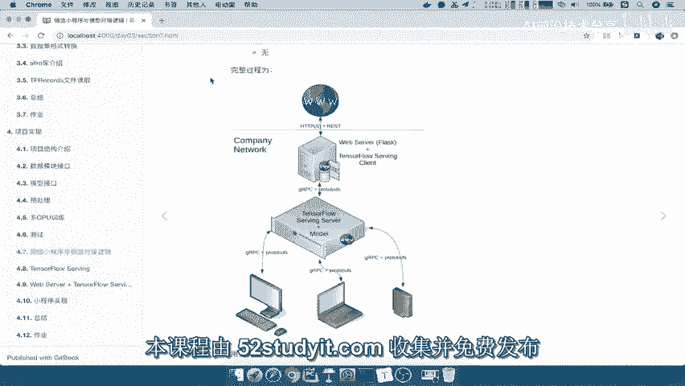
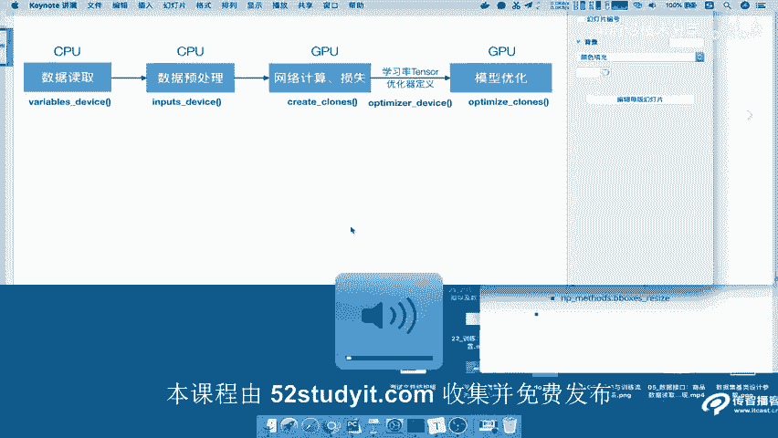
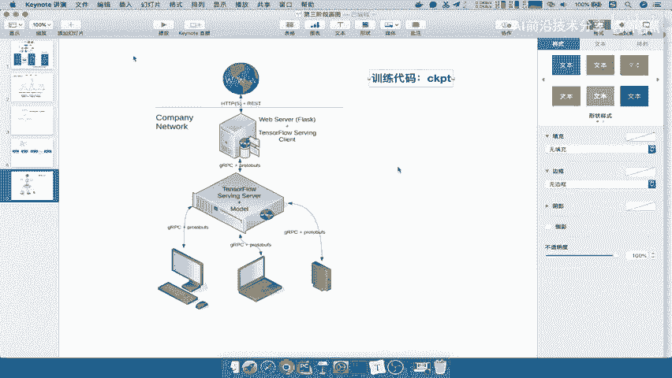
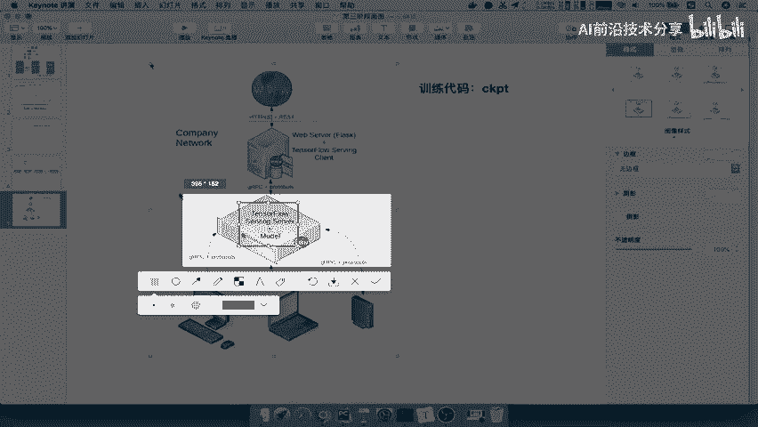
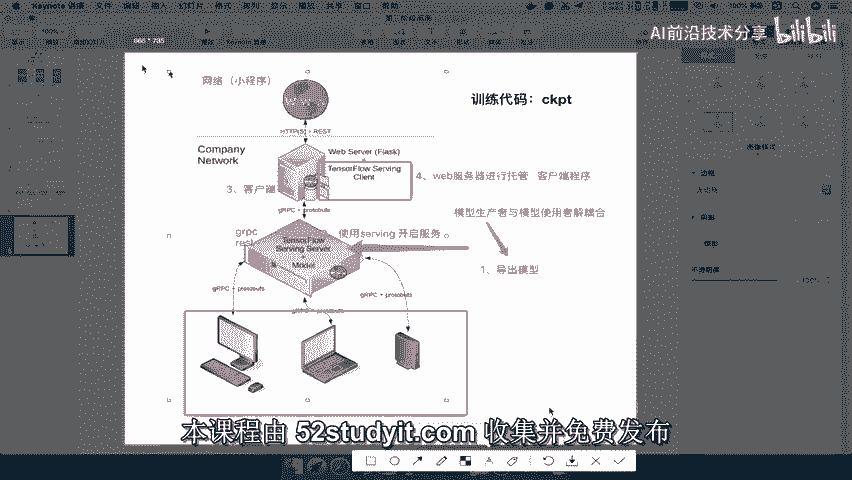
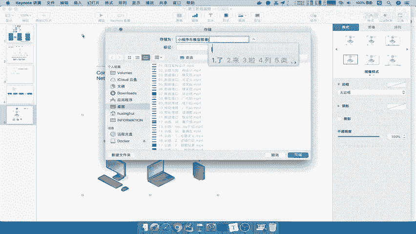

# 课程 P75：75.01 微信小程序与模型部署流程关系介绍 🚀

在本节课中，我们将要学习如何将训练好的AI模型部署到线上，并与微信小程序进行对接。我们将重点了解整个线上部署的流程和所使用的技术架构。

## 概述

首先，我们来介绍整个逻辑流程。我们的学习目标是了解线上部署的流程以及部署架构中使用的技术。

## 部署架构图解析

为了清晰地描述整个架构流程，我们参考下面这张图。

接下来，我们将对这张图进行详细解析。

### 模型文件与部署

我们之前通过训练代码得到的是模型文件，通常保存为 `CKPT` 格式。然而，这个文件并不能直接用于线上部署，我们需要单独进行部署工作。

### TensorFlow Serving 服务器

在架构图中，中间部分是 **TensorFlow Serving Server**。它的作用是将我们导出的模型部署在线上服务器上。

部署完成后，这个服务器将提供模型服务。这里的关键目的是实现模型生产者与模型使用者的解耦合。

模型生产者只需导出模型，并将其上传到服务器。然后，使用 **TensorFlow Serving** 开启服务。该服务会通过两种接口提供访问：**gRPC** 和 **REST**。

### 客户端与 Web 服务器

作为模型使用者（例如本地电脑或手机），我们需要一个客户端程序来请求这个服务。这个客户端被称为 **TensorFlow Serving Client**。

客户端通过 **gRPC** 协议与服务器通信，获取模型的输入和输出结果。通常，我们会将这个客户端程序托管在一个 **Web 服务器** 上。

Web 服务器负责对外提供网络接口。例如，微信小程序可以通过网络首先访问 Web 服务器，Web 服务器再将请求转交给客户端程序，客户端程序最终通过 TensorFlow Serving 获取结果并返回。

在整个通信过程中，如果使用 gRPC，通常会遵循 **Protocol Buffers** 协议。

## 核心流程总结

以上就是小程序与模型部署之间的整体关系。我们可以将整个过程梳理为以下四个步骤：

以下是实现对接的四个核心步骤：
1.  **导出模型**：模型生产者将训练好的模型导出为可部署的格式。
2.  **开启服务**：使用 TensorFlow Serving 将导出的模型部署在服务器上并开启服务。
3.  **客户端访问**：编写客户端程序，通过 gRPC 协议访问 TensorFlow Serving 服务。
4.  **Web 托管**：将客户端程序托管在 Web 服务器上，对外提供 API 接口供小程序调用。

## 总结

本节课中，我们一起学习了微信小程序与 AI 模型对接的完整部署流程。我们了解了从模型导出、使用 TensorFlow Serving 部署服务，到通过客户端和 Web 服务器搭建桥梁，最终让小程序能够调用模型的核心步骤。理解这个架构是进行实际项目开发的基础。

