# 课程 P77：模型导出 - 模型输入输出定义 🚀

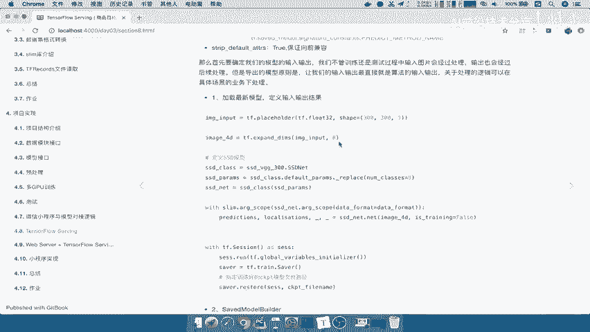

在本节课中，我们将学习如何为训练好的SSD模型定义清晰的输入和输出，这是将模型导出以供后续部署或服务的关键第一步。我们将创建一个独立的脚本，明确指定模型接收的数据格式和返回的预测结果。

---

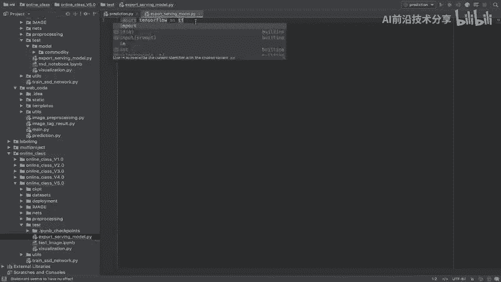

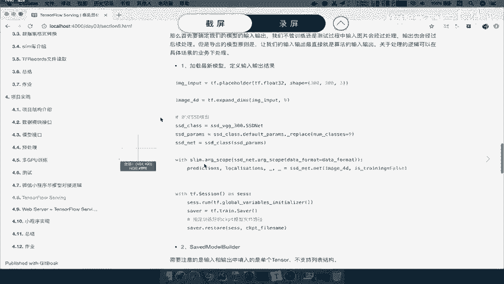

## 1. 创建模型导出脚本

上一节我们介绍了模型导出的基本概念，本节中我们来看看如何具体实现。首先，我们需要创建一个新的Python文件来编写导出逻辑。

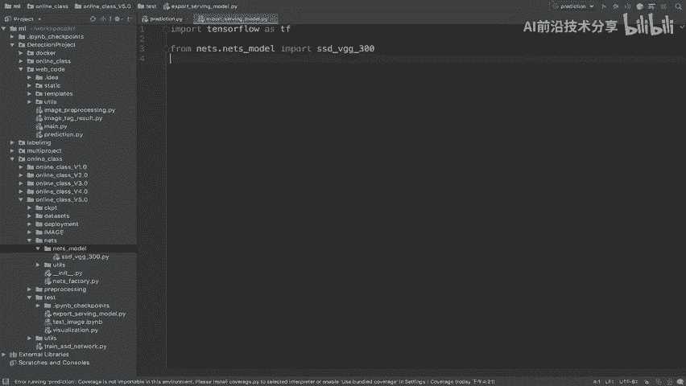

我们在项目目录的 `test` 文件夹下新建一个文件，命名为 `export_serving_model.py`。

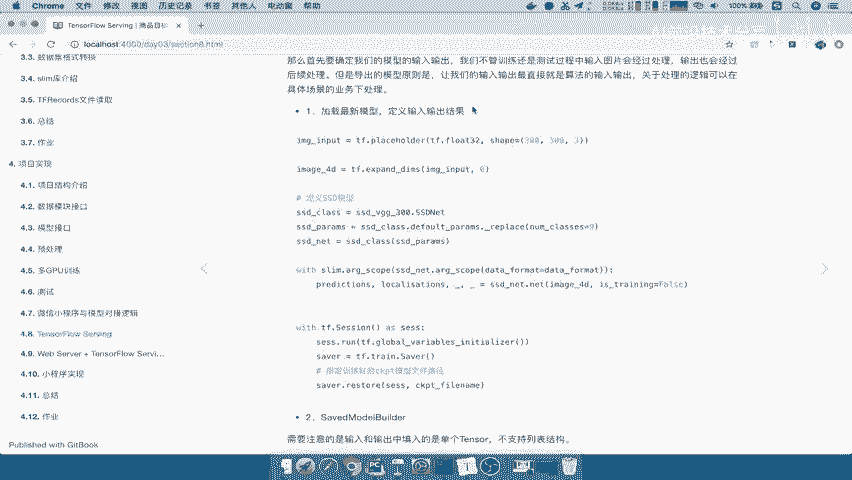

以下是创建文件后需要导入的基础库和模块：

```python
import os
import sys
import tensorflow as tf
```

为了能够正确导入项目内的网络结构，我们需要将项目根目录添加到系统路径中。

```python
sys.path.append('..')
from nets import ssd_vgg_300
```

## 2. 定义主函数与模型图

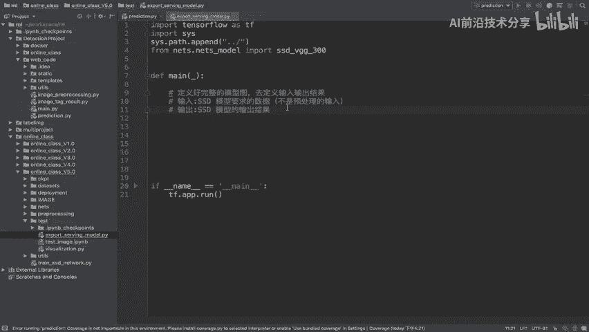

接下来，我们定义程序的主入口。我们将使用 `tf.app.run()` 来运行我们的脚本。

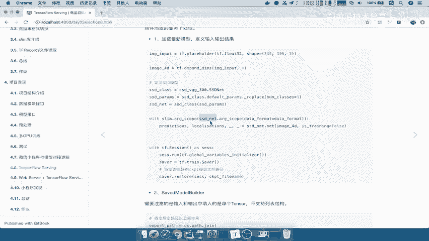

```python
def main(_):
    # 模型定义代码将写在这里
    pass

if __name__ == '__main__':
    tf.app.run()
```

## 3. 明确模型输入

模型输入必须是经过预处理后、可以直接输入网络的数据格式。对于SSD VGG 300模型，输入是固定尺寸的RGB图像。

我们使用TensorFlow的占位符来定义输入。注意，这里定义的是模型期望的输入，而不是原始的、未处理的图片。

```python
    # 定义输入占位符，数据类型为float32，形状为 [height, width, channels]
    image_input = tf.placeholder(dtype=tf.float32, shape=[300, 300, 3], name='image_input')
```

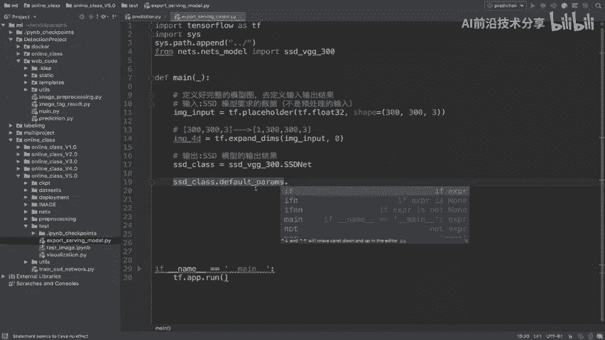

由于网络通常需要批处理数据，我们需要将三维的张量扩展为四维，增加一个批处理维度。

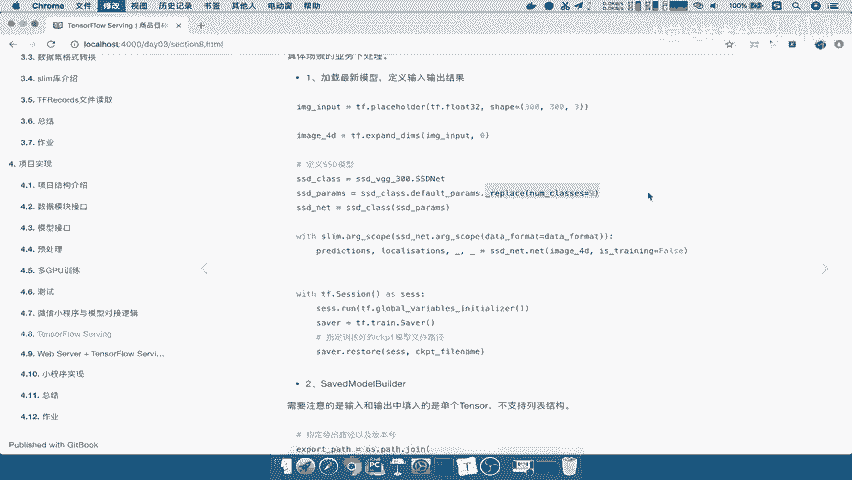

```python
    # 扩展维度，从 [H, W, C] 变为 [1, H, W, C]
    image_4d = tf.expand_dims(image_input, axis=0)
```

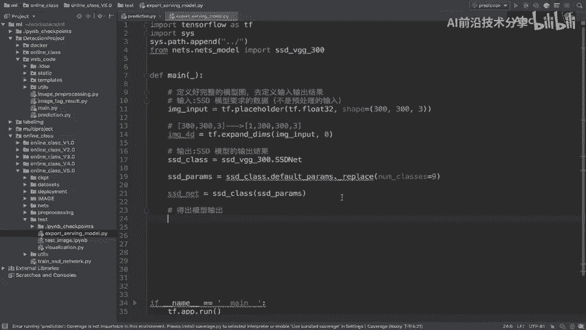

## 4. 构建网络并获取输出

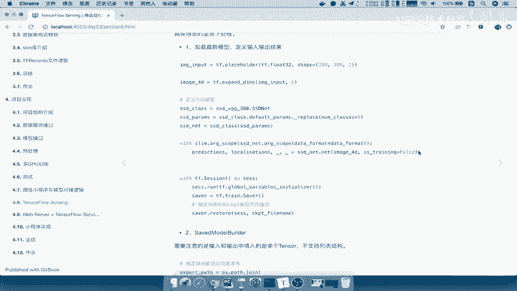

现在，我们将处理后的图像输入到SSD网络中，并获取网络的预测输出。

以下是构建网络并执行前向传播的步骤：

```python
    # 1. 获取默认参数并替换数据格式
    ssd_params = ssd_vgg_300.SSDNet.default_params._replace(data_format='NHWC')
    
    # 2. 实例化SSD网络模型
    ssd_net = ssd_vgg_300.SSDNet(ssd_params)
    
    # 3. 将图像输入网络，设置 is_training=False 以使用推理模式
    predictions, localisations, _, _ = ssd_net.net(image_4d, is_training=False)
```

至此，我们已经完成了模型计算图的定义：输入是 `image_input`，核心输出是 `predictions`（类别预测）和 `localisations`（位置预测）。

## 5. 加载训练好的模型参数

定义好计算图后，我们需要将训练好的权重参数加载到图中，这样模型才具有预测能力。

以下是加载模型权重的标准流程：

```python
    # 开启一个TensorFlow会话
    with tf.Session() as sess:
        # 初始化所有变量
        sess.run(tf.global_variables_initializer())
        
        # 创建Saver对象用于加载模型
        saver = tf.train.Saver()
        
        # 指定训练好的模型检查点文件路径
        ckpt_file_path = '../checkpoints/fine_tuning/model.ckpt-0'
        
        # 从检查点文件恢复模型权重
        saver.restore(sess, ckpt_file_path)
        
        print("模型权重加载完成。")
        # 后续可以在这里进行模型保存（如SavedModel格式）或测试
```

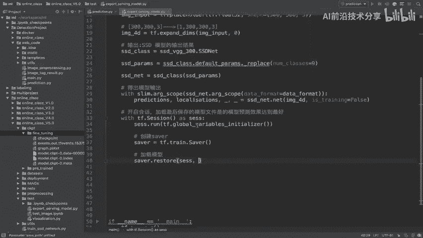

---

本节课中我们一起学习了如何为SSD目标检测模型定义清晰的输入和输出。我们创建了一个独立的脚本，使用占位符明确了模型期望的输入张量格式，并通过网络前向传播得到了预测输出。最后，我们初始化会话并加载了训练好的模型参数，为下一步将模型导出为可服务的格式做好了准备。整个过程的核心是确保模型接口的简洁和明确，便于后续的部署与集成。