# 课程 P78：模型导出：SavedModel 导出模型 🚀

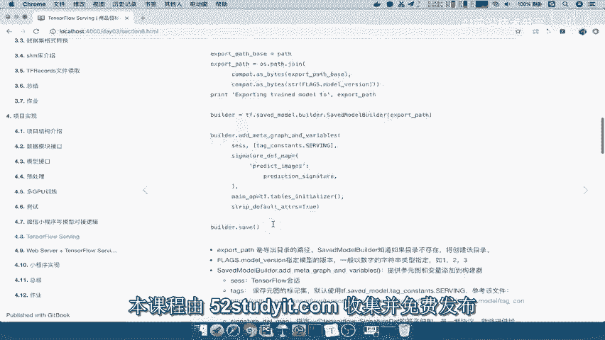

在本节课中，我们将学习如何使用 TensorFlow 的 `SavedModelBuilder` 将训练好的模型导出为 SavedModel 格式。这种格式是用于部署和提供服务的标准格式。

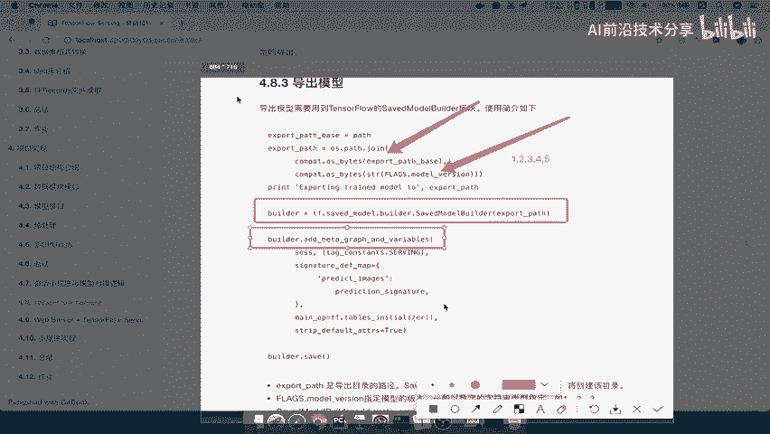

## 概述

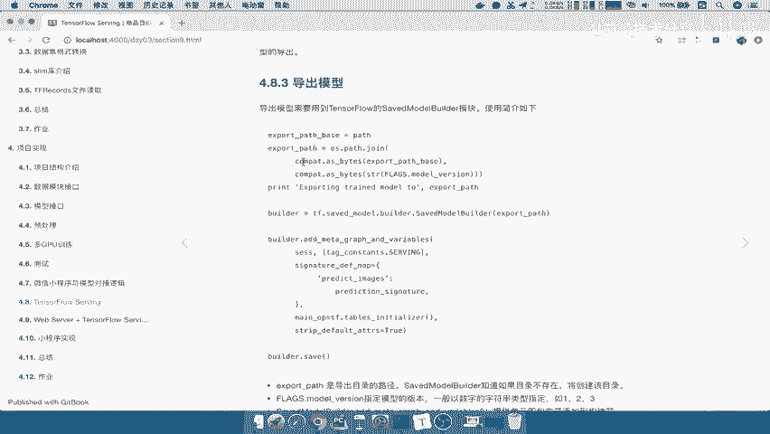

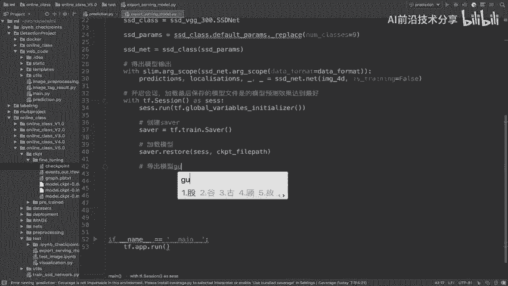

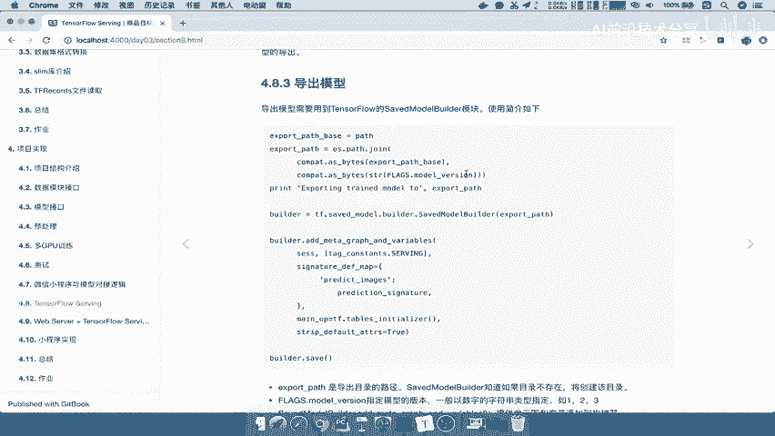

SavedModel 是 TensorFlow 用于保存和加载模型的通用格式。它包含了一个完整的 TensorFlow 程序，包括权重和计算图。导出过程的核心是使用 `tf.saved_model.builder.SavedModelBuilder` 来构建模型，并定义其输入输出的签名（Signature），以便于后续的部署和调用。

## 导出步骤详解

上一节我们介绍了模型训练与保存，本节中我们来看看如何将模型导出为 SavedModel 格式。

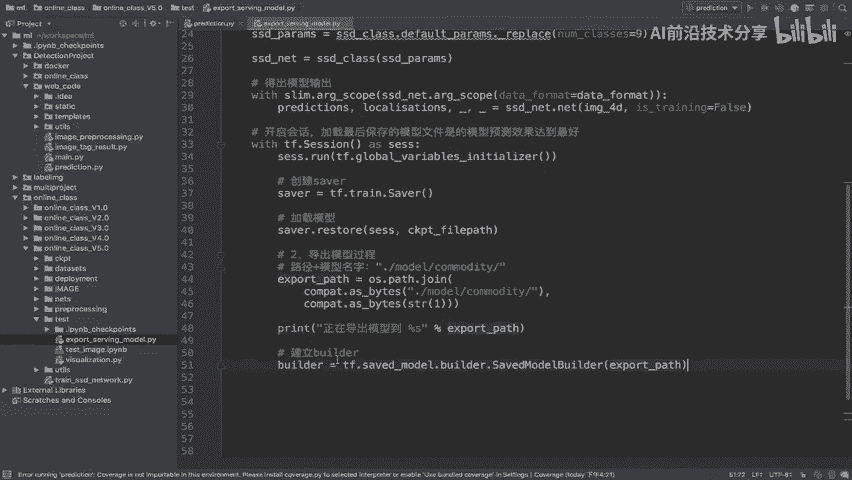

### 第一步：定义导出路径

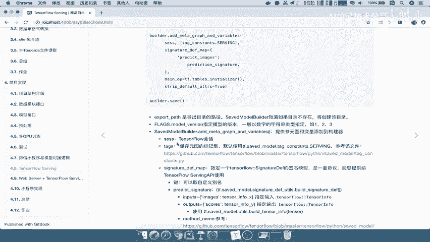

首先，需要指定模型导出的目标路径。该路径通常由基础路径、模型名称和版本号组成。

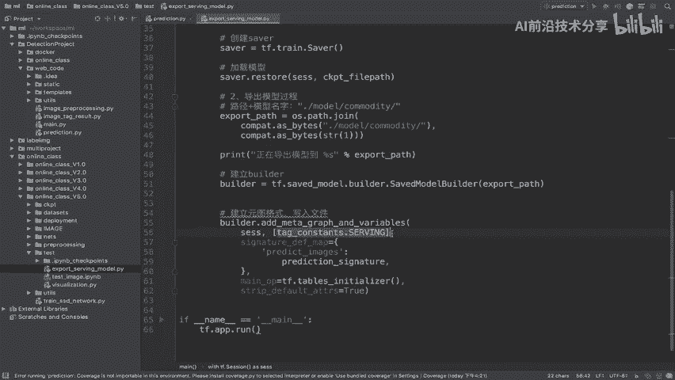

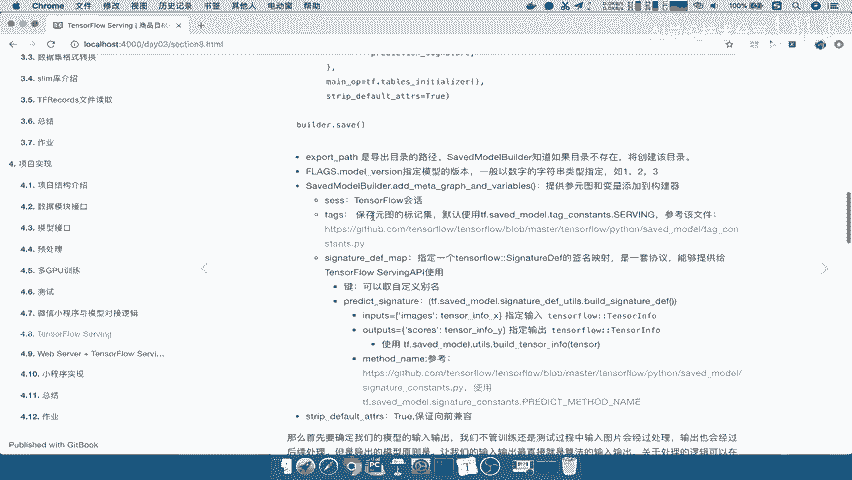

```python
export_path = “./test/model/commodity/1”
```

*   **基础路径**：模型文件存储的根目录。
*   **模型名称**：用于标识模型的字符串，例如 `commodity`。
*   **版本号**：一个数字，用于管理模型的不同版本。TensorFlow Serving 会自动选择版本号最大的模型进行服务。

定义好路径后，可以打印提示信息：
```python
print(“正在导出模型到路径：%s” % export_path)
```

### 第二步：创建 SavedModelBuilder

接下来，我们创建一个 `SavedModelBuilder` 对象。这个构建器（Builder）负责定义模型的导出格式和内容。

```python
builder = tf.saved_model.builder.SavedModelBuilder(export_path)
```

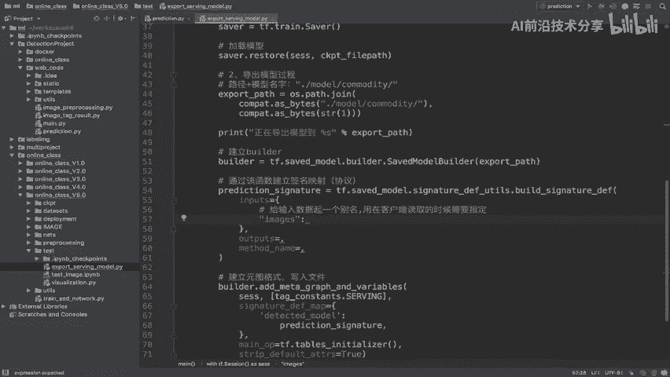

### 第三步：构建并添加模型签名（Signature）

这是导出过程的核心。我们需要定义一个签名，明确地告诉调用者模型的输入和输出是什么。签名是一个协议，它将具体的计算图输入输出张量（Tensor）映射为有意义的名称。

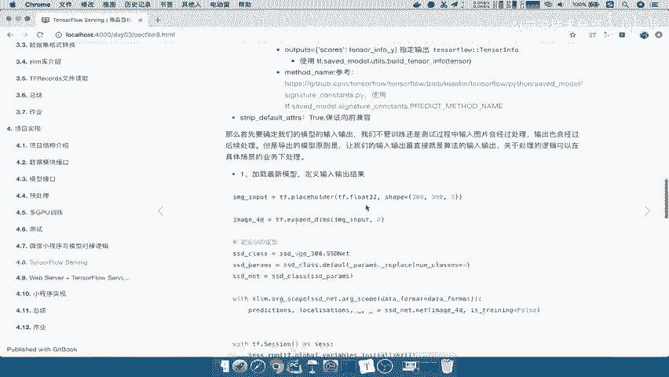

以下是构建签名的关键步骤：

1.  **获取模型输入输出张量**：首先，你需要从你的计算图中获取代表模型输入和输出的张量。假设你的模型输入是一个名为 `input_tensor` 的张量，输出是多个张量，例如 `predictions` 和 `locations`。
    ```python
    # 假设这是你的模型输入占位符或张量
    input_tensor = ...
    # 假设这些是你的模型输出张量
    output_predictions = ...
    output_locations = ...
    ```

2.  **构建签名定义映射**：使用 `tf.saved_model.signature_def_utils.build_signature_def` 函数来创建签名。该函数接收一个字典来定义输入和输出。

    ```python
    # 定义输入部分：给输入张量起一个对客户端友好的别名，例如 ‘images’
    inputs = {‘images’: tf.saved_model.utils.build_tensor_info(input_tensor)}

    # 定义输出部分：同样为每个输出张量起别名。注意，填入的参数必须是单个张量，不能是列表。
    # 如果模型有多个输出，需要分别指定。
    outputs = {
        ‘prediction’: tf.saved_model.utils.build_tensor_info(output_predictions),
        ‘location’: tf.saved_model.utils.build_tensor_info(output_locations)
    }

    # 构建签名定义
    prediction_signature = tf.saved_model.signature_def_utils.build_signature_def(
        inputs=inputs,
        outputs=outputs,
        method_name=tf.saved_model.signature_constants.PREDICT_METHOD_NAME
    )
    ```
    *   `build_tensor_info`: 将 TensorFlow 张量转换为 `TensorInfo` 协议缓冲区，这是签名的一部分。
    *   `method_name`: 指定方法名，对于预测任务，通常使用 `PREDICT_METHOD_NAME`。

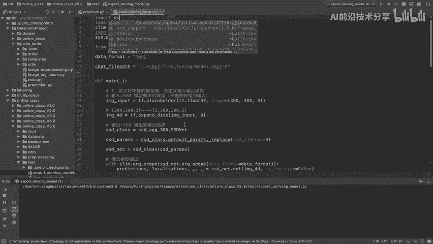

3.  **将签名添加到构建器**：将创建好的签名以字典形式添加到构建器中。字典的键是签名的名称（例如 `‘detected_model’`），值是上一步创建的签名定义。

    ```python
    signature_def_map = {
        tf.saved_model.signature_constants.DEFAULT_SERVING_SIGNATURE_DEF_KEY: prediction_signature
    }
    ```
    这里使用了默认的服务签名键 `DEFAULT_SERVING_SIGNATURE_DEF_KEY`，客户端调用时会默认使用这个签名。

### 第四步：保存模型

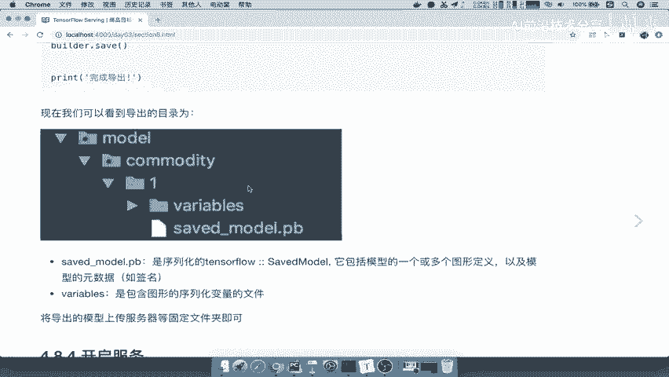

最后，调用构建器的 `save` 方法，并传入当前的 TensorFlow 会话（Session）以及定义好的签名映射，将模型保存到指定路径。

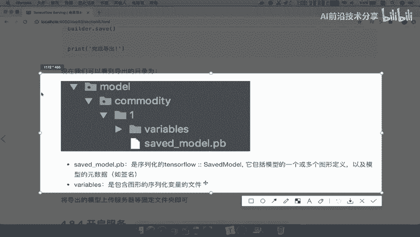

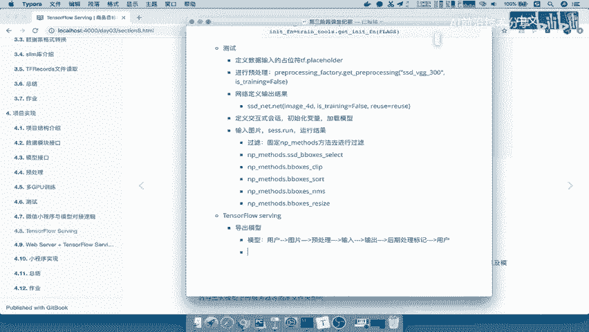

```python
builder.save(sess=session, signature_def_map=signature_def_map)
print(“Serving 模型结构导出结束。”)
```

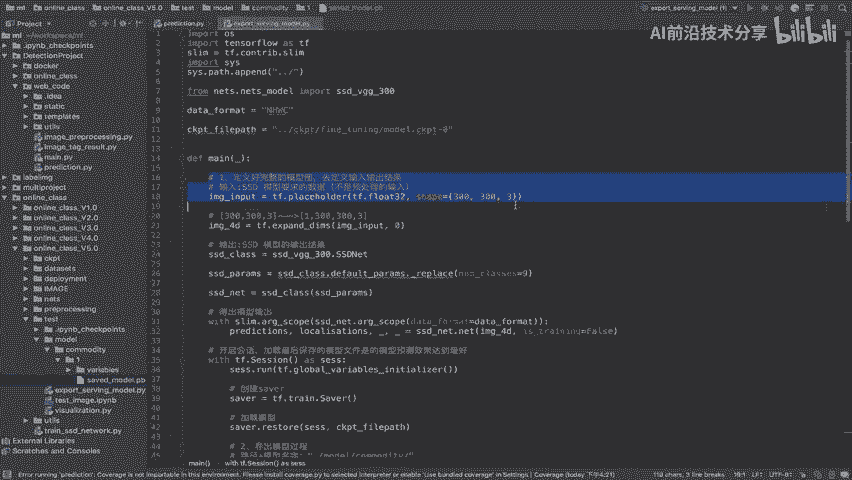

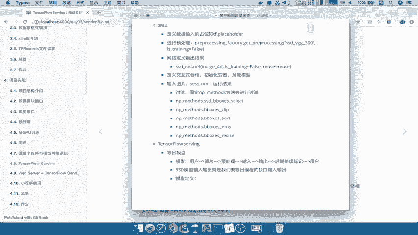

保存成功后，在导出路径下会生成 `saved_model.pb` 文件和 `variables` 文件夹。
*   `saved_model.pb`：包含模型的图结构、元数据和签名定义。
*   `variables/`：包含模型权重（变量）的序列化文件。

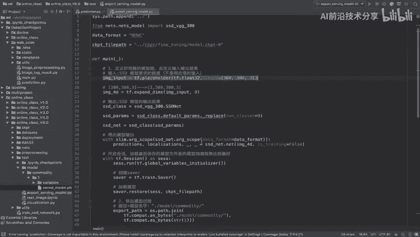

## 完整流程总结

本节课中我们一起学习了将 TensorFlow 模型导出为 SavedModel 格式的完整流程。我们来总结一下关键步骤：

1.  **模型定义与加载**：确保你拥有定义好的计算图，并且已经将训练好的权重（CKPT 文件）加载到会话中。
2.  **准备导出路径**：构造一个包含模型名称和版本号的导出路径。
3.  **创建构建器**：实例化 `tf.saved_model.builder.SavedModelBuilder`。
4.  **定义签名**：这是最关键的一步。你需要：
    *   明确模型的输入张量和输出张量。
    *   使用 `build_tensor_info` 包装它们。
    *   使用 `build_signature_def` 创建输入输出映射，并指定方法名。
    *   将签名组织成字典，通常包含默认服务签名。
5.  **执行保存**：调用构建器的 `save` 方法，传入当前会话和签名字典，完成模型导出。

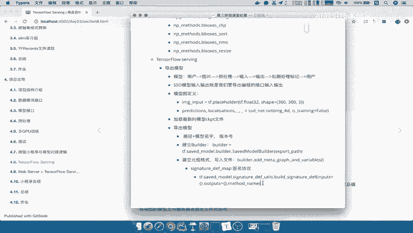

通过以上步骤，你就得到了一个标准的 SavedModel，可以轻松地部署到 TensorFlow Serving 或其他支持该格式的服务环境中，供客户端远程调用。