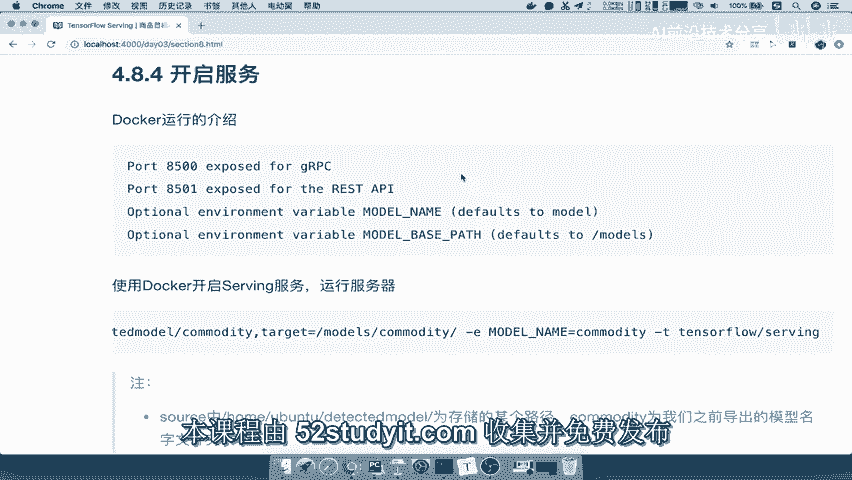
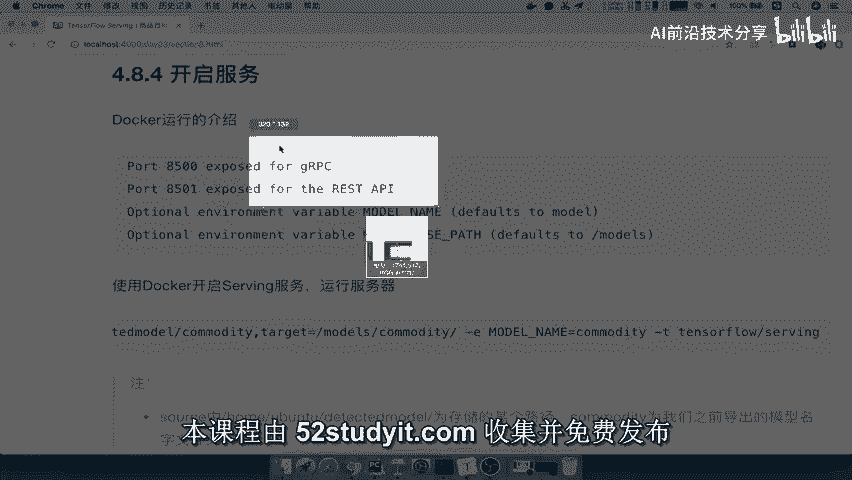
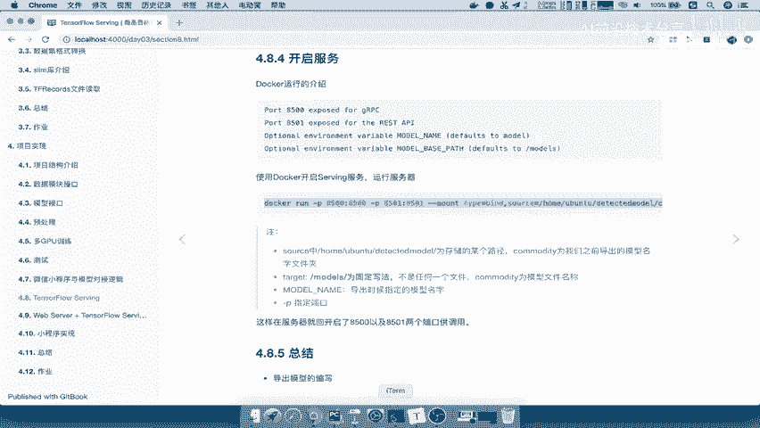
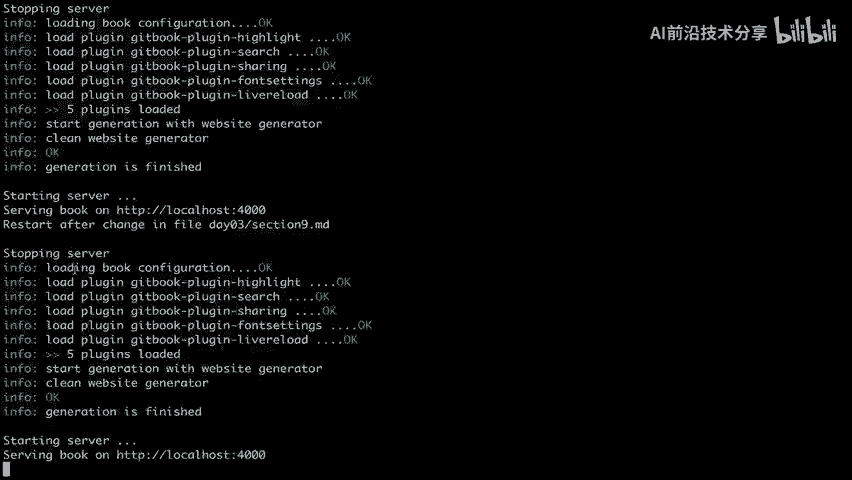
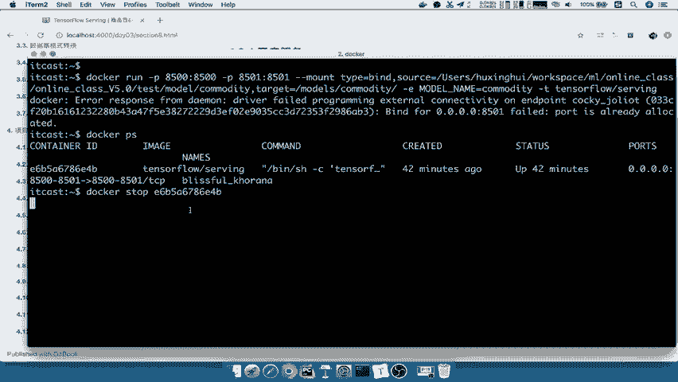

# 课程P79：开启TensorFlow Serving模型服务 🚀

在本节课中，我们将学习如何将训练好的TensorFlow模型部署为一个在线服务。具体来说，我们将使用TensorFlow Serving工具，通过Docker容器来启动一个模型服务，并了解其提供的两种API接口。

---



## 模型服务概述



上一节我们完成了模型的导出，接下来需要将模型部署为可访问的服务。这要求我们安装并运行TensorFlow Serving。虽然模型可以上传到远程服务器，但本节课我们将在本地进行测试和部署。

## 服务类型与端口

TensorFlow Serving主要提供两种服务接口：

*   **gRPC服务**：一种高性能的远程过程调用协议。
*   **REST API服务**：基于HTTP协议的表述性状态转移接口。

启动服务时，可以为这两种接口指定不同的端口。通常的做法是同时开启两种服务，以便根据需求选择调用方式。

以下是启动服务时需要指定的关键端口：
*   gRPC服务端口：`8500`
*   REST API服务端口：`8501`

## 启动服务命令详解



我们将使用Docker来运行TensorFlow Serving，这是最便捷的部署方式。在运行前，请确保已安装Docker并拉取了TensorFlow Serving的镜像。



启动服务的核心命令结构如下：

```bash
docker run -p 8500:8500 -p 8501:8501 \
  --mount type=bind,source=/path/to/your/model/,target=/models/your_model_name \
  -e MODEL_NAME=your_model_name \
  -t tensorflow/serving
```

以下是命令中关键参数的解释：

*   `-p 8500:8500 -p 8501:8501`：将容器内的8500和8501端口映射到主机，从而开放gRPC和REST服务。
*   `--mount type=bind,source=...,target=...`：将本地的模型目录挂载到Docker容器内部。
    *   `source`：指向你本地保存已导出模型的**完整目录路径**。
    *   `target`：容器内部的固定挂载路径，格式为 `/models/你的模型名`。这里的 `models` 是一个固定关键字，不代表具体文件。
*   `-e MODEL_NAME=...`：设置环境变量，指定模型的名字。这个名字需要与`target`路径中的模型名以及导出模型时设置的文件夹名保持一致。
*   `-t tensorflow/serving`：指定要运行的Docker镜像。



**重要提示**：`target`参数中的模型名（例如`your_model_name`）必须与导出模型所在文件夹的名称（例如`saved_model`目录的父目录名）以及环境变量`MODEL_NAME`的值三者一致，服务才能正确找到并加载模型。

## 实际操作演示

假设我们的模型导出在本地路径 `/home/user/online_class_view5.0/commodity` 下，并且模型文件夹名就是 `commodity`。

1.  **停止可能存在的旧服务**（如果之前已运行）：
    ```bash
    # 查看正在运行的容器
    docker ps
    # 停止对应的容器
    docker stop <容器ID>
    ```

2.  **启动TensorFlow Serving服务**：
    将上述命令中的路径和模型名替换为实际值。
    ```bash
    docker run -p 8500:8500 -p 8501:8501 \
      --mount type=bind,source=/home/user/online_class_view5.0/commodity,target=/models/commodity \
      -e MODEL_NAME=commodity \
      -t tensorflow/serving
    ```

3.  **验证服务**：
    命令成功运行后，控制台会输出日志。你可以使用 `docker ps` 命令查看容器是否正在运行。服务启动后，便可通过 `localhost:8501`（REST）或 `localhost:8500`（gRPC）来访问模型并进行预测。

---

## 课程总结

本节课中，我们一起学习了如何使用TensorFlow Serving部署模型服务。关键步骤包括：理解gRPC和REST两种服务接口，掌握通过Docker命令启动服务的方法，并详细解析了命令中源路径（`source`）、目标路径（`target`）和模型名（`MODEL_NAME`）等关键参数的配置。成功启动服务后，你的模型就从一个静态文件变成了一个可通过网络调用的在线API。