# 课程P8：8.01_Overfeat模型 🧠

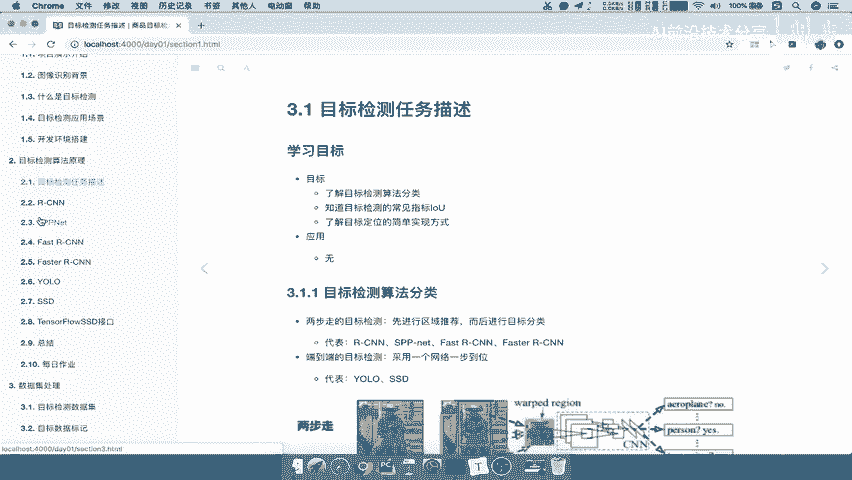

在本节课中，我们将学习目标检测任务中，当图像包含多个目标时，如何解决定位和分类的难题。我们将重点介绍一种基础且重要的思想——滑动窗口，以及它在Overfeat模型中的应用。

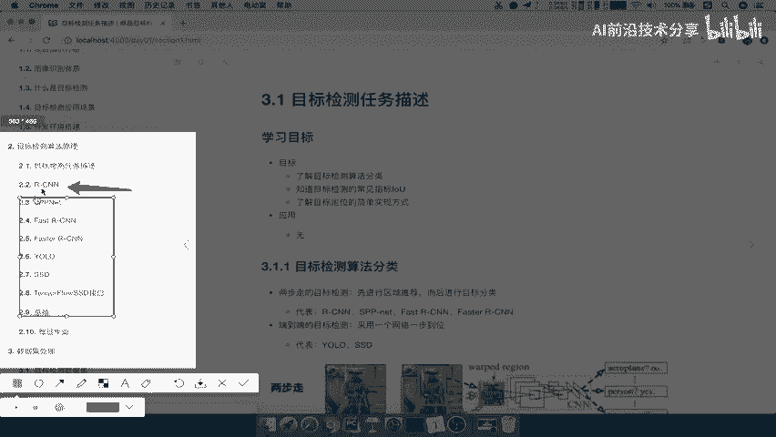

## 多目标检测的挑战

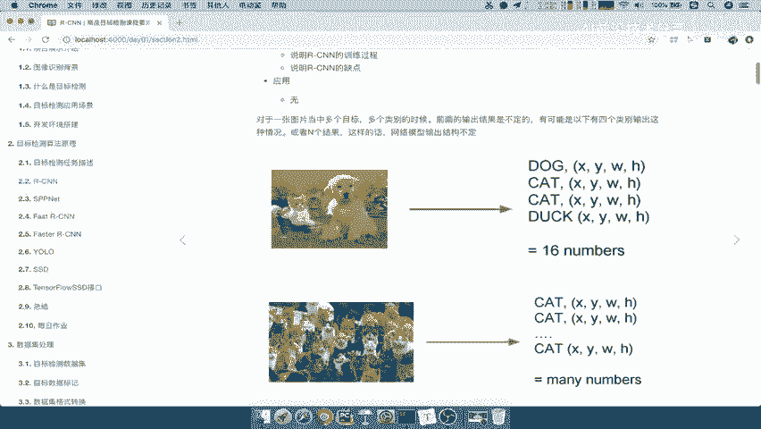

上一节我们介绍了单目标检测的解决方案，即通过增加一个全连接层来输出目标的位置坐标。然而，当一张图片中存在多个目标时，这种方法便不再适用。

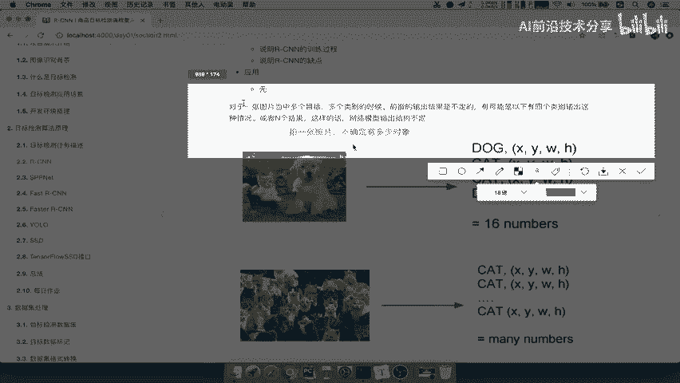

核心问题在于：网络输出的目标数量不确定。如果图片中有N个目标，网络就需要输出N个位置坐标，以及每个目标属于各个类别的概率。这使得我们之前提出的“分类+回归”方案变得不可行。

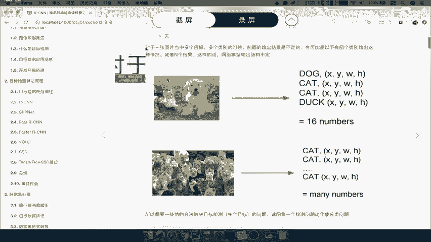

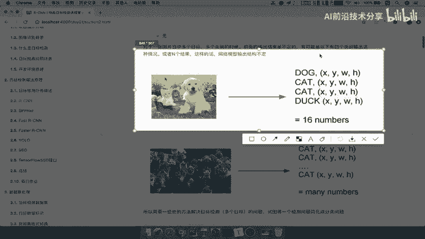

## 滑动窗口的解决思路

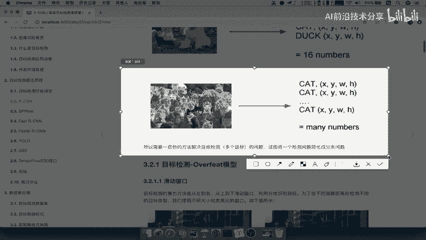

为了解决多目标检测的问题，我们引入一种新的思路。在详细讲解R-CNN算法之前，我们先来看一个关键概念：滑动窗口。

滑动窗口的核心思想是：既然不确定图片中有多少目标，我们就用不同大小和形状的窗口，像扫描一样遍历整张图片。

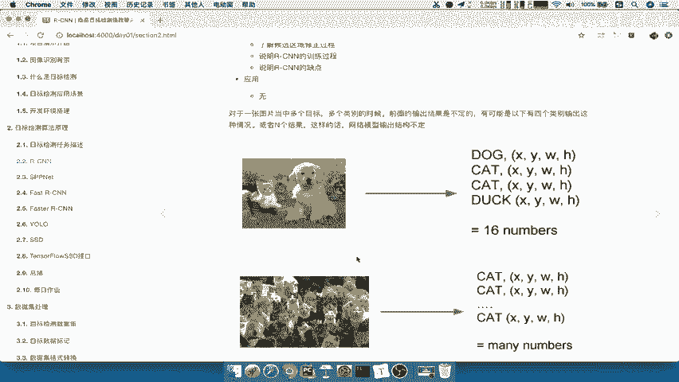

以下是滑动窗口的具体操作步骤：
1.  首先，我们预先定义K种不同大小或长宽比的窗口。
2.  对于每一种窗口，我们让它从图片的左上角开始，按照设定的步长（例如每次向右移动10个像素）从左到右、从上到下地滑动。
3.  每滑动一次，就截取出窗口当前覆盖的图片区域，作为一个“子图片”。
4.  假设每种窗口滑动后得到M个子图片，那么总共就会得到 **K × M** 个子图片。

这样，我们就把一张包含多个目标的复杂图片，转化成了许多个可能只包含单个目标的子图片。对于每一个子图片，我们就可以应用之前学过的单目标“分类+回归”方法进行处理了。

## Overfeat模型详解

基于滑动窗口思想的一个经典模型就是Overfeat模型。它的工作流程清晰地体现了这一思路。

以下是Overfeat模型的关键步骤：
1.  **生成候选区域**：使用预先定义的K种滑动窗口，在输入图像上滑动，生成大量（K × M个）候选子图片区域。
2.  **特征提取**：将每一个候选子图片输入到一个卷积神经网络（CNN）中，进行特征提取。
3.  **分类与回归**：网络最后连接两个分支：
    *   **分类分支**：输出该子图片属于各个类别的概率。
    *   **回归分支**：输出该子图片内目标位置的微调坐标（`[Δx, Δy, Δw, Δh]`）。

### 模型的训练

那么，如何训练这样的模型呢？关键在于准备训练数据。

训练数据需要为每张原始图片准备若干个子图片，并为每个子图片标注以下信息：
*   **类别标签**：如果子图片中包含目标，则标记为具体的类别（如“人”、“车”）；如果不包含目标，则标记为背景类（如0）。
*   **位置标签**：对于包含目标的子图片，需要标注其真实的位置坐标 `[x, y, w, h]`。

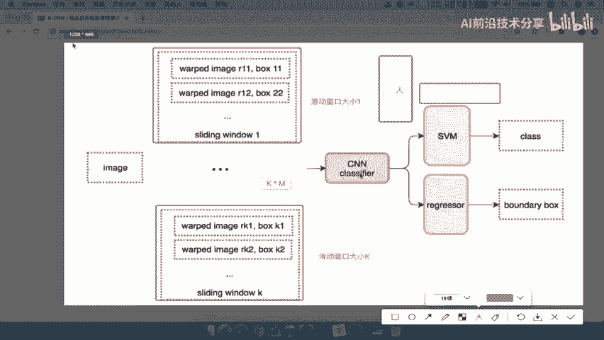

在训练时，模型将子图片输入网络，分别计算分类损失（如交叉熵损失）和回归损失（如Smooth L1损失），并通过反向传播同时优化这两个任务。

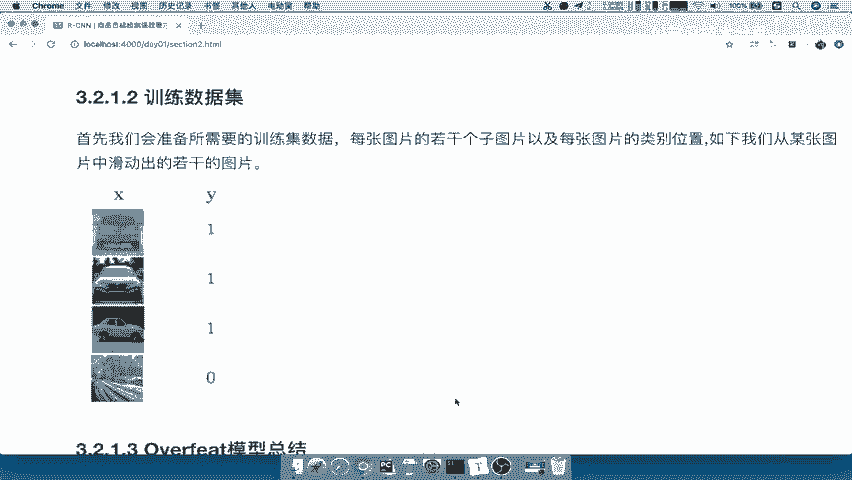

## Overfeat模型的优缺点

虽然滑动窗口思想非常直观，但Overfeat模型也存在明显的缺点，这主要是由其“暴力穷举”的特性导致的。

**优点**：
*   思路简单直接，将复杂的多目标检测问题转化为熟悉的单目标分类回归问题。

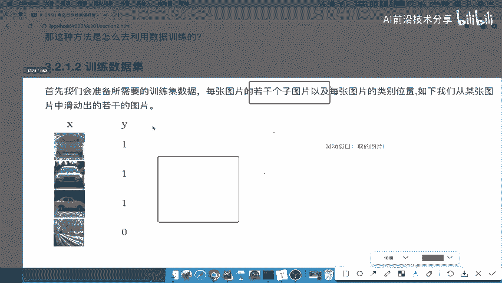

**缺点**：
1.  **计算成本高**：需要处理海量的子图片（K × M），每个子图片都要独立通过CNN进行前向传播，导致计算非常耗时。
2.  **窗口效率低**：预先定义的滑动窗口大小和长宽比是固定的，可能无法完美匹配图像中千变万化的物体形状和尺寸，产生大量无效的候选区域。
3.  **精度受限**：滑动步长和窗口尺寸的选择会影响检测精度，步长大可能漏检，步长小则计算量剧增。

## 总结

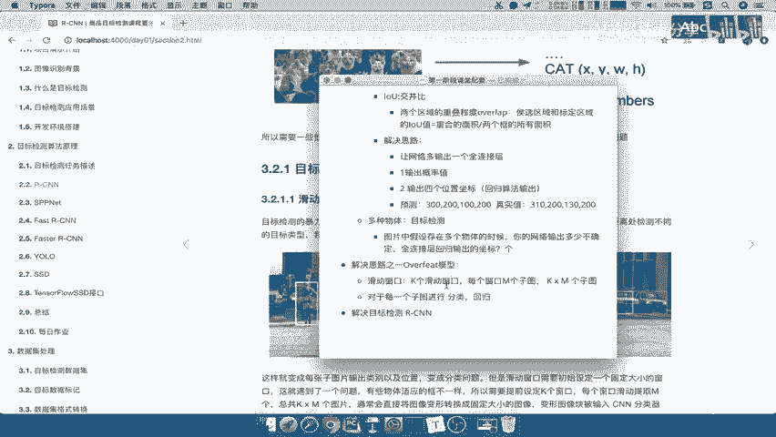

本节课中我们一起学习了Overfeat模型及其核心的滑动窗口思想。我们了解到，为了解决图像中多目标检测的难题，可以通过定义多种窗口来遍历图像，生成大量候选子区域，再对每个区域进行分类和位置回归。尽管这种方法计算量大且效率不高，但它为后续更高效的目标检测算法（如R-CNN系列）奠定了重要的基础。理解滑动窗口，是理解现代目标检测算法演进的关键第一步。