# TensorFlow Serving 客户端逻辑教程 🚀

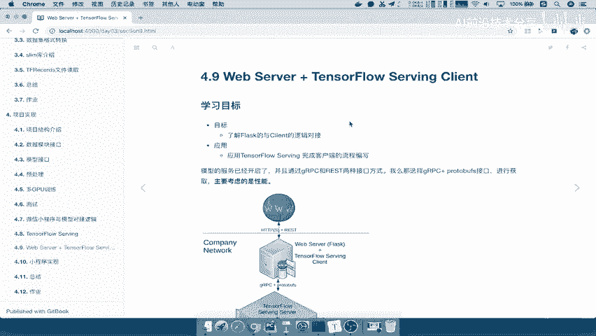

## 概述

在本节课中，我们将学习如何构建一个TensorFlow Serving的客户端。这个客户端将被一个Web服务器包裹，负责接收用户请求，与TensorFlow Serving服务器通信，并将结果返回给用户。我们将重点介绍客户端的逻辑设计、环境配置以及核心代码结构。

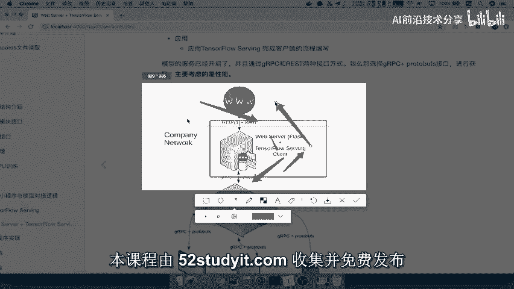

---

## 客户端架构设计 🏗️

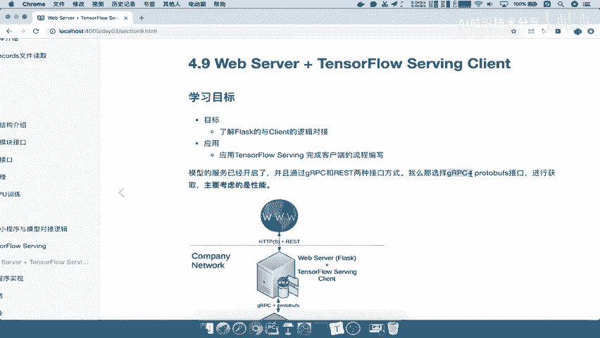

上一节我们介绍了TensorFlow Serving的基本概念，本节中我们来看看客户端的具体架构。

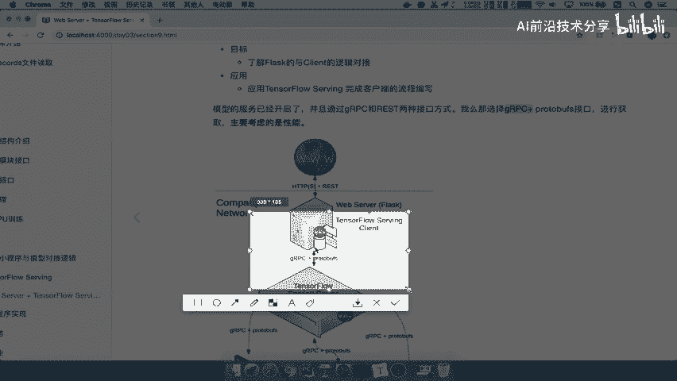

客户端会被我们的Web服务器包裹或托管。外部用户的请求首先到达Web服务器，然后被传递到客户端。客户端随后请求TensorFlow Serving服务器，服务器处理请求后将结果返回。


以下是完整的请求路径：
1.  用户请求发送到Web服务器。
2.  Web服务器将请求转发给TensorFlow Serving客户端。
3.  客户端请求TensorFlow Serving服务器。
4.  服务器将结果返回给客户端。
5.  客户端将结果返回给Web服务器。
6.  Web服务器最终将结果返回给用户。

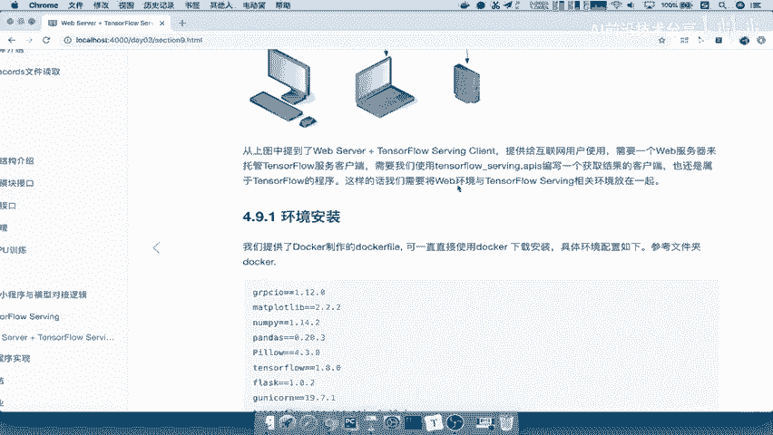

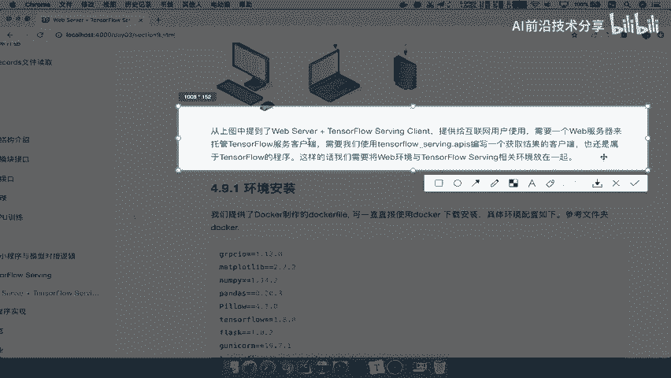

---

## 接口选择 ⚙️

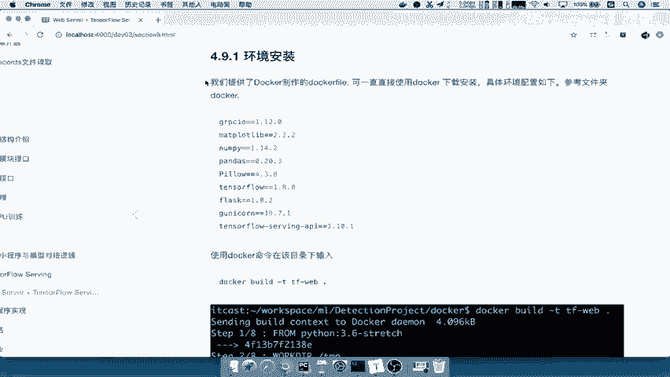

TensorFlow Serving客户端通常提供两种接口形式。我们会选择gRPC配合Protocol Buffers的接口，主要考虑是其性能非常出色。


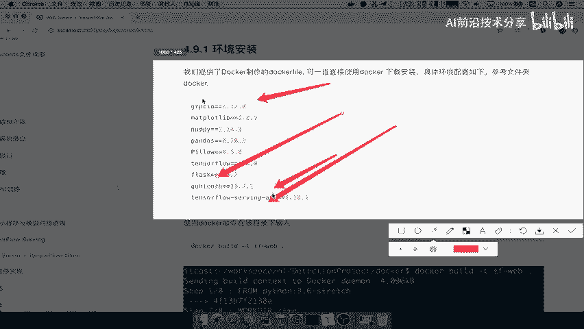

由于这种接口面向用户提供，在具体场景中需要权衡。如果不是特别追求卓越的性能，也可以使用REST接口的方式去请求。


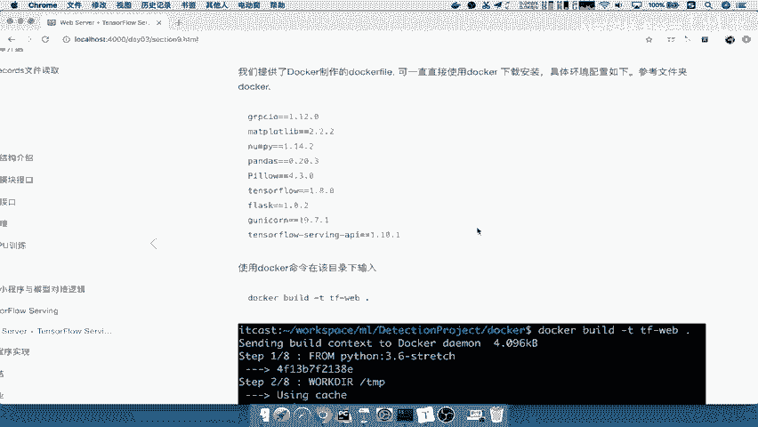

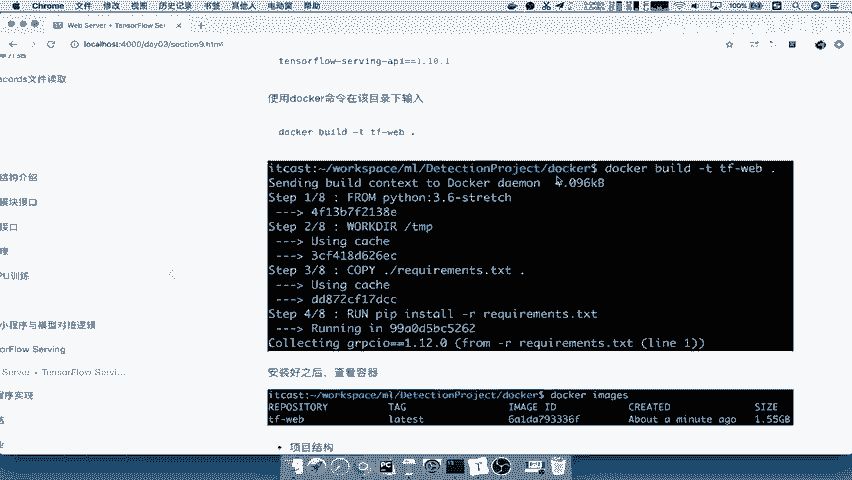

---

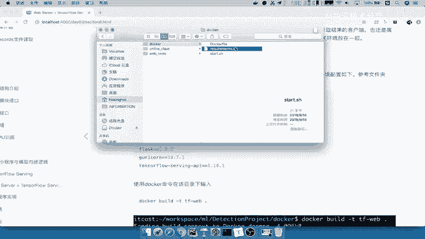

## 环境配置与Docker 🐳

我们将Web服务器程序和TensorFlow Serving客户端程序所需的环境整合在一起。

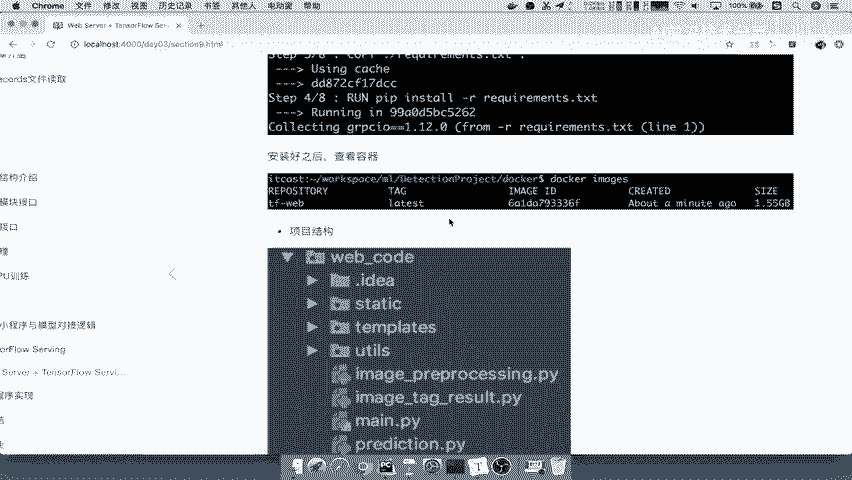


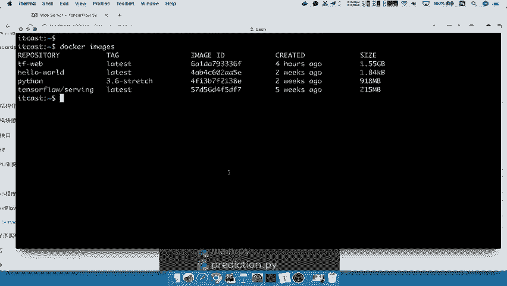

这个整合后的环境已经放在本地的Dockerfile中。你可以通过Docker直接构建指定的环境，或者将其拉取为容器。

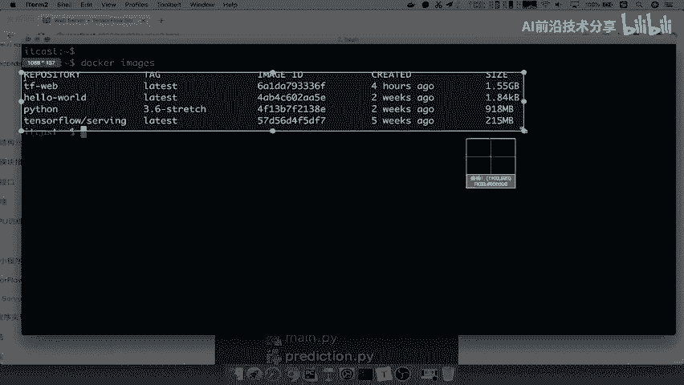

以下是环境配置的核心步骤：

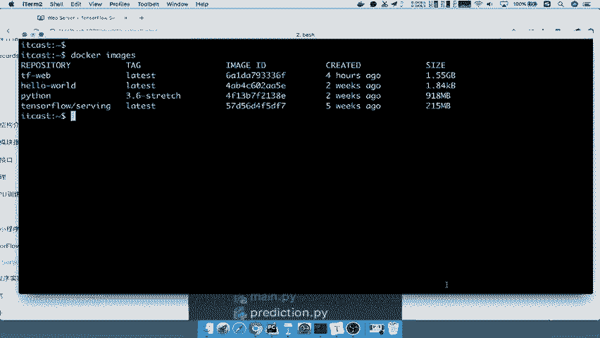

1.  **构建Docker镜像**：在包含`Dockerfile`和`requirements.txt`文件的目录下执行构建命令。
    ```bash
    docker build -t tf-serving-web .
    ```
2.  **查看镜像**：构建完成后，使用以下命令查看已创建的镜像。
    ```bash
    docker images
    ```
    你可以看到名为`tf-serving-web`的容器镜像，以及之前可能已经拉取好的`tensorflow/serving`镜像。

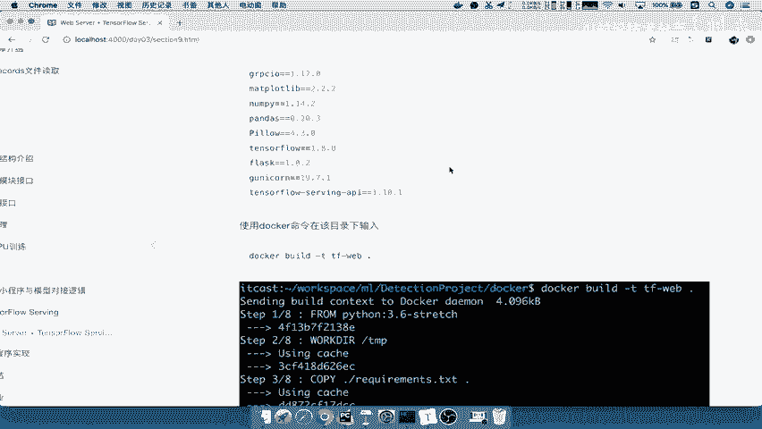


环境配置至关重要。如果环境有问题，后续的请求发送和处理都会出现错误。

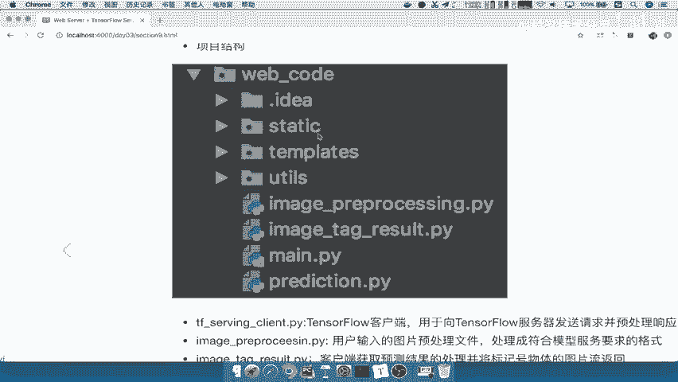

---

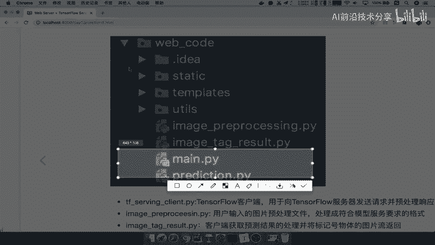

## 项目结构 📁

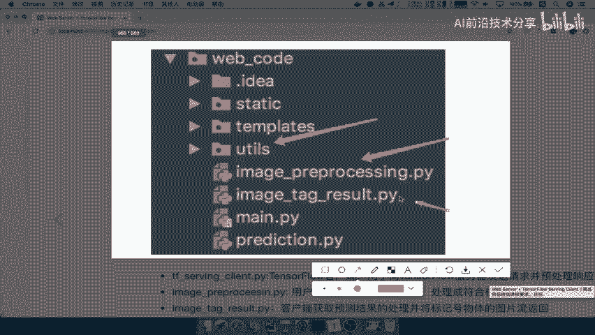

我们的Web项目主要包裹着TensorFlow Serving客户端。在项目结构中，有一个名为`web_code`的目录。


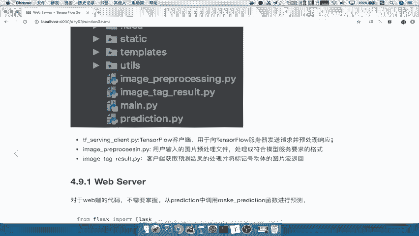

以下是关键文件说明：
*   `static`和`templates`目录：存放Web相关的静态文件和模板，与核心客户端逻辑无关。
*   `main.py`：Web服务器的主程序文件，负责路由和请求调度。
*   **TensorFlow Serving客户端核心文件**：我们主要使用以下三个文件来构建客户端逻辑：
    1.  `prediction.py`：向服务器发送请求并处理响应格式的核心文件。
    2.  `preprocess.py`：封装了数据预处理逻辑的文件。
    3.  `postprocess.py`：封装了结果后处理（如标签标记）逻辑的文件。

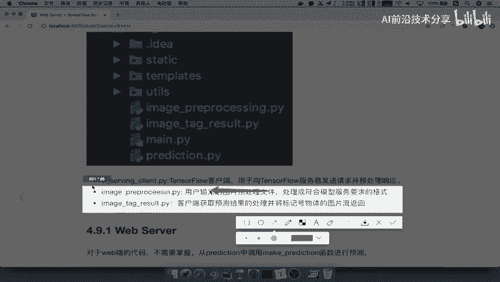


`prediction.py`会调用`preprocess.py`和`postprocess.py`来完成整个流程。

---

## 核心业务流程 🔄

现在，让我们梳理一下用户、Web后台和Serving客户端之间的完整业务流程。

1.  **用户发起请求**：用户提供图片，发送到Web后台。
2.  **Web后台中转**：Web后台不进行具体的TensorFlow相关处理，仅作为中转站。它将接收到的图片数据流直接传递给TensorFlow Serving客户端。
3.  **客户端处理与请求**：Serving客户端负责所有核心业务逻辑，包括：
    *   数据预处理
    *   请求格式封装
    *   向TensorFlow Serving服务器发送请求
    *   接收服务器响应
    *   对结果进行解析和后处理（如标记标签）
4.  **结果返回**：客户端将处理好的结果返回给Web后台。
5.  **响应最终用户**：Web后台将结果返回给用户。

整个设计确保了业务逻辑的清晰分离：Web后台只处理HTTP请求和响应，所有与TensorFlow Serving相关的操作都封装在独立的客户端模块中。

---

## Web服务代码简析 💻

Web服务的相关代码（主要是`main.py`）基于Flask框架编写。它的职责非常明确：

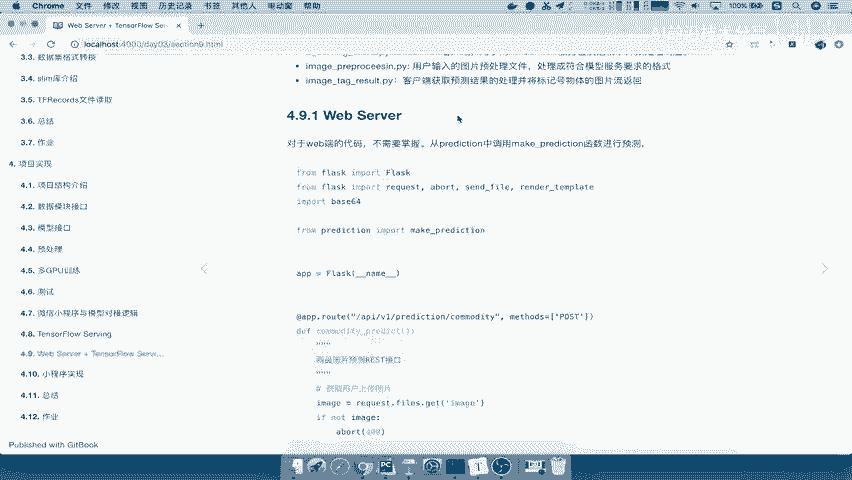

*   提供默认的页面接口。
*   提供一个用于预测的路由函数（例如`/predict`）。
*   在该路由函数中，它获取用户上传的图片数据，然后调用**TensorFlow Serving客户端**（即`prediction.py`中的函数）进行预测。
*   最后，它将客户端返回的结果进行适当编码（如JSON格式），并返回给用户。


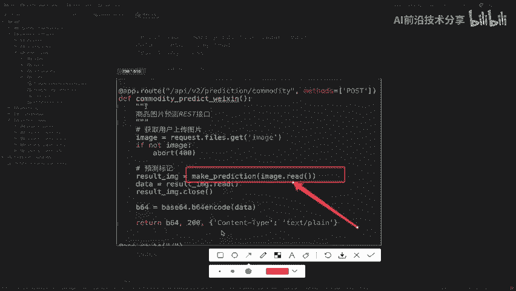

**请注意**：这部分Flask框架的Web代码我们不需要深入掌握或修改，只需理解其作为“桥梁”的作用即可。我们的开发重点在于`prediction.py`、`preprocess.py`和`postprocess.py`这三个构成Serving客户端的文件。

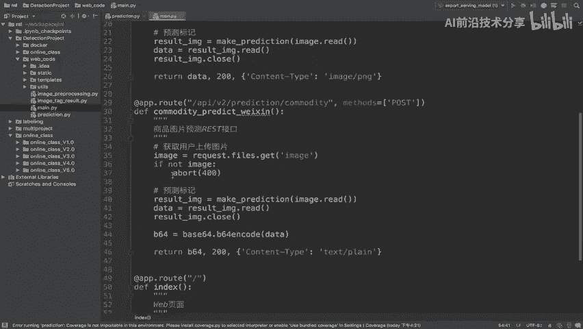

---

## 总结 📝


本节课中我们一起学习了TensorFlow Serving客户端的完整逻辑。

我们首先了解了客户端在Web服务器包裹下的架构设计。接着，探讨了gRPC和REST两种接口的选择考量。然后，我们通过Docker配置了整合Web和客户端依赖的统一环境。之后，解析了项目文件结构，明确了核心业务文件。最后，我们详细梳理了从用户请求到最终响应的数据流，并强调了Web后台与TensorFlow Serving客户端之间职责分离的设计原则。

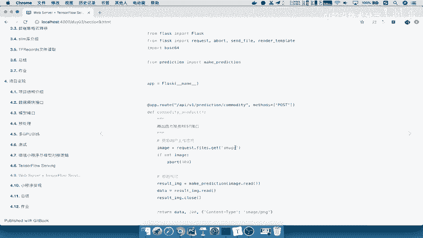

通过本课，你应该对如何构建一个与TensorFlow Serving交互的客户端应用有了清晰的认识。