# TensorFlow Serving 客户端开发教程 🚀

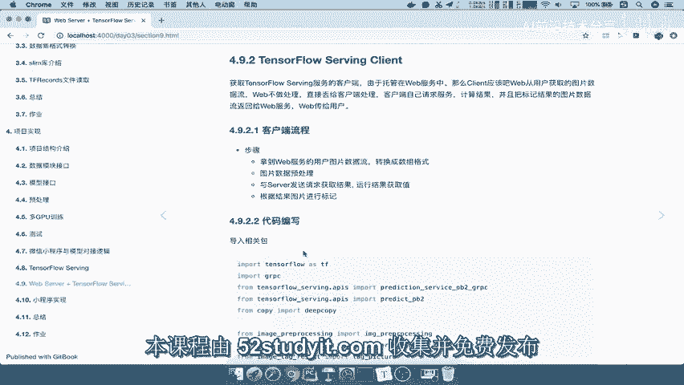

## 课程概述
在本节课中，我们将学习如何构建一个TensorFlow Serving的客户端。这个客户端的主要功能是接收用户输入的图片数据，将其转换为模型所需的格式，发送预测请求，并对返回的结果进行处理和标记。

---

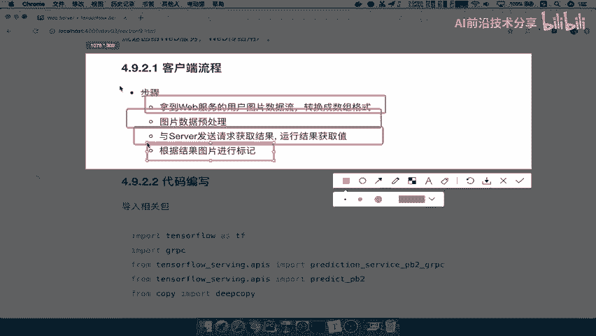

## 客户端流程分析

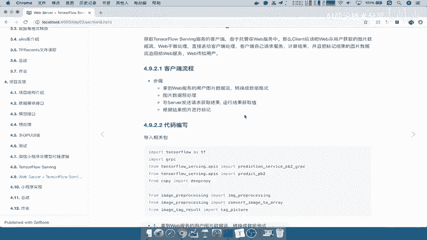

上一节我们介绍了课程的整体目标，本节中我们来看看客户端的具体工作流程。

以下是客户端处理数据的核心步骤：

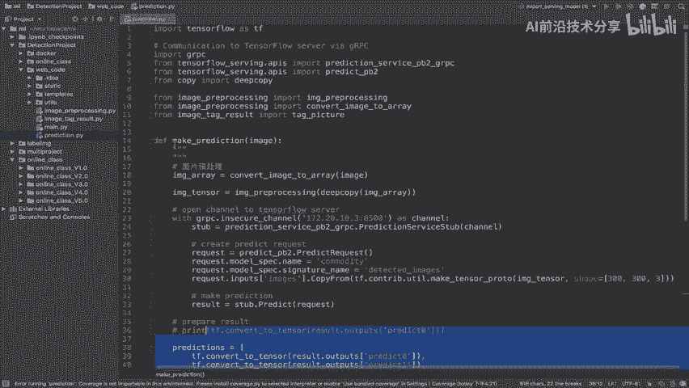

1.  **获取Web服务的用户数据流**：客户端首先从Web服务接收用户上传的图片数据流。
2.  **转换数据格式**：接收到的图片通常是二进制格式，需要将其转换为程序能够处理的数组格式。
3.  **图片预处理**：将转换后的图片数据调整成服务端模型所要求的输入格式（例如，调整尺寸、归一化等）。
4.  **发送请求**：将处理好的数据封装成请求，发送给TensorFlow Serving服务。
5.  **获取结果**：接收服务端返回的预测结果。
6.  **结果处理与标记**：对预测结果进行解析，并将其转换为人类可读的标签或信息。

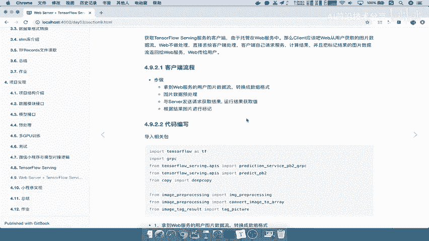

这个流程的核心是与Web服务进行数据交互，客户端本身不进行复杂的业务逻辑处理。

---

## 代码结构与实现

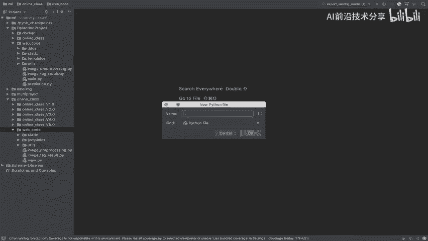

理解了流程之后，我们开始进行相关代码的编写。首先，我们来看一下完整的代码结构。

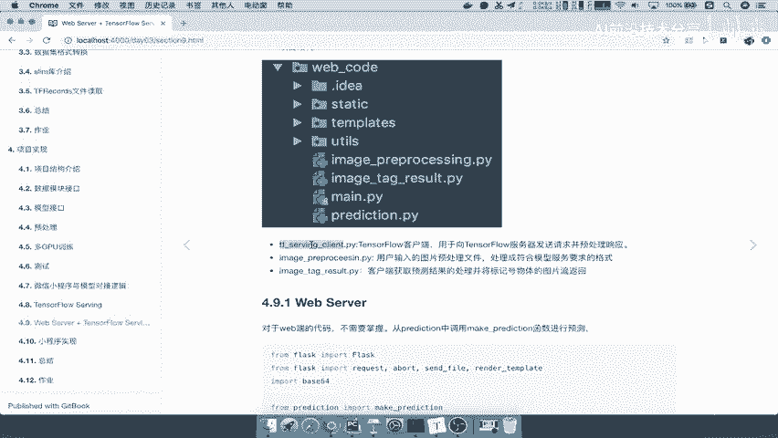

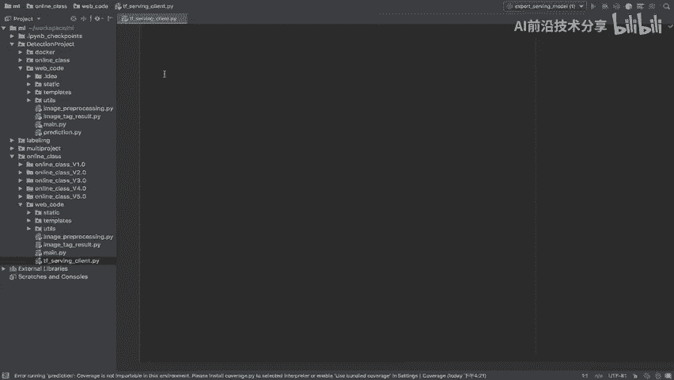

我们将在一个名为 `web_code` 的目录中组织代码。其中，`prediction.py` 是核心文件，它包含了图片转换、预处理、请求服务和结果处理的全部逻辑。这个模块最终会提供一个函数供Web客户端调用。

其他文件（如 `main.py`）是辅助性的Web框架组件（例如Flask）。

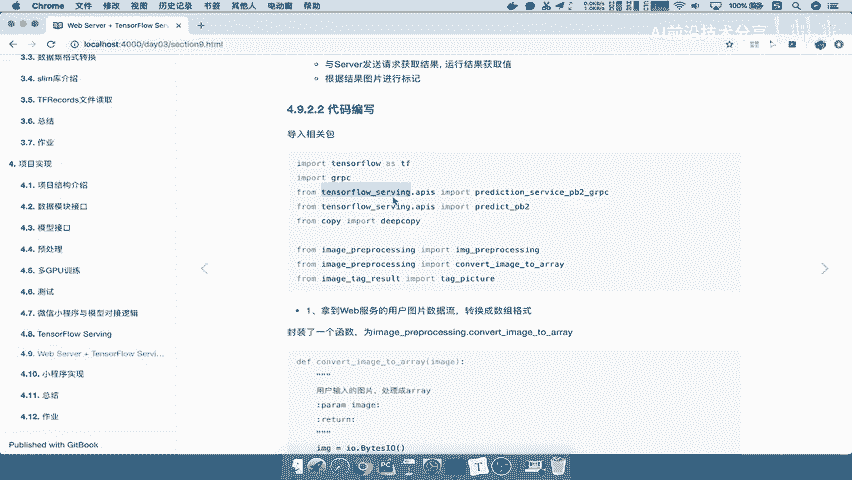

现在，我们开始实现 `prediction.py`。

### 第一步：导入依赖包

首先，需要导入所有必要的Python包。这包括处理Web请求、TensorFlow Serving交互以及图片处理的库。

```python
import numpy as np
from PIL import Image
import io
import tensorflow as tf
from tensorflow_serving.apis import predict_pb2
from tensorflow_serving.apis import prediction_service_pb2_grpc
import grpc
```

### 第二步：定义核心预测函数

我们将定义一个名为 `make_prediction` 的函数。这个函数是客户端的主要接口。

```python
def make_prediction(image_data):
    """
    对输入的图片数据进行预测。
    参数:
        image_data: 二进制格式的图片数据流。
    返回:
        处理后的预测结果标签。
    """
    # 函数主体将在后续步骤中实现
    pass
```

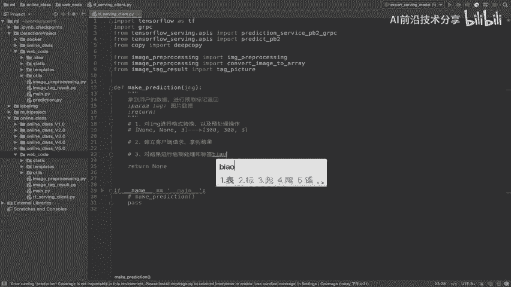

该函数接收一个二进制图片数据流作为输入，并返回预测结果的标签。

### 第三步：图片格式转换与预处理

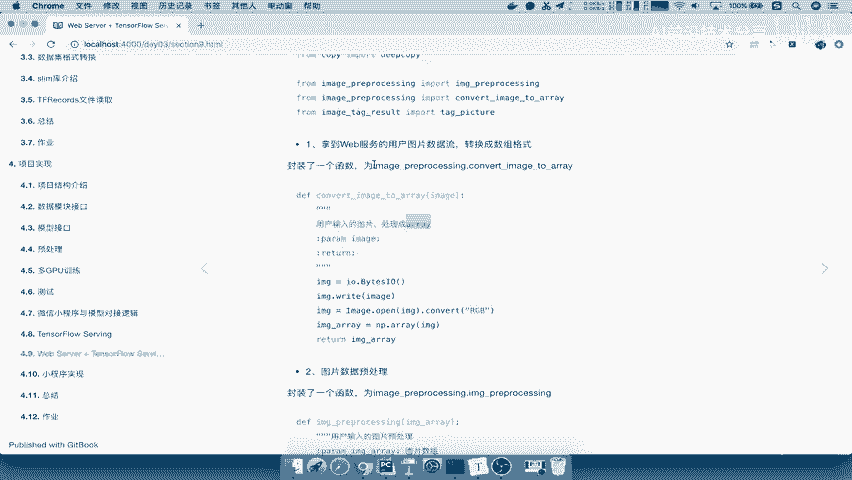

在 `make_prediction` 函数中，第一步是对输入的 `image_data` 进行格式转换和预处理。

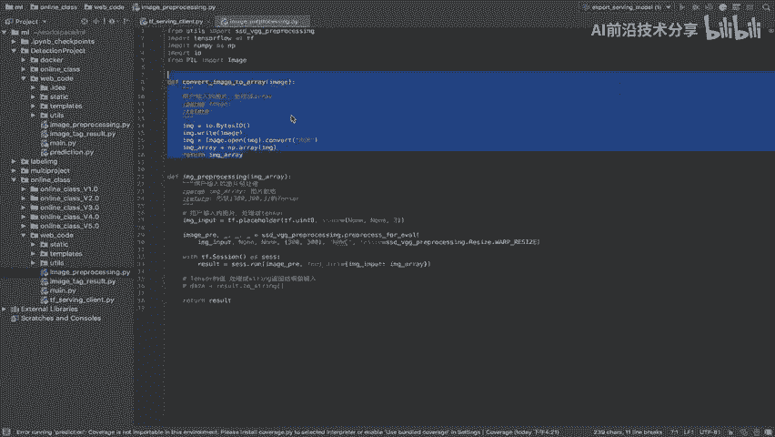

首先，调用 `convert_image_to_array` 函数将二进制数据转换为NumPy数组。

```python
def convert_image_to_array(image_data):
    """
    将二进制图片数据转换为NumPy数组。
    """
    image = Image.open(io.BytesIO(image_data)).convert('RGB')
    image_array = np.array(image)
    return image_array
```

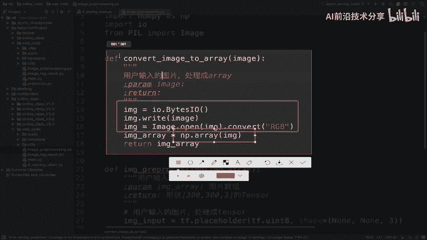

在 `make_prediction` 函数中应用：
```python
    # 1. 对image进行格式转换以及预处理操作
    image_array = convert_image_to_array(image_data)
```

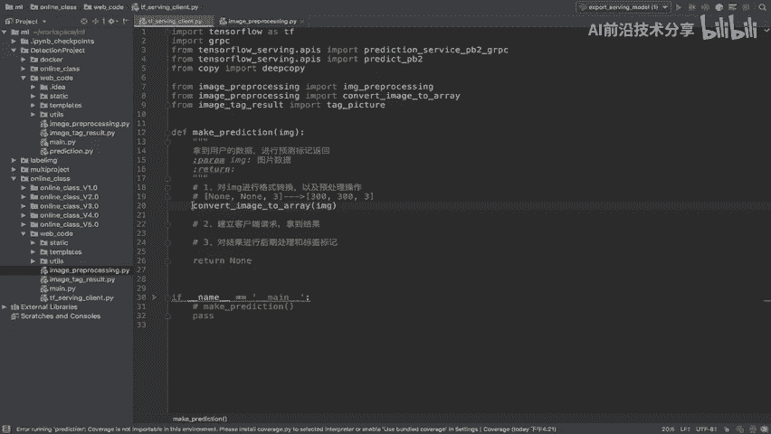

接着，需要将数组格式的图片处理成模型要求的输入格式（例如，调整大小为 300x300 像素并进行归一化）。这个逻辑封装在 `image_preprocessing` 函数中。

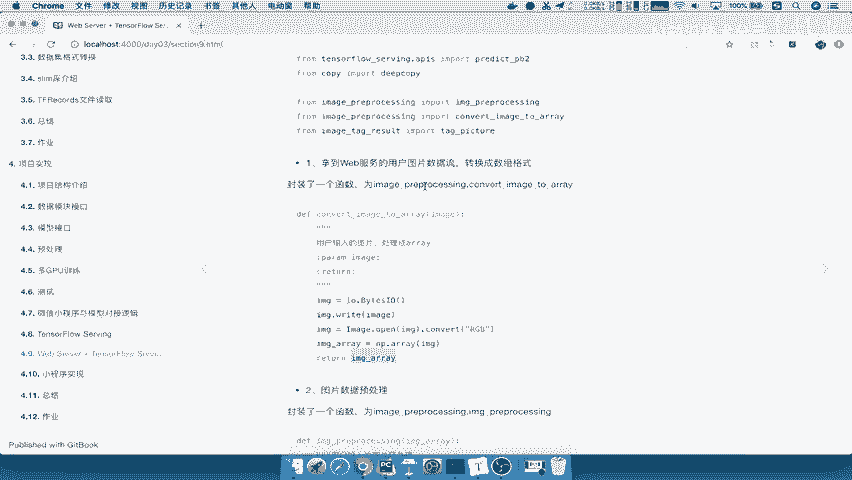

```python
def image_preprocessing(image_array):
    """
    对图片数组进行预处理（调整大小、归一化等）。
    此函数复用了模型训练时的预处理逻辑。
    """
    # 这里是一个示例预处理流程
    # 1. 调整图片尺寸
    # 2. 归一化像素值
    # 具体代码取决于你的模型要求
    processed_image = ... # 预处理操作
    return processed_image
```

在 `make_prediction` 函数中继续：
```python
    processed_image = image_preprocessing(image_array)
```

至此，我们完成了数据准备阶段的工作。下一节我们将实现如何向TensorFlow Serving服务发送请求并获取结果。

---

## 课程总结

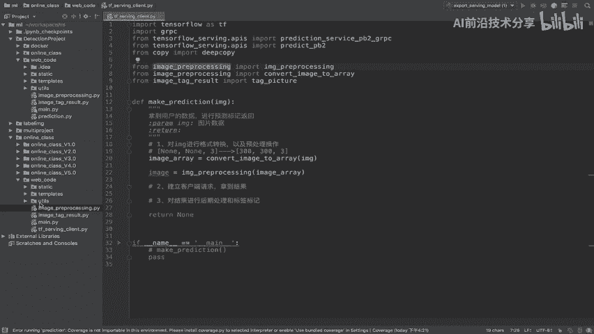

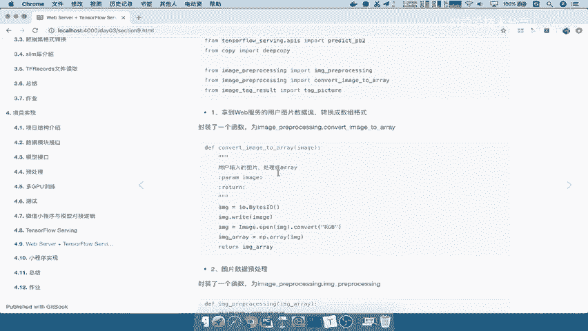

本节课中我们一起学习了TensorFlow Serving客户端的基本开发流程。我们首先分析了客户端从接收数据到返回结果的关键步骤。然后，我们开始动手实现，完成了项目结构的搭建、依赖包的导入以及核心预测函数 `make_prediction` 的框架。最后，我们重点实现了客户端的第一步操作：将用户上传的二进制图片数据转换为NumPy数组，并进行模型所需的预处理。

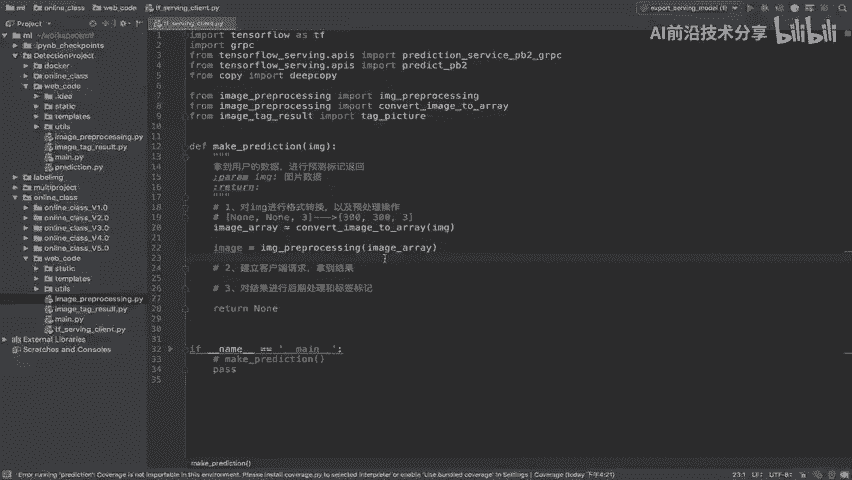

在接下来的课程中，我们将继续完善这个函数，实现与TensorFlow Serving服务的gRPC通信，并完成对预测结果的后处理与标记。