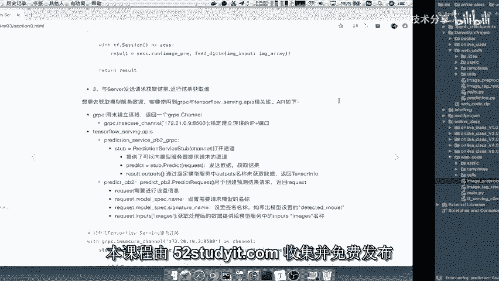
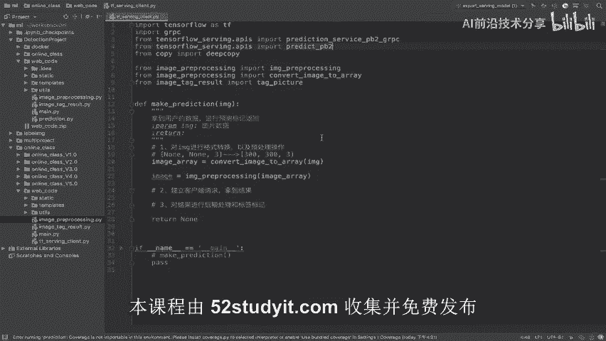
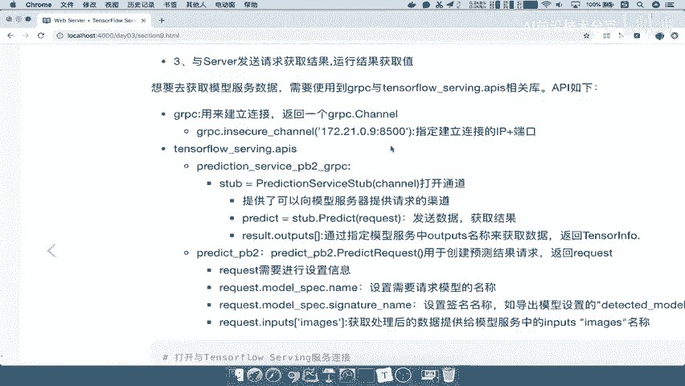
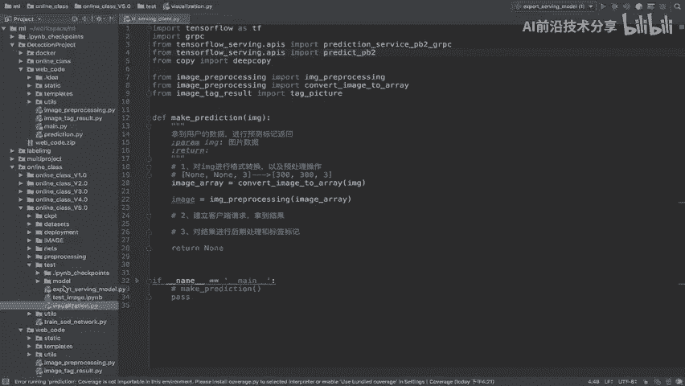
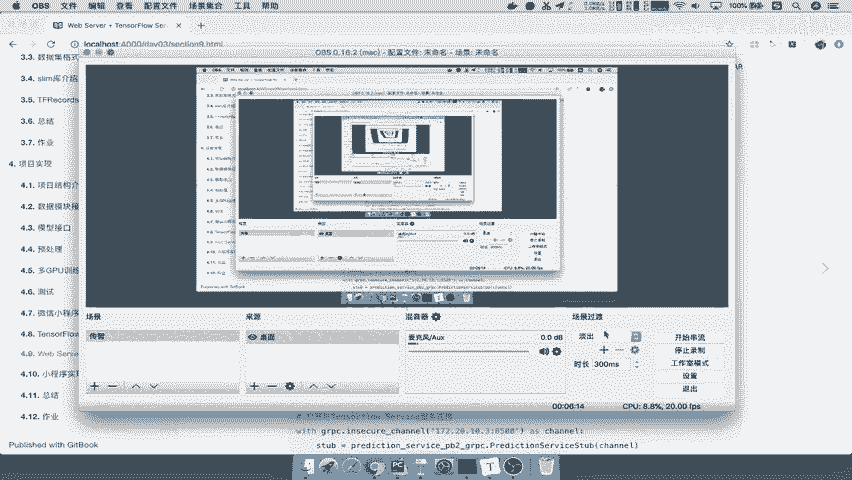

# 课程P82：gRPC与TensorFlow Serving API介绍 🚀



在本节课中，我们将学习如何编写客户端代码，通过gRPC协议向部署好的TensorFlow Serving模型服务器发起请求并获取预测结果。我们将了解整个请求流程以及所需的核心API。



---

## 建立连接与核心API

上一节我们介绍了模型服务的基本概念，本节中我们来看看如何与服务器建立通信。要获取模型服务器的数据，需要使用两个关键库：`grpc` 和 `tensorflow_serving.apis`。



建立连接并发送请求遵循一个清晰的步骤流程。

以下是完整的请求步骤：
1.  使用gRPC建立到服务器的网络连接通道。
2.  创建一个符合服务要求的请求协议，并封装好数据。
3.  通过已建立的通道发送请求，并获取服务器返回的结果。
4.  解析返回的结果，提取出我们需要的预测数据。

接下来，我们详细介绍其中用到的几个核心API。

---

### gRPC连接通道

首先，我们需要建立与服务器的连接。由于使用gRPC进行通信，因此必须使用 `grpc.insecure_channel` 函数。该函数需要指定服务器的IP地址和端口号。

```python
channel = grpc.insecure_channel('localhost:8500')
```
本地测试通常使用 `localhost:8500`，若为远程服务器，则需替换为对应的IP和端口。此函数返回一个 `channel` 对象，它将用于后续的通信。

### TensorFlow Serving API

建立gRPC通道后，我们需要使用TensorFlow Serving提供的API来封装数据和发送请求。主要涉及两个模块：

1.  **`prediction_service_pb2_grpc`**：此模块用于在已建立的gRPC通道上创建具体的服务访问通道（Stub）。它提供了一个可以向模型发送请求的管道。
    ```python
    stub = prediction_service_pb2_grpc.PredictionServiceStub(channel)
    ```
    通过这个 `stub`，我们可以发送请求并获取结果。结果中包含了模型导出时定义的签名映射（例如 `input_tensor` 和 `output_tensor`），因此获取输出时需要对应 `output_tensor` 的名称。



2.  **`predict_pb2`**：此模块主要用于构造请求对象。它会创建一个 `PredictRequest` 实例。
    ```python
    request = predict_pb2.PredictRequest()
    ```
    构造请求时，需要设置几个关键信息：
    *   请求的模型名称。
    *   模型导出时设置的签名名称（例如 `serving_default` 或自定义的 `detection_model`）。
    *   用户输入的数据，需要封装到与签名中 `input_tensor` 名称对应的字段中（例如 `images`）。

请求构造完成后，通过 `stub` 通道发送出去即可获得结果。

---

## 流程总结与代码实践

由于涉及的API名称较多，我们先对整个客户端流程进行总结。

客户端获取结果的完整过程可分为以下几个步骤：
1.  **数据准备**：获取用户输入数据，并进行必要的格式转换和预处理。
2.  **建立连接**：使用gRPC创建到模型服务器的连接通道。
3.  **创建服务通道**：使用TensorFlow Serving API在gRPC连接上创建可发送请求的服务存根（Stub）。
4.  **构造请求**：封装一个请求，其中必须包含：模型名称、模型签名名称以及预处理后的输入数据。
5.  **发送请求并获取响应**：通过服务存根发送请求，并接收服务器返回的响应。
6.  **解析结果**：从响应中解析出最终的预测输出。

我们将依据以上步骤来编写客户端代码。

---



本节课中我们一起学习了如何利用gRPC和TensorFlow Serving API构建模型预测的客户端。核心在于理解“建立连接-创建存根-构造请求-发送解析”这一流程，并掌握 `grpc.insecure_channel`、`prediction_service_pb2_grpc.PredictionServiceStub` 和 `predict_pb2.PredictRequest` 这几个关键API的用法。