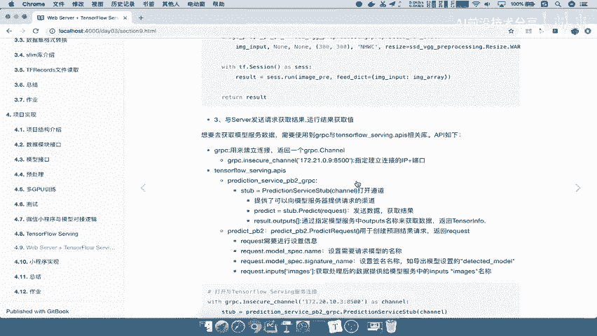
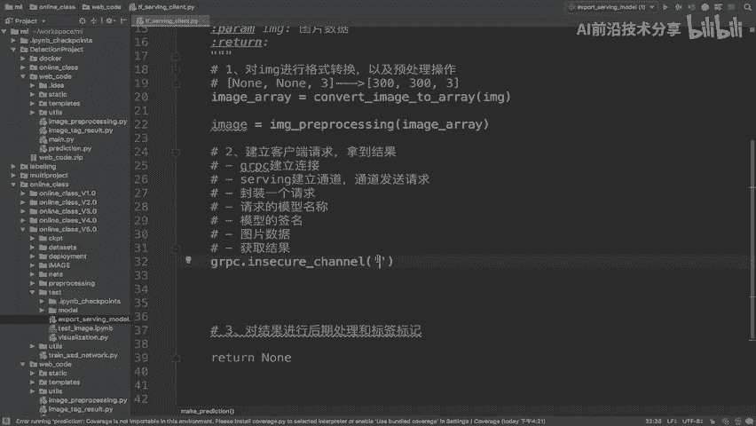
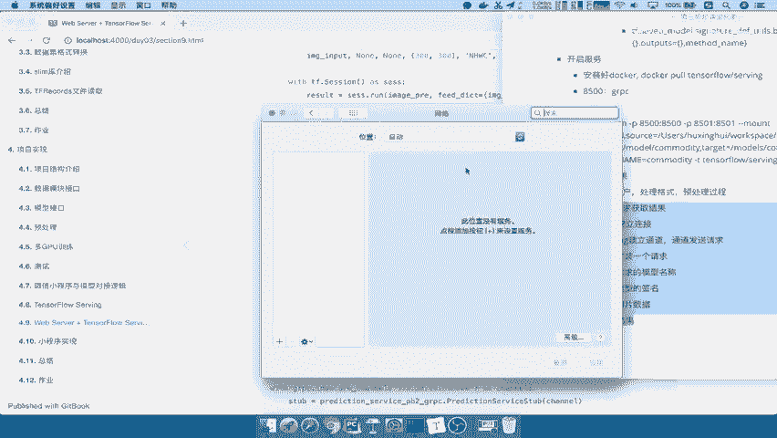
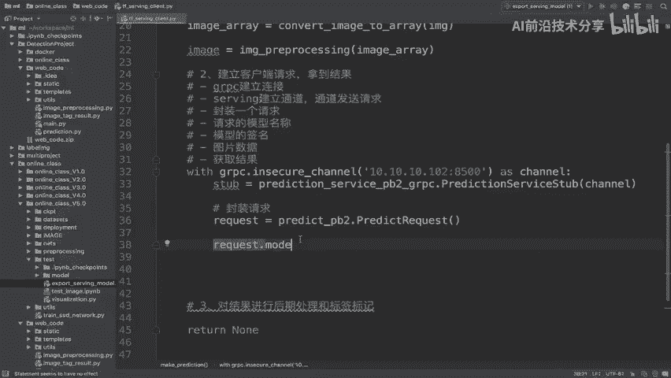
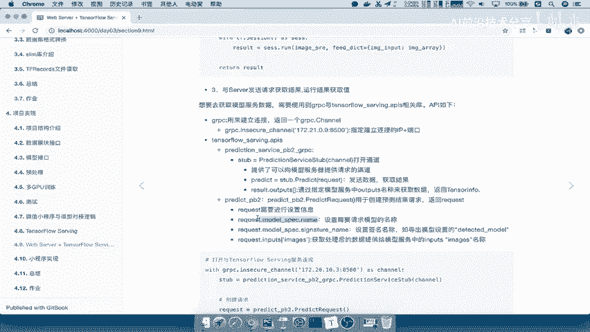
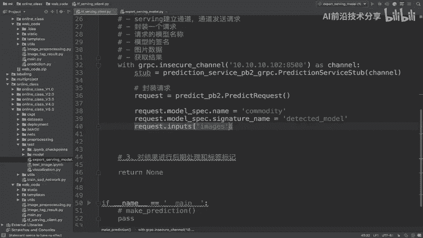
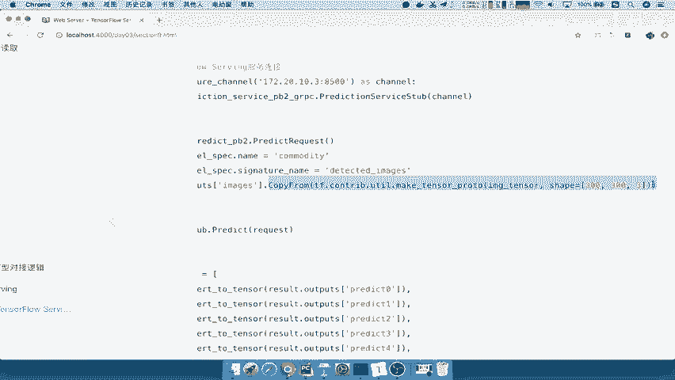
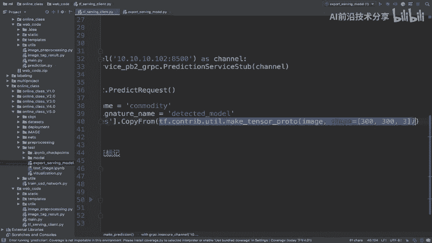
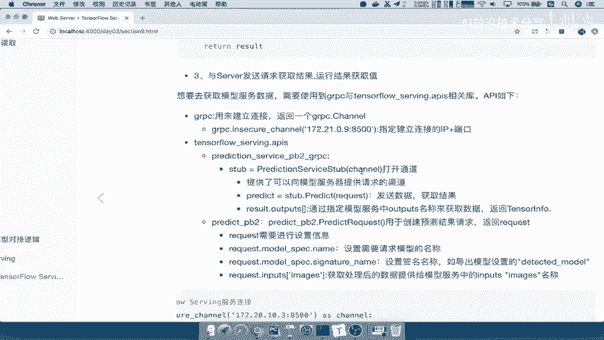

# 课程 P83：客户端建立连接与获取结果 🚀



在本节课中，我们将学习如何编写一个 gRPC 客户端，用于向 TensorFlow Serving 服务器发送请求并获取模型预测结果。我们将按照清晰的步骤，从建立连接到处理响应，逐一讲解。

---

## 建立 gRPC 连接

上一节我们介绍了服务端部署，本节中我们来看看如何从客户端发起请求。首先，我们需要与服务器建立 gRPC 连接。



我们使用 `grpc.insecure_channel` 来创建一个通道。需要传入服务器的 IP 地址和端口号。

```python
import grpc



# 本机测试使用的 IP 和端口
server_ip = '192.168.1.100'  # 请替换为你的服务器 IP
server_port = '8500'  # gRPC 端口
server_address = f'{server_ip}:{server_port}'

# 建立 insecure channel
with grpc.insecure_channel(server_address) as channel:
    # 后续操作在此代码块内进行
```

---

## 创建预测服务存根

连接建立后，我们需要创建一个能够与服务器上特定预测服务通信的“存根”。

以下是创建预测服务存根的步骤：

```python
from tensorflow_serving.apis import prediction_service_pb2_grpc

# 在已有的 channel 上下文中，创建 PredictionServiceStub
stub = prediction_service_pb2_grpc.PredictionServiceStub(channel)
```
这个 `stub` 对象将用于后续发送预测请求。

---

## 封装预测请求

现在，我们需要构造一个具体的预测请求。这包括指定模型名称、签名以及输入数据。



以下是封装请求的具体步骤：



1.  **创建请求对象**：使用 `predict_pb2.PredictRequest()`。
2.  **设置模型名称**：指定要调用的已部署模型的名称。
3.  **设置签名名称**：指定模型内用于处理请求的签名。
4.  **填充输入数据**：将预处理好的数据放入请求的指定输入中。

```python
from tensorflow_serving.apis import predict_pb2
from tensorflow import make_tensor_proto

# 1. 创建请求对象
request = predict_pb2.PredictRequest()

# 2. 设置模型名称 (需与导出模型时设置的名称一致)
request.model_spec.name = 'commodity'

# 3. 设置签名名称 (需与模型签名定义一致)
request.model_spec.signature_name = 'serving_default'

# 4. 填充输入数据
# 假设 `image_data` 是已经预处理好的图像数据（例如 shape 为 [1, 300, 300, 3] 的数组）
# 使用 make_tensor_proto 将数据转换为 TensorProto 格式，并放入请求的指定输入中
request.inputs['input_tensor'].CopyFrom(make_tensor_proto(image_data))
```
请注意，`'input_tensor'` 这个键名必须与模型签名中定义的输入名称完全一致。

---

## 发送请求并获取结果

请求封装完成后，即可通过存根发送给服务器并等待响应。

我们使用存根的 `Predict` 方法来发送请求。



```python
# 发送请求并获取结果
result = stub.Predict(request, timeout=10.0)  # 设置超时时间
```
返回的 `result` 对象包含了模型的预测输出。



---

## 处理与解析结果

最后一步是从响应结果中提取我们需要的数据。

结果中的输出也通过键名来访问，该键名需与模型签名中定义的输出名称一致。



```python
# 从结果中提取输出数据
# 假设模型输出名为 'output_tensor'
output_data = result.outputs['output_tensor']

# output_data 是一个 TensorProto 对象，可以将其转换为 numpy 数组进行处理
import tensorflow as tf
prediction_array = tf.make_ndarray(output_data)

# 现在可以使用 prediction_array 进行后续分析或展示
print(prediction_array)
```

---

## 总结

本节课中我们一起学习了构建一个完整 TensorFlow Serving gRPC 客户端的流程。



我们首先**建立 gRPC 连接**，然后**创建预测服务存根**，接着**封装包含模型名、签名和数据的预测请求**，之后**发送请求并获取响应**，最后**解析响应结果**得到模型的预测数据。掌握这些步骤，你就能成功地从客户端调用远程的机器学习模型服务了。