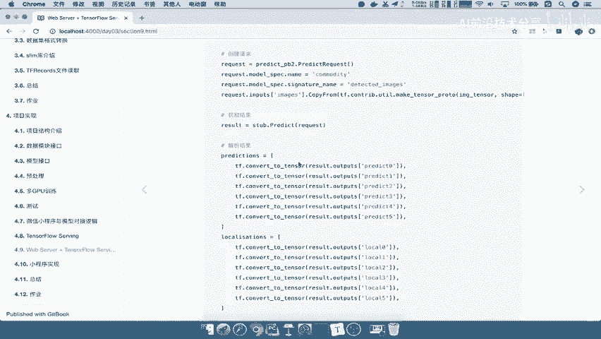
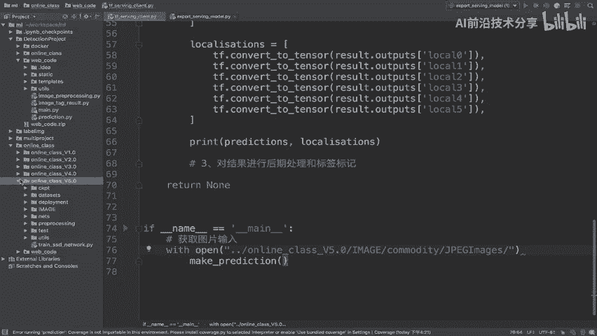
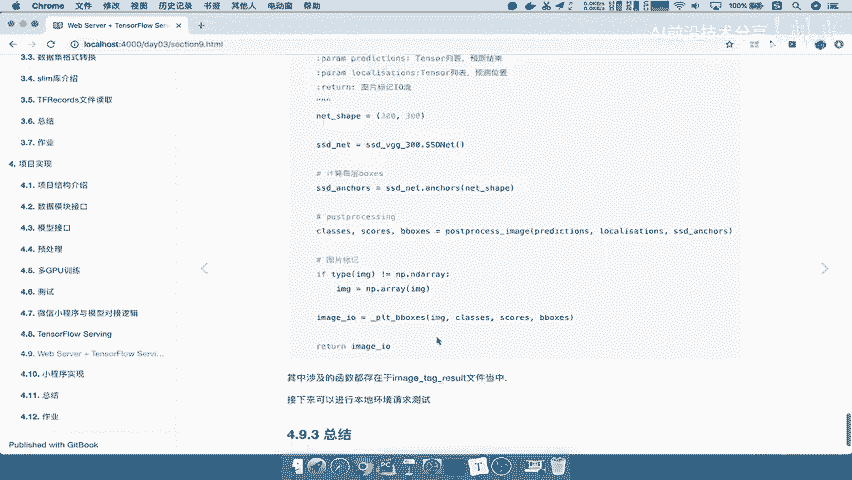
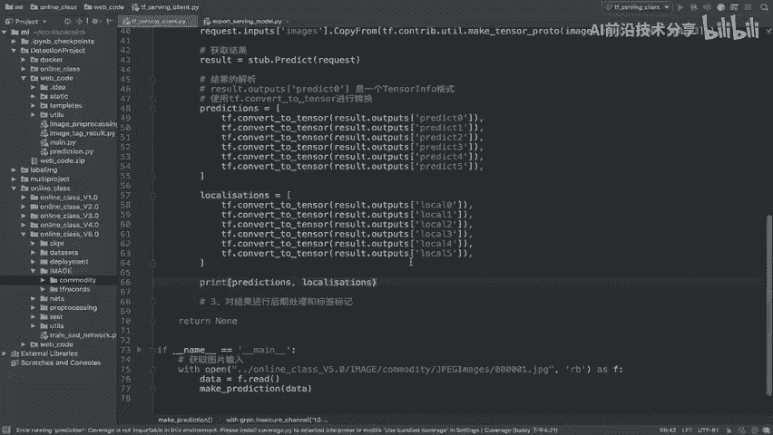

# 🧠 P84：客户端结果解析教程

在本节课中，我们将学习如何解析从TensorFlow Serving模型服务端返回的预测结果。我们将重点讲解如何从返回的复杂数据结构中提取出我们需要的预测值和定位信息，并将其转换为可操作的Tensor格式。

上一节我们介绍了如何向模型服务端发送请求并获取原始结果。本节中，我们来看看如何对这些结果进行解析和处理。



## 结果解析原理

解析结果的关键在于理解模型导出时的结构。模型返回的`result`对象包含两个主要部分：`predict`和`localization`。我们需要按照正确的名称将它们提取出来。

## 解析步骤详解

以下是解析结果的具体步骤：

1.  **提取原始输出**
    通过`result.outputs`方法，根据指定的输出名称获取数据。注意，此时获取的是`TensorInfo`格式，而非直接的`Tensor`。

    ```python
    prediction_outputs = result.outputs['predict']
    localization_outputs = result.outputs['localization']
    ```

2.  **转换为Tensor格式**
    使用`tf.convert_to_tensor`方法将`TensorInfo`转换为真正的`Tensor`，以便进行后续的数值操作。

    ```python
    import tensorflow as tf
    predict_tensor = tf.convert_to_tensor(prediction_outputs)
    local_tensor = tf.convert_to_tensor(localization_outputs)
    ```

3.  **处理多个输出**
    在我们的例子中，`predict`和`localization`各自包含6个部分。我们需要为每个部分单独进行转换。

    ```python
    # 解析 prediction 的六个部分
    predict_list = []
    for i in range(6):
        tensor_info = result.outputs[f'predict{i}']
        tensor = tf.convert_to_tensor(tensor_info)
        predict_list.append(tensor)

    # 解析 localization 的六个部分
    local_list = []
    for i in range(6):
        tensor_info = result.outputs[f'local{i}']
        tensor = tf.convert_to_tensor(tensor_info)
        local_list.append(tensor)
    ```

## 完整测试示例

为了验证解析过程，我们需要输入一张图片进行测试。

以下是加载图片并调用模型服务的完整代码示例：

```python
import tensorflow as tf

# 1. 定义模型服务地址
server_url = 'http://localhost:8501/v1/models/your_model:predict'

# 2. 加载测试图片
image_path = '../web_code/images/commodity/example.jpg'  # 请替换为你的图片路径
with open(image_path, 'rb') as f:
    image_data = f.read()



# 3. 构建请求数据
request_data = {
    'instances': [{'input_image': image_data}]
}



# 4. 发送请求（假设使用requests库）
import requests
response = requests.post(server_url, json=request_data)
result = response.json()

# 5. 解析结果
predictions = []
localizations = []

for i in range(6):
    # 解析预测值
    pred_tensor_info = result['outputs'][f'predict{i}']
    pred_tensor = tf.convert_to_tensor(pred_tensor_info)
    predictions.append(pred_tensor)

    # 解析定位信息
    loc_tensor_info = result['outputs'][f'local{i}']
    loc_tensor = tf.convert_to_tensor(loc_tensor_info)
    localizations.append(loc_tensor)

# 6. 打印解析后的结果结构
print(f"Predictions 列表长度: {len(predictions)}")
print(f"Localizations 列表长度: {len(localizations)}")
```

运行上述代码后，控制台将成功打印出请求的响应数据。你会看到`predictions`和`localizations`各自都是一个包含6个`Tensor`的列表，这标志着我们成功完成了结果的解析。



本节课中我们一起学习了如何从TensorFlow Serving的响应中解析出结构化的预测结果。核心在于通过正确的输出名称提取数据，并使用`tf.convert_to_tensor`进行格式转换。掌握这一步骤是后续进行结果可视化和业务应用的基础。