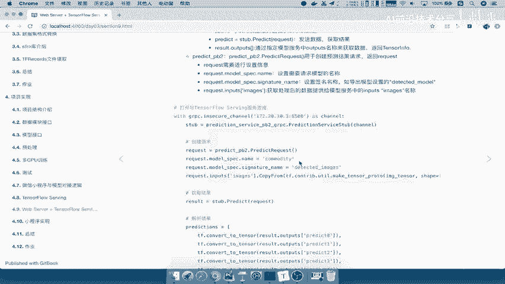
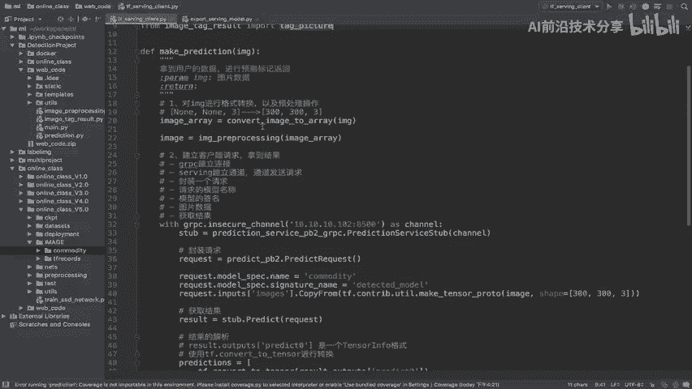
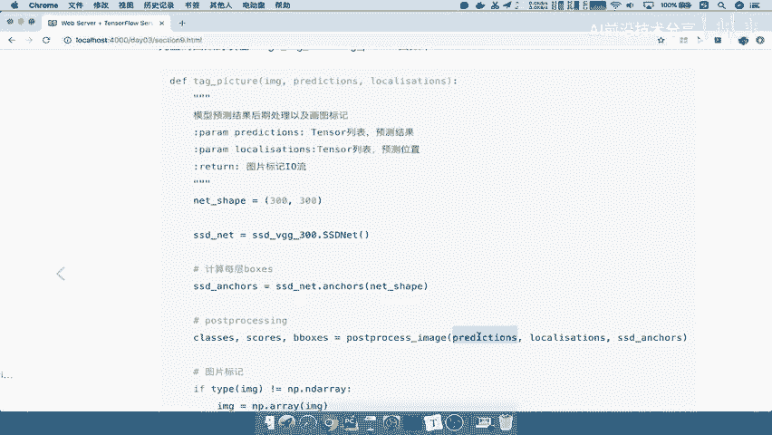
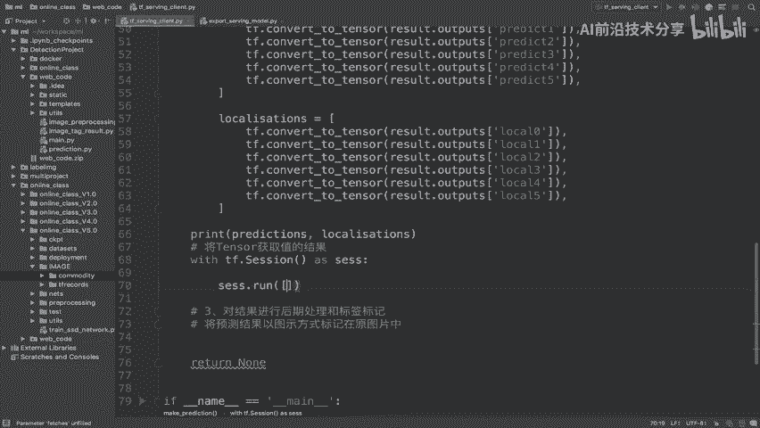
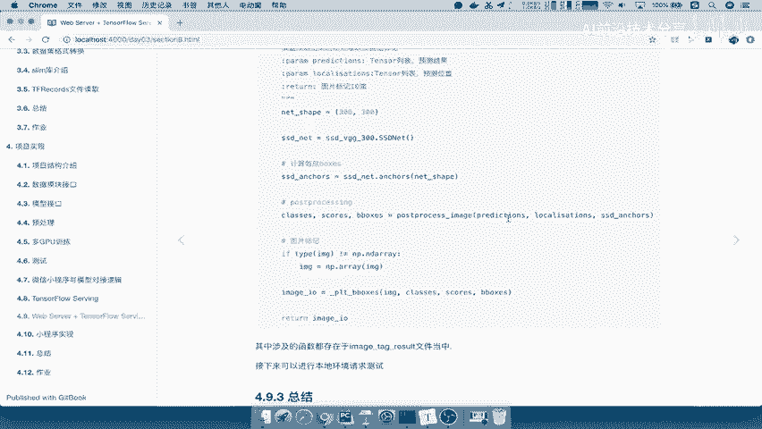
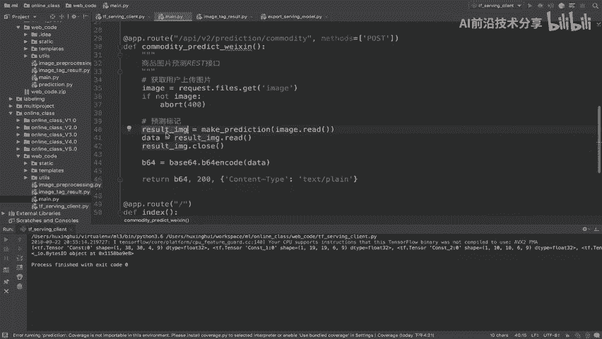
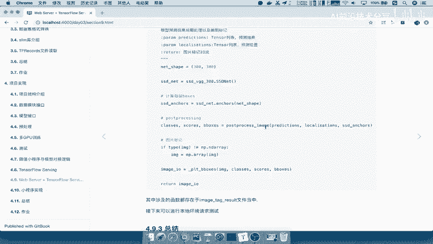

# 课程 P85：85.06_Client - 结果标记与返回 🖼️➡️🌐



在本节课中，我们将学习如何将模型预测的Tensor结果转换为可视化的标记图片，并通过Web服务器返回给用户。核心在于理解TensorFlow会话的运行机制以及如何将处理后的图片数据封装为可传输的格式。

---



上一节我们介绍了如何获取模型的预测结果，它是一个由Tensor组成的列表。本节中我们来看看如何将这个结果标记在原图片上并返回。



获取的结果是一个Tensor列表。如果要将这个结果返回给用户，我们需要将预测的标记（如边界框和类别）绘制在原始图片上。这相当于将预测结果以图示的方式标记在原图片当中。

因此，`tag_picture`函数的作用就是接收原始图片和预测结果，生成一张带标记的新图片。

`tag_picture`函数需要输入图片数据和预测结果。但预测结果目前还是一个Tensor对象，不能直接用于绘图运算。



这里涉及TensorFlow中一个常见的问题：需要从Tensor对象中获取具体的数值结果。为此，我们需要在TensorFlow会话中运行这个Tensor。

以下是具体的操作步骤：



1.  创建一个TensorFlow会话。
2.  在会话中运行获取预测结果的函数，从而得到具体的数值（如边界框坐标`P`和类别标签`L`）。
3.  将这些数值结果传递给`tag_picture`函数进行绘图。

```python
with tf.Session() as sess:
    P, L = sess.run([localization, classification])  # 获取具体的预测值
```

`tag_picture`函数内部封装了绘图逻辑。它会利用`postprocess_image`等方法处理预测数据，计算边界框，并使用`PIL`或`matplotlib`等库将标记绘制在图片上。

处理完成后，函数会将标记好的图片转换为字节流格式（例如使用`BytesIO`），方便通过网络传输。

所以，在配置函数中，我们需要：
*   传入**原始图片的数组格式**（`image_array`），因为内部需要进行数组运算。
*   传入从会话中获取的具体预测值`P`和`L`。
*   接收`tag_picture`返回的图片字节流结果。

```python
# 假设 original_image_array 是原始图片的NumPy数组格式
image_byte_stream = tag_picture(original_image_array, P, L)
```

最后，这个图片字节流（`image_byte_stream`）可以直接传递给Web服务器框架（例如Flask的`send_file`或返回`Response`），最终返回给前端用户。



---



本节课中我们一起学习了如何将模型输出的Tensor预测结果转换为可视化的图片。关键步骤包括：在TensorFlow会话中获取Tensor的具体值、调用绘图函数生成带标记的图片、以及将图片转换为字节流格式以便通过Web接口返回。这样就完成了从模型预测到用户可视化的完整流程。