# 🚀 课程 P86：服务器部署与小程序测试

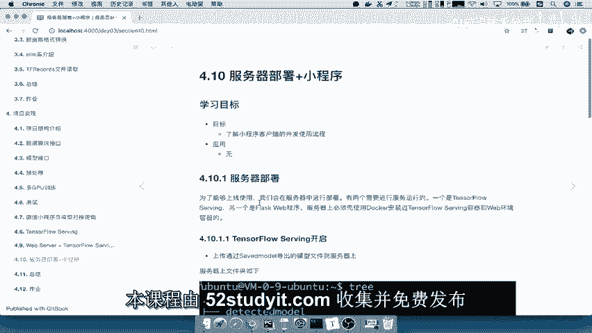

在本节课中，我们将学习如何将训练好的模型部署到服务器上，并了解如何通过小程序或Web服务来访问模型接口。我们将重点关注服务器部署所需的文件、服务开启流程以及一个简单的测试示例。

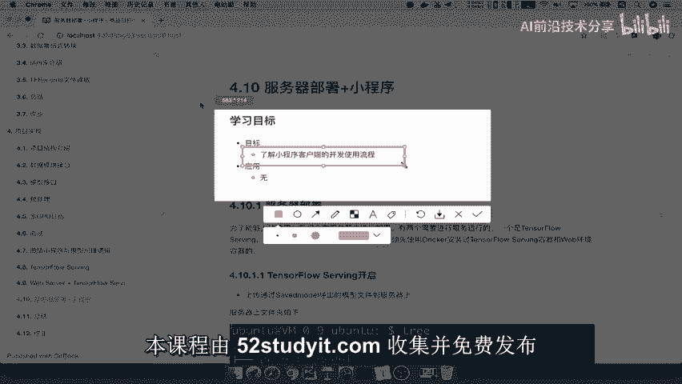

---

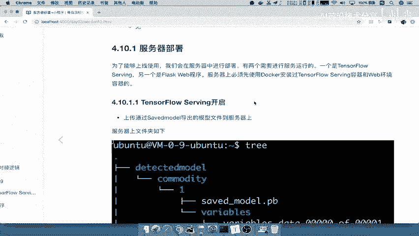

上一节我们介绍了模型训练与导出，本节中我们来看看如何将模型部署到服务器并开启服务。

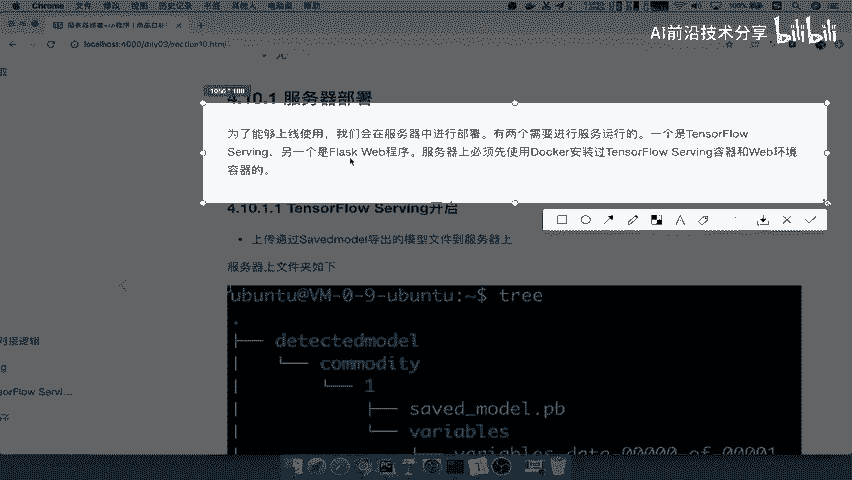

## 服务器部署概述

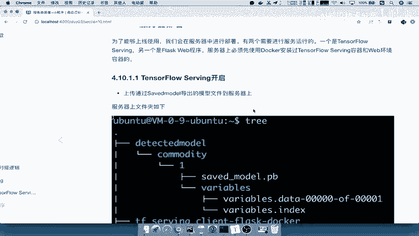

服务器部署通常用于线上环境。在服务器上，我们需要安装并运行两个核心服务：**TensorFlow Serving** 和 **Flask Web** 服务。

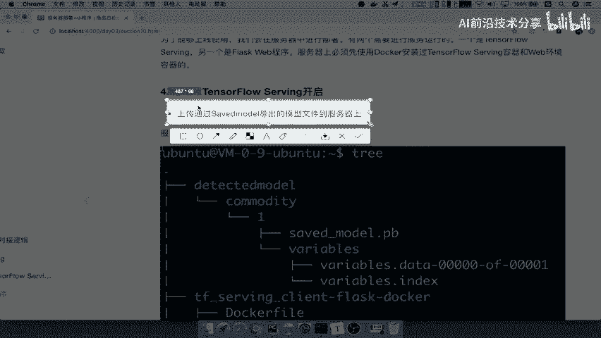

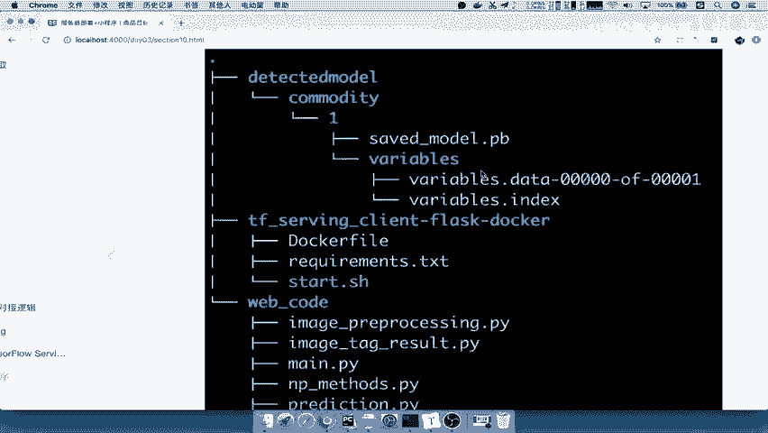

*   **TensorFlow Serving**：负责加载和运行导出的模型，提供模型推理的底层接口。
*   **Flask Web 服务**：作为客户端与 TensorFlow Serving 之间的桥梁，提供一个易于调用的 HTTP API 接口。

## 服务器部署所需文件

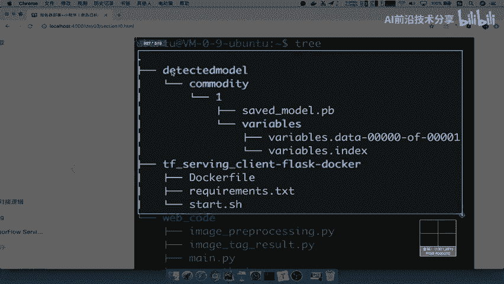

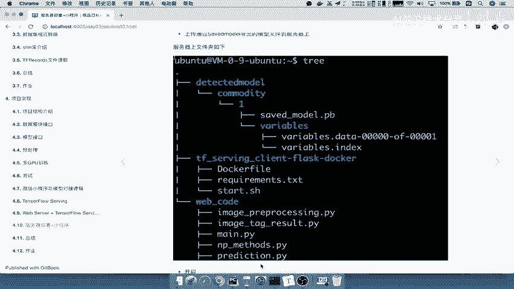

以下是部署到服务器所需的文件和目录结构：

1.  **模型文件**：通过 `tf.saved_model.save` 导出的 SavedModel 格式模型。
2.  **Docker 配置文件**：用于在服务器上构建包含 TensorFlow Serving 和 Flask 环境的 Docker 镜像。
3.  **Web 应用程序代码**：包含 Flask 后端服务逻辑的代码文件。

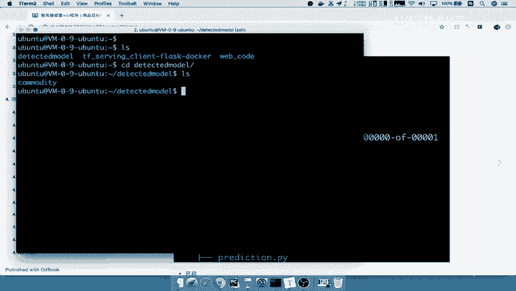

## 开启 TensorFlow Serving 服务

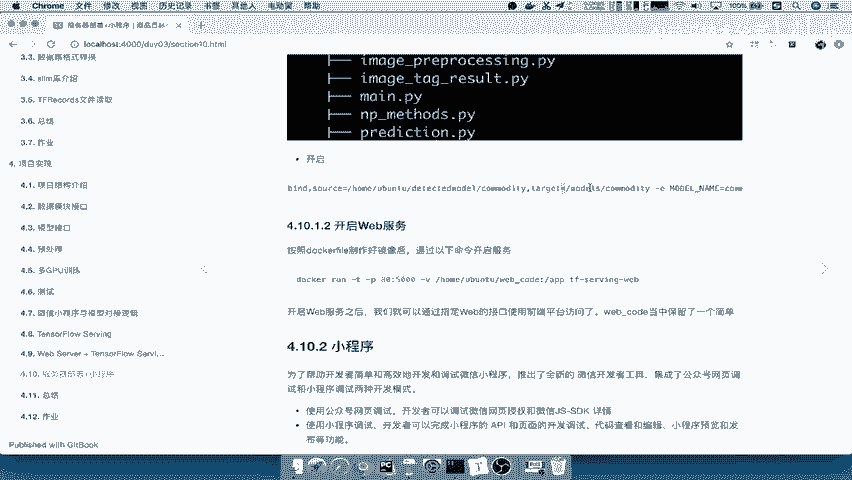

首先，我们需要在服务器上启动 TensorFlow Serving 服务来加载模型。

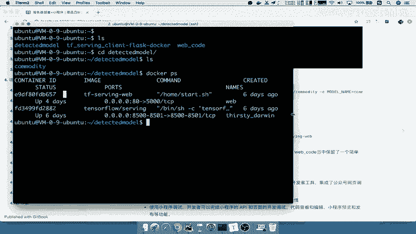

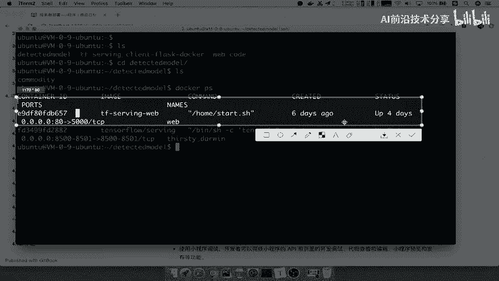

1.  将导出的模型文件夹上传到服务器的指定目录，例如 `commodity`。
2.  使用 Docker 命令启动 TensorFlow Serving 容器。该命令会指定端口、模型名称和模型路径。

```bash
docker run -p 8501:8501 --name=tf_serving_commodity \
  -v /path/to/your/model/commodity:/models/commodity \
  -e MODEL_NAME=commodity tensorflow/serving
```

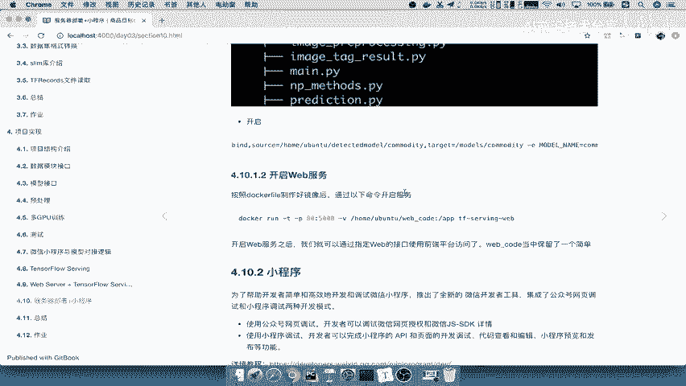

3.  服务启动后，可以使用 `docker ps` 命令查看运行中的容器，确认 TensorFlow Serving 服务已成功启动。

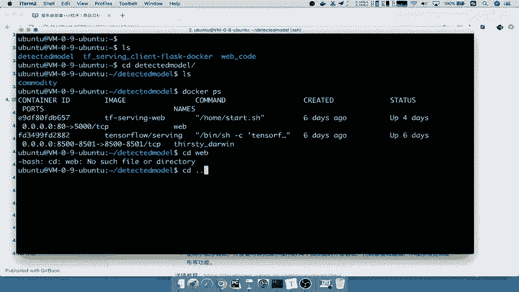

## 开启 Flask Web 服务

TensorFlow Serving 提供了 gRPC/HTTP 接口，但通常我们会通过一个更易用的 Web 服务来封装它。

1.  确保服务器上有构建好的 Docker 镜像，该镜像包含了 Flask 环境和与 TensorFlow Serving 交互的客户端代码。
2.  进入存放 Web 代码的目录（例如 `web_code`）。
3.  使用 Docker 命令启动 Flask Web 服务容器，并指定应用程序的入口点。

```bash
docker run -p 5000:5000 --name=tf_serving_web \
  -v /path/to/your/web_code:/app web_code_image \
  python main.py
```

4.  再次使用 `docker ps` 命令，现在应该能看到两个运行中的容器：`tf_serving_commodity` 和 `tf_serving_web`。

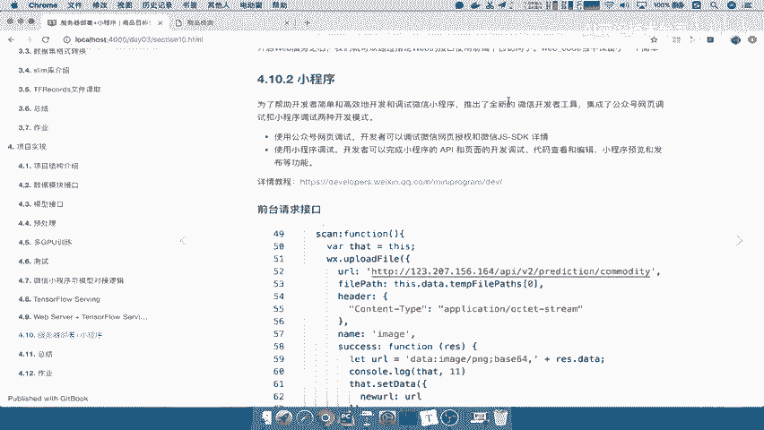

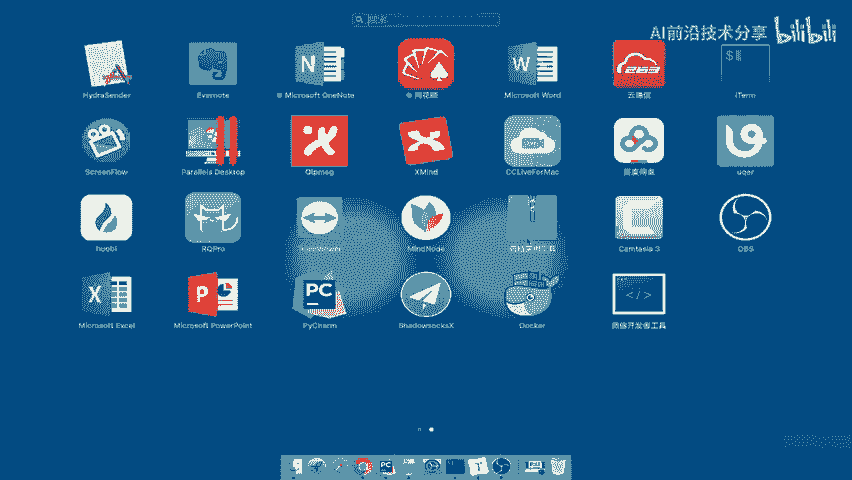

## 服务测试与小程序接入

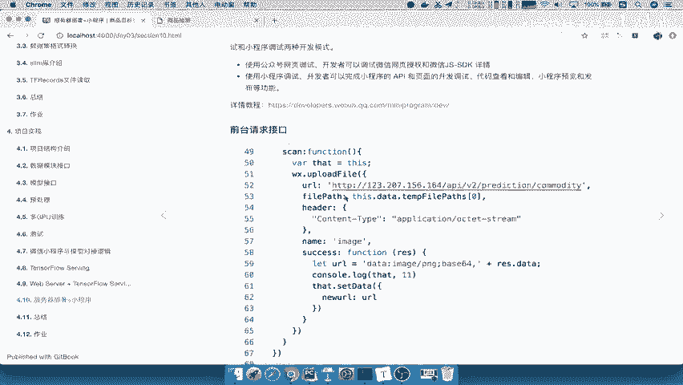

Web 服务启动后，会提供一个简单的 HTTP 接口。我们可以通过浏览器访问该服务的 IP 和端口（例如 `http://服务器IP:5000`），通常会看到一个简单的文件上传界面，用于测试模型。

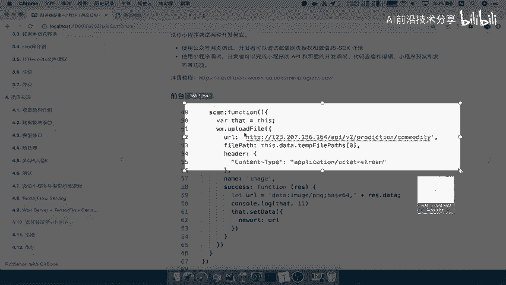

如果希望通过小程序调用模型，流程如下：

1.  在微信开发者工具中创建或导入小程序项目。
2.  在小程序代码中，编写网络请求代码，调用我们部署的 Flask Web 服务提供的 API 接口。
3.  将图片或其他数据发送到该接口，并接收模型返回的预测结果。

**核心调用逻辑**（伪代码表示）：
```javascript
// 小程序端发起请求
wx.uploadFile({
  url: 'https://your-server-ip:5000/predict',
  filePath: tempFilePath, // 用户选择的图片
  name: 'image',
  success (res) {
    // 处理服务器返回的JSON格式预测结果
    console.log(res.data)
  }
})
```

---

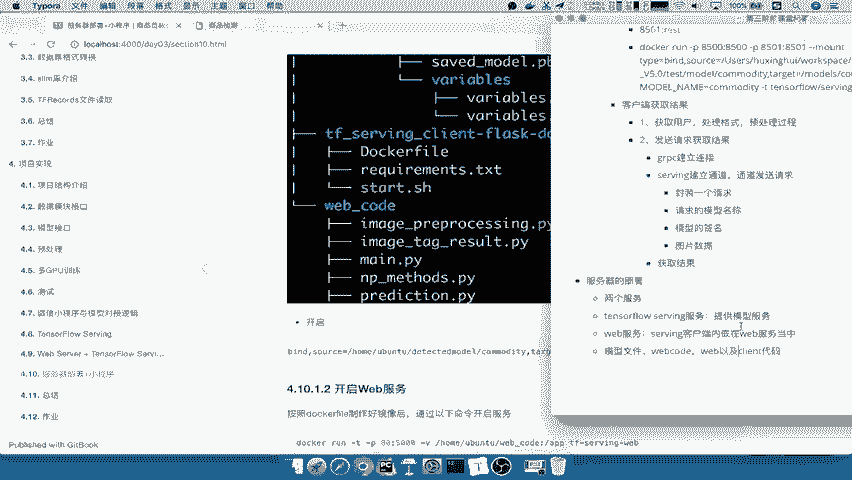

本节课中我们一起学习了服务器部署的核心步骤。我们了解到，部署主要涉及开启两个服务：**TensorFlow Serving** 用于托管模型，以及 **Flask Web 服务** 用于提供客户端访问接口。需要上传到服务器的关键文件包括**模型文件**和**Web应用程序代码**。整个过程通过 Docker 容器化部署，简单且易于管理。最后，任何客户端（如网页或小程序）都可以通过调用 Web 服务提供的 API 来使用我们部署的模型。